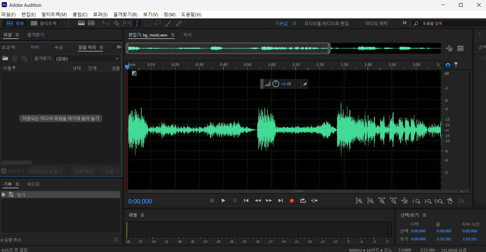
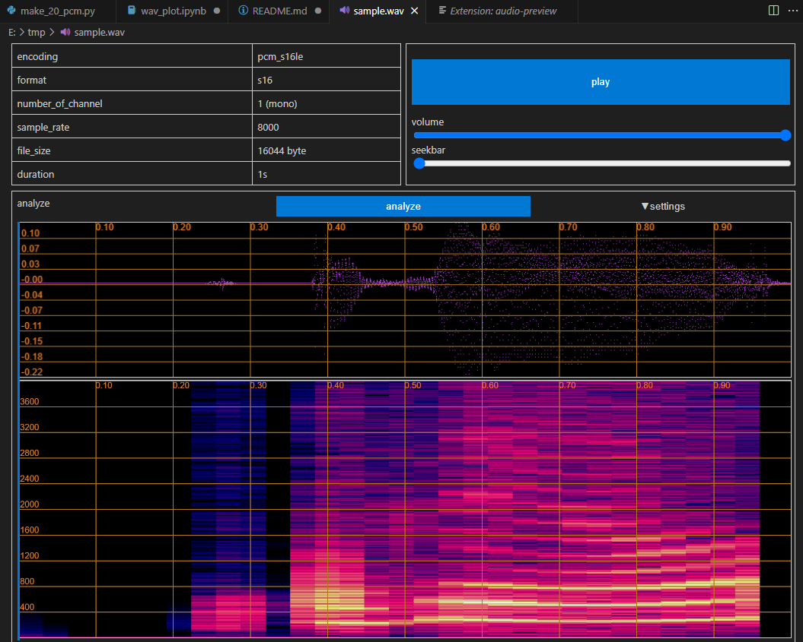
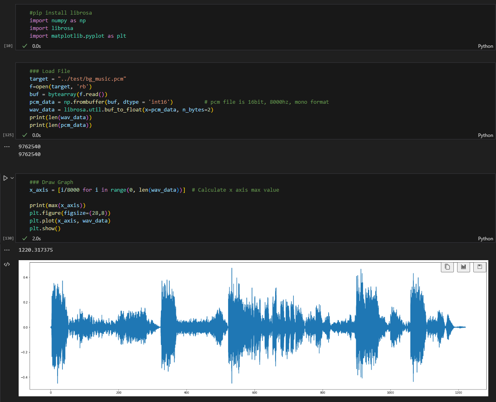
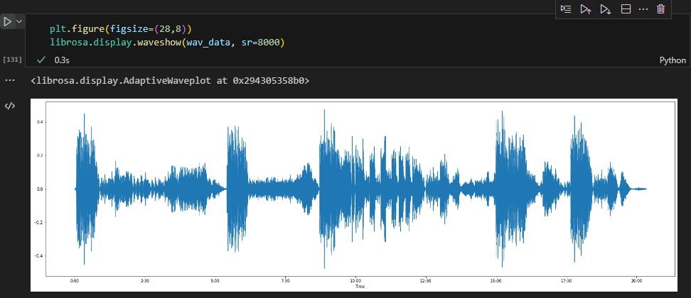
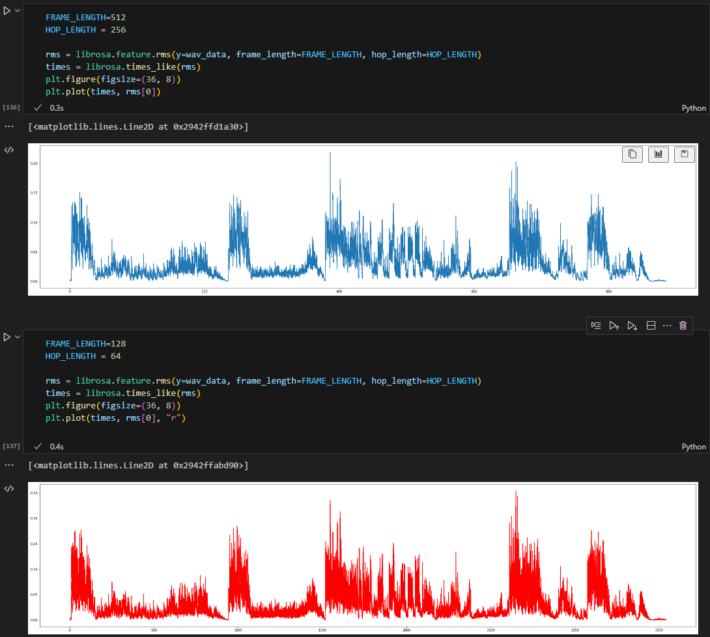
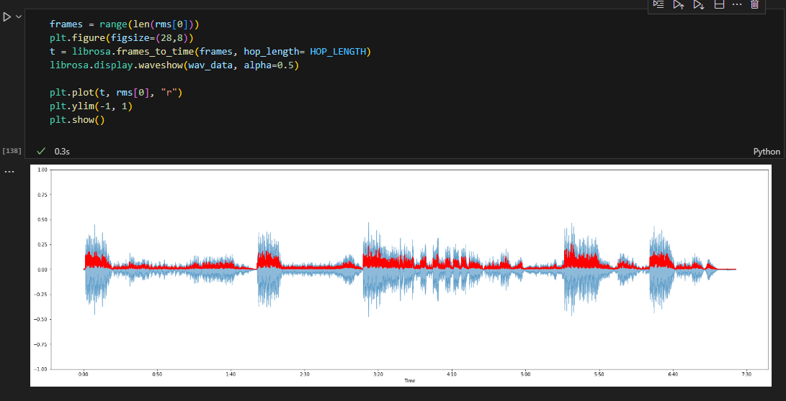
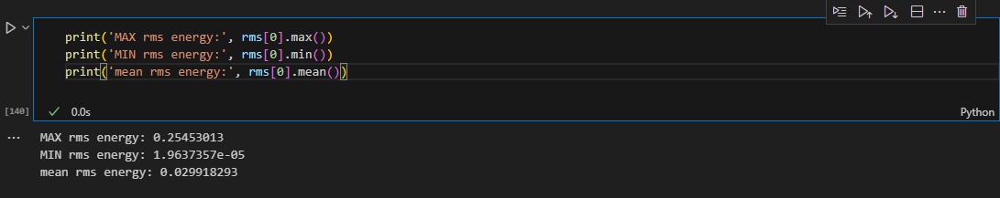
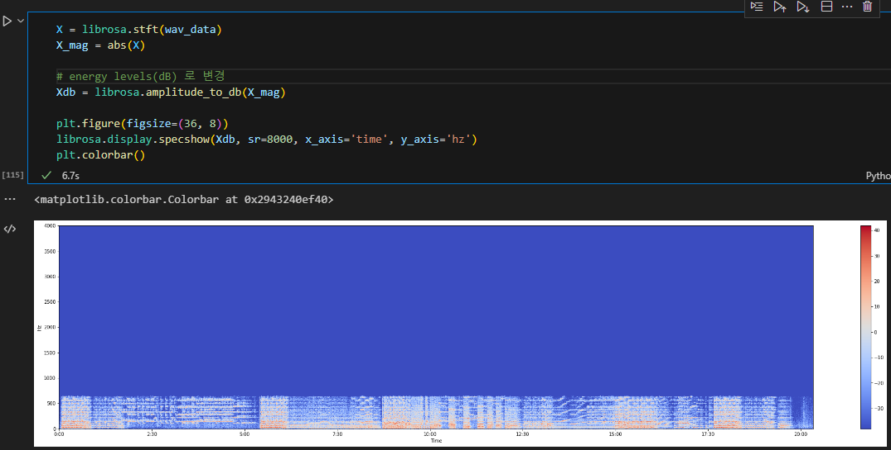

# Audio File Graphical Analyzing

<br /><br />
I mainly use Adobe Audition or VSCode's audio-preview plugin to view the waveform of an audio file.<br /><br />

 <br /><br />

In particular, VSCode's audio-preview plugin can be used in the development environment and has the advantage of being lighter than Adobe Audition. And best of all, this plugin is free. So I like to use the audio-preview plugin.
<br /><br />

 <br /><br />

However, the audio-preview plug-in currently supports files with headers including audio information, such as wav and mp3, and does not support raw formats without headers. So sometimes I feel the need for a simple program to analyze the waveform of a pcm file.
And users who try to learn AI using VoIP or voice will also want to see the energy (Root Mean Square Energy) or spectrum value of the voice file. We will use Python to create a program that simply analyzes the waveform of a PCM file and finds the energy of a voice file.

<br /><br />

## librosa installation

The most important Python package is librosa. Install this package using pip in your Python environment in advance. 
<br /><br />

``` bash
pip install librosa
pip install matplotlib (or conda install matplotlib)
```
<br>

I will do my Python programming in Jupyter NoteBook.


<br /><br />

## Jupyter Notebook

### Load packages and view pcm audio waveform

 <br /><br />

As you can see from the Jupyter notebook results, the audio file I loaded has 9,762,540 sampling values.
Since 8000 samples are performed per second, this value is approximately 1220 seconds when converted to time.  In the figure, the value of the x-axis was converted into seconds by dividing by 8000. <br />

Note that the unit of the x-axis is seconds. librosa also provides similar functionality. You can see that the x-axis has been converted to minutes for ease of viewing. The graph waveform is the same as the previous graph.

<br /><br />

 <br /><br />

I used liborsa to output a waveform of an audio file very easily. <br /><br />

### Calculate and view Wav file energy
<br /><br />

Next, let's find the energy of a wav file. A section with high energy is a section with voice or strong noise, and a section with a very low value can be determined as a silent section.
In order to obtain the average value of the energy, the frame to calculate the energy must first be set. For example, if you want to find the energy for 0.1 second, you just need to find the energy value of 800 data values.
And one more thing to consider is the slicing interval. If the slicing interval is also 0.1 second, the energy value will be calculated at 0.1 second intervals without overlapping sections.
Therefore, if the length of the audio file is 10 seconds, a total of 100 average energy values will be obtained. If the slicing interval is 0.05 seconds, 200 average energy values of 0.1 seconds will be calculated.
librosa uses two variables for this. They are frame_length and hop_length.
frame_length is the same concept as the aforementioned frame, and hop_length corresponds to the slicing interval. In most cases, hop_length has a smaller value than frame_length. That is, a portion of speech is used over several frames at the average energy. <br />
Since the hop_length value ultimately determines the number of average energies, if this value is small, a large number of average energies will be created and precise graphs will be output.<br />

The following is the graph difference according to the difference between frame_length and hop_length values. You can see that the red graph below is drawn more densely.

<br /><br />

 <br /><br />

Now let's output the waveform and energy of the audio file together.<br /><br />

### View audio file energy and waveform together

<br /><br />

 <br /><br />

Of course, information about RMS energy can be output along with a visual graph.
<br /><br />

 <br /><br />

***Caution : The value of the RMS energy varies according to the frame size. If the frame size increases, the RMS energy value also increases. Therefore, note that even the same audio file may have different RMS energy values depending on the frame size and hop size.***  

<br /><br />

 ### View spectrograms
<br /><br />

librosa also has the ability to output spectrograms/chromagrams.
You can use the librosa.display.specshow function to output something like this:
<br /><br />

 <br /><br />

