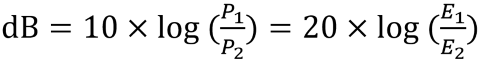
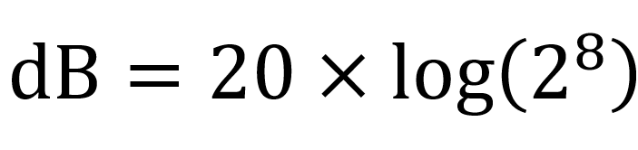
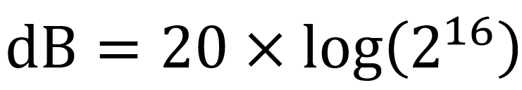

# Digital audio

This article referenced part of the content of Charles Patzold's [Programming Windows](https://www.amazon.com/Programming-Windows%C2%AE-Fifth-Developer-Reference/dp/157231995X) (Microsoft Programming Series).

## Sound basics

Sound is vibration. The human body perceives sound as it changes the air pressure on our eardrums. A microphone can pick up these vibrations and translate them into electrical currents. Similarly, electrical currents can be sent to amplifiers and speakers for rendering back into sound. In traditional analog forms of sound storage (such as audio tape and the phonograph record) these vibrations are stored as magnetic pulses or contoured grooves. When a sound is translated into an electrical current, it can be represented by a waveform that shows vibrations over time. The most natural form of vibration is represented by the sine wave.
The sine wave has two parameters—amplitude (that is, the maximum amplitude over the course of one cycle) and requency. We perceive amplitude as loudness and frequency as pitch. Human ears are generally said to be sensitive to sine waves ranging from low-pitched sounds at 20 Hz (cycles per second) to high-pitched sounds at 20,000 Hz, although sensitivity to these higher sounds degrades with age.
  

## PCM(Pulse Code Modulation)

Computers work with numbers, so to get sounds into our computers, it is necessary to devise a mechanism to convert sound to numbers and back again from numbers to sound.
The most common method of doing this without compressing data is called "pulse code modulation" (PCM). PCM is used on compact discs, digital audio tapes, and in Windows. Pulse code modulation is a fancy term for a conceptually simple process. With pulse code modulation, a waveform is sampled at a constant periodic rate, usually some tens of thousands of times per second.
For each sample, the amplitude of the waveform is measured. The hardware that does the job of converting an amplitude into a number is an analog-to-digital converter (ADC). Similarly, numbers can be converted back into electrical waveforms using a digital-to-analog converter (DAC). What comes out is not exactly what goes in. The resultant waveform has sharp edges that are high-frequency components. For this reason, playback hardware generally includes a low-pass filter following the digital-to-analog converter. This filter removes the high frequencies and smooths out the resultant waveform. On the input side, a low-pass filter comes before the ADC.

Pulse code modulation has two parameters: the sample rate, or how many times per second you measure the waveform amplitude, and the sample size, or the number of bits you use to store the amplitude level. As you might expect, the faster the sampling rate and the larger the sample size, the better the reproduction of the original sound. However, there is a point where any improvements to the sampling rate and sample size are overkill because they go beyond the resolution of human perception. On the other hand, making the sampling rate and sample size too low can cause problems in accurately reproducing music and other sounds.
  

### The Sampling Rate
The sampling rate determines the maximum frequency of sound that can be digitized and stored. In particular, the sampling rate must be twice the highest frequency of sampled sound. This is known as the "Nyquist Frequency," named after Harry Nyquist, an engineer who did research in the 1930s into sampling processes.
When a sine wave is sampled with too low a sampling rate, the resultant waveform has a lower frequency than the original. This is known as an alias. To avoid the problem of aliases, a low-pass filter is used on the input side to block all frequencies greater than half the sampling rate. On the output side, the rough edges of the waveform produced by the digital-to-analog converter are actually overtones composed of frequencies greater than half the sampling rate. Thus, a low-pass filter on the output side also blocks all frequencies greater than half the sampling rate.
The sampling rate used on audio CDs is 44,100 samples per second, or 44.1 kHz. The origin of this peculiar number is as follows:

The human ear can hear up to 20 kHz, so to capture the entire audio range that can be heard by humans, a sampling rate of 40 kHz is required. However, because low-pass filters have a roll-off effect, the sampling rate should be about 10 percent higher than that. Now we're up to 44 kHz. Just in case we want to record digital audio along with video, the sampling rate should be an integral multiple of the American and European television frame rates, which are 30 Hz and 25 Hz respectively. That pushes the sampling rate up to 44.1 kHz.
The compact disc sampling rate of 44.1 kHz produces a lot of data and might be overkill for some applications, such as recording voice rather than music. Halving the sampling rate to 22.05 kHz reduces the upper range of reproducible sound by one octave to 10 kHz. Halving it again to 11.025 kHz gives us a frequency range to 5 kHz. Sampling rates of 44.1 kHz, 22.05 kHz, and 11.025 kHz, as well as 8 kHz, are the standards commonly supported by waveform audio devices.
You might think that a sampling rate of 11.025 kHz is adequate for recording a piano because the highest frequency of a piano is 4186 Hz. However, 4186 Hz is the highest fundamental of a piano. Cutting off all sine waves above 5000 Hz reduces the overtones that can be reproduced and will not accurately capture and reproduce the piano sound.

  

### The Sample Size

The second parameter in pulse code modulation is the sample size measured in bits. The sample size determines the difference between the softest sound and loudest sound that can be recorded and played back. This is known as the dynamic range. 

Sound intensity is the square of the waveform amplitude (that is, the composite of the maximum amplitudes that each sine wave reaches over the course of one cycle). As is the case with frequency, human perception of sound intensity is logarithmic.

The difference in intensity between two sounds is measured in bels (named after Alexander Graham Bell, the inventor of the telephone) and decibels (dB). A bel is a tenfold increase in sound intensity. One dB is one tenth of a bel in equal multiplicative steps. Hence, one dB is an increase in sound intensity of 1.26 (that is, the 10th root of 10), or an increase in waveform amplitude of 1.12 (the 20th root of 10). A decibel is about the lowest increase in sound intensity that the ear can perceive. The difference in intensity between sounds at the threshold of hearing and sounds at the threshold of pain is about 100 dB.

You can calculate the dynamic range in decibels between two sounds with the following formula:

Here, P is the amount of power, such as power, energy, or sound intensity, and E represents the amount of voltage or sound pressure.
 

where A1 and A2 are the amplitudes of the two sounds. With a sample size of 1 bit, the dynamic range is zero, because only one amplitude is possible.

With a sample size of 8 bits, the ratio of the largest amplitude to the smallest amplitude is 256. Thus, the dynamic range is

or 48 decibels (log(256) is 2.408... ). A 48-dB dynamic range is about the difference between a quiet room and a power lawn mower. Doubling the sample size to 16 bits yields a dynamic range of

or 96 decibels. This is very nearly the difference between the threshold of hearing and the threshold of pain and is considered just about ideal for the reproduction of music.

Both 8-bit and 16-bit sample sizes are supported under Windows. When storing 8-bit samples, the samples are treated as unsigned bytes. Silence would be stored as a string of 0x80 values. The 16-bit samples are treated as signed integers, so silence would be stored as a string of zeros.
To calculate the storage space required for uncompressed audio, multiply the duration of the sound in seconds by the sampling rate.
Double that if you're using 16-bit samples rather than 8-bit samples. Double that again if you're recording in stereo. For example, an hour of CD-quality sound (or 3600 seconds at 44,100 samples per sec

  

## PCM in telephony systems

In general, when referring to PCM files in telephone systems, 8000, 16bit, mono or 8000, 8bit, mono formats are often mentioned.

8000 means sampling rate, 16 bits, 8 bits means sample size value. And mono refers to the number of channels. Charles Patzold's previous article didn't mention channels, but in general audio can be mono and stereo. Stereo audio for storing music is usually used, but mono is used for telephone systems.

 

### why 8000 Hz , 8 bit
Earlier, I said that the sound quality of a CD is 44.1 kHz. So, why do phones use 8kHz (8000)? The reason for this lies in the nature of the digital line used in the telephone network. Telephone systems use analog and digital lines. Since these two different lines can be converted to each other using an AD converter, they can be used interchangeably.

 

Digital phone systems use E1 and T1.

- E1: E1 is a digital transmission standard devised by the ITU-T and made a name by the European CEPT. E1 accommodates 32 channels at 64 kbps. Therefore, data is transmitted at a speed of 2.048 Mbps. Of the 32 channels, 30 channels are used for voice data transmission and 2 channels are used for signaling.
- T1: T1 was created by Bell Laboratories in the 1960s and transmits data at a rate of 1.544 Mbps accommodating 24 channels of 64 Kbps.

 
The transmission rate of digital telephone channel, 64kbps, consists of 8k sampling rate and 8-bit sample size.

  

## Why is the G.711 codec still popular?

G.711 codec compresses voice at 8KHz and 8bit. Therefore, it is a good codec to use not only in IP telephony but also in the existing digital phone system. For this reason, the G.711 codec is still popular to maintain compatibility between IP telephone systems and legacy telephone systems. In addition, SIP recommends that one of the G.711 codecs (alaw or ulaw) be included in the list of usable codecs.

The G.711 codec compresses 8k, 16-bit PCM audio into 8k, 8-bit format, or decodes 8k and 8-bit compressed audio into 8k, 16-bit format. Therefore, 8k, 16bit format pcm files are also frequently mentioned. In the actual RTP packet, audio compressed with the G.711 codec is delivered, but before being compressed or after uncompressed, it is 8k, 16bit format audio, and the audio format we encounter is also 8k, 16bit format PCM.
