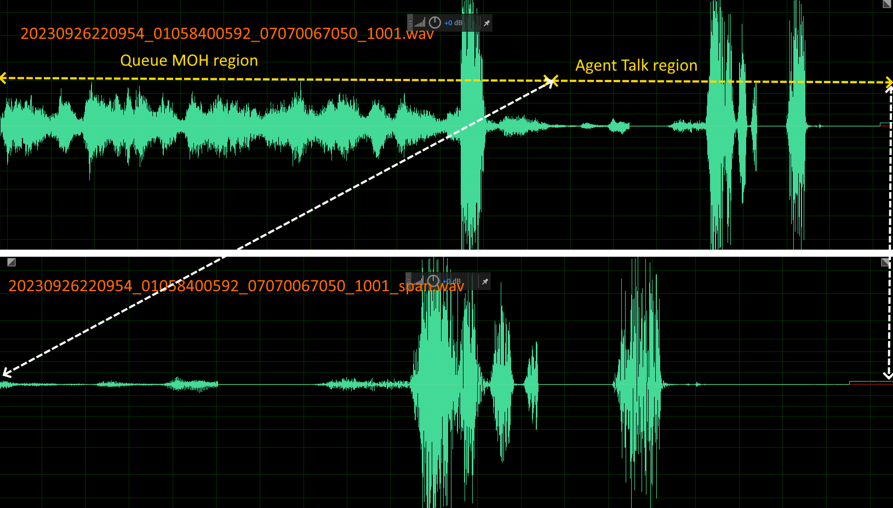

# Freeswitch recording with agent information

Call center systems often record customer service calls.
Recently, I created a call center system using mod_callcenter, but I ran into a problem creating recording files. In the dial plan, the customer's consultation call is transferred to a call center queue. This call is then distributed to the appropriate agent according to mod_callcenter's call distribution rules.
However, in the dial plan, it is impossible to know which agent the call will be distributed to, so it is impossible to include agent (or extension phone number) information in the recording file.

Below is the first dial plan. The following dial plan uses mod_callcenter.

``` xml
<extension name="CALLCENTER_MAIN">
  <condition field="destination_number" expression="^(07070067777)$">
    <action application="set" data="continue_on_fail=true"/>
    <action application="set" data="caller_id_name=${destination_number}" />
    <action application="set" data="record_session=$${base_dir}/recordings/${strftime(%Y%m%d%H%M%S)}_${caller_id_number}_${destination_number}.wav" />
    <action application="callcenter" data="myqueue@default" />
  </condition>
</extension>
```
When I called the number "07070067777" using the dial plan above, I was able to confirm that the call was properly routed to the agents registered in myqueue. You can also see that recording files are created in the recordings directory as follows. This is a list of recording files of calls received by a customer service representative via the call center "myqueue" queue by calling from 01058400500 to 07070067777.

``` bash
[root@tmoney_pbx ~]# ls -al /usr/local/freeswitch/recordings/
total 872
drwxrws---  2 root root   4096 Sep 14 12:57 .
drwxr-xr-x 20 root root   4096 Sep  6  2021 ..
-rw-r--r--  1 root root 219244 Sep 14 00:46 20230914004619_01058400500_07070067777.wav
-rw-r--r--  1 root root 111724 Sep 14 10:45 20230914104500_01058400500_07070067777.wav
-rw-r--r--  1 root root  87404 Sep 14 10:45 20230914104521_01058400500_07070067777.wav
-rw-r--r--  1 root root  74604 Sep 14 10:46 20230914104610_01058400500_07070067777.wav
```
However, this dial plan has one drawback. That is, there is no information about the agent who answered the phone in the recording file.

To solve this problem, the dial plan must be modified. At the time of setting record_session, it is not yet determined which agent the call will be distributed to, so this problem must be solved through post-processing after recording is completed.
In FreeSWITCH, set one of the values of "record_post_process_exec_api" and "record_post_process_exec_app" to enable post-processing after recording is finished.
I will use "record_post_process_exec_app".

```xml
<extension name="CALLCENTER_MAIN">
  <condition field="destination_number" expression="^(07070067777)$">
        <action application="sched_hangup" data="+300 alloted_timeout"/>
        <action application="spandsp_start_dtmf" data=""/>
        
        <action application="set" data="cc_recordfile=$${base_dir}/recordings/${strftime(%Y%m%d%H%M%S)}_${caller_id_number}_${destination_number}")

        <action application="log" data="WARNING RecordFile"/>
        <action application="log" data="WARNING RecordFile=${cc_recordfile}"/>

        <action application="lua" data="callcenter_test.lua"/>
  </condition>
</extension>
```

A Lua script that can be executed after recording is added to the dial plan. Now, when recording is finished, this script will run automatically. Now let’s create the after_record.lua file as follows:

```lua
-- callcenter_test.lua
    queue = session:getVariable("destination_number")

    local record_file_no_ext = "$${base_dir}/recordings/" ..dtNow .."_" ..queue .."_" ..queue
    local record_file = "$${base_dir}/recordings/" ..dtNow .."_" ..queue .."_" ..queue ..".wav"
    ScenarioLog("INFO", "Test Call center Scenario Start Queue:" ..queue .."\n")
    session:execute("set", "caller_id_name=" ..queue)
    session:execute("set", "recording_follow_transfer=true")
    --session:execute("set", "cc_export_recordfilename="..record_file)
    session:execute("set", "record_post_process_exec_app=lua:after_record.lua " ..record_file .. " " ..record_file_no_ext)
    session:execute("record_session", record_file)
    session:execute("callcenter", queue .."@default")
    return

```

And if you test again, you can see that after_record.lua is executed as follows. You can also check agent information stored in the “cc_agent” variable. Now we can use this information to change the name of the recorded file to the format we want.

```bash
EXECUTE [depth=0] sofia/blueivr/01058400592@1.228.34.170 lua(after_record.lua /usr/local/freeswitch/recordings/20230914131834_01058400500_07070067777.wav /usr/local/freeswitch/recordings/20230914131834_01058400500_07070067777)
2023-09-14 13:18:39.839776 [WARNING] switch_cpp.cpp:1465 ==== After Recording Process
2023-09-14 13:18:39.839776 [WARNING] switch_cpp.cpp:1465 ==== Recording FileName:/usr/local/freeswitch/recordings/20230914131834_01058400500_07070067777
2023-09-14 13:18:39.839776 [WARNING] switch_cpp.cpp:1465 ==== Agent:1001
```
<br>
Now you can create a recording file containing agent information as follows.<br>

```bash
[root@tmoney_pbx ~]# ls -al /usr/local/freeswitch/recordings/
total 872
drwxrws---  2 root root   4096 Sep 14 12:57 .
drwxr-xr-x 20 root root   4096 Sep  6  2021 ..
-rw-r--r--  1 root root 219244 Sep 14 00:46 20230914004619_01058400500_07070067777.wav
-rw-r--r--  1 root root 111724 Sep 14 10:45 20230914104500_01058400500_07070067777.wav
-rw-r--r--  1 root root  87404 Sep 14 10:45 20230914104521_01058400500_07070067777.wav
-rw-r--r--  1 root root  74604 Sep 14 10:46 20230914104610_01058400500_07070067777.wav
-rw-r--r--  1 root root  73964 Sep 14 12:39 20230914123918_01058400500_07070067777_1001.wav
-rw-r--r--  1 root root  96364 Sep 14 13:11 20230914131135_01058400500_07070067777_1001.wav
```
<br><br>

# Recording File Length Customizing

The recording file starts from the moment the caller calls FreeSWITCH. Therefore, not only the content of the call with the agent, but also the announcement from the IVR at the time of initial connection and the announcement from the call center queue are all recorded. Although this type of recording file is useful in some cases, it increases the size of the recording file unnecessarily, so in most cases, you only want to record the conversation with the agent. Through post-processing, the content of the call with the agent can be extracted and saved from the recording file.


Let's modify the lua file created earlier to save only the content of the call with the agent.

The time when the agent starts the call is stored in the __cc_queue_answered_epoch__ variable of the FreeSWITCH session. Therefore, the value obtained by subtracting this value from the current time is the time when the call started in the wav file.

The code to manipulate the wav file will be implemented in Python and will be executed by opening a Python process in lua.

```lua
--after_record.lua
require "socket"
recFile = argv[1]	--"/usr/local/freeswitch/recordings/****"
recFilePath = argv[2]	--"/usr/local/freeswitch/recordings/****.wav"
if nil == recFilePath then
    freeswitch.consoleLog("warning", "==== Invalid Parameter\n")
    return
end
agent = session:getVariable("cc_agent")
if nil ~= agent then
    local stranswered = session:getVariable("cc_queue_answered_epoch")
    if nil ~= stranswered then
        freeswitch.consoleLog("warning", "==== cc_queue_answered_epoch:" ..stranswered .."\n")
    else
        freeswitch.consoleLog("warning", "==== cc_queue_answered_epoch: nil\n")
    end
    local answered = tonumber(session:getVariable("cc_queue_answered_epoch")) --answered epoch time
    local now = socket.gettime()
    local span = now - answered
    local rec_file = recFile
    local new_rec_file = recFilePath .."_" ..agent ..".wav"

    os.rename(rec_file, new_rec_file)

    local span_rec_file = recFilePath .."_" ..agent .."_span.wav"
    local cmd = "/usr/bin/python3 /usr/local/freeswitch/scripts/split_wav.py --span " .. tostring(span) .. "  --in " ..new_rec_file .. "  --out " ..span_rec_file
    local handle = io.popen(cmd)
    local ret = handle:read("*a")
    handle:close()
end```
<br>

And this is python program which extracts only agent's part of wav file.

```python
#This python program extracts only agent's part of recording from wav file.
import wave
import argparse

parser = argparse.ArgumentParser()
parser.add_argument('--input', type=str, required = True, help='input wav filename')
parser.add_argument('--span', type=float, required = True, help='spantime of agent connection')
parser.add_argument('--out', type=str, required = True, help='output wav filename')
FLAGS, unparsed = parser.parse_known_args()

# times between which to extract the wave from
start = 0.0 # seconds
end = 0.0 # seconds

# file to extract the snippet from
with wave.open(FLAGS.input, "rb") as infile:
    # get file data
    nchannels = infile.getnchannels()
    sampwidth = infile.getsampwidth()
    framerate = infile.getframerate()
    n_frames = infile.getnframes()
    duration = n_frames / float(framerate)  # total play time
    start = duration - FLAGS.span
    end = duration
    # set position in wave to start of segment
    infile.setpos(int(start * framerate))
    # extract data
    data = infile.readframes(int((end - start) * framerate))

# write the extracted data to a new file
with wave.open(FLAGS.out, 'w') as outfile:
    outfile.setnchannels(nchannels)
    outfile.setsampwidth(sampwidth)
    outfile.setframerate(framerate)
    outfile.setnframes(int(len(data) / sampwidth))
    outfile.writeframes(data)

```
<br><br>

I changed agent 1001 to Available/Waiting status.
Then I make a call to "07070067777", I can hear queue music and then the 1001 extension starts ringing.

```bash
[root@tmoney_pbx recordings]# ls -al
total 948
drwxrws---  2 root root   4096 Sep 26 22:10 .
drwxr-xr-x 20 root root   4096 Sep  6  2021 ..
-rw-r--r--  1 root root  66052 Sep 26 22:10 20230926220954_01058400500_07070067777_1001_span.wav
-rw-r--r--  1 root root 204844 Sep 26 22:10 20230926220954_01058400500_07070067777_1001.wav
```
<br><br>
The following picture shows the waveforms of two wav files. You can see that the agent's call area was accurately cut out of the recording file.

<br/><br/>


