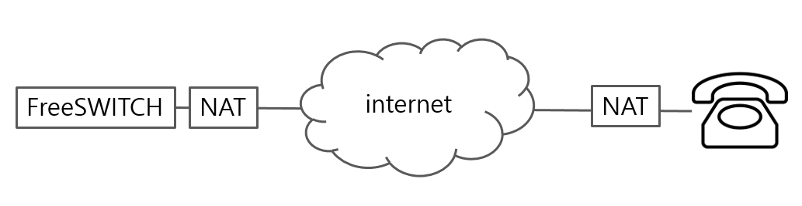
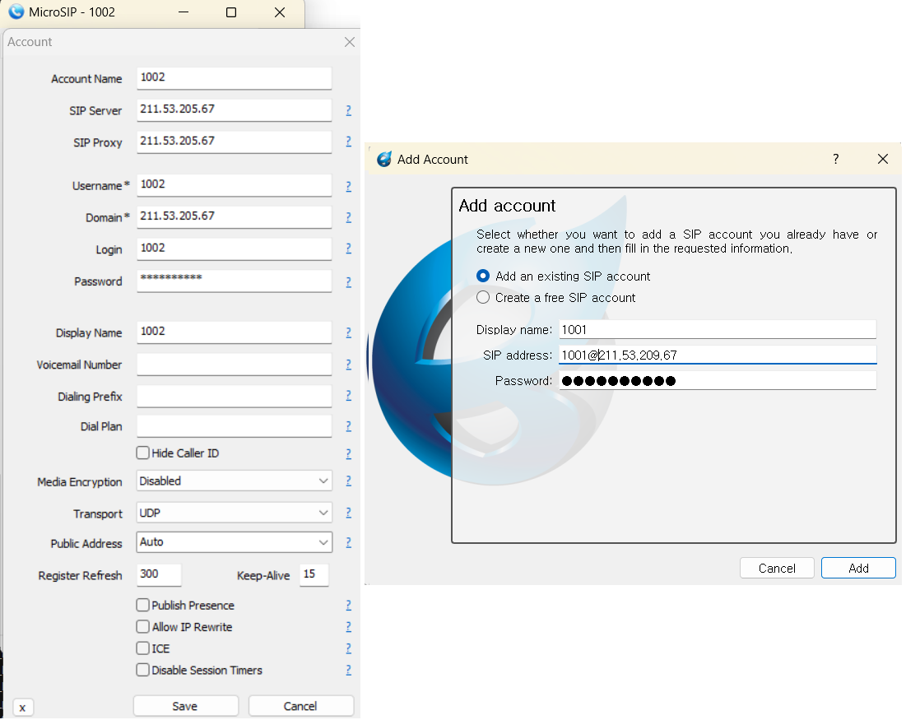

# SIP and NAT

Generally, when using an IP PBX on the same network, the PBX and the phone can communicate directly with each other. However, if you install an IP PBX in the cloud and want to connect a phone remotely, NAT processing is required. Typically, servers installed in the cloud are provided with a public IP along with a private IP for the internal network.

It has the following structure.



For most SIP phones, no special settings are required. This is because in most SIPs, the SIP Server (IP PBX) processes the phone's NAT information. Therefore, in the case of the picture above, as long as FreeSWITCH's NAT is set up properly, the client phone only needs to accurately enter FreeSWITCH's public IP information and registration information (id, password) in the SIP server information.
<br/><br/>

# FreeSWITCH NAT Configuration
Before setting up, you must first check the private IP and public IP values of FreeSWITCH you will install. If installed on a cloud server, these values will be included in the information provided by operators such as AWS.


## FreeSWITCH private IP settings

I will assume the private IP value is "192.168.100.10".
First, enter the private IP value in the domain value of conf/vars.xml.
The reason is that the address of the server where FreeSWITCH actually operates is a private IP. This is because the public IP value received from the cloud service provider is provided through port forwarding, so it is an IP address that does not exist on the cloud server where FreeSWITCH is installed. The IP address of the domain value used in vars.xml must be the IP address provided by the network interface that can be bound.

```bash
[root@my_pbx conf]# ip a
1: lo: <LOOPBACK,UP,LOWER_UP> mtu 65536 qdisc noqueue state UNKNOWN group default qlen 1000
    link/loopback 00:00:00:00:00:00 brd 00:00:00:00:00:00
    inet 127.0.0.1/8 scope host lo
       valid_lft forever preferred_lft forever
    inet6 ::1/128 scope host 
       valid_lft forever preferred_lft forever
2: eth0: <BROADCAST,MULTICAST,UP,LOWER_UP> mtu 1500 qdisc fq_codel state UP group default qlen 1000
    link/ether d2:00:00:7d:4c:e4 brd ff:ff:ff:ff:ff:ff
    inet 192.168.100.10/24 brd 192.168.100.255 scope global eth0
       valid_lft forever preferred_lft forever
```
The ip command only shows the private IP stored on the current interface. We use this value as the domain value in vars.xml.


``` xml
  <X-PRE-PROCESS cmd="set" data="domain=192.168.100.10"/>
  <X-PRE-PROCESS cmd="set" data="domain_name=$${domain}"/>
```
<br/>

## FreeSWITCH public IP settings

I will assume the public IP value is "211.53.205.67". <br/>

### acl.conf
Add the following to the conf/autoload_configs/acl.conf.xml file:
``` xml
    <list name="gateways" default="deny">
	  <node type="allow" cidr="211.53.205.67/32"/>
    </list>
```
<br/>

### sip profile setting
Modify the conf/sip_profiles/internal.xml file as follows.
``` xml
<profile name="internal">

  <aliases>
  </aliases>
  <gateways>
  </gateways>

  <domains>
    <domain name="all" alias="true" parse="false"/>
  </domains>

  <settings>
    <param name="debug" value="0"/>
    <param name="sip-trace" value="no"/>
    <param name="sip-capture" value="no"/>

    <param name="watchdog-enabled" value="no"/>
    <param name="watchdog-step-timeout" value="30000"/>
    <param name="watchdog-event-timeout" value="30000"/>

    <param name="log-auth-failures" value="false"/>
    <param name="forward-unsolicited-mwi-notify" value="false"/>

    <param name="context" value="default"/>
    <param name="rfc2833-pt" value="101"/>
    <!-- port to bind to for sip traffic -->
    <param name="sip-port" value="$${internal_sip_port}"/>
    <param name="dialplan" value="XML"/>
    <param name="dtmf-duration" value="2000"/>
    <param name="inbound-codec-prefs" value="$${global_codec_prefs}"/>
    <param name="outbound-codec-prefs" value="$${global_codec_prefs}"/>
    <param name="rtp-timer-name" value="soft"/>
    <!-- ip address to use for rtp, DO NOT USE HOSTNAMES ONLY IP ADDRESSES -->
    <param name="rtp-ip" value="$${domains}"/>
    <!-- ip address to bind to, DO NOT USE HOSTNAMES ONLY IP ADDRESSES -->
    <param name="sip-ip" value="$${domain}"/>
    <param name="hold-music" value="$${hold_music}"/>
    <param name="apply-nat-acl" value="nat.auto"/>
    <param name="apply-inbound-acl" value="domain"/>
    <param name="local-network-acl" value="localnet.auto"/>

    <param name="record-path" value="$${recordings_dir}"/>
    <param name="record-template" value="${caller_id_number}.${target_domain}.${strftime(%Y-%m-%d-%H-%M-%S)}.wav"/>
    <!--enable to use presence -->
    <param name="manage-presence" value="true"/>
    <param name="presence-hosts" value="$${domain},$${local_ip_v4}"/>
    <param name="presence-privacy" value="$${presence_privacy}"/>
    <param name="inbound-codec-negotiation" value="generous"/>
    <param name="tls" value="$${internal_ssl_enable}"/>
    <param name="tls-only" value="false"/>
    <param name="tls-bind-params" value="transport=tls"/>
    <param name="tls-sip-port" value="$${internal_tls_port}"/>
    <param name="tls-passphrase" value=""/>
    <param name="tls-verify-date" value="true"/>
    <param name="tls-verify-policy" value="none"/>
    <param name="tls-verify-depth" value="2"/>
    <param name="tls-verify-in-subjects" value=""/>
    <!-- TLS version default: tlsv1,tlsv1.1,tlsv1.2 -->
    <param name="tls-version" value="$${sip_tls_version}"/>

    <!-- TLS ciphers default: ALL:!ADH:!LOW:!EXP:!MD5:@STRENGTH  -->
    <param name="tls-ciphers" value="$${sip_tls_ciphers}"/>
    <param name="inbound-late-negotiation" value="true"/>
    <param name="inbound-zrtp-passthru" value="true"/>
    <param name="nonce-ttl" value="60"/>
    <param name="auth-calls" value="$${internal_auth_calls}"/>
    <!-- Force the user and auth-user to match. -->
    <param name="inbound-reg-force-matching-username" value="true"/>
    <!-- on authed calls, authenticate *all* the packets not just invite -->
    <param name="auth-all-packets" value="false"/>

    <param name="ext-rtp-ip" value="211.53.205.67"/>
    <param name="ext-sip-ip" value="211.53.205.67"/>

    <!-- rtp inactivity timeout -->
    <param name="rtp-timeout-sec" value="300"/>
    <param name="rtp-hold-timeout-sec" value="1800"/>
    <!--all inbound reg will look in this domain for the users -->
    <param name="force-register-domain" value="$${domain}"/>
    <!--force the domain in subscriptions to this value -->
    <param name="force-subscription-domain" value="$${domain}"/>
    <!--all inbound reg will stored in the db using this domain -->
    <param name="force-register-db-domain" value="$${domain}"/>

    <!-- for sip over websocket support -->
    <param name="ws-binding"  value=":5066"/>
    <param name="wss-binding" value=":7443"/>

    <!--
    -->
    <param name="challenge-realm" value="auto_from"/>
  </settings>
</profile>
```
<br>
The most important parts are "ext-rtp-ip" and "ext-sip-ip". These values use public IP values, which are the IP values used when going out from FreeSWITCH.

<br><br>


## FreeSWITCH directory settings

FreeSWITCH's directory is where extension information is registered. Register the extension you want to use as follows. I will create extensions 1001 and 1002 for testing.

The following is the conf/directory/default.xml file. There is no special content. This file includes the extension information xml file to be saved in the default directory.

```xml
<include>
  <domain name="$${domain}">
    <params>
      <param name="dial-string" value="{^^:sip_invite_domain=${dialed_domain}:presence_id=${dialed_user}@${dialed_domain}}${sofia_contact(*/${dialed_user}@${dialed_domain})},${verto_contact(${dialed_user}@${dialed_domain})}"/>
      <param name="jsonrpc-allowed-methods" value="verto"/>
    </params>

    <variables>
      <variable name="record_stereo" value="true"/>
      <variable name="default_gateway" value="$${default_provider}"/>
      <variable name="default_areacode" value="$${default_areacode}"/>
      <variable name="transfer_fallback_extension" value="operator"/>
    </variables>

    <groups>
      <group name="default">
	<users>
	  <X-PRE-PROCESS cmd="include" data="default/*.xml"/>
	</users>
      </group>
    </groups>

  </domain>
</include>

```

Then create 1001.xml and 1002.xml files as follows.

```xml
<include>
  <user id="1001">
    <params>
      <param name="password" value="$${default_password}"/>
      <param name="vm-password" value="1001"/>
    </params>
    <variables>
      <variable name="toll_allow" value="domestic,local"/>
      <variable name="accountcode" value="1001"/>
      <variable name="user_context" value="default"/>
      <variable name="effective_caller_id_name" value="Extension 1001"/>
      <variable name="effective_caller_id_number" value="1001"/>
      <variable name="outbound_caller_id_name" value="$${outbound_caller_name}"/>
      <variable name="outbound_caller_id_number" value="$${outbound_caller_id}"/>
    </variables>
  </user>
</include>
```

```xml
<include>
  <user id="1002">
    <params>
      <param name="password" value="$${default_password}"/>
      <param name="vm-password" value="1002"/>
    </params>
    <variables>
      <variable name="toll_allow" value="domestic,local"/>
      <variable name="accountcode" value="1002"/>
      <variable name="user_context" value="default"/>
      <variable name="effective_caller_id_name" value="Extension 1002"/>
      <variable name="effective_caller_id_number" value="1002"/>
      <variable name="outbound_caller_id_name" value="$${outbound_caller_name}"/>
      <variable name="outbound_caller_id_number" value="$${outbound_caller_id}"/>
    </variables>
  </user>
</include>

```
<br><br>

# Phone Configuration
For phones, we will use soft phones MicroSIP and Blink. Assign extension numbers 1001 and 1002 to each soft phone and set them as follows. Of course, you can use FreeSWITCH's public IP value for the SIP server information in the phone settings.



<br><br>

# Wrapping up
Now you can check the registration informations using fs_cli.

```bash
freeswitch@blueivr> show registrations
reg_user,realm,token,url,expires,network_ip,network_port,network_proto,hostname,metadata
1002,192.168.100.10,94f99d2e34094781ace9b40a744b2faf,sofia/internal/sip:1002@192.168.219.103:62244;ob;fs_nat=yes;fs_path=sip%3A1002%40122.153.196.159%3A62244%3Bob,1694328900,122.153.196.159,62244,udp,blueivr,
1001,192.168.100.10,6d4dc213faa14031a5f46e3a640e19dd,sofia/internal/sip:95780214@192.168.219.103:54680;fs_nat=yes;fs_path=sip%3A95780214%40122.153.196.159%3A54680,1694329212,122.153.196.159,54680,udp,blueivr,

2 total.

```
<br>
Among the above information, 192.168.219.103 IP is the private IP of the PC on which the softphone is running. Therefore, you can see that the phone also connected to FreeSWITCH through NAT.


