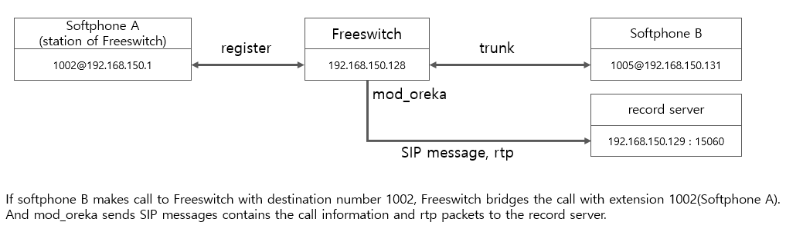
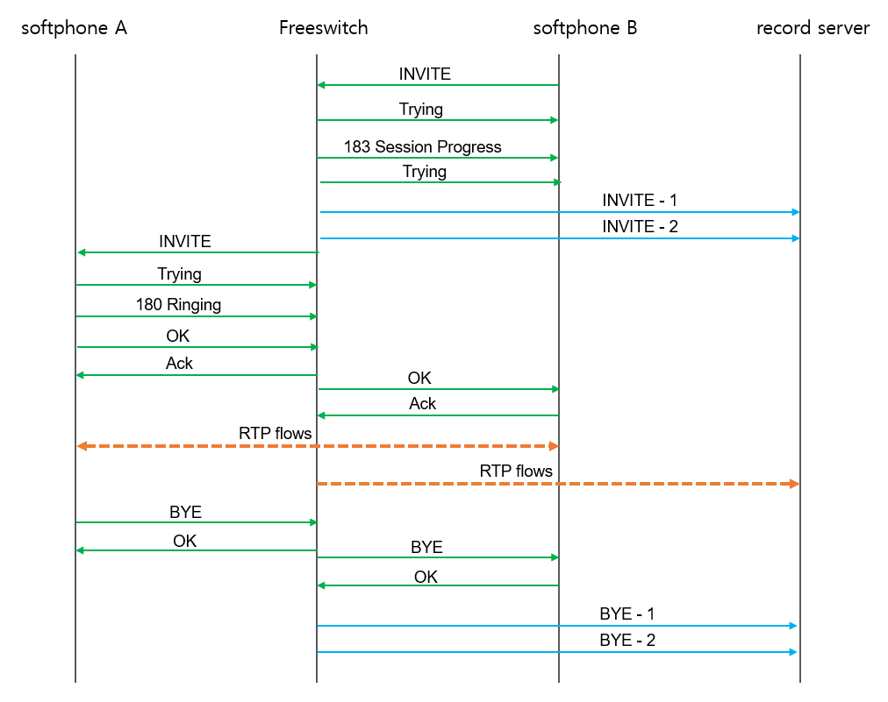

# Freeswitch recording using mod_oreka

Recently, I had to do a project to receive rtp packets from Freeswitch. You can use the mirroring using pcap introduced in VoIP-related-codes/pcap file Analyzing/basic_pcap_recording/. However, this method requires using network switch mirroring or installing applications to be developed with pcap in the system where freeswitch is installed. 
This time I will look into how to use mod_oreka to receive voice packets from freeswitch.

Freeswitch provides a function to record a call using the record_session application. A simple dialplan usage is as follows.

``` xml
<extension name="ext-666">
  <condition field="destination_number" expression="^666$">
    <action application="set" data="RECORD_TITLE=Recording ${destination_number} ${caller_id_number} ${strftime(%Y-%m-%d %H:%M)}"/>
    <action application="set" data="RECORD_COPYRIGHT=(c) 1980 Factory Records, Inc."/>
    <action application="set" data="RECORD_SOFTWARE=FreeSWITCH"/>
    <action application="set" data="RECORD_ARTIST=Ian Curtis"/>
    <action application="set" data="RECORD_COMMENT=Love will tear us apart"/>
    <action application="set" data="RECORD_DATE=${strftime(%Y-%m-%d %H:%M)}"/>
    <action application="set" data="RECORD_STEREO=true"/>
    <action application="record_session" data="$${recordings_dir}/${strftime(%Y-%m-%d-%H-%M-%S)}_${destination_number}_${caller_id_number}.wav"/>
    <action application="set" data="ringback=${us-ring}"/>
    <action application="bridge" data="sofia/external/18007842433@sip.voip-provider.com"/>
  </condition>
</extension>
```
However, sometimes it is necessary to link with a 3rd party external recording system. Most 3rd party external recording systems use network switch mirroring to record regardless of the PBX system. However, it is quite difficult for a 3rd party recording system to record in a PBX system to which TLS/strp is applied. In this case, a PBX system such as Cisco creates a new call session (not tls/srtp) with a recording system on the phone and transfers the call content.

Freeswitch's oreka module also transfers PBX call contents (RTP) to the 3rd party system. Originally created for the Oreka recording system, it is not difficult to create your own application to replace the Oreka system.
<br><br>


## install mod_oreka 
<br>

### mod_oreka needs some modification

mod_oreka sends call information from Freeswitch to the oreka recording server as a SIP message text. There are only two types of SIP messages to be delivered: "INVITE" and "BYE".
However, these messages are processed normally in the oreka recording system, but errors may occur in other SIP message parsing systems.
Therefore, it is good to prevent these errors from occurring by partially modifying the source code of mod_oreka. <br>

* In the SDP of the INVITE message, the order is partially adjusted and t=0 0 is added.

<br>

___Original___

``` c
/* In the static int oreka_send_sip_message(oreka_session_t *oreka, oreka_recording_status_t status, oreka_stream_type_t type) function
*/

    if (status == FS_OREKA_START) {
        sdp.write_function(&sdp, "v=0\r\n");
        sdp.write_function(&sdp, "o=freeswitch %s 1 IN IP4 %s\r\n", session_uuid, globals.local_ipv4_str);
        sdp.write_function(&sdp, "c=IN IP4 %s\r\n", globals.sip_server_ipv4_str);
        sdp.write_function(&sdp, "s=Phone Recording (%s)\r\n", type == FS_OREKA_READ ? "RX" : "TX");
        sdp.write_function(&sdp, "i=FreeSWITCH Oreka Recorder (pid=%d)\r\n", globals.our_pid);
        sdp.write_function(&sdp, "m=audio %d RTP/AVP 0\r\n", type == FS_OREKA_READ ? oreka->read_rtp_port : oreka->write_rtp_port);
        sdp.write_function(&sdp, "a=rtpmap:0 PCMU/%d\r\n", type == FS_OREKA_READ
                ? oreka->read_impl.samples_per_second : oreka->write_impl.samples_per_second);
    }


``` 

<br>

___Modified___
``` c
    //2022.12.25 LSH Add t=0 0 and do line sequence change
    if (status == FS_OREKA_START) {
        sdp.write_function(&sdp, "v=0\r\n");
        sdp.write_function(&sdp, "o=freeswitch %s 1 IN IP4 %s\r\n", session_uuid, globals.local_ipv4_str);
        sdp.write_function(&sdp, "s=Phone Recording (%s)\r\n", type == FS_OREKA_READ ? "RX" : "TX");
        sdp.write_function(&sdp, "i=FreeSWITCH Oreka Recorder (pid=%d)\r\n", globals.our_pid);
        sdp.write_function(&sdp, "c=IN IP4 %s\r\n", globals.sip_server_ipv4_str);
        sdp.write_function(&sdp, "t=0 0\r\n");
        sdp.write_function(&sdp, "m=audio %d RTP/AVP 0\r\n", type == FS_OREKA_READ ? oreka->read_rtp_port : oreka->write_rtp_port);
        sdp.write_function(&sdp, "a=rtpmap:0 PCMU/%d\r\n", type == FS_OREKA_READ
                ? oreka->read_impl.samples_per_second : oreka->write_impl.samples_per_second);
    }

``` 

<br>

* In the BYE message, change callee_id_name to callee_id_number. Because callee_id_name might contain space, This white space can prevent the SIP parser from properly parsing the message.

<br>

___Original___

``` c
/* In the static int oreka_send_sip_message(oreka_session_t *oreka, oreka_recording_status_t status, oreka_stream_type_t type) function
*/

sip_header.write_function(&sip_header, "%s sip:%s@%s:5060 SIP/2.0\r\n", method, callee_id_name, globals.local_ipv4_str);

``` 

<br>

___Modified___
``` c
    //2022.12.25 LSH
    //sip_header.write_function(&sip_header, "%s sip:%s@%s:5060 SIP/2.0\r\n", method, callee_id_name, globals.local_ipv4_str);
    sip_header.write_function(&sip_header, "%s sip:%s@%s:5060 SIP/2.0\r\n", method, callee_id_number, globals.local_ipv4_str);
``` 

<br>

If you modified the source codes, then re-build the mod_oreka and install it.
``` bash
$ src/mod/application/mod_oreka/make
$ src/mod/application/mod_oreka/sudo make install
# check if exists
$ ls -al /usr/local/freeswitch/mod/* |grep oreka
-rwxr-xr-x 1 root root     1300 Dec 22 19:15 /usr/local/freeswitch/mod/mod_oreka.la
-rwxr-xr-x 1 root root   118600 Dec 22 19:15 /usr/local/freeswitch/mod/mod_oreka.so
``` 
<br>

### Check if the mod_oreka module enabled. 

If the following line does not exist or is commented out, activate it.

``` bash
cat /usr/local/freeswitch/conf/autoload_configs/modules.conf.xml |grep oreka
<load module="mod_oreka"/>
```
<br><br>


### Config oreka server section
Although it is named sip-server-addr, this server is not actually a sip server. You just need to receive sip messages sent by mod_oreka using port 15060. There is no need to send responses to sip messages.

``` bash
cat /usr/local/freeswitch/conf/autoload_configs/oreka.conf.xml

<!--
To use this application simply install the open source Oreka recorder server (Orkaudio) and point
the sip-server-addr and sip-server-port to the oreka server
-->
<configuration name="oreka.conf" description="Oreka Recorder configuration">
  <settings>
    <!--  Oreka/Orkaudio recording server address. This server does not have to be an Oreka server. You can make your own server -->
    <param name="sip-server-addr" value="192.168.150.129"/>

    <!-- Which port to send signaling to in the recording server -->
    <param name="sip-server-port" value="15060"/>
  </settings>
</configuration>
```

<br><br>

### Load mod_oreka from fs_cli.

``` bash
$fs_cli
freeswitch@blueivr> reload mod_oreka
+OK Reloading XML
+OK module unloaded
+OK module loaded

2022-12-22 22:57:22.023964 [NOTICE] switch_loadable_module.c:1263 Deleting Application 'oreka_record'
2022-12-22 22:57:22.023964 [DEBUG] switch_loadable_module.c:1265 Write lock interface 'oreka_record' to wait for existing references.
2022-12-22 22:57:22.023964 [CONSOLE] switch_loadable_module.c:2396 Stopping: mod_oreka
2022-12-22 22:57:22.023964 [CONSOLE] switch_loadable_module.c:2416 mod_oreka unloaded.
2022-12-22 22:57:22.023964 [DEBUG] mod_oreka.c:659 Found parameter sip-server-addr=192.168.150.1
2022-12-22 22:57:22.023964 [DEBUG] mod_oreka.c:659 Found parameter sip-server-port=15060
2022-12-22 22:57:22.023964 [INFO] mod_oreka.c:721 Loading mod_oreka, sip_server_addr=192.168.150.1, sip_server_ipv4_str=192.168.150.1, sip_server_port=15060, local_ipv4_str=192.168.150.128
2022-12-22 22:57:22.023964 [CONSOLE] switch_loadable_module.c:1803 Successfully Loaded [mod_oreka]
2022-12-22 22:57:22.023964 [NOTICE] switch_loadable_module.c:350 Adding Application 'oreka_record'
2022-12-22 22:57:22.023964 [INFO] switch_time.c:1430 Timezone reloaded 1750 definitions

```
<br><br>


## System Configuration 
<br>


<br/><br/>

<br/>

### Freeswitch dialplan 
When a call is made to 1002 from the softphone located at 192.168.150.131, extension 1002 softphone (192.168.150.1) is connected.

``` xml
    <extension name="extension-intercom">
      <!-- <condition field="${sip_to_params}" expression="intercom\=true"/> -->
      <condition field="destination_number" expression="^(1002)$">
        <action application="log" data="ALERT ==== INTERNAL CALL for oreka testing ======"/>
        <action application="set" data="dialed_extension=$1"/>
        <action application="set" data="oreka_sip_h_X-customer=Customer123"/>
        <action application="set" data="oreka_sip_h_X-extension=${destination_number}"/>
        <action application="oreka_record"/>
        <action application="bridge" data="user/${destination_number}"/>
      </condition>
    </extension>

```

### recording server 
There must be a process that can receive SIP packets from mod_oreka delivered to port 15060. In the SIP message, there is information about the udp port number where rtp packets can be received. Record server can receive rtp dynamically using this value.
<br/><br/>

### SIP messages and rtp packets from mod_oreka
When a call is made , mod_oreka sends SIP messages which contains call information and rtp packets to the record server.

<br/><br/>

## SIP Messages flow 
<br>

<br/><br/>

**Note : INVITE-1, INVITE-2, BYE-1 and BYE-2 are not SIP protocols. In the picture, Record server does not send any responses. It's just sending SIP messages as text.** 

<br/><br/>

## Analyzing SIP messages from mod_oreka 
<br>
The SIP messages sent by mod_oreka are 2 INVITE and 2 BYE. The reason for sending two for one call is to process RX and TX channels separately.

<br/>

### INVITE-1
``` yaml
INVITE sip:1002@192.168.150.128:5060 SIP/2.0
Via: SIP/2.0/UDP 192.168.150.128:5061;branch=z9hG4bK-70116f1c-30da-434a-ae1f-8b72bbacb6dd
From: <sip:1005@192.168.150.128:5061;tag=1>
To: <sip:1002@192.168.150.128:5060>
Call-ID: 70116f1c-30da-434a-ae1f-8b72bbacb6dd
CSeq: 1 INVITE
Contact: sip:freeswitch@192.168.150.128:5061
Max-Forwards: 70
Subject: BEGIN RX recording of PhonerLite
X-customer: Customer123
X-extension: 1002
Content-Type: application/sdp
Content-Length: 225

v=0
o=freeswitch 70116f1c-30da-434a-ae1f-8b72bbacb6dd 1 IN IP4 192.168.150.128
s=Phone Recording (RX)
i=FreeSWITCH Oreka Recorder (pid=1401)
c=IN IP4 192.168.150.129
t=0 0
m=audio 21008 RTP/AVP 0
a=rtpmap:0 PCMU/8000

```
<br/><br/>

### INVITE-2
``` yaml
INVITE sip:1002@192.168.150.128:5060 SIP/2.0
Via: SIP/2.0/UDP 192.168.150.128:5061;branch=z9hG4bK-70116f1c-30da-434a-ae1f-8b72bbacb6dd
From: <sip:1005@192.168.150.128:5061;tag=1>
To: <sip:1002@192.168.150.128:5060>
Call-ID: 70116f1c-30da-434a-ae1f-8b72bbacb6dd
CSeq: 1 INVITE
Contact: sip:freeswitch@192.168.150.128:5061
Max-Forwards: 70
Subject: BEGIN TX recording of PhonerLite
X-customer: Customer123
X-extension: 1002
Content-Type: application/sdp
Content-Length: 225

v=0
o=freeswitch 70116f1c-30da-434a-ae1f-8b72bbacb6dd 1 IN IP4 192.168.150.128
s=Phone Recording (TX)
i=FreeSWITCH Oreka Recorder (pid=1401)
c=IN IP4 192.168.150.129
t=0 0
m=audio 21446 RTP/AVP 0
a=rtpmap:0 PCMU/8000


```

<br/><br/>

### BYE-1
``` yaml
BYE sip:1002@192.168.150.128:5060 SIP/2.0
Via: SIP/2.0/UDP 192.168.150.128:5061;branch=z9hG4bK-70116f1c-30da-434a-ae1f-8b72bbacb6dd
From: <sip:1005@192.168.150.128:5061;tag=1>
To: <sip:1002@192.168.150.128:5060>
Call-ID: 70116f1c-30da-434a-ae1f-8b72bbacb6dd
CSeq: 1 BYE
Contact: sip:freeswitch@192.168.150.128:5061
Max-Forwards: 70
Subject: END RX recording of PhonerLite
Content-Length: 0
```


<br/><br/>

### BYE-2
``` yaml
BYE sip:1002@192.168.150.128:5060 SIP/2.0
Via: SIP/2.0/UDP 192.168.150.128:5061;branch=z9hG4bK-70116f1c-30da-434a-ae1f-8b72bbacb6dd
From: <sip:1005@192.168.150.128:5061;tag=1>
To: <sip:1002@192.168.150.128:5060>
Call-ID: 70116f1c-30da-434a-ae1f-8b72bbacb6dd
CSeq: 1 BYE
Contact: sip:freeswitch@192.168.150.128:5061
Max-Forwards: 70
Subject: END TX recording of PhonerLite
Content-Length: 0
```

<br/><br/>


## Analyzing RTP from mod_oreka 
<br>
RTP packets must be received by analyzing the media information included in the SDP of the INVITE-1 and INVITE-2 messages.
If you analyze the above SIP messages, you can see that RX packets in PCMU format are sent to port 21934 in the INVITE-1 message.
Similarly, in the INVITE-2 message, it can be seen that a TX packet in PCMU format is sent to port 21898.

<br/><br/>


## Run mod_oreka dynamically
<br>

There may be cases where you need to selectively forward voice packets using mod_oreka only for certain calls, rather than all calls.
In this case, you can use the uuid of the call.

Information about the calls currently in progress can be read with the "show calls" command or directly from core.db.

<br/>


```sql
sqlite3 /usr/local/freeswitch/db/core.db 

sqlite> .headers on
sqlite> SELECT uuid, cid_num, callee_num, dest, context, direction, call_uuid FROM channels;
uuid|cid_num|callee_num|dest|context|direction|call_uuid
13de5da7-8d5b-45e2-81ed-f5c05960e367|PhonerLite|5003|07047378300|blueivr|inbound|13de5da7-8d5b-45e2-81ed-f5c05960e367
f2d8417d-7c98-4b5d-b959-b5c9aa22f4d2|PhonerLite|5003|5003|default|outbound|13de5da7-8d5b-45e2-81ed-f5c05960e367
```

<br/>

The two rows above are information about two channels for one call. The first row is a call coming into FreeSWITCH from the outside. Therefore, the direction value is inbound based on FreeSWITCH. And the second row is a call connected to extension 5003 from FreeSWITCH. It is an outbound call based on FreeSWITCH. The link connecting these two rows is call_uuid. This value uses the uuid of A Leg. Now, we can know both A Leg and B Leg information for one call currently in progress.

Now you can send voice packets to the current call using mod_oreka with the following uuid_oreka command in the fs_cli console:

```bash
freeswitch@blueivr> uuid_oreka 13de5da7-8d5b-45e2-81ed-f5c05960e367
```

<br/>
