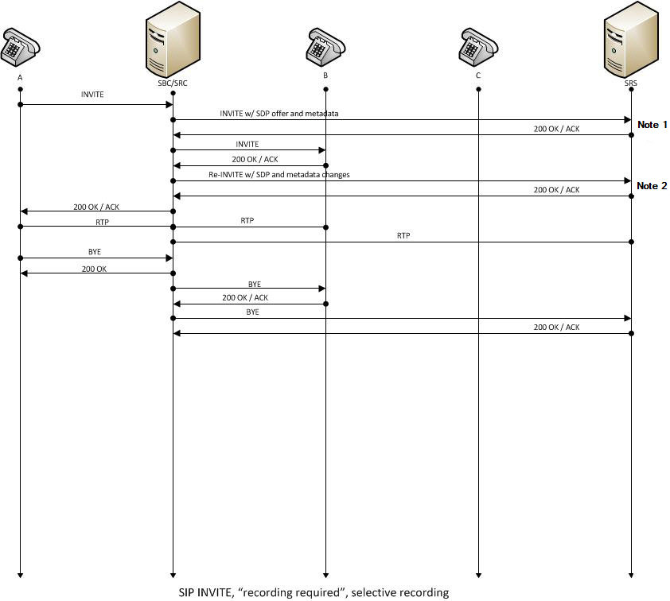

# About SIPREC

<br><br>

SIPREC (Session Recording Protocol) is a session recording protocol standardized by the IETF (RFC 7866). It is primarily used in enterprise IP telephone networks or call center environments to record voice calls for legal evidence, quality assurance (QA), or training purposes.

<br>

## Core Components (Architecture)

<br>

* SIPREC architecture is broadly divided into two core roles.
* SRC (Session Recording Client): This is the equipment directly participating in the call session to be recorded. (e.g., FreeSWITCH, SBC, IP-PBX) Its role is to duplicate the call content and transmit it to the SRS.
* SRS (Session Recording Server): This is the server that receives, stores, and manages the media and metadata transmitted from the SRC. (e.g., recording system)

<br>

## Operating Principle

<br>

* SIPREC creates a new session called an RS (Recording Session) separate from a standard call session.
* CS (Communication Session): This is the actual call session between Users A and B.
* RS (Recording Session): This is the session established when the SRC requests the SRS to "record the call from now on."
* Signaling: The RS is created using the SIP protocol (such as INVITE).
* Media Delivery: The actual call content (RTP) is duplicated and transmitted to the SRS. Typically, User A's voice and User B's voice are sent as separate streams (Multi-stream).
* Metadata Delivery: As one of SIPREC's most significant features, it transmits information to the SRS in XML format regarding not only the voice but also who is on the call, when, and to which number.

<br>

## Key Features and Benefits

<br>

* Standardization: It is not tied to a specific vendor and is compatible with any equipment compliant with the standard RFC 7866.
* Metadata Inclusion: It can record not only simple audio files but also detailed data such as call participant information and call transfer status.
* Flexibility: Since recording is performed at an intermediate point in the network (SBC), integrated recording is possible regardless of the type of telephone or switchboard.
* High Availability: It is easy to configure load balancing or failover by deploying multiple SRSs.

<br>

## SIPREC Protocol

<br>

* It adheres to the SIPREC (RFC 7866) standard.
* It includes both bidirectional (RX+TX) RTP streams simultaneously within a single SIPREC session (INVITE).
* In other words, the entire call is bundled into a single session and delivered to the recording server (SRS).
* Information such as participants, direction, and Call-ID is contained within the metadata (XML), and the server distinguishes between RX and TX based on this information.

<br>

## Sample SIPREC SIP INVITE and Response OK

<br>

### SIPREC SIP INVITE from SRC

<br>

```xml
INVITE sip:srs@recordingserver.com SIP/2.0
Via: SIP/2.0/UDP 192.168.1.10:5060;branch=z9hG4bK-12345
From: <sip:src@pbx.local>;tag=1111
To: <sip:srs@recordingserver.com>
Call-ID: abc123@pbx.local
CSeq: 1 INVITE
Contact: <sip:src@192.168.1.10:5060>
Content-Type: multipart/mixed; boundary=boundary42
Content-Length: ...

--boundary42
Content-Type: application/sdp

v=0
o=src 3747 3747 IN IP4 192.168.1.10
s=-
c=IN IP4 192.168.1.10
t=0 0
m=audio 4000 RTP/AVP 0
a=sendonly
m=audio 4002 RTP/AVP 0
a=sendonly

--boundary42
Content-Type: application/rs-metadata+xml

<?xml version="1.0"?>
<recording xmlns="urn:ietf:params:xml:ns:recording">
  <session session_id="abc123">
    <participant participant_id="p1" session_id="abc123">
      <name>Caller</name>
      <send>stream1</send>
    </participant>
    <participant participant_id="p2" session_id="abc123">
      <name>Callee</name>
      <send>stream2</send>
    </participant>
  </session>
</recording>

--boundary42--
```

<br>

### SIPREC Response OK from SRS

<br>

```xml
SIP/2.0 200 OK
Via: SIP/2.0/UDP 192.168.1.10:5060;branch=z9hG4bK-12345
From: <sip:src@pbx.local>;tag=1111
To: <sip:srs@recordingserver.com>;tag=2222
Call-ID: abc123@pbx.local
CSeq: 1 INVITE
Contact: <sip:srs@192.168.1.20:5070>
Content-Type: application/sdp
Content-Length: ...

v=0
o=srs 3747 3747 IN IP4 192.168.1.20
s=-
c=IN IP4 192.168.1.20
t=0 0
m=audio 5070 RTP/AVP 0
a=recvonly
m=audio 5072 RTP/AVP 0
a=sendonly
```

<br>

### How to distinguish between RTP TX/RX

#### INVITE (SRC → SRS)

* m=audio 4000  ... a=sendonly →  (TX or RX stream)
* m=audio 4002  ... a=sendonly →  (RX or TX stream)

#### 200 OK (SRS → SRC)

* m=audio 5070 ... a=recvonly → SRS receives RTP on this port.
* m=audio 5072 ... a=sendonly → SRS can send RTP to this port (but is not actually used in SIPREC).

#### SSRC

* Each RTP stream has a unique SSRC in its header.
* The SRS tracks the SSRC and maps it to the stream ID in the XML metadata.
* This identifies whether the actual packet belongs to an agent or a customer.
* Therefore, SRS must remember the stream1 and stream2 values ​​of the participant included in the XML of the INVITE method.
* Then, the SSRC value of the RTP header of the RTP packet is compared with stream1 and stream2 to distinguish between RX and TX.

Based on this information, the SRS distinguishes who is the sender (TX) and who is the receiver (RX) when storing the RTP stream.

<br><br>

# SIPREC Vs. Oreka Vs. Mirroring

<br>

| Feature             | `mod_siprec` (Active)             | `mod_oreka` (Active)                 | Passive Sniffing (SPAN)      |
|:------------------- |:--------------------------------- |:------------------------------------ |:---------------------------- |
| **Protocol**        | Standard SIPREC (RFC 7866)        | Proprietary Oreka Protocol           | Raw Packet Sniffing          |
| **Signaling**       | SIP INVITE with XML Metadata      | Metadata via Oreka's specific header | SIP/RTP Sniffing             |
| **Integration**     | Standardized (Works with any SRS) | Specific to Oreka (OrkAudio)         | Independent of Software      |
| **Traffic Type**    | SIP/RTP/XML                       | Custom packets (usually port 8000)   | Mirrored Network Traffic     |
| **System Load**     | Moderate (RTP Replication)        | Moderate (RTP Replication)           | **None** (On FreeSWITCH)     |
| **Encrypted Calls** | Supported (via TLS/SRTP)          | Supported (inside the module)        | Extremely Difficult          |
| **Setup Level**     | Module Compilation/SIP Config     | Module Compilation/Oreka Config      | Network Switch Configuration |

<br>

It shares many similarities with mod_oreka.
While mod_oreka was designed specifically for oreka recording servers, you can build your own oreka server and use it for various purposes. However, mod_siprec is more scalable because it supports a general-purpose protocol, allowing it to integrate with recording servers that use various SIPREC protocols.

Furthermore, it offers excellent versatility as devices such as Cisco CUCM/CUBE, Avaya Session Manager, AudioCodes, and Oracle SBCs support SIPREC.

<br><br>

# mod_siprec

<br>

아래 수정 필요

📌 **As of today (July11, 2026), the latest version of mod_siprec is 1.5.3. After downloading, building, installing, and testing this version**

<br>

 

## mod_siprec build

<br>

mod_siprec is not a module officially included in the FreeSWITCH source code. Therefore, you must download and build it separately.

* Download the FreeSWITCH source code. I will assume that it has been downloaded to the /usr/local/src/freeswitch directory.
* Download the mod_siprec source code from https://github.com/voicetel/mod_siprec. The location of the mod_siprec source code is /usr/locla/src/freeswitch/src/mod/applications.

<br>

There is a slight issue with the current mod_siprec.c code.
According to C90/C99 rules, variable declarations must be placed at the beginning of a block. However, since variables are declared in the middle of code execution within mod_siprec.c, compiling it as is results in an error.
While changing compilation options is an option, in my personal opinion, declaring variables in the middle of a function in a C source file is not a good practice.

However, building the downloaded source code requires a bit of a trick.

<br>

**The original build command of the voicetel homepage**

```bash
cd /usr/local/src
git clone https://github.com/voicetel/mod_siprec.git
git checkout v1.5.3
cd mod_siprec
ln -sf $PWD src/mod/applications/mod_siprec
echo 'applications/mod_siprec' >> build/modules.conf.in
./bootstrap.sh && ./configure
make mod_siprec-install
```

<br>

**Instead of creating a symbolic link, I will download the source code from the freeswitch source code directory.**
**CC="gcc -Wno-error=declaration-after-statement" The command "CC="gcc -Wno-error=declaration-after-statement" prevents errors from occurring even when declaring variables in the middle of a function, just like in C++.**

<br>

```bash
cd /usr/local/src/freeswitch/src/mod/applications
git clone https://github.com/voicetel/mod_siprec.git
cd src/mod/applications/mod_siprec

gcc -fPIC -DPIC -I/usr/include/uuid -I/usr/local/src/freeswitch/src/include \
    -I/usr/local/src/freeswitch/libs/libteletone/src -g -O2 \
    -Wno-error=declaration-after-statement \
    -c mod_siprec.c siprec_invite.c recording_session.c siprec_sdp.c siprec_metadata.c siprec_media.c siprec_g711.c siprec_sb.c     

gcc -shared -fPIC \
    -o mod_siprec.so \
    mod_siprec.o siprec_invite.o recording_session.o siprec_sdp.o siprec_metadata.o siprec_media.o siprec_g711.o siprec_sb.o  -luuid    
cp mod_siprec.so  /usr/local/freeswitch/mod/
```

<br>

If registered in the autoload_configs/modules.conf.xml file, the module will be automatically loaded when FreeSWITCH is restarted.

## Setting up mod_siprec

<br>

So, add mod_siprec to the conf/autoload_configs/modules.conf.xml file so that FreeSWITCH loads mod_siprec when it starts.

```xml
<load module="mod_siprec"/>
```

<br>

### siprec.conf.xml

Then, create the mod_siprec configuration file, /usr/local/freeswitch/conf/autoload_configs/siprec.conf.xml, as follows.

```xml
<configuration name="siprec.conf" description="SIPREC (RFC 7866) module config">
  <settings>
    <param name="src-enabled" value="true"/>
    
  </settings>
  <recording-servers>
    <recording-server name="default">
      <settings>
        <param name="host" value="127.0.0.1"/>
        <param name="port" value="5070"/>
        <param name="register" value="false"/>
        <param name="username" value=""/>
        <param name="password" value=""/>
      </settings>
    </recording-server>
  </recording-servers>
</configuration>
```

<br>

The src-enabled key is visible in settings.

#### SRC (Session Recording Client)

* Role: The entity that initiates recording at the PBX/media server/gateway where the actual call takes place.
* Operation: Monitors the call session and transmits the RTP stream and metadata (XML) to the recording server (SRS).
* Meaning in FreeSWITCH: FreeSWITCH acts as a SIPREC client to transmit call content to an external recording server.

<br>

Since FreeSWITCH operates as a recording client and not as a recording server, set src-enabled=true .

<br>

#### recording-server

Enter the address and information of the siprec server into the recording server.
The following siprec servers for recording can be used.

| Server                               | Installation difficulty                               | recording format                | Scope of application     |
| ------------------------------------ | ----------------------------------------------------- | ------------------------------- | ------------------------ |
| **drachtio-siprec-recording-server** | Easy (Docker/Node.js)                                 | pcap (Post-processing required) | Development/Testing, PoC |
| **Oreka (OrecX)**                    | Intermediate (SIPREC+RTPProxy configuration required) | wav/mp3                         | Enterprise, Call Center  |

<br>

## Dialplan

<br>

```xml
  <!-- Activate SIPREC while connecting to extension 5007 -->
  <extension name="TRUNK_SIPREC">
    <condition field="${sip_to_user}" expression="^(07047008888)$">
          <action application="set" data="continue_on_fail=true"/>
          <action application="export" data="hold_music=$${base_dir}/sounds/common/elise.wav" />
          <action application="siprec" data="default"/>
          <action application="bridge" data="USER/5007@$${domain}"/>
    </condition>
  </extension>
```

<br>

## Loading mod_siprec

<br>

If the setup process is finished, load mod_siprec in fs_cli.

```bash
freeswitch@blueivr> freeswitch@blueivr> load mod_siprec
+OK Reloading XML
+OK

2026-07-09 00:58:40.920225 98.13% [INFO] switch_time.c:1431 Timezone reloaded 0 definitions
2026-07-09 00:58:40.920225 98.13% [WARNING] switch_xml_config.c:437 Configuration parameter [srs-enabled] is unfortunately not valid, you might want to double-check that.
2026-07-09 00:58:40.920225 98.13% [CONSOLE] switch_loadable_module.c:1773 Successfully Loaded [mod_siprec]
2026-07-09 00:58:40.920225 98.13% [NOTICE] switch_loadable_module.c:330 Adding Application 'siprec'
2026-07-09 00:58:40.920225 98.13% [NOTICE] switch_loadable_module.c:330 Adding Application 'siprec_pause'
2026-07-09 00:58:40.920225 98.13% [NOTICE] switch_loadable_module.c:330 Adding Application 'siprec_resume'
2026-07-09 00:58:40.920225 98.13% [NOTICE] switch_loadable_module.c:330 Adding Application 'siprec_stop'

```

The last line in the fs_cli output above can be ignored.

<br><br>

# About simple_srs

<br><br>

simple_srs is a simple srs program created to test mod_siprec.

It operates through the following process.

<br/>

<div align="center">
<a href="https://translate.google.co.kr">siprec Call flow from ORACLE</a>
</div>

<br>

* When simple_srs receives an INVITE message from mod_siprec, it sends an OK response containing port information to receive rtp.

* In mod_siprec V1.34, RX and TX packets are sent from two ports. However, it is not possible to distinguish which one is the caller. simple_srs distinguishes between the two ports and creates two recording files to save the packets. The file names are based on the call ID included in mod_siprec's INVITE message.

* When the call ends, mod_siprec sends BYE. simple_srs sends OK and cleans up resources.Then, the recording file is converted to a wav file using the external program sox.

<br>

## simple_srs build

<br>

No special work is required for the build.

* mkdir build
* cd build
* cmake ..
* make

<br>

## run simple_srs

<br>

Run simple_srs.

```bash
[root@dev1 build]# ./simple_srs
====== Simple siprec server(for mod_siprec V1.34) Start ======
SIPREC socket port[5070] bind success
Initialize epoll success epoll siprec sock[4]
Create UDP sockets success
```

When receiving an INVITE

```bash
INVITE media:audio 20872 RTP/AVP 0  port:20872  codec:0
SIPREC socket port[21872] bind success
```

When receiving an BYE

```bash
End of recording
End of recording
CID:cc6489ed-ce3b-123f-8abb-d20d227d4ce8 Call termination completed
```

And you can see that two wav files were created as follows. rx and tx are stored in independent wav files.

```bash
[root@dev1 build]# ll
total 2276
-rw-r--r-- 1 root    root    151084 May 19 22:49 52a0faef-ce2c-123f-8abb-d20d227d4ce8_0_0.raw.wav
-rw-r--r-- 1 root    root    151084 May 19 22:49 52a0faef-ce2c-123f-8abb-d20d227d4ce8_0_1.raw.wav
-rw-r--r-- 1 root    root     14445 May 19 16:31 CMakeCache.txt
drwxr-xr-x 6 root    root      4096 May 20 00:39 CMakeFiles
-rw-r--r-- 1 root    root      1652 May 19 16:31 cmake_install.cmake
-rw-r--r-- 1 root    root      8774 May 19 16:31 Makefile
-rwxr-xr-x 1 root    root    873904 May 20 00:39 simple_srs
```

<br><br>

# Wrapping up

<br>
As mentioned earlier, mod_siprec v1.34 is an unfinished version. I will update the content once 1.4 is released.
