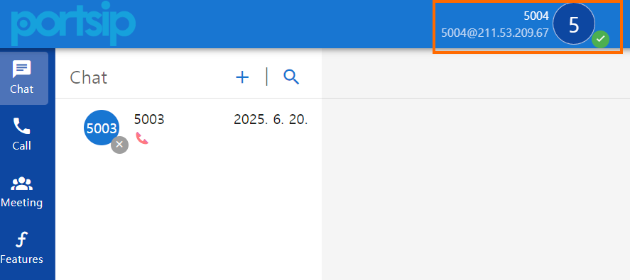
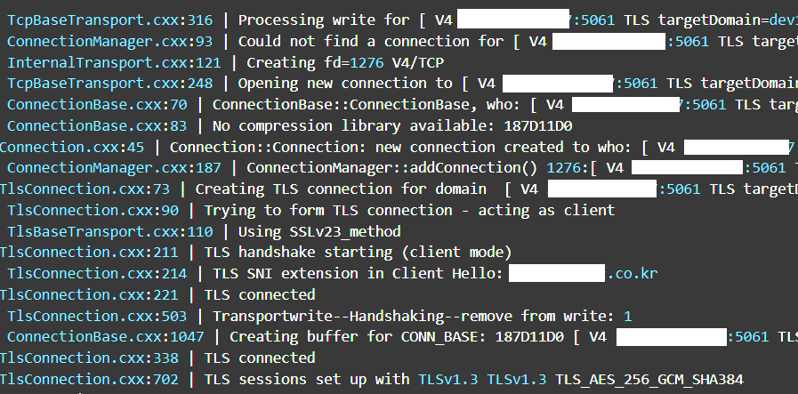
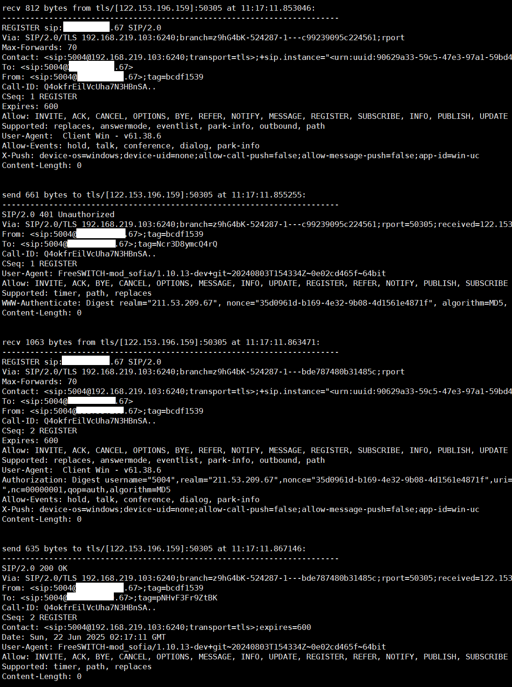

# Securities

Much of this article is taken from Packt Publishers' FreeSWITCH 1.8 (ISBN 978-1-78588-913-4).

<br/>

FreeSWITCH supports both encryption of SIP signaling and encryption of RTP. Normally, both are encrypted. The reason is that the RTP encryption key value is transmitted through SIP signaling, so if SIP is not encrypted, the key value that can decrypt RTP may be exposed.

<br/>

## Simple setup

<br/>

The following figure shows the most common configuration without any security applied.


<br/>

The left picture is the most common configuration without any security applied, and the right picture reduces the risk of hacker attacks by using lesser-known ports instead of well-known ports (5060, 5080). A firewall is also used.
However, the picture on the right cannot be the complete answer to security. The port that has been changed by a hacker's port scanning can also be exposed. And there is a risk of attack or call history theft through this port.

<br/>


## Complex setup

A more complex example indicates isolation of networks and assumes you have network routing gear that allows you to split network access either physically


<br/>

To do this, you might set up two Sofia SIP profiles like the following:

```xml
<profile name="incoming_from_pstn"> 
<settings> 
<param name="auth-calls" value="true"/> 
<param name="apply-inbound-acl" value="my_carriers"/> 
<param name="context" value="inbound_call"/> 
<param name="sip-port" value="5678"/> 
<param name="sip-ip" value="212.222.33.111"/> 
... other settings here ... 
</settings> 
</profile> 
<profile name="customer_access"> 
<settings> 
<param name="auth-calls" value="true"/> 
<param name="apply-inbound-acl" value="default_deny_list"/> 
<param name="context" value="customer_call"/> 
<param name="sip-port" value="15699"/> 
<param name="sip-ip" value="192.168.100.100"/> 
... other settings here ... 
</settings> 
</profile> 
```
<br/>

FreeSWITCH will attempt to utilize the network interface on the physical server which represents the IP address that you have specified in the Sofia SIP profile. This allows you to use different firewalls and network links for each interface powering your FreeSWITCH system.

 In this scenario, 192.168.100.100 could be an internal IP address that is not routable on the public Internet and 212.222.33.111 could be a public IP address that is routable. The IP address 212.222.33.111 would only have to be open to carriers unless you have users with phones outside your local network. As an alternative for allowing phones, **you could allow your staff to VPN into your network. This would be the most secure strategy possible.**

<br/>

# Encryption in Signaling and Media

However, there are situations where it is difficult to use VPN. In these cases, while the phones in the LAN environment are fine, remote extension phones that need to be connected via the Internet are vulnerable to security threats. In this case, calls can be protected from hacking risks by encrypting SIP signaling messages and RTP between the phone and FreeSWITCH.

<br/>

## Choosing between encryption options

 There are some encryption options available for FreeSWITCH. You can encrypt the signaling (that is, the SIP messages), the media (that is, the audio in the RTP stream), or both.

<br>

* TLS (Transport Layer Security) : encrypts everything over the TCP connection; this has the downside that jitter or delays due to TCP can occur. UDP is generally preferred for RTP and using TLSV1 has some additional traffic overhead.

* SSL (Secure Sockets Layer) : v2/3; SSLv2 was found to be insecure and is deprecated since 2011, while SSLv3 has been broken in 2014 and deprecated in 2015 (google for POODLE attack). So, because there is no meaning into having a breakable encryption, disable SSL altogether.

* ZRTP : A protocol designed by Phil Zimmermann (the developer of Pretty Good Privacy, PGP) that allows secure key negotiation without certificates while exchanging keys for SRTP streams directly in the session. However, the client must also support ZRTP and have the ZRTP feature turned on. Some software SIP phones support it, but it is not recommended to use it because there are not many hardware phones that support it compared to TLS. 

<br/>

## tls-version

<br>

As explained above, ssl, zrtp should be avoided if possible and tls should be used. In FreeSWITCH, encryption options can be specified as follows:

Edit "/usr/local/freeswitch/conf/vars.xml" like this:

```xml
<X-PRE-PROCESS cmd="set" data="sip_tls_version=tlsv1,tlsv1.1,tlsv1.2"/> 
```

Then check into all SIP profiles if they are using this same value. It will probably apply mainly to the "conf/sip_profiles/internal.xml" file. It can be taken from global variables as:

```xml
<param name="tls-version" value="$${sip_tls_version}"/> 
```

<br/>

## Certificates

<br>

 For any kind of SIP encryption, you need a Security Certificate issued ("signed") by a recognized Certification Authority, that takes on herself the esponsibility to assert that you are you and not a cat. You can cheat at this by crafting "self-signed" certificates, using software that simulate a certification authority (eg: you are your own Certification Authority). Certificates have nothing to do with using SSL as encryption method, "SSL Certificate" is just the old way to call a security certificate (because was then used by SSL, but it can be used by TLS too, no problem, is always the same certificate). Also if you disable SSL, you still need the same certificates for TLS, DTLS, and all other kind of encryptions.

You want to use real, actual certificates issued by a real, actual Certification Authority (as opposed to "self-signed" certificates). Those "real certificates" are automatically accepted by SIP clients.

At https://letsencrypt.org you can obtain legit certificates for free. I mainly use letsencrypt. In this article, I will explain how to use letsencrypt certificates rather than self-signed certificates.

<br/>

## Installing a certificate in FreeSWITCH

<br>

Self-signed certificates "may" work for testing purposes, but is such a PITA to have all the moving parts correctly coordinated, it is not worth at all, and a sure recipe for a lot of time wasted and frustration. Simply put: DON'T. Use real, valid certificates for real, valid domain names Since the method of installing a certificate from Letsencrypt is described in detail on the Internet, a explanation is omitted. I will continue to explain assuming that you have installed a Letsencrypt certificate.

On Linux systems, Let's Encrypt certificates are typically stored in the /etc/letsencrypt/live/domain_name/ directory. Now let's create a certificate for FreeSWITCH using the certificate in this directory.

<br>

### Make certificates for FreeSWITCH 

I will just use the /etc/letsencrypt/live/your_domain/ directory as my FreeSWITCH certificate directory.  
<span style="color:orange">***You must create the agent.pem and cafile.pem files.***</span>

<br>

```bash
#!/bin/sh 
cd /etc/letsencrypt/live/your_domain_name/
cat fullchain.pem privkey.pem > wss.pem 
cat cert.pem privkey.pem > agent.pem 
cat chain.pem > cafile.pem 
```

<br>

You can also use the more commonly used "/usr/local/freeswitch/certs/". In this case, you can create wss.pem, agent.pem, and cafile.pem files in the "/usr/local/freeswitch/certs/" directory as follows:

```bash
#!/bin/sh 
cp /etc/letsencrypt/live/your_domain_name/* /usr/local/freeswitch/certs/ 
cd /usr/local/freeswitch/certs/ 
cat fullchain.pem privkey.pem > wss.pem   #for webrtc
cat cert.pem privkey.pem > agent.pem 
cat chain.pem > cafile.pem 
```

<br>

### Protecting signaling

<br>

SIP signaling contains both authentication information your phone utilizes to make and receive calls and includes the Caller ID Name and Number of the caller and callee, by default in plain text. This is easy to sniff and to spoof. Encryption makes that harder. In addition, **if you are using SRTP (Secure RTP), the SIP signaling contains the cryptography key used to keep your audio secure.** Someone who observed this key in plain-text would easily be able to defeat the media encryption utilized.

Once you've obtained your certificates, you will need to tell FreeSWITCH to use these certificates. To do this, set these variables in "/usr/local/freeswitch/conf/vars.xml":

```xml
<X-PRE-PROCESS cmd="set" data="sip_tls_version=tlsv1,tlsv1.1,tlsv1.2"/> 
<X-PRE-PROCESS cmd="set" data="internal_tls_port=5061"/> 
<X-PRE-PROCESS cmd="set" data="internal_ssl_enable=true"/> 
<X-PRE-PROCESS cmd="set" data="external_tls_port=5081"/> 
<X-PRE-PROCESS cmd="set" data="external_ssl_enable=false"/> 
<X-PRE-PROCESS cmd="set" data="sip_tls_ciphers=ALL:!ADH:!LOW:!EXP:!MD5:@STRENGTH"/> 
<!-- <X-PRE-PROCESS cmd="set" data="sip_tls_ciphers=AES256-SHA"/> -->

<X-PRE-PROCESS cmd="set" data="internal_ssl_dir=/etc/letsencrypt/live/your_domain_name"/>
<X-PRE-PROCESS cmd="set" data="external_ssl_dir=/etc/letsencrypt/live/your_domain_name"/>

```

Note that in vars.xml TLS (historically named "ssl") is enabled separately for internal and external profile. And it is set to apply tls only to the internal profile. Since vars.xml only sets global variable values, the values ​​set here are not immediately reflected. You need to modify the xml file that sets the actual profile again.

After setting defaults in vars.xml, check your SIP profiles and be sure the parameters are reflecting what you want (remember: what is written between "<!--" and "-->" is commented out):

<span style="color:orange">***tls-cert-dir is an important value that tells us the directory where the agent.pem, cafile.pem ssl certificates are located.***</span>

The internal.xml file uses the global variable values ​​set in the vars.xml file. Here is a portion of conf/sip_profiels/internal.xml:

```xml
 <!-- TLS: disabled by default, set to "true" to enable --> 
<param name="tls" value="$${internal_ssl_enable}"/> 
<!-- Set to true to not bind on the normal sip-port but only on the TLS port --> 
<param name="tls-only" value="false"/> 
<!-- additional bind parameters for TLS --> 
<param name="tls-bind-params" value="transport=tls"/> 
<!-- Port to listen on for TLS requests. (5061 will be used if unspecified) --> 
<param name="tls-sip-port" value="$${internal_tls_port}"/> 

<!-- Location of the agent.pem and cafile.pem ssl certificates (needed for TLS server) --> 
<param name="tls-cert-dir" value="$${internal_ssl_dir}"/>

<!-- Optionally set the passphrase password used by openSSL to encrypt/decrypt TLS private key files -->
<param name="tls-passphrase" value=""/> 
<!-- Verify the date on TLS certificates --> 
<param name="tls-verify-date" value="true"/> 
<!-- TLS verify policy, when registering/inviting gateways with other servers (outbound) or handling -->
<!-- set to 'in' to only verify incoming connections, 'out' to only verify outgoing connections, 'all' -->
<param name="tls-verify-policy" value="none"/> 
<!-- Certificate max verify depth to use for validating peer TLS certificates when the verify policy -->
 <param name="tls-verify-depth" value="2"/> 
<!-- If the tls-verify-policy is set to subjects_all or subjects_in this sets which subjects are allow -->
 <param name="tls-verify-in-subjects" value=""/> 
<!-- TLS version default: tlsv1,tlsv1.1,tlsv1.2 --> 
<param name="tls-version" value="$${sip_tls_version}"/> 
<!-- TLS ciphers default: ALL:!ADH:!LOW:!EXP:!MD5:@STRENGTH  --> 
<param name="tls-ciphers" value="$${sip_tls_ciphers}"/> 
```


<br>

# TLS SIP signaling test

Before applying SRTP, let's save what I've done so far and test if tls is working properly. The test terminal used was a PortSIP softphone.

<br>

## Restart Freeswitch

<br>

Save your work and restart FreeSWITCH.

<br>


## Configuring PortSIP softphone

<br>
Here are my softphone settings:

<br>


<br>

And when I clicked Sign In, it was successfully registered as shown below.




<br>

And if you check the log file in the log file directory, you can see that tls worked properly as follows.



<br>

Of course, you can see in WireShark that messages are being sent and received using TLS as follows.


<br>

You may want to check detailed logs in FreeSWITCH. In this case, you can change the log level of sofia and restart mod_sofia.
Increase the log level to 9 and then run reload mod_sofia in fs_cli.

```xml
  <global_settings>
    <param name="log-level" value="9"/>
    <param name="debug-presence" value="0"/>
    <!-- <param name="capture-server" value="udp:homer.domain.com:5060"/> -->
  </global_settings>
```

<br><br>


# SRTP

<br>

Encryption of the RTP streams (audio and video) ensures that the actual content of SIP calls cannot be listened on, recorded, or otherwise illegally obtained. There are multiple ways to achieve this security. At its core, encryption requires that both sides involved agree on an encryption method and an algorithm for encrypting and decrypting the data being transmitted and received. In other words, you can't use an encryption method that isn't supported by both sides. In addition, encryption algorithms are based on key exchanges, generally at the beginning of the call. These key exchanges are similar to exchanging passwords by both parties, but in an electronic and often automated way. There are two popular forms of encryption generally used when encrypting audio and media streams. These forms of encryption are SRTP and ZRTP

 * SRTP : was developed in 2004 by a small team of IP protocol and cryptographic experts from Cisco and Ericsson. SRTP defines a method of transmitting and receiving RTP with message authentication and integrity and replay protection to the RTP data. Because it is older and was developed by key IP telephony hardware players, it has seen adoption in most SIP equipment. SRTP is available on almost all devices available on the market. 
 * ZRTP : was developed in 2006 by Phil Zimmermann (creator of PGP). It is a newer entrant that makes key negotiation automatic, significantly simplifying the setup and operation of ensuring secure and encrypted RTP calls. It also has the added advantage of not being dependent on server-side encryption. Encryption can occur between servers that are otherwise unaware of the contents of the RTP stream. However, a limited number of hardware support ZRTP at this moment, most hardware manufacturers will need to implement ZRTP for this protocol to be fully successful.

<br>

As you can see above, I will use SRTP, which is commonly used.

<br>

SRTP is an encryption mechanism that is negotiated during call setup via SIP. Both sides of the SIP conversation must agree to support RTP encryption and exchange keys for encryption in the SIP packets. The encryption key used for SRTP is exchanged inside SIP packets. This information is then used to encrypt the audio stream. SRTP enables encryption of the RTP data with minor overhead to the RTP UDP packets. This has the benefit that the call data are encrypted but still transmit via UDP, minimizing latency and using network traversal mechanisms that would normally be used in an unencrypted stream. Generally SRTP is the most firewall friendly strategies for existing installations since the actual work has already been done to get RTP to transmit properly over the network. SRTP is fairly easy to configure within FreeSWITCH.

<br>

<span style="color:orange">***You can enable SRTP from your Dialplan on a per-call basis by setting the following flag:***</span>

```xml
 <action application="set" data="rtp_secure_media=true"/>
```
<span style="color:orange">***Note that sip_secure_media is deprecated and no longer implemented. Use rtp_secure_media instead.***</span>

<br/>
 
### [rtp_secure_media](https://developer.signalwire.com/freeswitch/Channel-Variables-Catalog/rtp_secure_media_16353121)

<br/>

Syntax: rtp_secure_media=permission:list of encryption suites
Examples:
  * rtp_secure_media=mandatory:AES_CM_256_HMAC_SHA1_80,AES_CM_256_HMAC_SHA1_32
  * rtp_secure_media=true:AES_CM_256_HMAC_SHA1_80,AES_CM_256_HMAC_SHA1_32
  * rtp_secure_media=optional:AES_CM_256_HMAC_SHA1_80
  * rtp_secure_media=true:AES_CM_256_HMAC_SHA1_80

<br/>

permission:

* mandatory - Accept/Offer SAVP negotiation ONLY
* optional - Accept/Offer SAVP/AVP with SAVP preferred
* forbidden - More useful for inbound to deny SAVP negotiation
* deprecatedfalse - implies forbidden
* deprecatedtrue - implies mandatory
* default - accept SAVP inbound if offered

<br/>

<span style="color:orange">***It seems that rtp_secure_media_inbound and rtp_secure_media_outbound are no longer needed.***</span>


This needs to be done on both legs and on both inbound and outbound calls to be fully effective. Of course, the ITSP that provide you gateway to PSTN will probably not support SRTP so you may only be able to enable this on legs from FreeSWITCH to the endpoint(s).


<br>

### Apply srtp when connecting inbound calls to internal endpoints

<br>

If you want to apply it to outbound call to endpoints, you can pass it as data to the bridge application. The following is a dialplan that requests SRTP to extension 5005 when calling extension 5005.

```xml
	 <condition field="destination_number" expression="^(5005)$">
        <action application="log" data="ALERT ==== 5005 SRTP TEST INTERNAL CALL From ${caller_id_number} to $1 ======"/>
        <action application="set" data="continue_on_fail=true"/>
        <action application="set" data="hangup_after_bridge=true"/> 
        <!--<action application="bridge" data="{rtp_secure_media=true:AES_CM_256_HMAC_SHA1_80,AES_CM_256_HMAC_SHA1_32}USER/$1@$${domain}"/>-->
        <action application="bridge" data="{rtp_secure_media=true}USER/$1@$${domain}"/>
    </condition>
```
<br>

### Apply srtp to inbound calls from internal telephones

<br>
In this case, you must set your phone to use srtp on the extension phone. As you can see in the Login Setting screen of the PortSIP phone, SRTP is set to Force to ensure that SRTP is used.


<br/>
 
### SRTP Test

<br/>

To test srtp, use the dial plan above. In the dial plan, when a call comes in to extension 5005, the leg (b leg) that communicates with extension 5005 is set to use tls, srtp. I will test by calling extension 5004 to extension 5005. Extension 5004, 5005 are set to use srtp for all calls in the phone settings.

<br/>


<br>

And packets were captured using Wireshark on a PC with 5004 extension installed.

If you look at the packets after the call is made, you can see data going back and forth between terminals 5004 and 5005.
<br/>


<br>

These packets are SRTP packets. They are 10 bytes larger than RTP packets. This is because a 10-byte Authentication Tag is added to the back of the voice packet.

<br>

* RTP Packet: Header + Payload
* SRTP Packet: RTP Header + Encrypted Payload + Authentication Tag 

<br>

<span style="color:orange">***If you look at the encrypted packet, you can see that the RTP Header is not encrypted. Only the actual payload part is encrypted.***</span>

<br/>


<br/><br/>

# Cooking TLS and SRTP

<br>

Proceed after completing all the tasks described above.

<br>

## If you want to force all extension to use TLS

<br>

Set the tls-only value in the internal.xml file to true.

```xml
<param name="tls-only" value="true"/>
```

<br>

## If you want to force a specific extension to use TLS

<br>

If you want to set extension 1000 to use TLS, add the following line to the conf/directory/default/1000.xml file.

<br>

```xml
<param name="register-transport" value="tls"/>
```

Now extension 1000 will fail to register via UDP or TCP. If this line does not exist, extension 1000 can use tcp, udp, and tls for register.

* value="udp": Allow registration only with UDP
* value="tcp": Allow registration only with TCP
* value="tls": Allow registration only with TLS

<br>

## How to debug SIP messages when TLS is enforced

<br>

When tls is applied, it is difficult to check sip messages in network packets. I mainly use sngrep to check sip messages. However, when tls is applied, sngrep cannot capture packets. The same applies to Wireshark and tcpdump. You can check that tls is applied, but you cannot see the packet contents.

You can use the "sofia global siptrace on(off)" command in fs_cli.
Below is a capture from fs_cli of extension 5004 registering using tls.



<br>

# Wrapping up

<br/>
I looked at how to apply TLS/SRTP to extension phones in FreeSWITCH. Support may vary depending on the HW phone used. Therefore, it is necessary to refer to the phone vendor's documentation to check in advance whether there is a problem with applying TLS/SRTP with FreeSWITCH. In this article, I used the PortSIP softphone for easy testing. Many FreeSWITCH documents related to applying TLS/SRTP also do not reflect the changes in the latest version. Please note that if you set up and test based on documents searched on the Internet or materials searched using AI, there may be cases where it does not work properly.


