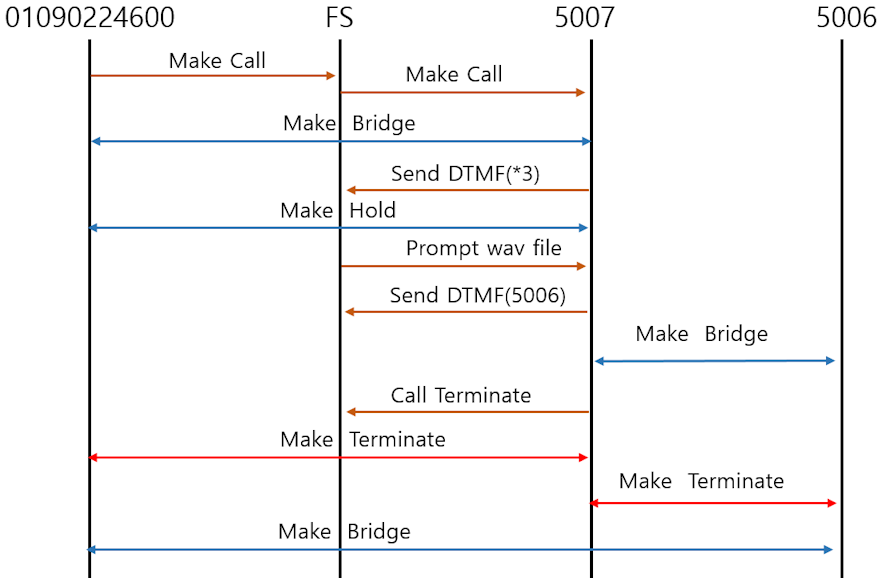
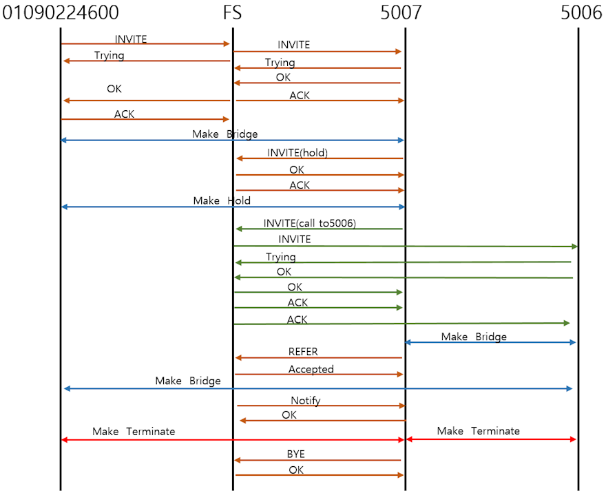

# Attended Transfer

## Definition of Attended Transfer

* Attended transfer (also called warm transfer):
A call transfer method where the person handling the call contacts the intended recipient first, explains the situation, and confirms they are ready to take the call before completing the transfer.

* This is different from a blind transfer (cold transfer), where the call is passed directly without prior notice.

<br>

## Key Characteristics

### Caller (A) → Intermediate handler (B) → Final recipient (C)

* A calls B.
* B answers and places A on hold.
* B calls C, explains the situation.
* If C agrees, B connects A and C.

### Advantages:

* The recipient is prepared for the conversation.
* Improves customer experience by avoiding repeated explanations.
* Ensures the call reaches the right person.

<br>

## Comparison: Blind vs. Attended Transfer

| Aspect | Blind Transfer | Attended Transfer |
| --- | --- | --- |
| **Process** | Directly passes the call | Confirms with recipient first |
| **Speed** | Faster | Slightly slower |
| **Customer experience** | Recipient unaware → may need repetition | Recipient informed → smoother conversation |
| **Best use case** | Simple routing, automated systems | Personalized service, complex issues |

<br><br>


# Attended Transfer Implementation Method

There are two ways to implement attended transfer in FreeSWITCH.

One is to use the phone's attended transfer feature, and the other is to use the Dialplan provided by FreeSWITCH.

<br>

# Using FreeSWITCH Features

<br>
FreeSWITCH does not utilize the phone's attended transfer function. Therefore, it has the advantage of being applicable to any endpoint as long as the phone is capable of making and receiving calls.

In particular, since the attending transfer mechanism varies by phone manufacturer, there is no need for training specific to the phone model. Additionally, due to compatibility issues, the attended transfer function provided by the phone may not work on some phones.

To test a call transfer, you must first create a call.

1. Let's create the following scenario first.
2. Call FreeSWITCH line 07047378800 from external trunk 01090224600.
2. Extension 5007 answers a call from external line 01090224600.
3. 5007 press *3 to perform an attended transfer.

To do this, first create a dial plan as follows.

The explanation of how to create a sip profile for a domestic dial plan is omitted.

```xml
<!--trunk xml conf/dialplan/***.xml-->
    <extension name="TRUNK_CUSTOMER_BLUE"> 
      <condition field="${sip_to_user}" expression="^(07047378800)$">
            <action application="log" data="ALERT destination_number=${destination_number}"/>
            <action application="set" data="continue_on_fail=true"/>
            <action application="export" data="hold_music=$${base_dir}/sounds/common/elise.wav" /> 
            <!-- Press *3 during a call to run extension 88 -->
            <action application="bind_meta_app" data="3 b s execute_extension::86 XML features"/>

            <action application="bridge" data="USER/5007@$${domain}"/>
      </condition>
    </extension>
```
<br>

You can modify above dialplan to suit your environment.You just need to create a dial plan that allows a connection from the external line to the internal line.

**Note that the above dial plan uses the bind_meta_app application. This application provides the ability to launch a new dial plan during a call by pressing *3.**

<br><br>

```xml
<!--default xml conf/dialplan/default.xml-->
  <extension name="Local_Extension InterCOM">
	<condition field="destination_number" expression="^(5\d{3})$">
	<action application="log" data="ALERT ==== Default INTERNAL CALL From ${caller_id_number} to $1 ======"/>
        <action application="set" data="continue_on_fail=true"/>
        <action application="export" data="hold_music=/usr/local/freeswitch/sounds/common/elise.wav" />            
        <action application="set" data="hangup_after_bridge=false"/> 
        <action application="bridge" data="USER/$1@$${domain}"/>
    </condition>
  </extension> 
```

<br>
During the attended transfer, the second call will use an extension.Therefore, I need to create a dialplan that allows extensions to communicate with each other.
I will use number 5XXX as my extension number. Accordingly, I created the dialplan above to bridge incoming calls from number 5XXX into the default context used by the extension.
If you want to add the attended transfer feature provided by FreeSWITCH to internal calls as well, add the following line as in default.xml.

<br>

```xml
<!-- Press *3 during a call to run extension 86 -->
<action application="bind_meta_app" data="3 ab s execute_extension::86 XML features"/>
```
<br>

bind_meta_app is a useful application that not only provides attended transfers provided by FreeSWITCH but also receives DTMF input during a call to operate a new dial plan. This application will be explained in detail later.


<br><br>


```xml
<!--features context conf/dialplan/features.xml-->
<include>
  <context name="features">
  <extension name="att_xfer">
    <condition field="destination_number" expression="^86$">
    <action application="log" data="ALERT feature dialplan"/>
    <!--read 4 digits and save to attxfer_callthis variable-->
    <action application="read" data="4 4 common/xfer_get4digits.wav attxfer_callthis 30000"/>
    <action application="att_xfer" data="user/${attxfer_callthis}"/>
    </condition>
  </extension>
  
  </context>
</include>  
```
<br>
The final dial plan uses a somewhat unfamiliar features context. The features context is contained within the parameters of bind_meta_app. Create the same context used in bind_meta_app and insert the above dial plan into it.

This scenario is invoked when *3 is pressed during a call, and receives a 4-digit DTMF for call transfer while playing the sounds/common/xfer_get4digits.wav audio file. Of course, you must create and prepare this audio file in advance.

And finally, the application that performs the attended transfer is att_xfer.

<br>

## test

<br>

When testing the dial plan prepared above, it operates in the following flow.




<br>


## Important functions

<br>
The most important applications implementing attended transfer in FreeSWITCH are bind_meta_app and att_xfer. Let's take a closer look at these applications.


### bind_meta_app application

<br>
The bind_meta_app application in FreeSWITCH is a dialplan tool that allows you to bind a specific application to a call leg, so that pressing a defined DTMF sequence during a bridged call will trigger the execution of that application. It is commonly used to add interactive features (like recording, transferring, or executing extensions) while a call is in progress.

<br>

📌 **Core Concept**

* Purpose: Attach an application to a call leg so that pressing * followed by a digit (0–9) executes the bound application.
* Scope: Works only on the call leg(s) specified; the other party does not hear the DTMF tones.
* Lifetime: The binding persists for the duration of the call leg.

```xml
<action application="bind_meta_app" data="KEY LISTEN_TO FLAGS APPLICATION[::PARAMETERS]"/>
```
* KEY: The digit (0–9) pressed after *. Example: 1 means *1.
* LISTEN_TO: Which call leg to monitor (a, b, or ab).
* FLAGS: Control behavior. Examples:


|FLAGS | Description |
| :---: | :--- | 
| **a** | respond on A leg |
| **b** | respond on B leg |
| **o** | respond on opposite leg | 
| **s** | respond on same leg | 
| **i** | execute inline immediately | 
| **1** | unbind after one use |

<br>

If you apply this to a call center, the attended transfer will be requested by extension 5007. In this case, since it only needs to respond to "*3" pressed on the B leg, you should set the LISTEN_TO value to b.

If you want to apply the attended transfer to extension calls as well, the LISTEN_TO value ab would be appropriate.

For attended transfers, the FLAGS value 's' is typically used because the terminal pressing *3 needs to be asked for the call transfer target.

However, if you need to receive input from the customer along with guidance during a call, you can use 'a' or 'o'.

<br>

📂 **Examples**

To activate the feature context's dx expression on *1 pressed by the caller during a call

```xml
<action application="bind_meta_app" data="1 a s execute_extension::dx XML features"/>
```

<br>

To proceed with selective recording by pressing 2   

```xml
<action application="bind_meta_app" data="2 b s record_session::$${base_dir}/recordings/${caller_id_number}.${strftime(%Y-%m-%d-%H-%M-%S)}.wav"/>

```

When *2 is pressed, the session audio is recorded and saved with timestamped filename.

<br>


## ✅ Practical Use Cases

* Call recording: Allow either caller or callee to start recording with a key sequence.
* Feature activation: Trigger special dialplan features (e.g., transfer, conference join) mid-call.
* Custom services: Execute scripts or applications dynamically during a bridged call.

<br>


## 🚨 Important Notes

* Does not work with bypass_media=true, because media flows directly between endpoints and DTMF tones never reach FreeSWITCH.

* Timeout behavior: After pressing *, the digit must be entered within 5 seconds; otherwise, the digit is passed to the opposite leg.

* Alternative: For more advanced digit bindings (like regex or multiple digits), use bind_digit_action.


<br>

### att_xfer application

<br>

📞**What is att_xfer**

* att_xfer is a FreeSWITCH application (part of mod_dptools) that performs an attended transfer.

* An attended transfer means the current caller is placed on hold while the person handling the call dials a third party, speaks with them first, and then decides whether to connect the original caller or cancel the transfer.


```xml
<action application="att_xfer" data="user/5006"/>
```

```bash
att_xfer <channel_url>
```

* <channel_url>: specifies the destination to which the transfer should be attempted (e.g., a SIP URI or dialplan target).


**Process:**

* The original caller is placed on hold.
* The system dials the target channel.
* The handler can speak privately with the new party.
* Options are available to complete the transfer, cancel it, or turn it into a three-way conference.

<br>

🔑 **Key Features**

* Cancel transfer: Use the attxfer_cancel_key (default #) to abort and return to the original caller.

* Hang up: Use the attxfer_hangup_key (default *) to end the consultation call.

* Conference: Use the attxfer_conf_key (default 0) to merge all parties into a three-way conference.

* Timeout behavior: If the consulted party does not answer, the handler can cancel and reconnect with the original caller.

<br>

🚨 **Practical Notes**

* Voicemail handling: If the consulted party’s voicemail picks up, the handler can cancel with # to avoid connecting the caller to voicemail.

* Flexibility: Useful in call centers or corporate environments where agents need to brief a colleague before transferring a customer.

* Integration: Often combined with bind_meta_app so that pressing a key sequence (like *3) triggers the attended transfer logic.


<br><br>

# Using Phone Features

<br>
Most hardware or software SIP phones include an attended transfer function.
However, since the implementation method varies slightly from phone to phone, you must test whether attended transfer is supported on each model currently in use.
Additionally, you must also prepare a dial plan to enable attended transfer.

I tested extensions 5006 and 5007 using a Panville phone.

The following process is followed.


* Press the Xfer soft button on the phone while on a call at 5007.

* The existing call is put on hold, and a request is made to enter the number to connect.

* Press 5006.

* The call with 5006 is connected, and the LCD screen displays two calls currently connected, with the second call being active.

* In this state, press the Xfer button again.

* At this moment, a REFER message is transmitted, and the FS connects 5006 to 01090224600.

* The FS sends "Accepted, NOTIFY" to 5007.

* The "Accepted, NOTIFY" message is received by 5007. Then, the 5007 phone automatically sends "BYE," and all calls from 5007 are disconnected.

<br>

The following is a summary of the content explained above in the form of a SIP message flow.

<br>




<br><br>

# Wrapping up

<br>

How you implement attended transfer in the FreeSWITCH system is up to your choice.

If FreeSWITCH and attended transfer do not work well due to a lack of compatibility with your SIP phone, you can use FreeSWITCH's features.

If you prefer using the Universal SIP protocol and there are no compatibility issues with your phone, you can use the features provided by your phone.

FreeSWITCH's method of detecting in-call DTMF to activate a new dial plan is a powerful feature that can be utilized for various purposes, including attended transfer and selective recording, so it is essential to familiarize yourself with its details.
