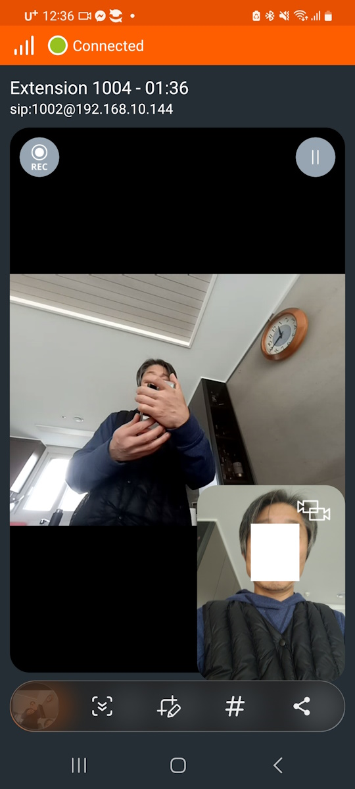

# Freeswitch Video Call


## Video Codecs
<br>
The video codecs mainly used in FreeSWITCH are as follows.
<br><br>

### h263, h263+, h263++
<br>
H.263 is a video compression standard originally designed as a low-bit-rate compressed format for videotelephony. It was standardized by the ITU-T Video Coding Experts Group (VCEG) in a project ending in 1995/1996. It is a member of the H.26x family of video coding standards in the domain of the ITU-T.
<br> <br> 

H.263v2 (also known as H.263+, or as the 1998 version of H.263) is the informal name of the second edition of the ITU-T H.263 international video coding standard. It retained the entire technical content of the original version of the standard, but enhanced H.263 capabilities by adding several annexes which can substantially improve encoding efficiency and provide other capabilities (such as enhanced robustness against data loss in the transmission channel). The H.263+ project was ratified by the ITU in February 1998. 
<br> <br> 

The definition of H.263v3 (also known as H.263++ or as the 2000 version of H.263) added three annexes. These annexes and an additional annex that specified profiles (approved the following year) were originally published as separate documents from the main body of the standard itself. 


<sup>[1. source](#footnote_1)</sup>

It was initially used as a codec for video calls, but due to its low resolution, it is only used in some 3G mobile networks and is not used much anymore.


<br><br>


### h264
<br>
Advanced Video Coding (AVC), also referred to as H.264 or MPEG-4 Part 10, is a video compression standard based on block-oriented, motion-compensated coding.[2] It is by far the most commonly used format for the recording, compression, and distribution of video content, used by 91% of video industry developers as of September 2019. It supports a maximum resolution of 8K UHD.

Performance has been continuously improved from version 1 in 2003 to version 26 in 2019. It is a high-definition codec that is currently widely used in video calls.


<br><br>


### vp8, vp9
<br>
VP8 is an open and royalty-free video compression format released by On2 Technologies in 2008.

Initially released as a proprietary successor to On2's previous VP7 format, VP8 was released as an open and royalty-free format in May 2010 after Google acquired On2 Technologies. Google provided an irrevocable patent promise on its patents for implementing the VP8 format, and released a specification of the format under the Creative Commons Attribution 3.0 license. That same year, Google also released libvpx, the reference implementation of VP8, under the revised BSD license.
It shows similar performance to the h264 codec.

<br>
VP9 is an open and royalty-free video coding format developed by Google.
VP9 is the successor to VP8 and competes mainly with MPEG's High Efficiency Video Coding (HEVC/H.265). At first, VP9 was mainly used on Google's video platform YouTube. The emergence of the Alliance for Open Media, and its support for the ongoing development of the successor AV1, of which Google is a part, led to growing interest in the format.
In contrast to HEVC, VP9 support is common among modern web browsers (see HTML5 video § Browser support). Android has supported VP9 since version 4.4 KitKat, while iOS/iPadOS added support for VP9 in iOS/iPadOS 14.
Parts of the format are covered by patents held by Google. The company grants free usage of its own related patents based on reciprocity, i.e. as long as the user does not engage in patent litigations. It shows similar performance to the h265 codec.


<br><br>

## Video Codecs in FreeSWITCH

<br>


You can check the list of codecs currently activated in FreeSWITCH as follows. Enter the show codec command in the fs_cli console. The list of codecs displayed on your computer may be different from the one below.
``` bash
freeswitch@blueivr> show codec
type,name,ikey
codec,ADPCM (IMA),mod_spandsp
codec,G.711 alaw,CORE_PCM_MODULE
codec,G.711 ulaw,CORE_PCM_MODULE
codec,G.722,mod_spandsp
codec,G.726 16k,mod_spandsp
codec,G.726 16k (AAL2),mod_spandsp
codec,G.726 24k,mod_spandsp
codec,G.726 24k (AAL2),mod_spandsp
codec,G.726 32k,mod_spandsp
codec,G.726 32k (AAL2),mod_spandsp
codec,G.726 40k,mod_spandsp
codec,G.726 40k (AAL2),mod_spandsp
codec,GSM,mod_spandsp
codec,H.261 Video (passthru),mod_h26x
codec,H.263 Video (passthru),mod_h26x
codec,H.263+ Video (passthru),mod_h26x
codec,H.263++ Video (passthru),mod_h26x
codec,H.264 Video (passthru),mod_h26x
codec,LPC-10,mod_spandsp
codec,MP3,mod_shout
codec,MP4V Video (passthru),mod_mp4v
codec,PROXY PASS-THROUGH,CORE_PCM_MODULE
codec,PROXY VIDEO PASS-THROUGH,CORE_PCM_MODULE
codec,RAW Signed Linear (16 bit),CORE_PCM_MODULE
codec,Speex,CORE_SPEEX_MODULE
codec,VP8 Video,CORE_VPX_MODULE
codec,VP9 Video,CORE_VPX_MODULE

27 total.
```

<br>

## FreeSWITCH codec modules
<br>
The following codec modules are located in the freeswitch/mod directory. If you need to use the codec but do not see it, uncomment the module in the modules.conf file when building source code and then build again.
<br><br>

### mod_h26x
Used to process h26x codec. However, this codec does not include an encoder or decoder. When transmitting and receiving video frames between two terminals, the encoded frame is simply transmitted to the other terminal without change. Since there is no encoder or decoder, it is difficult to strictly define it as a codec.

<br>

### mod_av
Used to process h26x codec. The difference from mod_h26x is that it is a complete codec that includes an encoder and decoder. If you use the h26x codec, it is a codec that must be used when you need to composite video frames, such as at a conference.

<br>


### CORE_VPX_MODULE
This is a codec built into FreeSWITCH. Because VP8 and VP9 codecs are free from licensing issues, FreeSWITCH uses them as the default codec. Therefore, vp8 and vp9 codecs can be used without separate module settings.


<br>

### mod_mp4v
Used to process mp4v codec. However, this codec does not include an encoder or decoder. When transmitting and receiving video frames between two terminals, the encoded frame is simply transmitted to the other terminal without change. Since there is no encoder or decoder, it is difficult to strictly define it as a codec.


<br>

## Simple internal video call
<br>
It is very simple to implement a video call between extension terminals that simply support video calls without using conference. Proceed as follows:
<br><br>


### vars.xml
Set the global_codec_prefs and outbound_codec_prefs values as follows. This setting causes the video codec to be added to the sdp when making a video call. 

```xml
  <X-PRE-PROCESS cmd="set" data="global_codec_prefs=PCMA,PCMU,H264,VP8"/>
  <X-PRE-PROCESS cmd="set" data="outbound_codec_prefs=PCMA,PCMU,H264,VP8"/>
```

### modules.conf.xml
Since I will simply bypass the video rtp, I will only use the mod_h26x module.

```xml
    <load module="mod_h26x"/>
    <!--<load module="mod_av"/>-->
```


### directory/default/mystation.xml
Create an extension to use for testing as follows.

```xml
<include>
  <user id="1004">
    <params>
      <param name="password" value="$${default_password}"/>
    </params>
    <variables>
      <variable name="accountcode" value="1004"/>
      <variable name="user_context" value="default"/>
      <variable name="effective_caller_id_name" value="Extension 1004"/>
      <variable name="effective_caller_id_number" value="1003"/>
      <variable name="outbound_caller_id_name" value="$${outbound_caller_name}"/>
      <variable name="outbound_caller_id_number" value="$${outbound_caller_id}"/>
    </variables>
  </user>
  <user id="1005">
    <params>
      <param name="password" value="$${default_password}"/>
    </params>
    <variables>
      <variable name="accountcode" value="1005"/>
      <variable name="user_context" value="default"/>
      <variable name="effective_caller_id_name" value="Extension 1005"/>
      <variable name="effective_caller_id_number" value="1001"/>
      <variable name="outbound_caller_id_name" value="$${outbound_caller_name}"/>
      <variable name="outbound_caller_id_number" value="$${outbound_caller_id}"/>
    </variables>
  </user>

</include>
```

### dialplan/default.xml
Create a dialplan to be used for testing as follows. This is a dialplan for internal calls between 1001 and 1005.

```xml
     <extension name="Local_Extension Example">
        <condition field="destination_number" expression="^(100[12345])$">
            <action application="log" data="ALERT ==== Default INTERNAL CALL From ${caller_id_number}======"/>
            <action application="set" data="res=${bgapi record_fsv  /tmp/testrecord.fsv}"/>
            <action application="set" data="dialed_ext=$1"/>
            <action application="set" data="hangup_after_bridge=true"/>
            <action application="bridge" data="USER/${destination_number}@$${domain}"/>
        </condition>
    </extension>
```
<br>

### video terminal
The test phone can be a hardware terminal that supports video or a SIP video softphone. I installed and used linphone on two smartphones.
The following is a smartphone screen shot. I was able to make normal video calls both when I activated only the vp8 codec and when I activated only the h264 codec.

<br>



<br>

# Wrapping up

mod_h26x has a very simple structure because it bypasses video RTP, and there are no special problems in building it. Therefore, when FreeSWITCH is installed in most Linux distributions, it is included by default. Therefore, video calls between devices can be implemented very easily regardless of the operating system. But conferences are different. Because Conference synthesizes two or more video images, both the corresponding encoder and decoder are required.
Currently, FreeSWITCH is being optimized and developed for Debian OS. It is not easy to build because there is a lack of documentation on building video codecs in Redhat-based Rocky and CentOS. Therefore, if you want to implement a video conference, it is recommended to use Debian Linux.

<br>
<a name="footnote_1">1</a>: From Wikipedia
