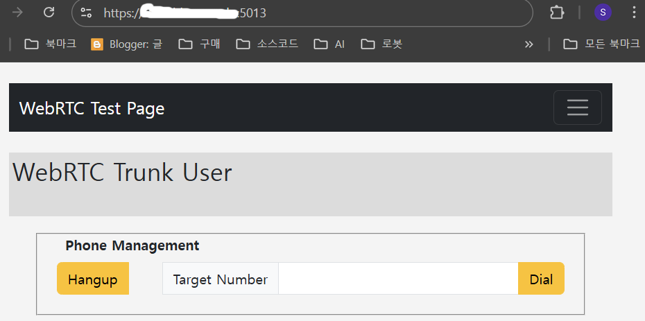
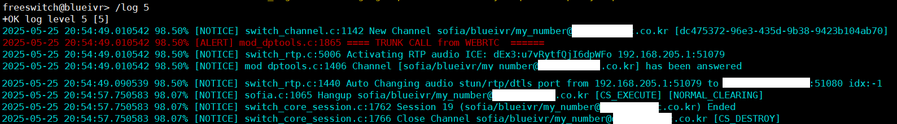

# WebRTC Client

In order to integrate with WebRTC in various PBX systems including FreeSWITCH, a module that can implement SIP signaling is required. WebRTC is literally RTC (Realtime Communication) that can be used on the Web. In other words, it can be seen that only RTP is implemented. Therefore, in order to integrate with PBX, telephone signaling represented by SIP must be added.

You can use the following javascripts:

<br>

## JSSIP

<br>

Pros:
* Well-documented and widely used
* Supports WebRTC for audio/video calls. 
* Works with SIP servers and proxies
* Actively maintained with a strong community

Cons:
* Codec negotiation is almost impossible.
* Requires a separate SIP server for signaling. But there is FreeSWITCH.
* Can be complex to configure for beginners. But there is me.

<br>

## SIP.js

<br>

Pros:
* Built specifically for WebRTC applications
* Provides easy integration with SIP-based VoIP systems
* Supports audio, video, and messaging
* Open-source and actively developed

Cons:
* Limited built-in debugging tools
* Requires additional configuration for advanced features

<br>

## PJSIP

<br>

Pros:
* Highly efficient and optimized for VoIP applications
* Supports WebRTC and SIP natively
* Offers extensive features like call transfer and conferencing

Cons:
* More complex to set up compared to JSSIP and SIP.js
* Requires additional dependencies

<br>

Among these, I will explain how to integrate with WebRTC clients in FreeSWITCH using jssip.

<br><br>


# FreeSWITCH Settings for WebRTC

Since jssip and WebRTC are clients that run on browsers, they use websocket to connect to servers. Therefore, FreeSWITCH also needs to be configured to allow connections via websocket.

<br>

# Edit sip profiles

Decide whether you will use the web client using jssip as an internal phone, a trunk phone, or both.
First, let's learn how to set up a trunk phone.

<br>

## Edit internal sip profiles

Modify the External SIP Profile. 

```xml
<settings>

... skip ...

<!-- for sip over websocket support -->
<param name="ws-binding"  value=":5067"/>
<!-- for sip over secure websocket support -->
<!-- You need wss.pem in $${certs_dir} for wss or one will be created for you -->
<param name="wss-binding" value=":7444"/>
<param name="tls-cert-dir" value="/usr/local/freeswitch/cert"/>
<param name="apply-candidate-acl" value="localnet.auto"/>
<param name="apply-candidate-acl" value="rfc1918.auto"/>
<param name="apply-candidate-acl" value="any_v4.auto"/>
<param name="apply-candidate-acl" value="wan_v4.auto"/>

```

WebSocket can use wss with tls applied and ws without tls applied. The current trend is to recommend https, and if http is used, problems may occur in obtaining control of devices such as microphones and speakers in webrtc. Therefore, https and wss are used.

The above settings can be summarized as follows:
* The websocket (ws) used in the http webpage connects using port 5067. However, this is not recommended.
* Secure websocket (wss) used on https webpages connects using port 7444. However, this is recommended.
* The storage location of the certificate used in wss is "/usr/local/freeswitch/cert".
* apply-candidate-acl in FreeSWITCH is used to apply an Access Control List (ACL) to ICE candidates during WebRTC communication. This helps in filtering which network candidates are allowed to be considered for establishing a connection.

<br>

## Create a FreeSWITCH certificate

Here, I will explain how to use a public certificate issued by Let's Encrypt. Let's Encrypt issues public certificates for free. The certificate validity period is 3 months, but it can be set to automatically extend. These days, even paid certificates are gradually reducing their validity periods, so there is no major inconvenience in using Let's Encrypt. However, there is the inconvenience of having to renew FreeSWITCH's certificate when renewing the certificate.

On Linux systems, Let's Encrypt certificates are typically stored in the /etc/letsencrypt/live/domain_name/ directory. Now let's create a certificate for FreeSWITCH using the certificate in this directory.

```bash
# ls -al
total 4
drwxr-xr-x 2 root root  93 May 14 17:55 .
drwx------ 4 root root  66 May 14 17:55 ..
lrwxrwxrwx 1 root root  41 May 14 17:55 cert.pem -> ../../archive/domain_name/cert1.pem
lrwxrwxrwx 1 root root  42 May 14 17:55 chain.pem -> ../../archive/domain_name/chain1.pem
lrwxrwxrwx 1 root root  46 May 14 17:55 fullchain.pem -> ../../archive/domain_name/fullchain1.pem
lrwxrwxrwx 1 root root  44 May 14 17:55 privkey.pem -> ../../archive/domain_name/privkey1.pem
-rw-r--r-- 1 root root 692 May 14 17:55 README
```

Of these files, the ones needed to create certificates for FreeSWITCH are fullchain.pem and privkey.pem. Using these two files, create and save the wss.pem file as follows. 
The "/usr/local/freeswitch/cert" directory is the certificate storage directory modified in the conf file set above.

```bash
cat /etc/letsencrypt/live/domain_name/fullchain.pem > /usr/local/freeswitch/cert/wss.pem
cat /etc/letsencrypt/live/domain_name/privkey.pem  >> /usr/local/freeswitch/cert/wss.pem
```
<br>

__Caution: Certificates created this way must be recreated when renewing a Let's Encrypt certificate. Then, the mod_sofia module must be reloaded or FreeSWITCH must be restarted.__

<br>


## FreeSWITCH dialplan

<br>

Create a dialplan in advance to receive calls from WebRTC clients. I will create a dialplan that accepts incoming call. And plays an audio file. The incoming call number (DNIS) will be __07010002000__. Since the call is coming from outside, the dial plan must modify the external profile. If you can hear the audio stream from FreeSWITCH in your browser, the test was successful.

```xml
    <extension name="TRUNK_WEBRTC_TEST">
      <condition field="destination_number" expression="^(07010002000)$">
            <action application="log" data="ALERT ==== TRUNK CALL from WEBRTC  ======"/>
            <action application="set" data="continue_on_fail=true"/>
            <action application="answer" data=""/>
            <action application="sleep" data="500"/>
            <action application="playback" data="$${sounds_dir}/common/logged_in_status.wav"/>
            <action application="hangup" data="NORMAL_CLEARING"/>
      </condition>
    </extension>
```

<br><br>


# Creating a web page using jssip

Now it's time to create a web page using jssip.
I will explain briefly because creating a web page is not the purpose of this article. You can use a web server such as Apache or NginX. I will implement it simply using Python Flask. The Flask web server will serve https using the public certificate described above.

<br>

## Flask python App

```python
#simple_webrtc.py
from flask import Flask, render_template, redirect
import os
import ssl
import socket
    
app = Flask(__name__)

@app.route("/", methods = ["GET"])
def index():
    return render_template("index_webrtc.html", uri = hostname, me = "my_number")

@app.route("/webrtc", methods = ["GET"])
def index_webrtc():
    return render_template("index_webrtc.html", uri = hostname, me = "my_number")


if __name__ == '__main__':
    global hostname

    ssl_ctx = ssl.SSLContext(ssl.PROTOCOL_TLSv1_2)
    hostname = socket.gethostname() 
        
    cert_path = os.path.join("/etc/letsencrypt/live/", hostname)
    print (f"certificate path : {cert_path}")
    if os.path.exists(cert_path):   #use letsencrypt certificate
        full_chain = os.path.join(cert_path, "fullchain.pem")
        privkey = os.path.join(cert_path, "privkey.pem")
        ssl_ctx.load_cert_chain(full_chain, privkey)
        app.run(debug=True, host='0.0.0.0', port=5013, ssl_context = ssl_ctx, use_reloader=False) 
    else:    #cannot find Let's Encrypt certificates -> http
        print (f"Cannot find certificates ")
        app.run(debug=True, host='0.0.0.0', port=5013, use_reloader=False) 
```
<br>

## Create an html file
Now it's time to create the index_webrtc.html file. To understand HTML for Flask Web, you must have basic knowledge of Flask, including jinja2.

```html


    
        <div class="alert alert-warning alert-dismissible fade show" role="alert">
            {{ message }}
            <button type="button" class="btn-close" data-bs-dismiss="alert" aria-label="close">
            </button>
        </div>
    
      <!-- flash 메시지를 모두 지운다. 다음 페이지에 중복 출력 방지-->
        {{session['_flashes'].clear() }}
    
    <br/>

    <div class="container">
        <!-- 점보트론의 배경색 및 스타일은 styelsheet.css 파일에 정의 -->
        <!-- https://getbootstrap.com/docs/4.0/content/typography/ 폰트 사용법이 자세하게 나와있음-->
        <div class = row>
            <!-- 줄바꿈 방지를 위해 row 안에 col 2개를 만들어 사용함. 버튼의 경우 우정렬을 위해 d-grid gap-2 d-md-flex justify-content-md-end을 사용-->
            <div class="jumbotron p-1" >
                <div class="row">
                  <div class="col-md-6">                     
                      <h2>WebRTC Trunk User {{session['userid']}} </h2> <br>
                  </div>
                </div>
            </div>
        </div>
        <audio id = "ringtone" src = "/static/audio/ringtone.mp3" loop ></audio>
        <div class = row>
          <div class="col-md-12 ">
            <fieldset class="groupbox-border">
              <legend class="groupbox-border">Phone Management</legend>
              <div class="control-group">
                <div class="input-group">
                  <button type="button" class="btn btn-warning" name="hangup" id="hangup-btn" onClick="rtc_hangup_call()"> Hangup </button>
                  &nbsp; &nbsp; &nbsp; &nbsp;
                  <span class="input-group-text">Target Number</span>
                  <input type="text" class="form-control" id="call-destination" aria-describedby="basic-addon3">
                  <button type="button" class="btn btn-warning" name="dial" id="dial-btn" onClick="rtc_make_call()"> Dial </button>
                </div>              

              </div>
            </fieldset>


          </div>
        </div>
        <br/>
    </div>
    <br>

    <!--<script src="{{url_for('static', filename='script/simple_webrtc.js')}}"></script>  -->


    <script type="text/javascript"> 
      let g_Uri = "";
      var g_wsurl = "";
      //const g_tenant = "{{session['tenant_id']}}";
      //const g_user = "{{session['userid']}}";
      var g_ringtone;
      var g_WebRTCPhone;
      var g_session;

      function do_make_trunk_connection()
      {
        g_Uri = "{{uri}}";
        if (window.location.protocol === "https:") {
            g_wsurl = "wss://" + g_Uri + ":7444";  
            console.log("Current page is HTTPS. Trying to connect with wss to FreeSWITCH :" + g_wsurl);
        } else {
            g_wsurl = "ws://" + g_Uri + ":5067";  
            console.log("Current page is HTTP. Trying to connect with ws to FreeSWITCH :" + g_wsurl);
        }
        var socket = new JsSIP.WebSocketInterface(g_wsurl);
        var configuration = {
          sockets  : [ socket ],
          authorization_user: "{{me}}",
          uri      : 'sip:' + "{{me}}" + "@"+ g_Uri ,
          register : false
        };        
        g_WebRTCPhone = new JsSIP.UA(configuration);
        g_WebRTCPhone.start();
        g_WebRTCPhone.on('connected', function(e){ 
          /* Your code here */ 
          console.log("simple_webrtc  Websocket Connected");
        });
        g_WebRTCPhone.on('disconnected', function(e){ 
          console.log("simple_webrtc  Websocket Disconnected");
        });        
        
        g_WebRTCPhone.on('newRTCSession', function(data) {
          g_session = data.session;   // type JsSIP.RTCSession
          const remoteIdentity = g_session.remote_identity.display_name || g_session.remote_identity.uri.user;
          var callOptions = {   //전화받기 (answer)의 파라미터
            mediaConstraints: {
              audio: true, // only audio calls
              video: false
            },
          };
          if (g_session.direction === 'incoming') { //or outgoing
          }
          else  { // 아웃바운드

            //g_ringtone.play();
            console.log('simple_webrtc  Trying Outboud Call:', g_session);
            //g_ringback_proc();

            g_session.on("failed",function(){
              // unable to establish the call
              console.log('simple_webrtc  Outboud Call failed event');
            });

            g_session.on('addstream', function(e){
              console.log('simple_webrtc  Outboud Call addstream event');
            });

            g_session.connection.ontrack = (e) => {
              console.log("simple_webrtc  Outboud Call Remote track received:", e.streams[0]);
              const remoteAudio = document.createElement('audio');
              remoteAudio.srcObject = e.streams[0];
              remoteAudio.play();
            };
            
            g_session.on('accepted', function(){  //When sending 200 OK response
              // 통화가 연결된 후 오디오 재생 시작
              console.log('simple_webrtc  Outboud Call accepted event:' , g_session);
              
              // ==> 체크 후 삭제
              navigator.mediaDevices.getUserMedia({ audio: true })
              .then((stream) => {
                stream.getTracks().forEach(track => g_session.connection.addTrack(track, stream));
              })
            });
            
            
            g_session.on('peerconnection', function(data) {
              console.log('simple_webrtc  Outboud Call peerconnection event');
            });


            g_session.on("confirmed",function(e){ //When receiving ACK Message
              // this handler will be called for incoming calls too
              console.log('simple_webrtc  Outboud Call confirmed event', g_session);

            });
            g_session.on("ended",function(e){
              // the call has ended
              console.log('simple_webrtc  Outboud Call ended event');
            });
          }
         
        });        
        
        
      }
      
      function webrtc_make_trunk_connection()
      {
        return do_make_trunk_connection();
      }
      
      function webrtc_make_trunk_call(target)
      {
        if(g_WebRTCPhone == null){
          console.log('Makinge WebRTC Phone failed.');
          return ;
        }
        var options = {
          'mediaConstraints' : { 'audio': true, 'video': false },
        };        
        g_session = g_WebRTCPhone.call("sip:" + target + "@" + g_Uri , options);
      
      }
      
      
      
      function rtc_make_call(){
        const target = document.getElementById("call-destination").value;
        console.log('Outboud Call To:' + target);
        webrtc_make_trunk_call(target);
      }

      function rtc_hangup_call(){
        g_session.terminate();  
      }
              
      

      window.addEventListener("pagehide", () => {
        simple_webrtc_disconnect();
      });    
      
      $(document).ready(function(){ 

        g_ringtone = document.getElementById('ringtone');
        
        setTimeout(() => {
          webrtc_make_trunk_connection();
        }, 500); // 0.5초 후 실행
        

      });      
    </script>




```
<br/>

When you run the Flask Python program and access it using a browser, the following screen is displayed.



<br/><br/>

If you enter __07010002000__ in the Target Number of your browser and press the Dial button, the following output will appear on the fs_cli screen, indicating a normal connection. I was able to hear the audio sent from FreeeSWITCH accurately in my browser.



<br/><br/>


# Trouble Shooting

<br/>

Most failures are caused by network issues. First, check your firewall settings. Note that WebRTC clients use secured websockets to send sip messages, so you cannot use SIP message monitoring tools such as sngrep.

<br/><br/>


# Wrapping up

<br/>

We learned how to implement Trunk Call using WebRTC.
It can be implemented relatively easily using jssip, but the above example has a security vulnerability.
FreeSWITCH uses acl.conf to check the safe Trunk Call target. However, since clients using WebRTC must be able to connect from an unspecified number of IPs, they can be exposed to unintended VoIP attacks. This is especially because Trunk Call does not authenticate. In the next article, we will learn how to safely implement WebRTC clients and Trunk Calls.

The web source code is available at [Source Code](https://example.com)
