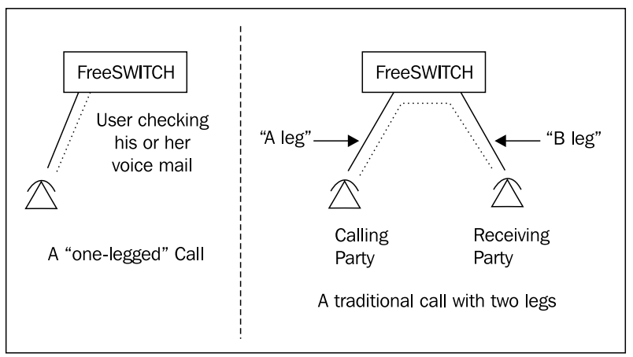

I have organized terms and concepts frequently used in FreeSWITCH.
<br> <br> 

# profile, context

## profile
FreeSWITCH's profile is a combination of a specific IP and port. <br />
For example, 192.168.1.12:5060, 192.168.1.12:5080 are two profiles using one IP.
Every profile has different settings. One of the most important of these settings is context. The context is explained below.
All inbound calls come in to FreeSWITCH as a profile (ip, port combination). It has a similar role to the main gate. 
If FreeSWITCH's IP address is 192.168.1.12 and the 192.168.1.12:5060 profile is called "myprofile", FreeSWITCH binds to the 5060 UDP port of this IP. And you can process SIP signals coming into this port. 
<br />

### profile setting
FreeSWITCH manages profiles in the __conf/sip_profiles__ folder.
FreeSWITCH manages profiles in the conf/sip_profiles folder. In this directory, there are two xml files provided by FreeSWITCH. Of course, you can modify this file to suit your purposes or delete it and create a new file.

* external.xml :  The following is a portion of the external.xml file. Important contents include the profile name (external), context name (public), and sip_port value ($${external_sip_port}).
external_sip_port is specified as 5080 in the conf/vars.xml file. In other words, what this profile means is that it binds UDP port 5080 and processes SIP calls coming into this port with the context value "public". And the auth-calls value is false. This means that authentication is not required for SIP calls. Therefore, you must register the accessible counterpart exchange or device IP information in advance in the acl.conf.xml file. It uses IP authentication, which is generally used in SIP Trunking.
<br> <br> 

```xml
<profile name="external">
  <gateways>
    <X-PRE-PROCESS cmd="include" data="external/*.xml"/>
  </gateways>

  <domains>
    <domain name="all" alias="false" parse="true"/>
  </domains>

  <settings>
    <param name="sip-port" value="$${external_sip_port}"/>
    <param name="dialplan" value="XML"/>
    <param name="context" value="public"/>
    <param name="inbound-codec-prefs" value="$${global_codec_prefs}"/>
    <param name="outbound-codec-prefs" value="$${outbound_codec_prefs}"/>
    <param name="hold-music" value="$${hold_music}"/>
    <param name="auth-calls" value="false"/>
    <!--
        DO NOT USE HOSTNAMES, ONLY IP ADDRESSES IN THESE SETTINGS!
    -->
    <param name="rtp-ip" value="$${local_ip_v4}"/>
    <param name="sip-ip" value="$${local_ip_v4}"/>
    <param name="ext-rtp-ip" value="$${external_rtp_ip}"/>
    <param name="ext-sip-ip" value="$${external_sip_ip}"/>
 
  </settings>
</profile>
```
<br> <br> 

* internal.xml : The following is a portion of the external.xml file. Important contents include the profile name (internal), context name (public), and sip_port value ($${internal_sip_port}). internal_sip_port is specified as 5060 in the conf/vars.xml file. In other words, what this profile means is that it binds UDP port 5060 and processes SIP calls coming into this port with the context value "public". In other words, what this profile means is that it binds UDP port 5080 and processes SIP calls coming into this port with the context value "public". And the __auth-calls value is true__. This means that authentication is required for SIP calls. Therefore, the only devices that can use this 5060 port are extension phones in conf/directory.
<br> <br> 

```xml
<profile name="internal">

  <gateways>
  </gateways>

  <domains>
    <!-- indicator to parse the directory for domains with parse="true" to get gateways-->
    <!--<domain name="$${domain}" parse="true"/>-->
    <!-- indicator to parse the directory for domains with parse="true" to get gateways and alias every domain to this profile -->
    <!--<domain name="all" alias="true" parse="true"/>-->
    <domain name="all" alias="true" parse="false"/>
  </domains>

  <settings>
    <param name="context" value="public"/>
    <param name="rfc2833-pt" value="101"/>
    <!-- port to bind to for sip traffic -->
    <param name="sip-port" value="$${internal_sip_port}"/>
    <param name="dialplan" value="XML"/>
    <param name="inbound-codec-prefs" value="$${global_codec_prefs}"/>
    <param name="outbound-codec-prefs" value="$${global_codec_prefs}"/>
    <!-- ip address to use for rtp, DO NOT USE HOSTNAMES ONLY IP ADDRESSES -->
    <param name="rtp-ip" value="$${local_ip_v4}"/>
    <!-- ip address to bind to, DO NOT USE HOSTNAMES ONLY IP ADDRESSES -->
    <param name="sip-ip" value="$${local_ip_v4}"/>
    <param name="hold-music" value="$${hold_music}"/>
    <param name="apply-nat-acl" value="nat.auto"/>

    <param name="apply-inbound-acl" value="domains"/>

    <param name="record-path" value="$${recordings_dir}"/>
    <param name="record-template" value="${caller_id_number}.${target_domain}.${strftime(%Y-%m-%d-%H-%M-%S)}.wav"/>

    <param name="auth-calls" value="$${internal_auth_calls}"/>
    <param name="ext-rtp-ip" value="$${external_rtp_ip}"/>
    <param name="ext-sip-ip" value="$${external_sip_ip}"/>

  </settings>
</profile>
```


If an INVITE SIP message comes in on port 5060, FreeSWITCH searches the XML configuration for the context "public" used by this profile. 
Now, calls made to the "external" or "interna;" profile will go to the "public" context.<br/><br/> 

## context, extension
Context is a set of extensions. Extension is a set of instructions. <br />
The context is located in conf/dialplan. The context name exists as follows and has several extensions. An extension again has its own name, condition, and several actions (commands). <br/>

The following is an example of an xml file in the dialplan directory. The name of the context is internal and the name of the extension is extension-intercom. And it works if the called number is in the 12340 to 12349 band. Then, run the three applications in order.
<br> 

```xml
<include>
  <context name="internal">
      <extension name="extension-intercom">
      <condition field="destination_number" expression="^(1234[0-9])$">
        <action application="log" data="INFO lua test"/>
        <action application="set" data="continue_on_fail=true"/>
        <action application="lua" data="hello.lua"/>
      </condition>
</include>
```
<br/><br/>

The hierarchy of context, extension, condition, and action is as follows.
<br/>


<br/><br/>

# leg

we call a connection between two devices a call leg. Consider the following illustration:
The picture on the left has only one leg. In this case, the SIP device is connected to FreeSWITCH and is probably receiving self-service services provided by Freeswitch, such as Vociemail, IVR, etc.
<br/>




If you dial digits that end up calling another phone currently registered to FreeSWITCH or push the call to a service provider to call your cellular phone, you then have two call legs—the first one we explained, and another connects FreeSWITCH and the other phone or service provider. Each leg of the call has its own unique properties, and a special relationship with the opposite leg in that particular call. When one or more legs of call are exchanging media with each other, we call that a __bridge__. 

In a bridged call, either leg of the call can perform certain operations on the other leg in the same bridge such as put it on hold, transfer it to another extension, or join it with a third party to form a three-way call.

__From FreeSWITCH's perspective, in most cases, the A leg is inbound and the B leg is outbound.__

<br/><br/>

# channel variable

Channel variables are special group of name/value pairs that are designed to influence the channel behavior , and provide a way to store important call data.
The special caller profile variables are as follows. The caller profile is just a collection of special information that every call has in common, which is passed along from one leg to another

* username
* Dialplan
* caller_id_name
* caller_id_number
* callee_id_name
* callee_id_number
* network_addr
* ani
* aniii
* rdnis
* destination_number
* source
* uuid
* context

<br/><br/>

## channel variable example 1

Create and add the following dialplan. Set two variables using the set application. Set the values “1002” and “Customer123” in “dialed_extension” and “customer”, respectively. Then run test_channelvar.lua.

```xml
<extension name="extension-intercom">
  <condition field="destination_number" expression="^(1002)$">
    <action application="log" data="ALERT ==== CALL for testing channel variable ======"/>
    <action application="set" data="dialed_extension=$1"/>
    <action application="set" data="sip_h_X-customer=Customer123"/>
    <action application="lua" data="test_channelvar.lua"/>
  </condition>
</extension>
```
<br/>
And this is test_channelvar.lua.

<br/>

```lua
freeswitch.consoleLog("INFO", "-------------- test channel variable Start \n ")
-- 
local ani = session:getVariable("ani")
local dnis = session:getVariable("destination_number")

-- ringing (180)
session:execute("ring_ready")
session:sleep(1000)

-- answer (200)
session:answer()

local dialed = session:getVariable("dialed_extension")
local custom = session:getVariable("sip_h_X-customer")
freeswitch.consoleLog("INFO", "channel variable dialed_extension:" ..dialed)
freeswitch.consoleLog("INFO", "channel variable sip_h_X-customer:" ..custom)
```
<br/>

And this is the output message from fs_cli. As you can see, exported session variables can be seen in the lua script.

<br/>

```bash
EXECUTE [depth=0] sofia/blueivr/71382049@192.168.219.103 log(ALERT ==== INTERNAL CALL for oreka testing ======)
2023-10-06 02:19:24.381866 [ALERT] mod_dptools.c:1866 ==== INTERNAL CALL for oreka testing ======
EXECUTE [depth=0] sofia/blueivr/71382049@192.168.219.103 set(dialed_extension=*1003)
EXECUTE [depth=0] sofia/blueivr/71382049@192.168.219.103 set(sip_h_X-customer=Customer123)
EXECUTE [depth=0] sofia/blueivr/71382049@192.168.219.103 set(sip_h_X-extension=1003)
EXECUTE [depth=0] sofia/blueivr/71382049@192.168.219.103 lua(test_channelvar.lua)

2023-10-06 02:19:24.381866 [INFO] switch_cpp.cpp:1447 -------------- test channel variable Start
2023-10-06 02:19:25.421639 [INFO] switch_cpp.cpp:1447 channel variable dialed_extension:1003
2023-10-06 02:19:25.421639 [INFO] switch_cpp.cpp:1447 channel variable sip_h_X-customer:Customer123
```

<br/>

__There is one thing to note. The set application only affects the current session (A leg). The above example also runs the lua script on the A leg without connecting the B leg.__

<br/>

## channel variable example 2

This time, let's learn how to transfer the channel variable set in A Leg to B Leg.
To test the B Leg, you must prepare another device and bridge it. 

```xml
<extension name="extension-intercom">
  <condition field="destination_number" expression="^(1001)$">
    <action application="log" data="ALERT ==== CALL for testing B Leg channel variable ======"/>
    <action application="export" data="dialed_extension=$1"/>
    <action application="export" data="sip_h_X-customer=Customer123"/>
    <action application="bridge" data="user/${destination_number}"/>
  </condition>
</extension>
```
<br/>

__As you can see from the dial plan above, if you want to apply the channel variables of A Leg to B Leg, use the export application.__

One problem is that it is difficult to check the channel variable in the B Leg device. To check the channel variable of the B Leg, we will use ESL to receive and check the channel event.

``` python
#Simple ESL program for monitoring channel variable 
import ESL
import json

filter = 'CHANNEL_ORIGINATE  CHANNEL_ANSWER '

def event_ESL_job():
    con = ESL.ESLconnection('127.0.0.1', '8021', 'ClueCon')
    print('Connecting to ESL ....')
    if con.connected():
        print('Connecting to ESL SUCCESS')
        con.events('json', filter)
        while 1:
            try:
                e = con.recvEvent()
                if e:
                    j = json.loads(e.serialize('json'))
                    if j:
                        print(json.dumps(j, indent=2))

            except Exception as e:  
                #print(j)            
                print("error:", "Exception Occured")
                print(type(e))


if __name__ == "__main__":
    event_ESL_job()
```

<br/><br/>

Now, if you dial 1001 while running the above Python program, the 1010 extension will ring. And the following events are received in the Python program. 

The name of the event is CHANNEL_ORIGINATE. This value can be checked in "Event-Name": "CHANNEL_ORIGINATE". And you can find the following values in this json file: You can confirm that the channel variables exported from A Leg have been properly transferred to B Leg.

* __"variable_export_vars": "RFC2822_DATE,dialed_extension,sip_h_X-customer,sip_h_X-extension",__
  
* __"variable_dialed_extension": "*1003",__
* __"variable_sip_h_X-customer": "Customer123",__


<br/><br/>

```json
{
  "variable_audio_media_flow": "sendrecv",
  "Other-Leg-Channel-Transfer-Time": "0",
  "Caller-Orig-Caller-ID-Name": "spypi",
  "variable_recovery_profile_name": "internal",
  "Other-Leg-Channel-Hold-Accum": "0",
  "Other-Leg-Channel-Hangup-Time": "0",
  "variable_originating_leg_uuid": "7aa49fb7-cb15-45cc-a528-ca496e9ecad2",
  "Other-Leg-Username": "71382049",
  "variable_rtp_use_codec_string": "PCMU@8000h@20i",
  "Caller-Screen-Bit": "true",
  "variable_is_outbound": "true",
  "Call-Direction": "outbound",
  "Other-Leg-Dialplan": "XML",
  "Event-Calling-Line-Number": "636",
  "variable_dialed_domain": "192.168.150.128",
  "variable_call_uuid": "7aa49fb7-cb15-45cc-a528-ca496e9ecad2",
  "Caller-Channel-Resurrect-Time": "0",
  "Other-Leg-Caller-ID-Name": "spypi",
  "Caller-ANI": "71382049",
  "variable_video_media_flow": "inactive",
  "Other-Leg-ANI": "71382049",
  "Event-Date-GMT": "Thu, 05 Oct 2023 18:04:13 GMT",
  "Event-Date-Timestamp": "1696529053921201",
  "Event-Name": "CHANNEL_ORIGINATE",
  "FreeSWITCH-Switchname": "blueivr",
  "variable_signal_bond": "7aa49fb7-cb15-45cc-a528-ca496e9ecad2",
  "Caller-Channel-Bridged-Time": "0",
  "Caller-Callee-ID-Number": "1001",
  "Unique-ID": "7121f14d-121d-4329-868c-1ac0b1052c04",
  "Other-Leg-Channel-Bridged-Time": "0",
  "Caller-Caller-ID-Number": "71382049",
  "Caller-Username": "71382049",
  "variable_channel_name": "sofia/internal/1001@192.168.150.1:12478",
  "Caller-Privacy-Hide-Number": "false",
  "Other-Leg-Profile-Created-Time": "0",
  "variable_max_forwards": "69",
  "Event-Date-Local": "2023-10-06 03:04:13",
  "Event-Calling-Function": "switch_core_session_run",
  "Other-Leg-Unique-ID": "7aa49fb7-cb15-45cc-a528-ca496e9ecad2",
  "Caller-Destination-Number": "1001",
  "Other-Leg-Channel-Progress-Media-Time": "0",
  "Caller-Profile-Index": "1",
  "Channel-State": "CS_INIT",
  "variable_rtp_local_sdp_str": "v=0\r\no=FreeSWITCH 1696507125 1696507126 IN IP4 192.168.150.128\r\ns=FreeSWITCH\r\nc=IN IP4 192.168.150.128\r\nt=0 0\r\nm=audio 21928 RTP/AVP 0 101 13\r\na=rtpmap:0 PCMU/8000\r\na=rtpmap:101 telephone-event/8000\r\na=fmtp:101 0-16\r\na=rtpmap:13 CN/8000\r\na=ptime:20\r\na=sendrecv\r\n",
  "Core-UUID": "14ecc6eb-9b31-49ee-ae32-837124ef32ab",
  "Caller-Profile-Created-Time": "1696529053921201",
  "variable_sip_invite_domain": "192.168.150.128",
  "variable_originator": "7aa49fb7-cb15-45cc-a528-ca496e9ecad2",
  "variable_sip_h_X-customer": "Customer123",
  "Caller-Channel-Answered-Time": "0",
  "variable_originator_codec": "PCMU@8000h@20i",
  "Answer-State": "ringing",
  "Caller-Context": "blueivr",
  "variable_dialed_user": "1001",
  "Other-Leg-Caller-ID-Number": "71382049",
  "Caller-Channel-Hold-Accum": "0",
  "variable_sofia_profile_url": "sip:mod_sofia@192.168.150.128:5060",
  "Caller-Callee-ID-Name": "Outbound Call",
  "variable_sip_req_uri": "1001@192.168.150.1:12478",
  "Caller-Channel-Created-Time": "1696529053921201",
  "Other-Leg-Channel-Created-Time": "0",
  "Other-Leg-Orig-Caller-ID-Number": "71382049",
  "Event-Sequence": "6375",
  "Caller-Orig-Caller-ID-Number": "71382049",
  "variable_sofia_profile_name": "internal",
  "Other-Leg-Context": "blueivr",
  "Caller-Caller-ID-Name": "spypi",
  "Other-Leg-Privacy-Hide-Name": "false",
  "Channel-Name": "sofia/internal/1001@192.168.150.1:12478",
  "Other-Leg-Channel-Progress-Time": "0",
  "Other-Leg-Destination-Number": "*1003",
  "Caller-Channel-Last-Hold": "0",
  "Other-Leg-Channel-Last-Hold": "0",
  "variable_local_media_ip": "192.168.150.128",
  "Channel-State-Number": "2",
  "variable_advertised_media_ip": "192.168.150.128",
  "variable_sip_destination_url": "sip:1001@192.168.150.1:12478",
  "Channel-Call-UUID": "7aa49fb7-cb15-45cc-a528-ca496e9ecad2",
  "Caller-Dialplan": "XML",
  "variable_presence_id": "1001@192.168.150.128",
  "Other-Leg-Channel-Answered-Time": "0",
  "Other-Leg-Source": "mod_sofia",
  "Caller-Source": "mod_sofia",
  "Caller-Channel-Name": "sofia/internal/1001@192.168.150.1:12478",
  "FreeSWITCH-IPv4": "192.168.150.128",
  "FreeSWITCH-IPv6": "::1",
  "variable_originate_early_media": "true",
  "variable_text_media_flow": "disabled",
  "Channel-HIT-Dialplan": "false",
  "variable_local_media_port": "21928",
  "Caller-Privacy-Hide-Name": "false",
  "variable_sip_profile_name": "internal",
  "Event-Calling-File": "switch_core_state_machine.c",
  "variable_switch_m_sdp": "v=0\r\no=- 3905877358 3905877358 IN IP4 192.168.150.1\r\ns=Blink 3.2.0 (Windows)\r\nt=0 0\r\nm=audio 50020 RTP/AVP 113 9 0 8 101\r\nc=IN IP4 192.168.150.1\r\na=rtpmap:113 opus/48000/2\r\na=fmtp:113 useinbandfec=1\r\na=rtpmap:9 G722/8000\r\na=rtpmap:0 PCMU/8000\r\na=rtpmap:8 PCMA/8000\r\na=rtpmap:101 telephone-event/8000\r\na=fmtp:101 0-16\r\na=rtcp:50021\r\na=zrtp-hash:1.10 7be1e4252cb63a9f55c7cef42def47c30a85422c1f3a67e47e62f34b423ea6da\r\n",
  "Caller-Channel-Progress-Media-Time": "0",
  "Other-Leg-Channel-Resurrect-Time": "0",
  "variable_sip_h_X-extension": "*1003",
  "Other-Leg-Network-Addr": "192.168.150.1",
  "Caller-Unique-ID": "7121f14d-121d-4329-868c-1ac0b1052c04",
  "variable_sip_to_host": "192.168.150.1:12478",
  "Presence-Call-Direction": "outbound",
  "Other-Leg-Orig-Caller-ID-Name": "spypi",
  "Other-Leg-Direction": "inbound",
  "Other-Leg-Channel-Name": "sofia/blueivr/71382049@192.168.219.103",
  "Other-Leg-Screen-Bit": "true",
  "variable_sip_local_network_addr": "192.168.150.128",
  "variable_sip_from_host": "192.168.150.128",
  "Caller-Channel-Hangup-Time": "0",
  "variable_RFC2822_DATE": "Fri, 06 Oct 2023 03:04:13 +0900",
  "variable_export_vars": "RFC2822_DATE,dialed_extension,sip_h_X-customer,sip_h_X-extension",
  "Caller-Direction": "outbound",
  "Channel-Presence-ID": "1001@192.168.150.128",
  "variable_uuid": "7121f14d-121d-4329-868c-1ac0b1052c04",
  "variable_direction": "outbound",
  "variable_sip_outgoing_contact_uri": "<sip:mod_sofia@192.168.150.128:5060>",
  "Caller-Network-Addr": "192.168.150.1",
  "Other-Type": "originator",
  "variable_dialed_extension": "*1003",
  "Other-Leg-Logical-Direction": "inbound",
  "Caller-Channel-Transfer-Time": "0",
  "variable_session_id": "86",
  "Caller-Logical-Direction": "outbound",
  "Caller-Channel-Progress-Time": "0",
  "FreeSWITCH-Hostname": "ubuntusrv",
  "Channel-Call-State": "DOWN",
  "Other-Leg-Privacy-Hide-Number": "false"
}

```


