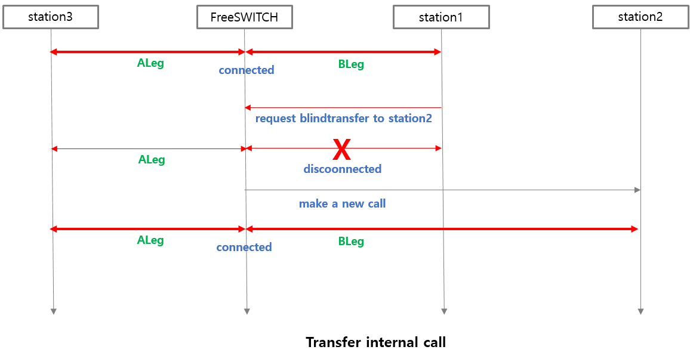

# Transfer

<br>
There are two ways to transfer a phone call. 

The transfer-related content below was taken from [Yeastar](https://www.yeastar.com/voip-phone-system-feature/call-transfer/)


<br>

## Blind transfer

<br>

Blind transfer, also referred to as cold transfer, occurs when the caller transfers the call to another without any communication between them.

In this scenario, the transferring caller does not need to provide any information as they hang up after initiating the call transfer. It is typically used when no additional information regarding the transaction needs to be passed on.

This type of call transfer has its pros and cons. On the one hand, it is quick and efficient. However, on the other hand, there are times when it may be helpful to give additional information or provide context before connecting with someone.

<br>

## Attended transfer

<br>

Attended transfers, also known as warm transfers, require a bit more involvement from the transferring party.

In this scenario, the caller is encouraged to speak with the new party before the call is transferred. This type of transfer typically involves a brief conversation that can help set expectations and provide context for both parties.

This type of transfer is beneficial when providing an account number, information about what actions should take place or other pertinent details. It also helps ensure no confusion when someone picks up on the other end.

<br><br>


# Transfer and DialPlan

<br>
Let's look at the Dialplan applied to two cases of phone transfer. Attended transfer always causes an internal call to occur immediately before the transfer. However, in blind transfer, the current call may be an internal call or a trunk call.

<br>

## Blind transfer and Dialplan

<br>

First of all, this is the case when transferring a trunk call. In this case, FreeSWITCH will call station2, and the dialplan to be used at this time is the trunk dialplan. This is because the A Leg is connected from the trunk.

<br>


<br>

Therefore, you should prepare a trunk dial plan in advance as follows. The context value uses the trunk context specified in sip_profiles. 
For reference, I set the range of extension phone numbers to 5000 to 5099.

<br>

```xml
<include>
  <context name="trunk_context">
    <extension name="TRUNK Local_Extension">
    <condition field="destination_number" expression="^(50\d{2})$">
          <action application="set" data="continue_on_fail=true"/>
          <action application="log" data="ALERT ==== Trunk INTERNAL CALL From ${caller_id_number} to $1 ======"/>
          <action application="bridge" data="USER/$1@$${domain}"/>
      </condition>
    </extension>
  </context> 
</include>
```

<br><br>
The following is a blindtransfer during an internal call.
<br>



<br>

This time, you need to prepare a dial plan for internal calls as follows. The following will probably be stored in the conf.dialplan/default.xml file:

<br>

```xml
<include>
  <context name="default">
    <extension name="Local_Extension Example">
    <condition field="destination_number" expression="^(50\d{2})$">
          <action application="set" data="continue_on_fail=true"/>
          <action application="log" data="ALERT ==== Trunk INTERNAL CALL From ${caller_id_number} to $1 ======"/>
          <action application="bridge" data="USER/$1@$${domain}"/>
      </condition>
    </extension>
  </context> 
</include>
```


<br>

## Attended transfer and Dialplan

<br>

Attended Transfer must occur during an internal call. Therefore, you only need to prepare a dial plan for internal calls in advance. All you need is the dial plan you used for internal call transfer in Bliend Transfer.

<br>


<br>

```xml
<include>
  <context name="default">
    <extension name="Local_Extension Example">
    <condition field="destination_number" expression="^(50\d{2})$">
          <action application="set" data="continue_on_fail=true"/>
          <action application="log" data="ALERT ==== Trunk INTERNAL CALL From ${caller_id_number} to $1 ======"/>
          <action application="bridge" data="USER/$1@$${domain}"/>
      </condition>
    </extension>
  </context> 
</include>
```

