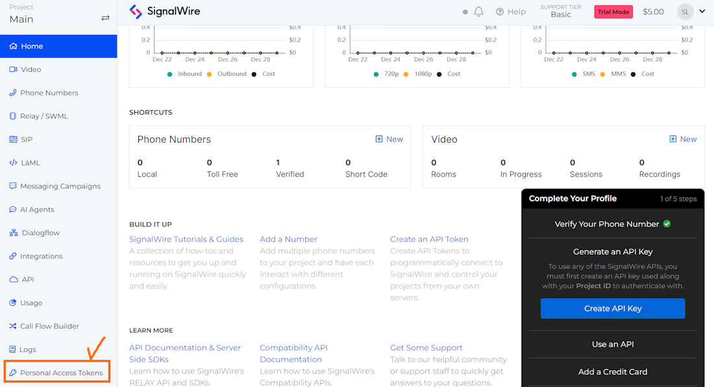

# Building Freeswitch source code on Debian OS

Several years ago, FreeSWITCH was developed based on CentOS, but after Redhat acquired CentOS, the development platform was changed to Debian. Therefore, it is easy to use Debian OS to build the latest source code. In particular, it is recommended to use Debian OS to implement the video conference function.
I will explain how to build FreeSWITCH 1.10, the latest version, on Debian 12.

## Install Debian 12
<br>
I downloaded debian-12.4.0-amd64-netinst.iso from the debian site and installed it. This image is the minimum version image and is used by installing several packages after installation.
I will omit the detailed process related to Debian OS installation. The following are the settings required after installation.
<br>

### Network COnfiguration
<br>
After installing Debian, change the network from DHCP to STATIC IP as follows. Change the IP address and gateway information to suit your situation.

```bash
# This file describes the network interfaces available on your system
# and how to activate them. For more information, see interfaces(5).

source /etc/network/interfaces.d/*

# The loopback network interface
auto lo
iface lo inet loopback

# The primary network interface
allow-hotplug ens33

auto ens33
#iface ens33 inet dhcp

iface ens33 inet static
address 192.168.10.144/24        # Your desired static IP address
network 192.168.10.0       # Your subnet mask
gateway 192.168.10.1          # Your gateway (router) IP address
dns-nameservers 8.8.8.8      # DNS server(s) - You can add multiple servers
```

<br>

### Install basic packages
<br>
If you have an Internet connection, install the required packages as follows.

<br>

```bash
$ sudo apt-get update
$ sudo apt-get install git wget net-tools vim htop 
```
<br>

## Create SignalWire Personal Access Token
<br>
First, sign up for membership at Signalwire.
Then create a Personal Access Token. Be sure to save the generated token value as it will be needed in the future build process.

<br>



How to create a token is well explained at https://developer.signalwire.com/freeswitch/FreeSWITCH-Explained/Installation/HOWTO-Create-a-SignalWire-Personal-Access-Token_67240087#attachments.
<br>


## Build script
<br>
The following is the script to be used for building.

```bash
TOKEN=Your_Token_Value_Here

apt-get update && apt-get install -yq gnupg2 wget lsb-release

wget --http-user=signalwire --http-password=$TOKEN -O /usr/share/keyrings/signalwire-freeswitch-repo.gpg https://freeswitch.signalwire.com/repo/deb/debian-release/signalwire-freeswitch-repo.gpg

echo "machine freeswitch.signalwire.com login signalwire password $TOKEN" > /etc/apt/auth.conf

chmod 600 /etc/apt/auth.conf

echo "deb [signed-by=/usr/share/keyrings/signalwire-freeswitch-repo.gpg] https://freeswitch.signalwire.com/repo/deb/debian-release/ `lsb_release -sc` main" > /etc/apt/sources.list.d/freeswitch.list

echo "deb-src [signed-by=/usr/share/keyrings/signalwire-freeswitch-repo.gpg] https://freeswitch.signalwire.com/repo/deb/debian-release/ `lsb_release -sc` main" >> /etc/apt/sources.list.d/freeswitch.list

apt-get update
 
# Install dependencies required for the build

apt-get build-dep freeswitch
 
# then let's get the source. Use the -b flag to get a specific branch

cd /usr/src/

git clone https://github.com/signalwire/freeswitch.git -bv1.10 freeswitch

cd freeswitch
 
# Because we're in a branch that will go through many rebases, it's
# better to set this one, or you'll get CONFLICTS when pulling (update).

git config pull.rebase true
 
# ... and do the build

./bootstrap.sh -j

./configure
```

<br>
Modify the module.conf file before building. Since I will not be using the signalwire module, I will comment out mod_signalwire.

Now build the source code!
<br>

```bash
make
make install
```

<br>
And this is the structure of the /usr/local/freeswitch directory confirmed with the tree command.


```bash
$ tree /usr/local/freeswitch/
/usr/local/freeswitch/
├── bin
│   ├── freeswitch
│   ├── fs_cli
│   ├── fs_encode
│   ├── fs_ivrd
│   ├── fs_tts
│   ├── fsxs
│   ├── gentls_cert
│   ├── switch_eavesdrop
│   └── tone2wav
├── certs
│   ├── dtls-srtp.pem
│   └── wss.pem
├── conf
│   ├── autoload_configs
│   │   ├── abstraction.conf.xml
│   │   ├── acl.conf.xml
│   │   ├── alsa.conf.xml
│   │   ├── amqp.conf.xml
│   │   ├── amr.conf.xml
│   │   ├── amrwb.conf.xml
│   │   ├── av.conf.xml
│   │   ├── avmd.conf.xml
│   │   ├── blacklist.conf.xml
│   │   ├── callcenter.conf.xml
│   │   ├── cdr_csv.conf.xml
│   │   ├── cdr_mongodb.conf.xml
│   │   ├── cdr_pg_csv.conf.xml
│   │   ├── cdr_sqlite.conf.xml
│   │   ├── cepstral.conf.xml
│   │   ├── cidlookup.conf.xml
│   │   ├── conference.conf.xml
│   │   ├── conference_layouts.conf.xml
│   │   ├── console.conf.xml
│   │   ├── curl.conf.xml
│   │   ├── db.conf.xml
│   │   ├── dialplan_directory.conf.xml
│   │   ├── directory.conf.xml
│   │   ├── distributor.conf.xml
│   │   ├── easyroute.conf.xml
│   │   ├── enum.conf.xml
│   │   ├── erlang_event.conf.xml
│   │   ├── event_multicast.conf.xml
│   │   ├── event_socket.conf.xml
│   │   ├── fax.conf.xml
│   │   ├── fifo.conf.xml
│   │   ├── format_cdr.conf.xml
│   │   ├── graylog2.conf.xml
│   │   ├── hash.conf.xml
│   │   ├── hiredis.conf.xml
│   │   ├── httapi.conf.xml
│   │   ├── http_cache.conf.xml
│   │   ├── ivr.conf.xml
│   │   ├── java.conf.xml
│   │   ├── kazoo.conf.xml
│   │   ├── lcr.conf.xml
│   │   ├── local_stream.conf.xml
│   │   ├── logfile.conf.xml
│   │   ├── lua.conf.xml
│   │   ├── memcache.conf.xml
│   │   ├── modules.conf.xml
│   │   ├── mongo.conf.xml
│   │   ├── msrp.conf.xml
│   │   ├── nibblebill.conf.xml
│   │   ├── opal.conf.xml
│   │   ├── opus.conf.xml
│   │   ├── oreka.conf.xml
│   │   ├── osp.conf.xml
│   │   ├── perl.conf.xml
│   │   ├── pocketsphinx.conf.xml
│   │   ├── portaudio.conf.xml
│   │   ├── post_load_modules.conf.xml
│   │   ├── pre_load_modules.conf.xml
│   │   ├── presence_map.conf.xml
│   │   ├── python.conf.xml
│   │   ├── redis.conf.xml
│   │   ├── rss.conf.xml
│   │   ├── rtmp.conf.xml
│   │   ├── sangoma_codec.conf.xml
│   │   ├── shout.conf.xml
│   │   ├── signalwire.conf.xml
│   │   ├── skinny.conf.xml
│   │   ├── smpp.conf.xml
│   │   ├── sms_flowroute.conf.xml
│   │   ├── sndfile.conf.xml
│   │   ├── sofia.conf.xml
│   │   ├── spandsp.conf.xml
│   │   ├── switch.conf.xml
│   │   ├── syslog.conf.xml
│   │   ├── timezones.conf.xml
│   │   ├── translate.conf.xml
│   │   ├── tts_commandline.conf.xml
│   │   ├── unicall.conf.xml
│   │   ├── v8.conf.xml
│   │   ├── verto.conf.xml
│   │   ├── voicemail.conf.xml
│   │   ├── voicemail_ivr.conf.xml
│   │   ├── vpx.conf.xml
│   │   ├── xml_cdr.conf.xml
│   │   ├── xml_curl.conf.xml
│   │   ├── xml_rpc.conf.xml
│   │   ├── xml_scgi.conf.xml
│   │   └── zeroconf.conf.xml
│   ├── chatplan
│   │   └── default.xml
│   ├── dialplan
│   │   ├── blueivr.xml
│   │   └── default.xml
│   ├── directory
│   │   ├── default
│   │   │   ├── 1001.xml
│   │   │   ├── 1002.xml
│   │   │   ├── 1003.xml
│   │   │   ├── 1004.xml
│   │   │   ├── 1005.xml
│   │   │   └── ivr.xml.old
│   │   └── default.xml
│   ├── extensions.conf
│   ├── freeswitch.xml
│   ├── fur_elise.ttml
│   ├── ivr_menus
│   │   ├── demo_ivr.xml
│   │   └── new_demo_ivr.xml
│   ├── lang
│   │   ├── de
│   │   │   ├── demo
│   │   │   │   └── demo.xml
│   │   │   ├── de.xml
│   │   │   └── vm
│   │   │       ├── sounds.xml
│   │   │       └── tts.xml
│   │   ├── en
│   │   │   ├── demo
│   │   │   │   ├── demo-ivr.xml
│   │   │   │   ├── demo.xml
│   │   │   │   ├── funnies.xml
│   │   │   │   └── new-demo-ivr.xml
│   │   │   ├── dir
│   │   │   │   ├── sounds.xml
│   │   │   │   └── tts.xml
│   │   │   ├── en.xml
│   │   │   ├── ivr
│   │   │   │   └── sounds.xml
│   │   │   └── vm
│   │   │       ├── sounds.xml
│   │   │       ├── tts.xml
│   │   │       └── voicemail_ivr.xml
│   │   ├── es
│   │   │   ├── demo
│   │   │   │   ├── demo-es-ES.xml
│   │   │   │   ├── demo-es-MX.xml
│   │   │   │   ├── demo-ivr-es-ES.xml
│   │   │   │   └── demo-ivr-es-MX.xml
│   │   │   ├── dir
│   │   │   │   ├── sounds-es-ES.xml
│   │   │   │   ├── sounds-es-MX.xml
│   │   │   │   ├── tts-es-ES.xml
│   │   │   │   └── tts-es-MX.xml
│   │   │   ├── es_ES.xml
│   │   │   ├── es_MX.xml
│   │   │   └── vm
│   │   │       ├── sounds-es-ES.xml
│   │   │       ├── sounds-es-MX.xml
│   │   │       ├── tts-es-ES.xml
│   │   │       └── tts-es-MX.xml
│   │   ├── fr
│   │   │   ├── demo
│   │   │   │   └── demo.xml
│   │   │   ├── dir
│   │   │   │   ├── sounds.xml
│   │   │   │   └── tts.xml
│   │   │   ├── fr.xml
│   │   │   └── vm
│   │   │       └── sounds.xml
│   │   ├── he
│   │   │   ├── demo
│   │   │   │   ├── demo-ivr.xml
│   │   │   │   └── demo.xml
│   │   │   ├── dir
│   │   │   │   └── sounds.xml
│   │   │   ├── he.xml
│   │   │   └── vm
│   │   │       └── sounds.xml
│   │   ├── pt
│   │   │   ├── demo
│   │   │   │   ├── demo-ivr-pt-BR.xml
│   │   │   │   ├── demo-ivr-pt-PT.xml
│   │   │   │   ├── demo-pt-BR.xml
│   │   │   │   └── demo-pt-PT.xml
│   │   │   ├── dir
│   │   │   │   ├── sounds-pt-BR.xml
│   │   │   │   ├── sounds-pt-PT.xml
│   │   │   │   ├── tts-pt-BR.xml
│   │   │   │   └── tts-pt-PT.xml
│   │   │   ├── pt_BR.xml
│   │   │   ├── pt_PT.xml
│   │   │   └── vm
│   │   │       ├── sounds-pt-BR.xml
│   │   │       ├── sounds-pt-PT.xml
│   │   │       ├── tts-pt-BR.xml
│   │   │       └── tts-pt-PT.xml
│   │   ├── ru
│   │   │   ├── demo
│   │   │   │   ├── demo-ivr.xml
│   │   │   │   └── demo.xml
│   │   │   ├── dir
│   │   │   │   ├── sounds.xml
│   │   │   │   └── tts.xml
│   │   │   ├── ru.xml
│   │   │   └── vm
│   │   │       ├── sounds.xml
│   │   │       └── tts.xml
│   │   └── sv
│   │       ├── sv.xml
│   │       └── vm
│   │           └── sounds.xml
│   ├── mime.types
│   ├── notify-voicemail.tpl
│   ├── sip_profiles
│   │   ├── blueivr
│   │   │   ├── 070.xml.unload
│   │   │   ├── softphone.xml
│   │   │   └── voipgw.xml
│   │   ├── blueivr.xml
│   │   └── internal.xml
│   ├── skinny_profiles
│   │   └── internal.xml
│   ├── tetris.ttml
│   ├── vars.xml
│   ├── voicemail.tpl
│   └── web-vm.tpl
├── db
│   ├── call_limit.db
│   ├── core.db
│   ├── fifo.db
│   ├── json.db
│   ├── sofia_reg_blueivr.db
│   ├── sofia_reg_internal.db
│   └── voicemail_default.db
├── fonts
│   ├── FreeMonoBoldOblique.ttf
│   ├── FreeMonoBold.ttf
│   ├── FreeMonoOblique.ttf
│   ├── FreeMono.ttf
│   ├── FreeSansBoldOblique.ttf
│   ├── FreeSansBold.ttf
│   ├── FreeSansOblique.ttf
│   ├── FreeSans.ttf
│   ├── FreeSerifBoldItalic.ttf
│   ├── FreeSerifBold.ttf
│   ├── FreeSerifItalic.ttf
│   ├── FreeSerif.ttf
│   ├── OFL.txt
│   └── README.fonts
├── grammar
├── htdocs
│   ├── license.txt
│   ├── portal
│   │   ├── assets
│   │   │   ├── bootstrap
│   │   │   │   ├── css
│   │   │   │   │   ├── bootstrap.css
│   │   │   │   │   ├── bootstrap.min.css
│   │   │   │   │   ├── bootstrap-responsive.css
│   │   │   │   │   └── bootstrap-responsive.min.css
│   │   │   │   ├── img
│   │   │   │   │   ├── glyphicons-halflings.png
│   │   │   │   │   └── glyphicons-halflings-white.png
│   │   │   │   └── js
│   │   │   │       ├── bootstrap.js
│   │   │   │       └── bootstrap.min.js
│   │   │   ├── bootstrap-3.1.1
│   │   │   │   ├── css
│   │   │   │   │   ├── bootstrap.css
│   │   │   │   │   ├── bootstrap.min.css
│   │   │   │   │   ├── bootstrap-theme.css
│   │   │   │   │   └── bootstrap-theme.min.css
│   │   │   │   ├── fonts
│   │   │   │   │   ├── glyphicons-halflings-regular.eot
│   │   │   │   │   ├── glyphicons-halflings-regular.svg
│   │   │   │   │   ├── glyphicons-halflings-regular.ttf
│   │   │   │   │   └── glyphicons-halflings-regular.woff
│   │   │   │   └── js
│   │   │   │       ├── bootstrap.js
│   │   │   │       └── bootstrap.min.js
│   │   │   ├── bs_for_ember
│   │   │   │   ├── css
│   │   │   │   │   └── bs-growl-notifications.min.css
│   │   │   │   └── js
│   │   │   │       ├── bs-alert.min.js
│   │   │   │       ├── bs-badge.min.js
│   │   │   │       ├── bs-basic.min.js
│   │   │   │       ├── bs-button.min.js
│   │   │   │       ├── bs-core.min.js
│   │   │   │       ├── bs-growl-notifications.min.js
│   │   │   │       ├── bs-items-action-bar.min.js
│   │   │   │       ├── bs-label.min.js
│   │   │   │       ├── bs-list-group.min.js
│   │   │   │       ├── bs-modal.min.js
│   │   │   │       ├── bs-nav.min.js
│   │   │   │       ├── bs-notifications.min.js
│   │   │   │       ├── bs-progressbar.min.js
│   │   │   │       └── bs-wizard.min.js
│   │   │   └── js
│   │   │       ├── ember-1.0.0-rc.1.js
│   │   │       ├── ember-1.0.0-rc.1.min.js
│   │   │       ├── ember-data.js
│   │   │       ├── ember-data.min.js
│   │   │       ├── ember.js
│   │   │       ├── ember.min.js
│   │   │       ├── fsportal.js
│   │   │       ├── handlebars.js
│   │   │       ├── handlebars.min.js
│   │   │       ├── ie-console.js
│   │   │       ├── jquery-1.9.1.min.js
│   │   │       └── jquery.min.js
│   │   ├── index.html
│   │   ├── LICENCE
│   │   └── README.md
│   ├── slim.swf
│   └── slimtest.htm
├── images
│   ├── default-avatar.png
│   └── default-mute.png
├── include
│   └── freeswitch
│       ├── libteletone_detect.h
│       ├── libteletone_generate.h
│       ├── libteletone.h
│       ├── switch_am_config.h
│       ├── switch_apr.h
│       ├── switch_buffer.h
│       ├── switch_caller.h
│       ├── switch_channel.h
│       ├── switch_cJSON.h
│       ├── switch_cJSON_Utils.h
│       ├── switch_config.h
│       ├── switch_console.h
│       ├── switch_core_db.h
│       ├── switch_core_event_hook.h
│       ├── switch_core.h
│       ├── switch_core_media.h
│       ├── switch_core_video.h
│       ├── switch_cpp.h
│       ├── switch_curl.h
│       ├── switch_dso.h
│       ├── switch_estimators.h
│       ├── switch_event.h
│       ├── switch_frame.h
│       ├── switch.h
│       ├── switch_hashtable.h
│       ├── switch_image.h
│       ├── switch_ivr.h
│       ├── switch_jitterbuffer.h
│       ├── switch_json.h
│       ├── switch_limit.h
│       ├── switch_loadable_module.h
│       ├── switch_log.h
│       ├── switch_module_interfaces.h
│       ├── switch_mprintf.h
│       ├── switch_msrp.h
│       ├── switch_nat.h
│       ├── switch_odbc.h
│       ├── switch_packetizer.h
│       ├── switch_platform.h
│       ├── switch_regex.h
│       ├── switch_resample.h
│       ├── switch_rtcp_frame.h
│       ├── switch_rtp.h
│       ├── switch_scheduler.h
│       ├── switch_spandsp.h
│       ├── switch_stun.h
│       ├── switch_types.h
│       ├── switch_utf8.h
│       ├── switch_utils.h
│       ├── switch_vad.h
│       ├── switch_vpx.h
│       ├── switch_xml_config.h
│       ├── switch_xml.h
│       └── test
│           ├── switch_fct.h
│           └── switch_test.h
├── lib
│   ├── libfreeswitch.la
│   ├── libfreeswitch.so -> libfreeswitch.so.1.0.0
│   ├── libfreeswitch.so.1 -> libfreeswitch.so.1.0.0
│   ├── libfreeswitch.so.1.0.0
│   └── pkgconfig
│       └── freeswitch.pc
├── log
│   ├── cdr-csv
│   │   ├── 1003.csv
│   │   ├── 1004.csv
│   │   ├── 1005.csv
│   │   └── Master.csv
│   ├── freeswitch.history
│   ├── freeswitch.log
│   ├── freeswitch.xml.fsxml
│   └── xml_cdr
├── mod
│   ├── mod_amr.la
│   ├── mod_amr.so
│   ├── mod_av.la
│   ├── mod_av.so
│   ├── mod_b64.la
│   ├── mod_b64.so
│   ├── mod_cdr_csv.la
│   ├── mod_cdr_csv.so
│   ├── mod_cdr_sqlite.la
│   ├── mod_cdr_sqlite.so
│   ├── mod_commands.la
│   ├── mod_commands.so
│   ├── mod_conference.la
│   ├── mod_conference.so
│   ├── mod_console.la
│   ├── mod_console.so
│   ├── mod_db.la
│   ├── mod_db.so
│   ├── mod_dialplan_asterisk.la
│   ├── mod_dialplan_asterisk.so
│   ├── mod_dialplan_xml.la
│   ├── mod_dialplan_xml.so
│   ├── mod_dptools.la
│   ├── mod_dptools.so
│   ├── mod_enum.la
│   ├── mod_enum.so
│   ├── mod_esf.la
│   ├── mod_esf.so
│   ├── mod_event_socket.la
│   ├── mod_event_socket.so
│   ├── mod_expr.la
│   ├── mod_expr.so
│   ├── mod_fifo.la
│   ├── mod_fifo.so
│   ├── mod_fsv.la
│   ├── mod_fsv.so
│   ├── mod_g723_1.la
│   ├── mod_g723_1.so
│   ├── mod_g729.la
│   ├── mod_g729.so
│   ├── mod_h26x.la
│   ├── mod_h26x.so
│   ├── mod_hash.la
│   ├── mod_hash.so
│   ├── mod_httapi.la
│   ├── mod_httapi.so
│   ├── mod_local_stream.la
│   ├── mod_local_stream.so
│   ├── mod_logfile.la
│   ├── mod_logfile.so
│   ├── mod_loopback.la
│   ├── mod_loopback.so
│   ├── mod_lua.la
│   ├── mod_lua.so
│   ├── mod_mp4v.la
│   ├── mod_mp4v.so
│   ├── mod_native_file.la
│   ├── mod_native_file.so
│   ├── mod_opus.la
│   ├── mod_opus.so
│   ├── mod_pgsql.la
│   ├── mod_pgsql.so
│   ├── mod_png.la
│   ├── mod_png.so
│   ├── mod_rtc.la
│   ├── mod_rtc.so
│   ├── mod_say_en.la
│   ├── mod_say_en.so
│   ├── mod_skinny.la
│   ├── mod_skinny.so
│   ├── mod_sms.la
│   ├── mod_sms.so
│   ├── mod_sndfile.la
│   ├── mod_sndfile.so
│   ├── mod_sofia.la
│   ├── mod_sofia.so
│   ├── mod_spandsp.la
│   ├── mod_spandsp.so
│   ├── mod_syslog.la
│   ├── mod_syslog.so
│   ├── mod_test.la
│   ├── mod_test.so
│   ├── mod_tone_stream.la
│   ├── mod_tone_stream.so
│   ├── mod_valet_parking.la
│   ├── mod_valet_parking.so
│   ├── mod_verto.la
│   ├── mod_verto.so
│   ├── mod_voicemail.la
│   ├── mod_voicemail.so
│   ├── mod_xml_cdr.la
│   ├── mod_xml_cdr.so
│   ├── mod_xml_rpc.la
│   ├── mod_xml_rpc.so
│   ├── mod_xml_scgi.la
│   └── mod_xml_scgi.so
├── recordings
├── run
│   └── freeswitch.pid
├── scripts
├── sounds
└── storage
    └── http_file_cache
```

<br><br>

### Additional work

* Modify the domain IP and codec information to be used in the vars.xml file.
* If an extension is needed, create an extension information xml file in conf/directory.
* Create the necessary dialplan in conf/dialplan.
* If a sip connection is required, perform additional work in conf/sip_profiles.


