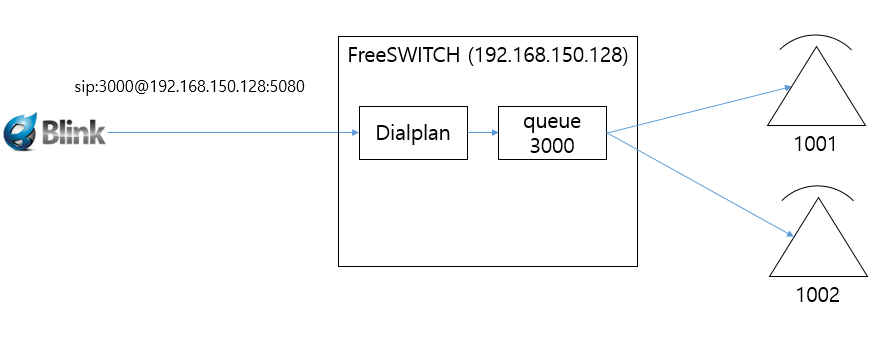
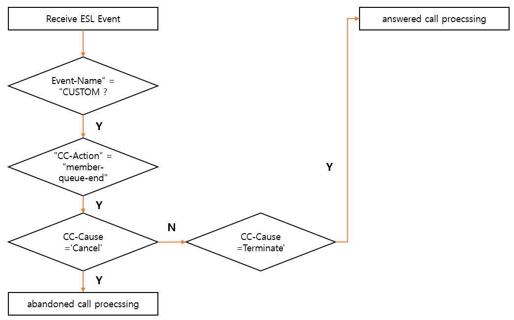

In FreeSWITCH, CDRs can be saved in various formats like csv, xml, database.
This time, we will learn how to create a CDR suitable for a call center system.
The core of the call center system CDR is managing agent activity.
A CDR that can create queue-level and agent-level statistical data is needed.

<br> <br> 

# __Prerequisite__
* [__cdr basic__](https://github.com/raspberry-pi-maker/VoIP-related-codes/blob/main/FreeSWITCH/cdr/cdr_basic.md)
* [__Dynamic usage of mod_callcenter__](https://github.com/raspberry-pi-maker/VoIP-related-codes/blob/main/FreeSWITCH/mod_calltcenter/Dynamic%20usage%20of%20mod_callcenter.md)

<br> 

# Test Environment
This is my test environment



* queue : 3000
* agents : 1001, 1002 (same extension number)
* dialplan : trunk inbound call to 3000 might be saved to queue 3000
* test external phone : blink softphone for making trunk call to 3000


```bash
freeswitch@blueivr> callcenter_config agent list
name|instance_id|uuid|type|contact|status|state|max_no_answer|wrap_up_time|reject_delay_time|busy_delay_time|no_answer_delay_time|last_bridge_start|last_bridge_end|last_offered_call|last_status_change|no_answer_count|calls_answered|talk_time|ready_time|external_calls_count
1001|single_box||callback|[call_timeout=60]user/1001|Available|Waiting|0|0|0|0|0|1696981398|1696981402|1696981393|1696980875|0|2|8|0|0
1002|single_box||callback|[call_timeout=60]user/1002|Logged Out|Waiting|0|0|0|0|0|0|0|0|1696981071|0|0|0|0|0
+OK

freeswitch@blueivr> callcenter_config queue list
name|strategy|moh_sound|time_base_score|tier_rules_apply|tier_rule_wait_second|tier_rule_wait_multiply_level|tier_rule_no_agent_no_wait|discard_abandoned_after|abandoned_resume_allowed|max_wait_time|max_wait_time_with_no_agent|max_wait_time_with_no_agent_time_reached|record_template|calls_answered|calls_abandoned|ring_progressively_delay|skip_agents_with_external_calls|agent_no_answer_status
3000@default|round-robin|/usr/local/freeswitch/sounds/ivr/common/music-on-hold.wav|system|false|300|true|false|60|false|0|0|20||2|2|0|true|On Break
+OK

freeswitch@blueivr> callcenter_config tier list
queue|agent|state|level|position
3000@default|1001|Ready|1|1
3000@default|1002|Ready|1|1
+OK

```

<br><br>

# Make callcenter CDR using mod_cdr_csv
Let’s first look at the CDR of the call center inbound call using mod_cdr_csv, which was tested in the previous article.


* Make an outbound call from the blink softphone.
* The outgoing call is connected to mod_callcenter queue 3000 through FreeSWITCH's dialplan.
* The bell rings to agent 1001 who is logged in.
* Moh is played on the blink softphone.
* When a 1001 agent answers the phone, a call is made with the blink softphone.

<br>
And the following is the cdr in csv format created as a result of the above call.

<br>

```bash
"spypi","19083426","1001","default","2023-10-11 08:43:13","2023-10-11 08:43:18","2023-10-11 08:43:22","9","4","NORMAL_CLEARING","1c2888e3-b3ab-4d66-be6b-91b6430f0afd","","1001","PCMA","PCMA"

"3000","19083426","3000","blueivr","2023-10-11 08:43:13","2023-10-11 08:43:13","2023-10-11 08:43:22","9","9","NORMAL_CLEARING","d26a29f9-60e7-4df5-9eed-e42bac8c7096","1c2888e3-b3ab-4d66-be6b-91b6430f0afd","","PCMU","PCMU"
```

Since I set both A and B legs to leave cdrs, 2 cdrs were created for one call.
The above cdr has the following problems.

* There is no information about the agent. There is no problem because I used the same extension number and agent name. However, if different values are used for the agent name and extension number, it is not possible to check which agent received the call.
* Because it is made of two cdrs, there is the inconvenience of having to always combine two rows to generate information about one call.

<br><br>

# Create a CDR suitable for call centers
You can use the method used in mod_cdr_csv to insert cdr values into the database, but this time I'm going to use a slightly different method.

First I looked at using record_post_process_exec_app in the dial plan. record_post_process_exec_app APP is an application that can be called at the end of recording. An example of using this application to add agent information to a call center recording file is provided in [Freeswitch recording with agent information](https://github.com/raspberry-pi-maker/VoIP-related-codes/tree/main/FreeSWITCH/Recording%20with%20mod_callcenter). 

However, because this application was called after the call ended, there was a problem in that it could not access various channel variables except basic information. Therefore, the record_post_process_exec_app application was judged to be difficult to use.

Before going deeper, let's look at the events that occur when a call enters mod_callcenter's queue and the call is distributed to agents and answered.

<br>

## Callcenter ESL event sequence for a successful call

1. "CC-Action": "member-queue-start" : Joining the queue triggers this event, allowing you to track when callers enter the queue

2.  "CC-Action": "members-count" : This event is generated every time the queue count api is called and anytime a caller enters or leaves the queue. 

3.  "CC-Action": "agent-state-change" : Every time an agent's State changes, this event is generated.. __The agent status changes from "Waiting" to "Receiving".__

4.  "CC-Action": "agent-offering" : Every time a caller is presented to an agent (before he answers), this event is generated.

5.  "CC-Action": "bridge-agent-start" : When an agent is connected, this event is generated. NOTE: the channel variables, including, for example, Event-Date-Timestamp are present as well as the callcenter values.

6.  "CC-Action": "members-count" 

7.  "CC-Action": "agent-state-change" : Every time an agent's State changes, this event is generated.. __The agent status changes from "Receiving" to "In a queue call".__

8.  "CC-Action": "bridge-agent-end" : When an agent is disconnected, this event is generated. __NOTE: the channel variables, including, for example, Event-Date-Timestamp are present as well as the callcenter values.__

9.  "CC-Action": "member-queue-end" : This is generated when a caller leaves the queue. Different lengths of queue-specific times are reported in seconds. There are two values for CC-Cause: 'Terminated' and 'Cancel'. For successful call, __the CC-Cause will be 'Terminated'__. And __CC-Agent value will be present.__

10.  "CC-Action": "agent-state-change" : Every time an agent's State changes, this event is generated. __The agent status changes from "In a queue call" to "Waiting".__


<br>

## Callcenter ESL event sequence for a abandoned call

1. "CC-Action": "member-queue-start"

2. "CC-Action": "members-count"

3. "CC-Action": "member-queue-end" : If we get a hangup from the caller before talking to an agent, __the CC-Cause will be 'Cancel'__. __CC-Cancel-Reason will contain the reason of the drop between NONE (no specific reason), TIMEOUT (caller has been waiting more than the timeout), NO_AGENT_TIMEOUT (caller has been waiting more than the no_agent_timeout), and BREAK_OUT (caller abandoned).__  

4. "CC-Action": "members-count"

<br><br>


## The most important event - "CC-Action": "member-queue-end" 

<br>

The flow of analyzing ESL events is as follows.



<br>

### Keys needed to create a CDR

|key|example values|description|
|------|---|---|
|Caller-ANI|19083426|caller(member)'s number|
|Caller-Destination-Number|3000|DNIS|
|Caller-Context|public|dialplan context|
|Caller-Channel-Created-Time|1696995740907190|The micro epoch in which the member phone was connected to FreeSWITCH |
|Hangup-Cause|NORMAL_CLEARING|Hangup Cause|
|CC-Agent|1001|agent name who answered|
|Caller-Callee-ID-Number, Other-Leg-Destination-Number|1001|agent's extension number|
|CC-Queue|3000@default|queue name|
|CC-Member-Leaving-Time|1696995749|The epoch when the member left the queue|
|CC-Agent-Called-Time|1696995740|The epoch when the agent;s phone starts ringing|
|CC-Member-Joined-Time|1696995740|The epoch when the member entered the queue|
|CC-Member-CID-Number|19083426|caller(member)'s number|
|CC-Member-Session-UUID, Channel-Call-UUID, variable_uuid, variable_call_uuid|503d2093-45f8-4156-bed5-10f1d387d04b|A leg UUID|
|CC-Member-UUID|dbd77eea-5eec-4992-a386-d49683aaecef|B leg UUID|
|CC-Agent-Answered-Time|1696995745|The epoch when the agent answered the call|
|CC-Cause|Terminated|Cancel or Terminated|
|variable_cc_queue_joined_epoch|1696995740|Same as CC-Member-Joined-Time|
|variable_start_epoch|1696995740|Same as CC-Member-Joined-Time|
|variable_bridge_epoch|1696995745|Same as CC-Agent-Answered-Time|
|variable_cc_queue_terminated_epoch|1696995749|Same as CC-Member-Leaving-Time|
|variable_end_epoch|1696995749|Same as CC-Member-Leaving-Time|
|variable_billsec|9|billing time|


<br>

## Sample python script for ESL, CDR

The following Python script receives the CUSTOM ESL event and leaves a CDR in the sqlite DB.
It is easy to create statistics because it adds information such as agent name and queue name to the cdr records.

<br>

```python
import ESL
import json
import sqlite3

filter = 'CUSTOM callcenter::info'

# For convenience, I don't create indexes
def create_table(conn):
    table_sql = "CREATE TABLE IF NOT EXISTS callcenter_cdr \
(caller_id_number text NOT NULL, \
destination_number text NOT NULL, \
queue_name text NOT NULL, \
agent_name text NOT NULL, \
answered_number text NOT NULL, \
system_entered_stamp text NOT NULL, \
queue_entered_stamp text NOT NULL, \
ring_stamp text NOT NULL, \
answer_stamp text NOT NULL, \
end_stamp text NOT NULL, \
duration int NOT NULL, \
billsec int NOT NULL, \
hangup_cause text NOT NULL, \
uuid text NOT NULL, \
bleg_uuid text NOT NULL \
); "

    try:
        c = conn.cursor()
        c.execute(table_sql)
    except Error as e:
        print(e)
    
def process_abandoned_call(conn, j):
    try:
        duration = 0
        billsec = 0
        if "variable_billsec" in j :
            billsec = int(j["variable_billsec"])
            
        sql = "insert into callcenter_cdr values(?,?,?,?,?,?,?,?,?,?,?,?,?,?,?);"
        c = conn.cursor()
        c.execute(sql, (j["Caller-ANI"], j["Caller-Destination-Number"], j["CC-Queue"], "",\
        "", j["Caller-Channel-Created-Time"], "", \
        "", "", "", \
        duration, billsec, j["Hangup-Cause"],j["Channel-Call-UUID"], ""))
        conn.commit()
    except Error as e:
        print(e)
    
def process_answered_call(conn, j):
    try:
        duration = int(j["CC-Member-Leaving-Time"]) - int(j["CC-Agent-Answered-Time"])
        billsec = int(j["variable_billsec"])
        sql = "insert into callcenter_cdr values(?,?,?,?,?,?,?,?,?,?,?,?,?,?,?);"
        c = conn.cursor()
        c.execute(sql, (j["Caller-ANI"], j["Caller-Destination-Number"], j["CC-Queue"], j["CC-Agent"],\
        j["Caller-Callee-ID-Number"], j["Caller-Channel-Created-Time"], j["CC-Member-Joined-Time"], \
        j["CC-Agent-Called-Time"], j["CC-Agent-Answered-Time"], j["CC-Member-Leaving-Time"], \
        duration, billsec, j["Hangup-Cause"],j["Channel-Call-UUID"], j["CC-Member-UUID"]))
        conn.commit()
    except Error as e:
        print(e)

def process_callcenter_event(conn, j):
    if "CC-Action" not in j :
        return
    if j["CC-Action"] != "member-queue-end":
        return
    if "CC-Cause" not in j :
        return
    if j["CC-Cause"] == "Cancel":   # abandoned call
        process_abandoned_call(conn, j)
    else:    
        process_answered_call(conn, j)

def event_ESL_job():
    conn = sqlite3.connect("/usr/local/freeswitch/db/my_cdr.db")
    create_table(conn)

    con = ESL.ESLconnection('127.0.0.1', '8021', 'ClueCon')
    print('Connecting to ESL ....')
    if con.connected():
        print('Connecting to ESL SUCCESS')
        con.events('json', filter)
        while 1:
            try:
                e = con.recvEvent()
                if e:
                    j = json.loads(e.serialize('json'))
                    if j:
                        #print(json.dumps(j, indent=2))
                        process_callcenter_event(conn, j)

            except Exception as e:  
                #print(j)            
                print("error:", "Exception Occured")
                print(type(e))

if __name__ == "__main__":
    event_ESL_job()

```

<br><br>

# Wrapping up

The above Python script was tested only for abandoned calls and agent-connected calls. I did not test various cases such as transfer, conference call, and pickup.


