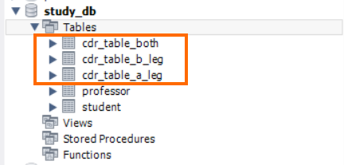
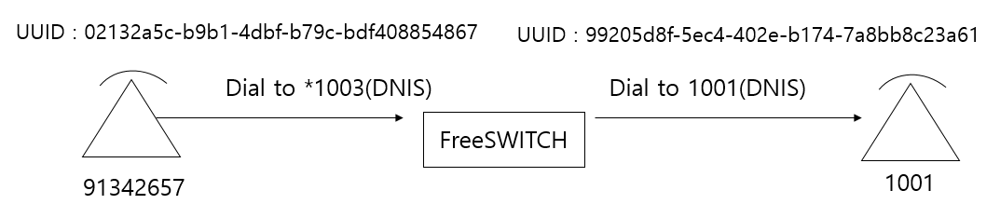
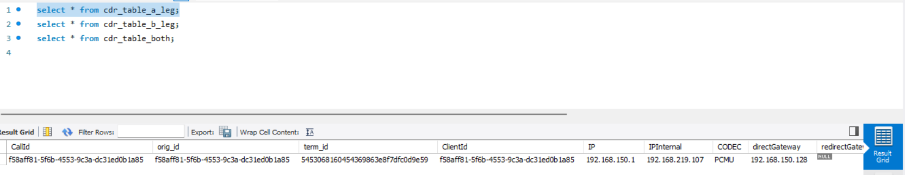

In FreeSWITCH, CDRs can be saved in various formats like csv, xml, database.
<br> <br> 

# __Prerequisite__
* [__cdr basic__](https://github.com/raspberry-pi-maker/VoIP-related-codes/blob/main/FreeSWITCH/cdr/cdr_basic.md)

<br> 

In this article, we will learn how to store CDRs directly in the database.
The advantage of mod_odbc_cdr is that it is not dependent on a specific DB. If you have installed the odbc driver properly, you can use any database.

For a detailed description of mod_cdr_csv, refer to [FreeSWITCH Document about mod_odbc_cdr](https://developer.signalwire.com/freeswitch/FreeSWITCH-Explained/Modules/mod_odbc_cdr_7143449) .

<br>

# check odbc connection
If you have set the ODBC driver normally, you can check as follows.
The following are the settings I use to use odbc.

```ini
root@ubuntusrv:/usr/local/freeswitch/db# cat /etc/odbc.ini
[study_mysql]
Description     = connect to study_db
Driver          = MySQL ODBC 8.0 Unicode Driver
SERVER          = 127.0.0.1
PORT            = 3306
DATABASE        = study_db
User            = study_user
Password        = study
```

```ini
root@ubuntusrv:/usr/local/freeswitch/db# cat /etc/odbcinst.ini
[MySQL ODBC 8.0 Unicode Driver]
Driver=/usr/lib/x86_64-linux-gnu/odbc/libmyodbc8w.so
UsageCount=1

[MySQL ODBC 8.0 ANSI Driver]
Driver=/usr/lib/x86_64-linux-gnu/odbc/libmyodbc8a.so
UsageCount=1

[ODBC Driver 17 for SQL Server]
Description=Microsoft ODBC Driver 17 for SQL Server
Driver=/opt/microsoft/msodbcsql17/lib64/libmsodbcsql-17.10.so.4.1
UsageCount=1
```
<br>

You can test odbc connection using the isql command. If the following console screen appears, you can now use odbc.

```bash
root@ubuntusrv:/usr/local/freeswitch/db# isql -v study_mysql
+---------------------------------------+
| Connected!                            |
|                                       |
| sql-statement                         |
| help [tablename]                      |
| echo [string]                         |
| quit                                  |
|                                       |
+---------------------------------------+
SQL> 

```

<br><br>

# mod_odbc_cdr

First enable the mod_odbc_cdr module at conf/autoload_configs/modules.conf.xml:

```xml
<!-- Event Handlers -->
<!--<load module="mod_cdr_csv"/>-->
<load module="mod_event_socket"/>
<!--<load module="mod_cdr_sqlite"/>-->
<load module="mod_odbc_cdr"/>
```
<br> 

Modify the conf/autoload_configs/odbc_cdr.conf file as follows. If the file does not exist, create a new one.  The contents of the xml file are self-explanatory.


```xml
<configuration name="odbc_cdr.conf" description="ODBC CDR Configuration">
  <settings>
    <!-- <param name="odbc-dsn" value="database:username:password"/> -->
    <param name="odbc-dsn" value="odbc://study_mysql"/>
    <!-- global value can be "a-leg", "b-leg", "both" (default is "both") -->
    <param name="log-leg" value="both"/>
    <!-- value can be "always", "never", "on-db-fail" -->
    <param name="write-csv" value="on-db-fail"/>
    <!-- location to store csv copy of CDR -->
    <param name="csv-path" value="/usr/local/freeswitch/log/odbc_cdr"/>
    <!-- if "csv-path-on-fail" is set, failed INSERTs will be placed here as CSV files otherwise they will be placed in "csv-path" -->
    <param name="csv-path-on-fail" value="/usr/local/freeswitch/log/odbc_cdr/failed"/>
    <!-- dump SQL statement after leg ends -->
    <param name="debug-sql" value="false"/>
  </settings>
  <tables>
    <!-- only a-legs will be inserted into this table -->
    <table name="cdr_table_a_leg" log-leg="a-leg">
      <field name="CallId" chan-var-name="call_uuid"/>
      <field name="orig_id" chan-var-name="uuid"/>
      <field name="term_id" chan-var-name="sip_call_id"/>
      <field name="ClientId" chan-var-name="uuid"/>
      <field name="IP" chan-var-name="sip_network_ip"/>
      <field name="IPInternal" chan-var-name="sip_via_host"/>
      <field name="CODEC" chan-var-name="read_codec"/>
      <field name="directGateway" chan-var-name="sip_req_host"/>
      <field name="redirectGateway" chan-var-name="sip_redirect_contact_host_0"/>
      <field name="CallerID" chan-var-name="sip_from_user"/>
      <field name="TelNumber" chan-var-name="sip_req_user"/>
      <field name="TelNumberFull" chan-var-name="sip_to_user"/>
      <field name="sip_endpoint_disposition" chan-var-name="endpoint_disposition"/>
      <field name="sip_current_application" chan-var-name="current_application"/>
    </table>
    <!-- only b-legs will be inserted into this table -->
    <table name="cdr_table_b_leg" log-leg="b-leg">
      <field name="CallId" chan-var-name="call_uuid"/>
      <field name="orig_id" chan-var-name="uuid"/>
      <field name="term_id" chan-var-name="sip_call_id"/>
      <field name="ClientId" chan-var-name="uuid"/>
      <field name="IP" chan-var-name="sip_network_ip"/>
      <field name="IPInternal" chan-var-name="sip_via_host"/>
      <field name="CODEC" chan-var-name="read_codec"/>
      <field name="directGateway" chan-var-name="sip_req_host"/>
      <field name="redirectGateway" chan-var-name="sip_redirect_contact_host_0"/>
      <field name="CallerID" chan-var-name="sip_from_user"/>
      <field name="TelNumber" chan-var-name="sip_req_user"/>
      <field name="TelNumberFull" chan-var-name="sip_to_user"/>
      <field name="sip_endpoint_disposition" chan-var-name="endpoint_disposition"/>
      <field name="sip_current_application" chan-var-name="current_application"/>
    </table>
    <!-- both legs will be inserted into this table -->
    <table name="cdr_table_both">
      <field name="CallId" chan-var-name="uuid"/>
      <field name="orig_id" chan-var-name="Caller-Unique-ID"/>
      <field name="TEST_id" chan-var-name="sip_from_uri"/>
    </table>
  </tables>
</configuration>

```
<br>

Then reload the mod_odbc_cdr module with fs_cli

```bash
freeswitch@blueivr> load mod_odbc_cdr
+OK Reloading XML
+OK

2023-10-11 07:33:24.667041 [DEBUG] mod_odbc_cdr.c:431 Set odbc-dsn [odbc://study_mysql]
2023-10-11 07:33:24.667041 [DEBUG] mod_odbc_cdr.c:460 Set log-leg [both]
2023-10-11 07:33:24.667041 [DEBUG] mod_odbc_cdr.c:471 Set csv-path [/usr/local/freeswitch/log/odbc_cdr/]
2023-10-11 07:33:24.667041 [DEBUG] mod_odbc_cdr.c:472 Set csv-path-on-fail [/usr/local/freeswitch/log/odbc_cdr/failed/]
2023-10-11 07:33:24.667041 [INFO] mod_odbc_cdr.c:120 Found table [cdr_table_a_leg]
2023-10-11 07:33:24.667041 [INFO] mod_odbc_cdr.c:124 Set table [cdr_table_a_leg] to log A-legs only
2023-10-11 07:33:24.667041 [INFO] mod_odbc_cdr.c:135 Adding fields to table [cdr_table_a_leg]
2023-10-11 07:33:24.667041 [INFO] mod_odbc_cdr.c:164 Field [CallId] (call_uuid) added to [cdr_table_a_leg]
2023-10-11 07:33:24.667041 [INFO] mod_odbc_cdr.c:164 Field [orig_id] (uuid) added to [cdr_table_a_leg]
2023-10-11 07:33:24.667041 [INFO] mod_odbc_cdr.c:164 Field [term_id] (sip_call_id) added to [cdr_table_a_leg]
2023-10-11 07:33:24.667041 [INFO] mod_odbc_cdr.c:164 Field [ClientId] (uuid) added to [cdr_table_a_leg]
2023-10-11 07:33:24.667041 [INFO] mod_odbc_cdr.c:164 Field [IP] (sip_network_ip) added to [cdr_table_a_leg]
2023-10-11 07:33:24.667041 [INFO] mod_odbc_cdr.c:164 Field [IPInternal] (sip_via_host) added to [cdr_table_a_leg]
2023-10-11 07:33:24.667041 [INFO] mod_odbc_cdr.c:164 Field [CODEC] (read_codec) added to [cdr_table_a_leg]
2023-10-11 07:33:24.667041 [INFO] mod_odbc_cdr.c:164 Field [directGateway] (sip_req_host) added to [cdr_table_a_leg]
2023-10-11 07:33:24.667041 [INFO] mod_odbc_cdr.c:164 Field [redirectGateway] (sip_redirect_contact_host_0) added to [cdr_table_a_leg]
2023-10-11 07:33:24.667041 [INFO] mod_odbc_cdr.c:164 Field [CallerID] (sip_from_user) added to [cdr_table_a_leg]
2023-10-11 07:33:24.667041 [INFO] mod_odbc_cdr.c:164 Field [TelNumber] (sip_req_user) added to [cdr_table_a_leg]
2023-10-11 07:33:24.667041 [INFO] mod_odbc_cdr.c:164 Field [TelNumberFull] (sip_to_user) added to [cdr_table_a_leg]
2023-10-11 07:33:24.667041 [INFO] mod_odbc_cdr.c:164 Field [sip_endpoint_disposition] (endpoint_disposition) added to [cdr_table_a_leg]
2023-10-11 07:33:24.667041 [INFO] mod_odbc_cdr.c:164 Field [sip_current_application] (current_application) added to [cdr_table_a_leg]
2023-10-11 07:33:24.667041 [INFO] mod_odbc_cdr.c:120 Found table [cdr_table_b_leg]
2023-10-11 07:33:24.667041 [INFO] mod_odbc_cdr.c:127 Set table [cdr_table_b_leg] to log B-legs only
2023-10-11 07:33:24.667041 [INFO] mod_odbc_cdr.c:135 Adding fields to table [cdr_table_b_leg]
2023-10-11 07:33:24.667041 [INFO] mod_odbc_cdr.c:164 Field [CallId] (call_uuid) added to [cdr_table_b_leg]
2023-10-11 07:33:24.667041 [INFO] mod_odbc_cdr.c:164 Field [orig_id] (uuid) added to [cdr_table_b_leg]
2023-10-11 07:33:24.667041 [INFO] mod_odbc_cdr.c:164 Field [term_id] (sip_call_id) added to [cdr_table_b_leg]
2023-10-11 07:33:24.667041 [INFO] mod_odbc_cdr.c:164 Field [ClientId] (uuid) added to [cdr_table_b_leg]
2023-10-11 07:33:24.667041 [INFO] mod_odbc_cdr.c:164 Field [IP] (sip_network_ip) added to [cdr_table_b_leg]
2023-10-11 07:33:24.667041 [INFO] mod_odbc_cdr.c:164 Field [IPInternal] (sip_via_host) added to [cdr_table_b_leg]
2023-10-11 07:33:24.667041 [INFO] mod_odbc_cdr.c:164 Field [CODEC] (read_codec) added to [cdr_table_b_leg]
2023-10-11 07:33:24.667041 [INFO] mod_odbc_cdr.c:164 Field [directGateway] (sip_req_host) added to [cdr_table_b_leg]
2023-10-11 07:33:24.667041 [INFO] mod_odbc_cdr.c:164 Field [redirectGateway] (sip_redirect_contact_host_0) added to [cdr_table_b_leg]
2023-10-11 07:33:24.667041 [INFO] mod_odbc_cdr.c:164 Field [CallerID] (sip_from_user) added to [cdr_table_b_leg]
2023-10-11 07:33:24.667041 [INFO] mod_odbc_cdr.c:164 Field [TelNumber] (sip_req_user) added to [cdr_table_b_leg]
2023-10-11 07:33:24.667041 [INFO] mod_odbc_cdr.c:164 Field [TelNumberFull] (sip_to_user) added to [cdr_table_b_leg]
2023-10-11 07:33:24.667041 [INFO] mod_odbc_cdr.c:164 Field [sip_endpoint_disposition] (endpoint_disposition) added to [cdr_table_b_leg]
2023-10-11 07:33:24.667041 [INFO] mod_odbc_cdr.c:164 Field [sip_current_application] (current_application) added to [cdr_table_b_leg]
2023-10-11 07:33:24.667041 [INFO] mod_odbc_cdr.c:120 Found table [cdr_table_both]
2023-10-11 07:33:24.667041 [INFO] mod_odbc_cdr.c:130 Set table [cdr_table_both] to log both legs
2023-10-11 07:33:24.667041 [INFO] mod_odbc_cdr.c:135 Adding fields to table [cdr_table_both]
2023-10-11 07:33:24.667041 [INFO] mod_odbc_cdr.c:164 Field [CallId] (uuid) added to [cdr_table_both]
2023-10-11 07:33:24.667041 [INFO] mod_odbc_cdr.c:164 Field [orig_id] (Caller-Unique-ID) added to [cdr_table_both]
2023-10-11 07:33:24.667041 [INFO] mod_odbc_cdr.c:164 Field [TEST_id] (sip_from_uri) added to [cdr_table_both]
2023-10-11 07:33:24.667041 [CONSOLE] switch_loadable_module.c:1803 Successfully Loaded [mod_odbc_cdr]
2023-10-11 07:33:24.667041 [INFO] switch_time.c:1430 Timezone reloaded 1750 definitions

```


Create three tables in advance to be used in the xml file above. The following are the SQL statements used to create the table. For convenience, I don't create indexes. The table name and column name are the same as the contents in the xml file.

```sql
CREATE TABLE IF NOT EXISTS `cdr_table_a_leg` (
`CallId` varchar(80) DEFAULT NULL,
`orig_id` varchar(80) DEFAULT NULL,
`term_id` varchar(80) DEFAULT NULL,
`ClientId` varchar(80) DEFAULT NULL,
`IP` varchar(80) DEFAULT NULL,
`IPInternal` varchar(80) DEFAULT NULL,
`CODEC` varchar(80) DEFAULT NULL,
`directGateway` varchar(80) DEFAULT NULL,
`redirectGateway` varchar(80) DEFAULT NULL,
`CallerID` varchar(80) DEFAULT NULL,
`TelNumber` varchar(80) DEFAULT NULL,
`TelNumberFull` varchar(80) DEFAULT NULL,
`sip_endpoint_disposition` varchar(80) DEFAULT NULL,
`sip_current_application` varchar(80) DEFAULT NULL
);

CREATE TABLE IF NOT EXISTS `cdr_table_b_leg` (
`CallId` varchar(80) DEFAULT NULL,
`orig_id` varchar(80) DEFAULT NULL,
`term_id` varchar(80) DEFAULT NULL,
`ClientId` varchar(80) DEFAULT NULL,
`IP` varchar(80) DEFAULT NULL,
`IPInternal` varchar(80) DEFAULT NULL,
`CODEC` varchar(80) DEFAULT NULL,
`directGateway` varchar(80) DEFAULT NULL,
`redirectGateway` varchar(80) DEFAULT NULL,
`CallerID` varchar(80) DEFAULT NULL,
`TelNumber` varchar(80) DEFAULT NULL,
`TelNumberFull` varchar(80) DEFAULT NULL,
`sip_endpoint_disposition` varchar(80) DEFAULT NULL,
`sip_current_application` varchar(80) DEFAULT NULL
);

CREATE TABLE IF NOT EXISTS `cdr_table_both` (
`CallId` varchar(80) DEFAULT NULL,
`orig_id` varchar(80) DEFAULT NULL,
`TEST_id` varchar(80) DEFAULT NULL
);
```
<br>

The following is the list after table creation.



Now you are ready. Let's leave the cdr in MySQL.

<br>

## odbc csv example

Then make calls.
This picture is the trunk phone call.




If you look at the MySQL table after the call is completed, you can see that the cdr value was created as set in the conf/autoload_configs/odbc_cdr.conf file.



<br><br>


# Wrapping up
Using mod_odbc_cdr, you can easily save CDRs to a relational database. However, the cdr column value in the above example using the xml value in the FreeSWITCH official document feels poor.
Column values can be changed using channel variable values as described in mod_cdr_csv. You can create it in whatever format you want.
However, combining the A Leg and B Leg described in mod_cdr_csv into one row is not easy in [__mod_odbc_cdr__](https://github.com/raspberry-pi-maker/VoIP-related-codes/blob/main/FreeSWITCH/cdr/cdr_basic.md).

