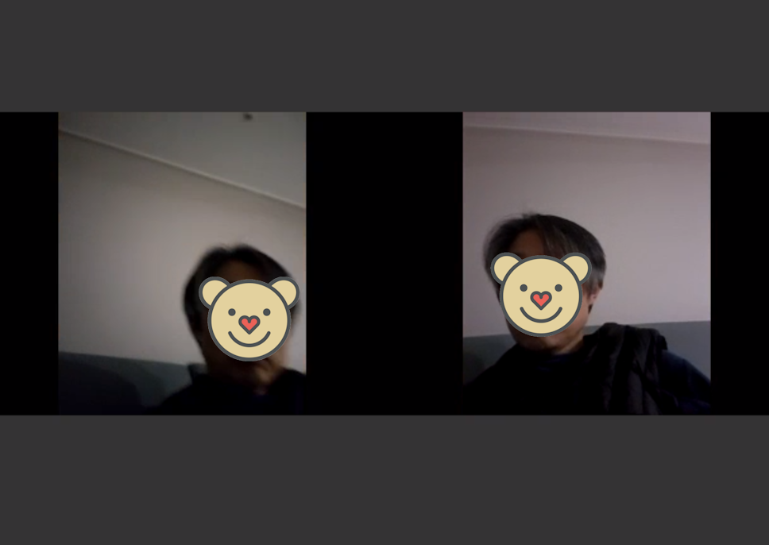
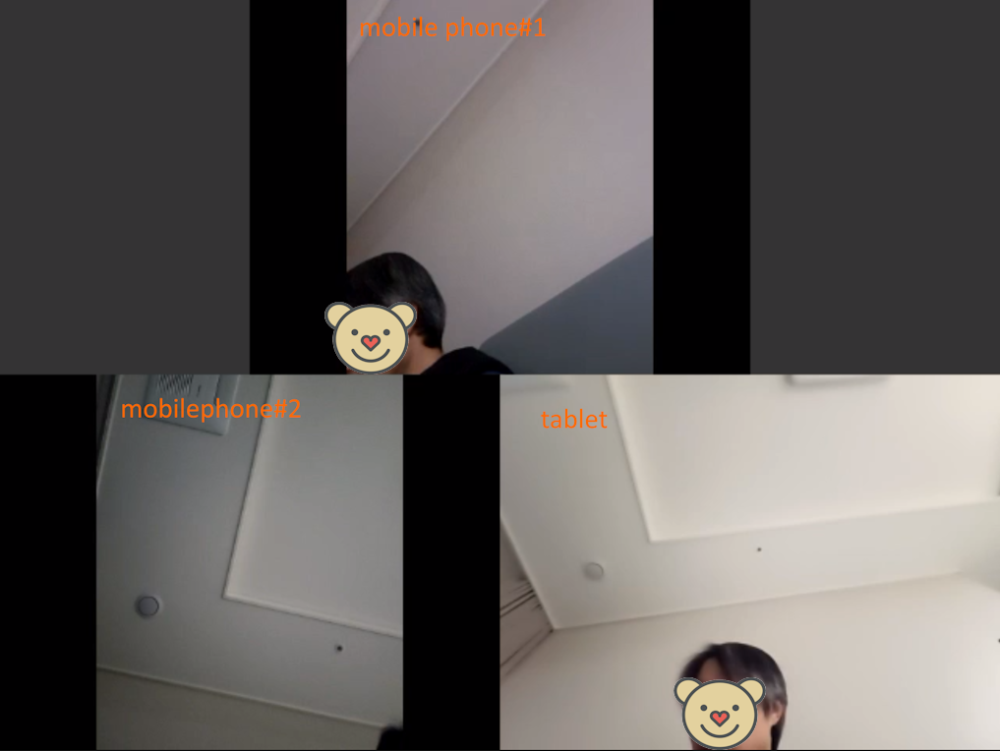

# Voice Conference with Recording Example

__This document is applicable to FreeSWITCH 1.6 or higher. We recommend using 1.10 if possible.__

<br>

## Prerequisites

<br>

* [mod_conference](https://github.com/raspberry-pi-maker/VoIP-related-codes/tree/main/FreeSWITCH/mod_conference/mod_conference.md). 
* [Very Simple Voice Conference Examples](https://github.com/raspberry-pi-maker/VoIP-related-codes/tree/main/FreeSWITCH/mod_conference/voice_conference_example.md). 
* [Simple Video Call](https://github.com/raspberry-pi-maker/VoIP-related-codes/tree/main/FreeSWITCH/Video%20Call/SimpleVideo.md). 

<br>

Video conferences require a lot of computing resources.
In particular, as the number of meeting attendees increases, resource requirements increase rapidly.
And since FreeSWITCH moved its development platform to Debian, there is a problem that documentation for source code builds is not properly provided on other OSs. There are no major problems in building a voice-centered system on Linux distributions other than Debian, but building the modules required for video conferences is quite difficult.
Therefore, I recommend using the Debian distribution for systems that support video conferencing whenever possible.

Building FreeSWITCH on Debian is explained in [Build FreeSWITCh on the Debian 12](https://github.com/raspberry-pi-maker/VoIP-related-codes/blob/main/FreeSWITCH/build/debian_build.md).


Please refer to [Simple Video Call](https://github.com/raspberry-pi-maker/VoIP-related-codes/tree/main/FreeSWITCH/Video%20Call/SimpleVideo.md) for an explanation of how to implement video calls and video codecs in FreeSWITCH.

<br>


## conference.conf.xml

<br>

For video conferencing, you need to add a few video-related configurations to the settings of conference.conf.xml used in existing audio conferences.

<br>


```xml
    <profile name="videoconf">
      <!-- Domain (for presence) -->
      <param name="domain" value="$${domain}"/>
      <!-- Sample Rate-->
      <param name="rate" value="8000"/>
      <!-- Number of milliseconds per frame -->
      <param name="interval" value="20"/>
      <!-- Energy level required for audio to be sent to the other users -->
      <param name="energy-level" value="100"/>
      <param name="muted-sound" value="conference/conf-muted.wav"/>
      <!-- File to play to acknowledge unmuted -->
      <param name="unmuted-sound" value="conference/conf-unmuted.wav"/>
      <!-- File to play if you are alone in the conference -->
      <param name="alone-sound" value="conference/conf-alone.wav"/>
      <!-- File to play when you're alone (music on hold)-->
      <param name="moh-sound" value="conference/conf-music.wav"/>
      <!-- File to play when you join the conference -->
      <!--<param name="enter-sound" value="tone_stream://%(200,0,500,600,700)"/>-->
      <param name="enter-sound" value="conference/conf-welcome.wav"/>
      <!-- File to play when you leave the conference -->
      <param name="exit-sound" value="conference/conf-exit.wav"/>
      <!-- File to play when you are ejected from the conference -->
      <param name="kicked-sound" value="conference/conf-kicked.wav"/>
      <!-- File to play to prompt for a pin -->
      <param name="pin-sound" value="conference/conf-pin.wav"/>
      <!-- File to play to when the pin is invalid -->
      <param name="bad-pin-sound" value="conference/conf-bad-pin.wav"/>
      <!-- Default Caller ID Name for outbound calls -->
      <param name="caller-id-name" value="$${outbound_caller_name}"/>
      <!-- Default Caller ID Number for outbound calls -->
      <param name="caller-id-number" value="$${outbound_caller_id}"/>
      <!-- enable comfort noise generation -->
      <param name="comfort-noise" value="true"/>
      <param name="conference-flags" value="rfc-4579|minimize-video-encoding|video-muxing-personal-canvas|audio-always"/>
      <param name="video-mode" value="mux"/>
      <!--<param name="video-layout-name" value="1up_top_left+2"/>-->
      <!--<param name="video-canvas-size" value="800x600"/>-->
      <param name="video-canvas-size" value="640x480"/>
      <!--<param name="video-canvas-size" value="600x800"/>-->
      <param name="video-canvas-bgcolor" value="#333333"/>
      <param name="video-layout-bgcolor" value="#000000"/>
      <!--<param name="video-codec-bandwidth" value="1mb"/>-->
      <param name="video-codec-bandwidth" value="64KB"/>
      <param name="video-fps" value="10"/>
      <param name="auto-record" value="/usr/local/freeswitch/recordings/${strftime(%Y/%m/%d)}/${conference_name}_${strftime(%Y%m%d%H%M%S)}.mp4"/>
      <param name="min-required-recording-participants" value="1"/>
    </profile>
```
<br>

## dialplan

```xml
    <extension name="VIDEO_CONFERENCE">
        <condition field="destination_number" expression="^(2010)$">
            <action application="log" data="ALERT ==== Simple Video Conference CALL From ${caller_id_number}======"/>
            <action application="set" data="continue_on_fail=true"/>
            <action application="conference" data="testvideo@videoconf++flags{join-vid-floor}"/>
        </condition>
    </extension>
```
<br>


## video phones

<br>

For testing purposes, I tested several software video phones on the android OS.

<br>

|Video Phone|Description|Recommand|
|------|---|--|
|Linphone|The h264 codec works fine. However, in the case of VP8 codec, compatibility with FreeSWITCH seems to be poor. When using the VP8 codec, video calls worked normally, but video conference recording did not work properly.|recommand|
|PortSIP |h264 and vp8 both work well. Video conference recording also works well. But it didn't install on my Android tablet. It seems that it can only be installed on mobile phones.|recommand|
|ZoiPer|There is no part to set the codec. Video calling compatibility with FreeSWITCH is very poor|not recommand|
||||

I tested with the most compatible PortSIP product.

<br><br>

## test

<br>
As described in the dial plan, you can make a video call to number 2010 from two extension video phones.
If you make an video conference , you can see that the FreeSWITCH log as follows.

<br><br>

```json
2023-12-31 00:27:25.590387 99.67% [ALERT] mod_dptools.c:1865 ==== Simple Video Conference CALL From 1005======
EXECUTE [depth=0] sofia/internal/1005@192.168.10.144 set(continue_on_fail=true)
2023-12-31 00:27:25.590387 99.67% [INFO] switch_core_session.c:2793 Sending early media
2023-12-31 00:27:25.590387 99.67% [INFO] switch_core_media.c:9560 Activating VIDEO RTCP PORT 10403 interval 1000 mux -1
2023-12-31 00:27:25.590387 99.67% [NOTICE] sofia_media.c:90 Pre-Answer sofia/internal/1005@192.168.10.144!
EXECUTE [depth=0] sofia/internal/1005@192.168.10.144 conference(testvideo@videoconf++flags{join-vid-floor})
2023-12-31 00:27:25.590387 99.67% [NOTICE] mod_conference.c:2242 Channel [sofia/internal/1005@192.168.10.144] has been answered
2023-12-31 00:27:25.590387 99.67% [INFO] switch_ivr_async.c:221 Digit parser mod_conference: Setting realm to 'conf'
2023-12-31 00:27:25.590387 99.67% [INFO] conference_member.c:1097 conference testvideo OK video floor 9 sofia/internal/1005@192.168.10.144
2023-12-31 00:27:25.610538 99.67% [WARNING] switch_rtp.c:6988 INVALID RTCP PACKET TYPE 254 VER 2 LEN 8
2023-12-31 00:27:25.670709 99.67% [INFO] switch_vpx.c:564 config: vp8
2023-12-31 00:27:25.670709 99.67% [NOTICE] switch_vpx.c:599 VPX encoder reset (WxH/BW) from 0x0/0 to 640x480/1024
2023-12-31 00:27:25.690634 99.67% [INFO] switch_vpx.c:564 config: vp8
2023-12-31 00:27:25.690634 99.67% [NOTICE] switch_vpx.c:599 VPX encoder reset (WxH/BW) from 640x480/1024 to 640x480/512
2023-12-31 00:27:26.110995 99.67% [WARNING] switch_rtp.c:6988 INVALID RTCP PACKET TYPE 254 VER 2 LEN 12
2023-12-31 00:27:27.650823 99.57% [WARNING] switch_rtp.c:6988 INVALID RTCP PACKET TYPE 254 VER 2 LEN 16
2023-12-31 00:27:37.031146 99.23% [NOTICE] sofia.c:1065 Hangup sofia/internal/1005@192.168.10.144 [CS_EXECUTE] [NORMAL_CLEARING]
2023-12-31 00:27:37.031146 99.23% [INFO] conference_loop.c:1668 Channel leaving conference, cause: NORMAL_CLEARING
2023-12-31 00:27:37.051193 99.23% [NOTICE] switch_core_session.c:1762 Session 66 (sofia/internal/1005@192.168.10.144) Ended
2023-12-31 00:27:37.051193 99.23% [NOTICE] switch_core_session.c:1766 Close Channel sofia/internal/1005@192.168.10.144 [CS_DESTROY]
2023-12-31 00:27:43.090848 99.03% [NOTICE] sofia.c:1065 Hangup sofia/internal/1003@192.168.10.144 [CS_EXECUTE] [NORMAL_CLEARING]
2023-12-31 00:27:43.090848 99.03% [INFO] conference_loop.c:1668 Channel leaving conference, cause: NORMAL_CLEARING
2023-12-31 00:27:43.110334 99.03% [NOTICE] switch_core_session.c:1762 Session 65 (sofia/internal/1003@192.168.10.144) Ended
2023-12-31 00:27:43.110334 99.03% [NOTICE] switch_core_session.c:1766 Close Channel sofia/internal/1003@192.168.10.144 [CS_DESTROY]
2023-12-31 00:27:43.130472 99.00% [NOTICE] avformat.c:1235 video thread done
frame I:7     Avg QP:11.40  size:  9524
frame P:265   Avg QP:14.92  size:  4475
mb I  I16..4: 74.5%  0.0% 25.5%
mb P  I16..4:  9.2%  0.0%  4.3%  P16..4: 20.3%  9.8%  2.9%  0.0%  0.0%    skip:53.5%
coded y,uvDC,uvAC intra: 48.1% 48.9% 24.4% inter: 13.3% 15.1% 0.6%
i16 v,h,dc,p: 43% 20% 11% 25%
i4 v,h,dc,ddl,ddr,vr,hd,vl,hu: 22% 24% 23%  4%  7%  6%  7%  4%  4%
i8c dc,h,v,p: 61% 16% 20%  4%
kb/s:369.27
Qavg: 61139.641
Statistics: 1384490 bytes written, 2 seeks, 9 writeouts
2023-12-31 00:27:43.150442 99.00% [INFO] conference_record.c:425 Recording of {video_time_audio=false,channels=1,samplerate=8000,vw=640,vh=480,fps=10.00}/usr/local/freeswitch/recordings/2023/12/31/testvideo_20231231002715.mp4 Stopped
```

<br>

If you check after finishing the conference, you can see that the file was created as follows.

```bash
root@debian:/usr/local/freeswitch/recordings/2023/12/31# ll
total 1364
drwxr-x--- 2 root root    4096 Dec 31 00:27 .
drwxr-x--- 4 root root    4096 Dec 31 00:27 ..
-rw-r--r-- 1 root root 1384486 Dec 31 00:27 testvideo_20231231002715.mp4
```
<br><br>

I downloaded the video file and confirmed that it played normally on the PC.

<br>



<br><br>

## transcoding test

<br>
The above test was conducted after setting the video codec of the two soft phones to be the same as vp8.
This time, we tested with two soft phones, one set to h264 codec and the other set to vp8 codec.
The result was successful. Videos processed with two different codecs were merged and saved as a single video, and the other party's screen appeared normal on the video phone.


<br><br>

## Video conference using 3 terminals

<br>

Lastly, video conferencing using three terminals was tested. In the three terminals, the other party's screen appeared normal with the remaining two videos mixed except mine, and the recorded video also displayed three images properly as shown in the following picture.

<br>



