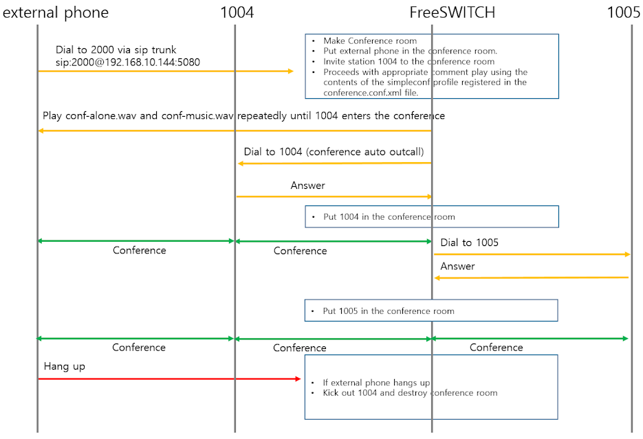

# Invite other attendees during a conference

__This document is applicable to FreeSWITCH 1.6 or higher. We recommend using 1.10 if possible.__

<br>

## Prerequisites

<br>

* [mod_conference](https://github.com/raspberry-pi-maker/VoIP-related-codes/tree/main/FreeSWITCH/mod_conference/mod_conference.md). 
* [Very Simple Voice Conference Examples](https://github.com/raspberry-pi-maker/VoIP-related-codes/tree/main/FreeSWITCH/mod_conference/voice_conference_example.md). 
* [Voice Conference with Recording Example](https://github.com/raspberry-pi-maker/VoIP-related-codes/tree/main/FreeSWITCH/mod_conference/voice_conference_recording.md). 
* [Voice Conference with Inviting Example](https://github.com/raspberry-pi-maker/VoIP-related-codes/tree/main/FreeSWITCH/mod_conference/voice_conference_invite.md). 


<br>

The process from initially creating a conference room to having two conference attendees participate in the meeting is the same as [Voice Conference with Inviting Example](https://github.com/raspberry-pi-maker/VoIP-related-codes/tree/main/FreeSWITCH/mod_conference/voice_conference_invite.md).
However, in this scenario, two meeting attendees invite another attendee during the conference.

<br>



<br>

Of the two participants in the initial conference, one is an external device calling the SIP trunk and the other is extension 1004.
Of these two conference participants, I would like to grant invitation permission only to extension 1004.

<br>

## How to invite conference attendee during a conference?

<br>
DTMF is almost the only means by which a phone can communicate with the system (FreeSWITCH). In previous examples, we used <caller-controls> in the conference.conf.xml file to allow conference room attendees to use functions such as volume control, mute, and exit the conference room.

<br>

```xml
    <group name="simpleconf">
      <control action="mute" digits="0"/>
      <control action="deaf mute" digits="*"/>
      <control action="energy up" digits="9"/>
      <control action="energy equ" digits="8"/>
      <control action="energy dn" digits="7"/>
      <control action="vol talk up" digits="3"/>
      <control action="vol talk zero" digits="2"/>
      <control action="vol talk dn" digits="1"/>
      <control action="vol listen up" digits="6"/>
      <control action="vol listen zero" digits="5"/>
      <control action="vol listen dn" digits="4"/>
      <control action="hangup" digits="#"/>
    </group>
```
<br>

__This solution employs bind_digit_action. Keep in mind that the digits assigned in conference.conf.xml for caller-controls will override any digits that you bind. This is the reason that we defined our own caller-controls instead of using the defaults. In our case, we simply remove the * caller-control and then use *1 and *2 for our bind_digit_action sequences.__

<br>

Therefore, in order to use *1, *2 DTMF, we must remove the use of * from the above xml as follows.

```xml
    <group name="simpleconf">
      <control action="mute" digits="0"/>
      <control action="energy up" digits="9"/>
      <control action="energy equ" digits="8"/>
      <control action="energy dn" digits="7"/>
      <control action="vol talk up" digits="3"/>
      <control action="vol talk zero" digits="2"/>
      <control action="vol talk dn" digits="1"/>
      <control action="vol listen up" digits="6"/>
      <control action="vol listen zero" digits="5"/>
      <control action="vol listen dn" digits="4"/>
      <control action="hangup" digits="#"/>
    </group>
```
<br>

And be sure to add the following line to the profile to specify `<caller-controls>`.

<br>

```xml
      <!-- Very Important  -->
      <param name="caller-controls" value="simpleconf"/>
```


## external dialplan

<br>

The external dial plan is almost identical to [Voice Conference with Inviting Example](https://github.com/raspberry-pi-maker/VoIP-related-codes/tree/main/FreeSWITCH/mod_conference/voice_conference_invite.md).

If you make a call to 2002 using the SIP trunk from the outside, the complex_voice_trunk_conference.lua script will be executed.

<br>


```xml
    <extension name="COMPLEX_AUDIO_CONFERENCE">
        <condition field="destination_number" expression="^(2002)$">
            <action application="log" data="ALERT ==== Complex Trunk Audio Conference CALL From ${caller_id_number} *** $1======"/>
            <action application="set" data="continue_on_fail=true"/>
            <action application="lua" data="complex_voice_trunk_conference.lua"/>
        </condition>
    </extension>
```

<br>

## complex_voice_trunk_conference.lua

<br>
This Lua script is more complex than the previous scripts and has new features added.

```lua
-- FreeSWITCH api
fs_api = freeswitch.API()

ani = session:getVariable("ani")
dnis = session:getVariable("destination_number") 

freeswitch.consoleLog("NOTICE", string.format("Complex voice trunk conference => Conference Call from [%s] to [%s]\n", ani, dnis))
session:execute("ring_ready")
session:sleep(500) 
session:answer()

conf_name = "1004"   --station number who I'll invite to the conference room
conf_profile = "simpleconf"
flags = "moderator"

--Prepare auto outcall
session:execute("set", "conference_auto_outcall_timeout=60")
session:execute("set", "conference_auto_outcall_flags=mute")  
session:execute("set", "conference_auto_outcall_caller_id_name=" .. ani)
session:execute("set", "conference_auto_outcall_caller_id_number=" .. ani)


--    session:execute("set", "conference_auto_outcall_maxwait=10") 
prefix_string = "{sip_contact_user=" .. ani .. ", answer_delay=0, execute_on_answer='lua complex_conf_agent.lua', , api_hangup_hook='lua complex_conf_hangup_hook.lua'"
prefix_string = prefix_string .. "}"

freeswitch.consoleLog("WARNING", "prifix_string:" .. prefix_string .. "\n")
session:execute("set", "conference_auto_outcall_prefix=" .. prefix_string)

-- Invite station to the conference room "user/1005@$${domain}"
session:execute("conference_set_auto_outcall", "user/" .. conf_name .."@$${domain}")

-- Put the (trunk) caller in the conference room
session:execute("conference", string.format("%s@%s++flags{%s}", conf_name, conf_profile, flags))
freeswitch.consoleLog("NOTICE", "Complex voice trunk conference => End Conference\n")

-- destroy conference
conf_cmd = conf_name .. " kick all"
freeswitch.consoleLog("WARNING", "conference " .. conf_cmd)
fs_api:execute("conference", conf_cmd)

```
<br>

### callbacks

<br>

The __conference_auto_outcall_prefix__ value has changed.
execute_on_answer and api_hangup_hook were added to this value. These values are callback functions called as follows when the conference_set_auto_outcall application calls a new conference participant.

* execute_on_answer : A callback called when a conference participant called by conference_set_auto_outcall answers the phone.
* api_hangup_hook : A callback called when a conference participant called by conference_set_auto_outcall leaves the conference room.

<br>

### Why do I need callbacks?

<br>

The complex_voice_trunk_conference.lua script handles sessions with external phones calling the SIP trunk. In other words, this script is not executed when extension 1004 is connected.
Earlier I said I would grant permission to add conference attendees only from extension phones.

I will use bind_digit_action to invite additional attendees from the extension phone. Therefore, a script that can be executed when an extension phone is connected is needed. What makes this script usable are the callbacks introduced earlier. In particular, the execute_on_answer callback, which is executed when a call is received from an extension invited to the conference room, is important.

<br>

### Script that runs when an extension call invited to a conference room is received.

<br>

The core function of this script is to use bind_digit_action to execute dial plans ASK_FOR_NUMBER__1004 and CANCEL_LAST_CALL__1004 when *1 and *2 are pressed during a meeting.

<br>

```lua
--[[
    This script runs when the station answers the call.
]]

ani = session:getVariable("ani")
dnis = session:getVariable("destination_number") 

freeswitch.consoleLog("ALERT", string.format("Complex Conference agent connected! => Conference Call from [%s] to [%s]\n", ani, dnis))

--[[    
    <action application="bind_digit_action" data="moderator,*1,exec:execute_extension,ASK_FOR_NUMBER__$1 XML default"/>
    <action application="bind_digit_action" data="moderator,*2,exec:execute_extension,CANCEL_LAST_CALL__$1 XML default"/>
    <action application="digit_action_set_realm" data="moderator"/>
    <action application="conference" data="$1@simple+flags{moderator}"/>
]]

session:execute("bind_digit_action", string.format("moderator,*1,exec:execute_extension,ASK_FOR_NUMBER__%s XML default", dnis))
session:execute("bind_digit_action", string.format("moderator,*2,exec:execute_extension,CANCEL_LAST_CALL__%s XML default",dnis))
session:execute("digit_action_set_realm", "moderator")
```

<br>

## What's new in the internal dialplan

<br>
The newly added dial plan is called when extension 1004 presses *1 during a conference. The voice files destination_telephone_number.wav and invalid_entry.wav used in play_and_get_digits are prepared in advance and saved in the sounds/ivr directory.
This dialplan proceeds in the following order.

<br>

In the "Added Step1" dialplan 

* Get the phone number of the conference participant you wish to add.
* Call the dial plan Added Step2(ADD_CALL_TO_CONF__${target_num}) again using the entered phone number.

<br>

In the "Added Step2" dialplan 

* If target_num is 4 digits, the extension is invited to the conference room.
* If it is 5 digits, the number is called into the conference room on the public line.

<br>

```xml
    <extension name="Added Step1">
      <condition field="destination_number" expression="^ASK_FOR_NUMBER__(\d+)$">
        <!-- ask caller for a number + #, collect into ${target_num} variable -->
        <action application="play_and_get_digits" data="4 11 1 5000 # ivr/destination_telephone_number.wav ivr/invalid_entry.wav target_num \d+"/>
        <!-- add this call to the conference -->
        <action application="log" data="ALERT ==== You have entered ${target_num} ======"/>
        <action application="execute_extension" data="ADD_CALL_TO_CONF__${target_num}"/>
        </condition>
    </extension> 

    <extension name="Added Step2">
    <!-- if we have a four-digit number then attempt to dial it as a user ... -->
      <condition field="destination_number" expression="^ADD_CALL_TO_CONF__(\d{4})$" break="on-true">
        <action application="set" data="new_uuid=${create_uuid foo}" inline="true"/>
        <action application="hash" data="insert/domain-${domain_name}/last_user_$1/${new_uuid}" />
        <action application="set" data="res=${bgapi originate {origination_uuid=${new_uuid}}user/$1 &conference(${conference_name})}"/>
      </condition>
    <!-- if we have a five+ digit number then attempt to dial it as a gw connection ... -->
      <condition field="destination_number" expression="^ADD_CALL_TO_CONF__(\d{5})$" break="on-true">
        <action application="set" data="new_uuid=${create_uuid foo}" inline="true"/>
        <action application="hash" data="insert/domain-${domain_name}/last_user_$1/${new_uuid}" />
        <action application="set" data="res=${bgapi originate {origination_uuid=${new_uuid}}sofia/gateway/mygw/$1 &conference(${conference_name})}"/>
      </condition>
    <!-- ... otherwise inform moderator that the operation was not exactly successful -->
      <condition field="destination_number" expression="^ADD_CALL_TO_CONF__$">
        <action application="playback" data="ivr/ivr-dude_you_suck.wav"/>
      </condition>
    </extension>

```

<br><br>

# Wrapping up

<br>

I created a scenario where new attendees were invited during the conference.
Let’s test in the following order.

1. Make a call to sip:2002@domain:5080 from an external phone.
2. FreeSWITCH runs "complex_voice_trunk_conference.lua" in the FreeSWITCH external dialplan.
3. "complex_voice_trunk_conference.lua" invites extension 1005 to the conference room. At this time, register a callback that is automatically executed when the extension answers a call in prefix_string.
4. Extension 1005 answers the call and enters the conference room.
5. During a conference, extension 1005 presses *1 to start inviting new conference member.
6. FreeSWITCH asks 1005 to enter the phone number of the person you want to invite.
7. FreeSWITCH invites new conference member.
8. Three people do a meeting in a conference room.


