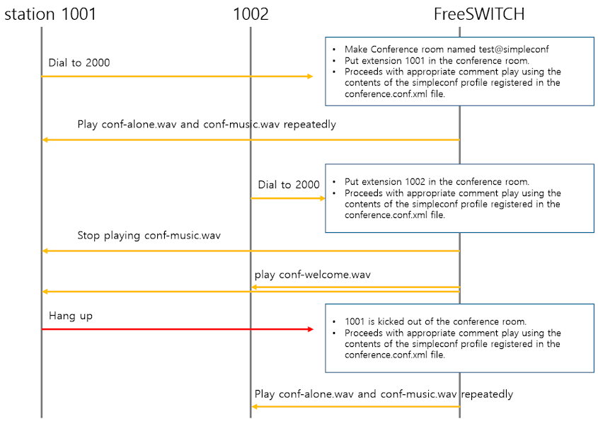

# Very Simple Voice Conference Example

__This document is applicable to FreeSWITCH 1.6 or higher. We recommend using 1.10 if possible.__

<br>

## Prerequisites

<br>

* [mod_conference](https://github.com/raspberry-pi-maker/VoIP-related-codes/tree/main/FreeSWITCH/mod_conference/mod_conference.md). 

<br>

## Pre-prepared sound files
<br>
The following files are audio files to be used for conference testing. Create and prepare these audio files with appropriate content in advance and save them in the /usr/local/freeswitch/sounds/conference .

<br>

|File Name|Description|Position in concerence.conf.xml|
|------|---|---|
|conf-alone.wav|File to play if you are alone in the conference. This file is heard by all participants in the conference room.|`<param name="alone-sound" value="conference/conf-alone.wav"/>`|
|conf-exit.wav|File to play when you leave the conference. This file is heard by all participants in the conference room except the devic that ended the call. |`<param name="exit-sound" value="conference/conf-exit.wav"/>`|
|conf-music.wav|File to play when you're alone|`<param name="moh-sound" value="conference/conf-music.wav"/>`|
|conf-muted.wav|File to play to acknowledge muted|`<param name="muted-sound" value="conference/conf-muted.wav"/>`|
|conf-unmuted.wav|File to play to acknowledge unmuted|`<param name="unmuted-sound" value="conference/conf-unmuted.wav"/>`|
|conf-pin.wav|File to play to prompt for a pin|`<param name="pin-sound" value="conference/conf-pin.wav"/>`|
|conf-bad-pin.wav|File to play to when the pin is invalid|`<param name="bad-pin-sound" value="conference/conf-bad-pin.wav"/>`|
|conf-welcome.wav|File to play when you join the conference. No play for first participant|`<param name="enter-sound" value="conference/conf-welcome.wav"/>`|
|conf-kicked.wav|File to play when you are ejected from the conference|`<param name="kicked-sound" value="conference/conf-kicked.wav"/>`|
||||

<br>

## Simple Conference Scenario
<br>
Below is a flowchart of the simple conference room I am trying to create. 

Only two devices will participate in the conference. 
* If the first extension 1001 dials 2000, FreeSWITCH will create a conference room and invite 1001 to join the conference room. Since 1001 is the first participant, 1001 will hear an announcement (alone-sound) informing 1001 that 1001 are currently alone. Then, 1001 will hear the waiting music repeatedly until the next participant enters.

* When the second participant 1002 calls number 2000, he or she will hear an enter-sound indicating participation in the conference room. And since two people participated in the conference room, the conference room is activated and the two participants can have a meeting. And the waiting music that 1001 was listening to will also end.

* when the meeting is over, 1001 ends the call first and leaves. Then, since 1002 will be left alone, you will hear a message (alone-sound) informing you that you are alone. Then, you will hear the waiting music repeatedly until the next participant enters. In this state, when 1002 ends the call, the conference room also disappears.

<br>




<br>

## Configuration
<br>
The following are FreeSWITCH settings created for this scenario.

<br>

### conf/autoload_configs/conference.conf.xml

```xml
    <profile name="simpleconf">
      <!-- Domain (for presence) -->
      <param name="domain" value="$${domain}"/>
      <!-- Sample Rate-->
      <param name="rate" value="8000"/>
      <!-- Number of milliseconds per frame -->
      <param name="interval" value="20"/>
      <!-- Energy level required for audio to be sent to the other users -->
      <param name="energy-level" value="100"/>
      <param name="muted-sound" value="conference/conf-muted.wav"/>
      <!-- File to play to acknowledge unmuted -->
      <param name="unmuted-sound" value="conference/conf-unmuted.wav"/>
      <!-- File to play if you are alone in the conference -->
      <param name="alone-sound" value="conference/conf-alone.wav"/>
      <!-- File to play when you're alone (music on hold)-->
      <param name="moh-sound" value="conference/conf-music.wav"/>
      <!-- File to play when you join the conference -->
      <param name="enter-sound" value="conference/conf-welcome.wav"/>
      <!-- File to play when you leave the conference -->
      <param name="exit-sound" value="tone_stream://%(500,0,300,200,100,50,25)"/>
      <!-- File to play when you are ejected from the conference -->
      <param name="kicked-sound" value="conference/conf-kicked.wav"/>
      <!-- File to play to prompt for a pin -->
      <param name="pin-sound" value="conference/conf-pin.wav"/>
      <!-- File to play to when the pin is invalid -->
      <param name="bad-pin-sound" value="conference/conf-bad-pin.wav"/>
      <param name="caller-id-name" value="$${outbound_caller_name}"/>
      <!-- Default Caller ID Number for outbound calls -->
      <param name="caller-id-number" value="$${outbound_caller_id}"/>
      <param name="comfort-noise" value="true"/>
    </profile>
```

<br>

### conf/dialplan/default.xml

```xml
    <extension name="SIMPLE_CONFERENCE">
        <condition field="destination_number" expression="^(2000)$">
            <action application="log" data="ALERT ==== Simple Conference CALL From ${caller_id_number}======"/>
            <action application="set" data="continue_on_fail=true"/>
            <!--<action application="answer"/>-->
            <action application="conference" data="test@simpleconf"/>
        </condition>
    </extension>
```


<br>

### conf/directory/default/station.xml

```xml
<include>
  <user id="1001">
    <params>
      <param name="password" value="$${default_password}"/>
    </params>
    <variables>
      <variable name="accountcode" value="1001"/>
      <variable name="user_context" value="default"/>
      <variable name="effective_caller_id_name" value="Extension 1001"/>
      <variable name="effective_caller_id_number" value="1001"/>
      <variable name="outbound_caller_id_name" value="$${outbound_caller_name}"/>
      <variable name="outbound_caller_id_number" value="$${outbound_caller_id}"/>
    </variables>
  </user>
  <user id="1002">
    <params>
      <param name="password" value="$${default_password}"/>
    </params>
    <variables>
      <variable name="accountcode" value="1002"/>
      <variable name="user_context" value="default"/>
      <variable name="effective_caller_id_name" value="Extension 1002"/>
      <variable name="effective_caller_id_number" value="1001"/>
      <variable name="outbound_caller_id_name" value="$${outbound_caller_name}"/>
      <variable name="outbound_caller_id_number" value="$${outbound_caller_id}"/>
    </variables>
  </user>
</include>
```
<br><br>


# Very Simple Voice Conference Example2

This time I will add only a few features.

* __Secure conference using PIN input__
* __Activate mute functionality__

<br>

Adding these features is very simple. All you have to do is add a little something to your dialplan, like this:

<br>

```xml
    <extension name="SIMPLE_CONFERENCE2">
        <condition field="destination_number" expression="^(2001)$">
            <action application="log" data="ALERT ==== Simple Conference2 CALL From ${caller_id_number}======"/>
	    <action application="set" data="continue_on_fail=true"/>
            <!--<action application="answer"/>-->
            <action application="conference" data="test@simpleconf+7536+flags{mute}"/>
        </condition>
    </extension>
```
<br>
`+7536+flags{mute}`  was added after the conference name. Just add the PIN value after the first + and the flags value after the second +.

If you want to add two or more flags, do the following:

```xml
<action application="conference" data="confname[@profile][+flags{mute|deaf|...}]">
```
<br>
The types of flag values are well explained at https://developer.signalwire.com/freeswitch/FreeSWITCH-Explained/Modules/mod_conference_3965534/.

<br>
The voice file related to PIN processing has already been added to the conference.conf.xml file. Now, when you call number 2001, you will hear a voice asking you to enter the PIN value. If you enter the correct PIN value, you can enter the conference room. If you enter the wrong PIN value, you can retry 3 times. The number of retries is defined as follows.

<br>

```xml
<param name="pin-retries" value="3"/>
```
<br>

The default value is 3, so there is no need to add it if you use the default value of 3.

And if you press 0 after entering the conference room, the status will change to mute or unmute and the audio files (conf-muted.wav, conf-unmuted.wav) will be played.


<br><br>


# Very Simple Voice Conference Example2 using lua script

This time I will implement above dialplan in lua.

<br>

In dialplan, simply call simple_conference.lua.

```xml
    <extension name="SIMPLE_CONFERENCE2">
        <condition field="destination_number" expression="^(2002)$">
            <action application="log" data="ALERT ==== Simple Conference2 CALL From ${caller_id_number}======"/>
	    <action application="set" data="continue_on_fail=true"/>
            <action application="lua" data="simple_conference.lua"/>
        </condition>
    </extension>
```

<br>

This is the simple_conference.lua. Using a lua script, the PIN value can be dynamically read from the database, and the conference room can also be dynamically selected, allowing for a much more flexible conference implementation.

```lua
ani = session:getVariable("ani")
dnis = session:getVariable("destination_number") 

freeswitch.consoleLog("NOTICE", string.format("Conference Call from [%s] to [%s]\n", ani, dnis))
session:execute("ring_ready")
session:sleep(500) 
session:answer()

--test@simpleconf+7536+flags{mute}
conf_num = "test"
conf_profile = "simpleconf"
pin = "7536"
flags = "mute"
session:execute("conference", string.format("%s@%s+%s+flags{%s}", conf_num, conf_profile, pin, flags))
```

<br><br>


# Wrapping up
I created a very simple conference room and learned the basic operations. Generally, a conference is based on the participation of three or more people. In the next example, I will create a conference example with a slightly more elaborate scenario.