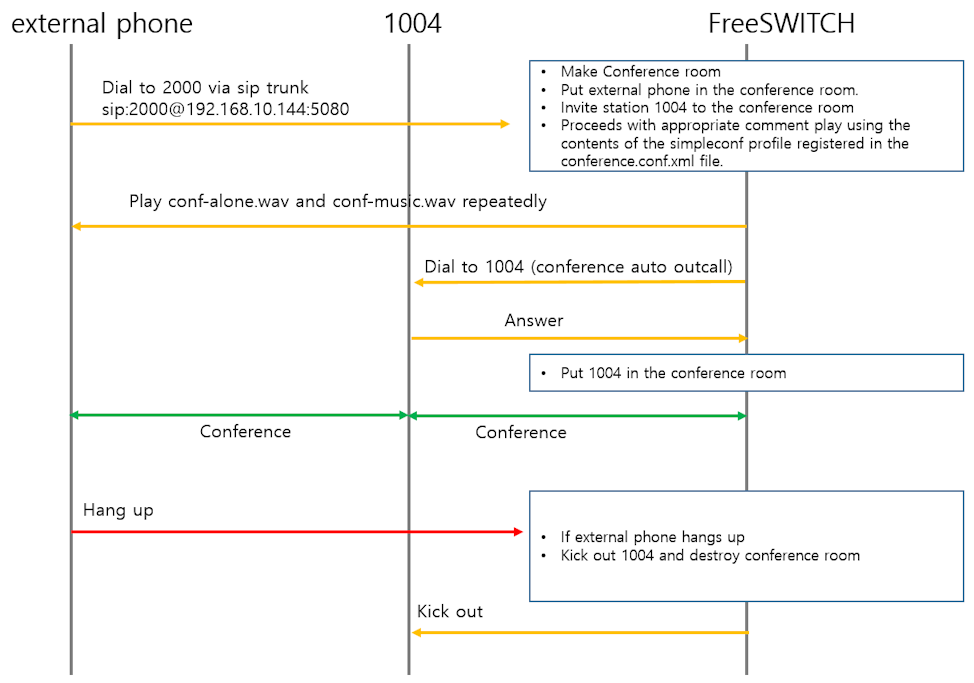

# Voice Conference with Inviting Example

__This document is applicable to FreeSWITCH 1.6 or higher. We recommend using 1.10 if possible.__

<br>

## Prerequisites

<br>

* [mod_conference](https://github.com/raspberry-pi-maker/VoIP-related-codes/tree/main/FreeSWITCH/mod_conference/mod_conference.md). 
* [Very Simple Voice Conference Examples](https://github.com/raspberry-pi-maker/VoIP-related-codes/tree/main/FreeSWITCH/mod_conference/voice_conference_example.md). 

<br>

In [Very Simple Voice Conference Examples](https://github.com/raspberry-pi-maker/VoIP-related-codes/tree/main/FreeSWITCH/mod_conference/voice_conference_example.md), we looked at an example of entering a conference room by calling from two extensions.

In this example, a conference is not created until a call is made from a different extension and the conference room is entered. This time, when a call is received through the SIP Trunk, the Sip Trunk call is entered into the conference room and an outbound call is attempted to the extension phone. This is an example of entering a conference room when an extension answers a call. 

<br>



<br>


## conference.conf.xml

<br>

For video conferencing, you need to add a few video-related configurations to the settings of conference.conf.xml used in existing audio conferences. This time we will create a scenario using a lua script.

<br>


```xml
    <profile name="simpleconf2">
      <!-- Domain (for presence) -->
      <param name="domain" value="$${domain}"/>
      <!-- Sample Rate-->
      <param name="rate" value="8000"/>
      <!-- Number of milliseconds per frame -->
      <param name="interval" value="20"/>
      <!-- Energy level required for audio to be sent to the other users -->
      <param name="energy-level" value="100"/>
      <param name="muted-sound" value="conference/conf-muted.wav"/>
      <!-- File to play to acknowledge unmuted -->
      <param name="unmuted-sound" value="conference/conf-unmuted.wav"/>
      <!-- File to play if you are alone in the conference -->
      <param name="alone-sound" value="conference/conf-alone.wav"/>
       <!-- File to play when you're alone (music on hold)-->
      <param name="moh-sound" value="conference/conf-music.wav"/>
      <!-- File to play when you join the conference -->
      <!--<param name="enter-sound" value="tone_stream://%(200,0,500,600,700)"/>-->
      <param name="enter-sound" value="conference/conf-welcome.wav"/>
      <!-- File to play when you leave the conference -->
      <param name="exit-sound" value="conference/conf-exit.wav"/>
      <!-- File to play when you are ejected from the conference -->
      <param name="kicked-sound" value="conference/conf-kicked.wav"/>
      <!-- File to play to prompt for a pin -->
      <param name="pin-sound" value="conference/conf-pin.wav"/>
      <!-- File to play to when the pin is invalid -->
      <param name="bad-pin-sound" value="conference/conf-bad-pin.wav"/>
      <!-- Default Caller ID Name for outbound calls -->
      <param name="caller-id-name" value="$${outbound_caller_name}"/>
      <!-- Default Caller ID Number for outbound calls -->
      <param name="caller-id-number" value="$${outbound_caller_id}"/>
      <!-- enable comfort noise generation -->
      <param name="comfort-noise" value="true"/>
      <param name="auto-record" value="/usr/local/freeswitch/recordings/${strftime(%Y/%m/%d)}/${conference_name}_${strftime(%Y%m%d%H%M%S)}.mp3"/>
    </profile>
```
<br>

## external dialplan

```xml
    <extension name="AUDIO_CONFERENCE">
        <condition field="destination_number" expression="^(2001)$">
            <action application="log" data="ALERT ==== Simple Trunk Audio Conference CALL From ${caller_id_number}======"/>
            <action application="set" data="continue_on_fail=true"/>
            <action application="lua" data="simple_voice_trunk_conference.lua"/>
        </condition>
    </extension>
```
<br>

## simple_voice_trunk_conference.lua

<br>

```lua
-- FreeSWITCH api
fs_api = freeswitch.API()

ani = session:getVariable("ani")
dnis = session:getVariable("destination_number") 

freeswitch.consoleLog("NOTICE", string.format("Simple voice trunk conference => Conference Call from [%s] to [%s]\n", ani, dnis))
session:execute("ring_ready")
session:sleep(500) 
session:answer()

conf_name = "1004"   --station number who I'll invite to the conference room
conf_profile = "simpleconf2"
flags = "mute|hangup"

--Prepare auto outcall
session:execute("set", "conference_auto_outcall_timeout=60")
session:execute("set", "conference_auto_outcall_flags=")  
session:execute("set", "conference_auto_outcall_caller_id_name=" .. ani)
session:execute("set", "conference_auto_outcall_caller_id_number=" .. ani)

--    session:execute("set", "conference_auto_outcall_maxwait=10") 
prefix_string = "{sip_contact_user=" .. ani .. ", answer_delay=0"
prefix_string = prefix_string .. "}"

freeswitch.consoleLog("WARNING", "prifix_string:" .. prefix_string .. "\n")
session:execute("set", "conference_auto_outcall_prefix=" .. prefix_string)

-- Invite station to the conference room "user/1004@$${domain}"
session:execute("conference_set_auto_outcall", "user/" .. conf_name .."@$${domain}")

-- Put the (trunk) caller in the conference room
session:execute("conference", string.format("%s@%s++flags{%s}", conf_name, conf_profile, flags))
freeswitch.consoleLog("NOTICE", "Simple voice trunk conference => End Conference\n")

-- destroy conference
conf_cmd = conf_name .. " kick all"
freeswitch.consoleLog("WARNING", "conference " .. conf_cmd)
fs_api:execute("conference", conf_cmd)

```

<br>

Use conference_set_auto_outcall to have mod_conference call endpoints and join them to a conference bridge. To have it call more than one participant, just repeat the conference_set_auto_outcall action in the dialplan for each destination number or address.


<br>

## conference_set_auto_outcall

<br>

The usage of conference_set_auto_outcall is as follows.

<br>

```xml
<action application="conference_set_auto_outcall" data="dialstring"/>
```

<br>

If you want to bridge to an extension, create a dialstring as follows. The following is an xml that invites 1001 and 1002 to the conference room.

<br>

```xml
<action application="conference_set_auto_outcall" data="user/1000@$${domain}"/>
<action application="conference_set_auto_outcall" data="user/1001@$${domain}"/>
```


<br>

If you want to bridge to an external device(sip trunk), create a dialstring as follows. The following is an xml that calls 12024561000 and invites a conference room. In this case, "gwname" information must exist in conf/sip_profiles.

<br>

```xml
<action application="conference_set_auto_outcall" data="sofia/internal/gateway/gwname/12024561000"/>
```

<br>

Before calling the conference_set_auto_outcall application, set the following parameters in advance.

* conference_auto_outcall_timeout : Originate timeout to use when joining a member to a conference via conference_set_auto_outcall application
* conference_auto_outcall_caller_id_name : Caller ID name to use when dialing endpoints using conference_set_auto_outcall application
* conference_auto_outcall_caller_id_number : In this article, the original caller's phone number was used.
* conference_auto_outcall_prefix : String to prepend to each of the dial-string values set from the conference_auto_outcall application
* conference_auto_outcall_flags : Conference member flags to set for members joining via conference_set_auto_outcall application (use | as separator for multiple flags)


<br>

## test

<br>

Now let's do a test. 

1.  Make a call to sip:2000@domain:5080 from an external phone.
2.  FreeSWITCH executes simple_voice_trunk_conference.lua according to the external dialplan.
3.  The lua script makes an outbound call to extension 1005 requesting attendance in the conference room.
4.  And at the same time, an external phone is placed in the conference room. External calls will probably hear the standby music specified in the profile in conference.conf.xml.
5.  The bell rings at extension 1005. The outcall number will be the value specified as conference_auto_outcall_caller_id_number. When you answer the phone, you are automatically connected to the conference room. A conference room with two participants is now activated.


<br>

# Wrapping up

<br>
Above, only extension 1005 was invited to the conference room, but multiple extensions or national lines 
can also be invited. 

<br>

```lua
-- Invite station to the conference room "user/1004@$${domain}"
session:execute("conference_set_auto_outcall", "user/" .. conf_name .."@$${domain}")
```

<br>

Since the above code does not block, you can invite multiple extensions or trunk lines as follows.

<br>

```lua
-- Invite station to the conference room "user/1004@$${domain}"
session:execute("conference_set_auto_outcall", "user/1004@$${domain}")
session:execute("conference_set_auto_outcall", "user/1005@$${domain}")
session:execute("conference_set_auto_outcall", "user/1006@$${domain}")
```
