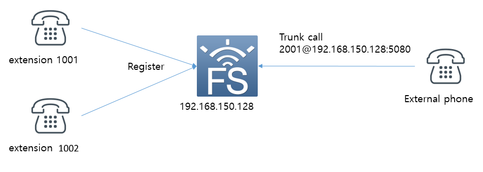
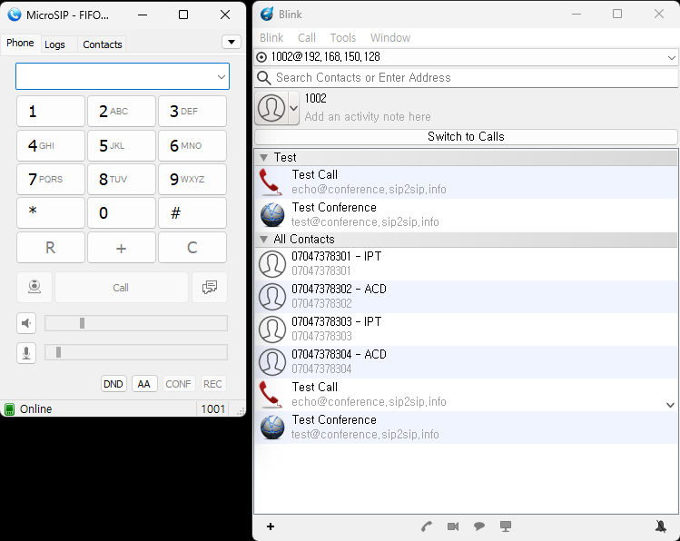
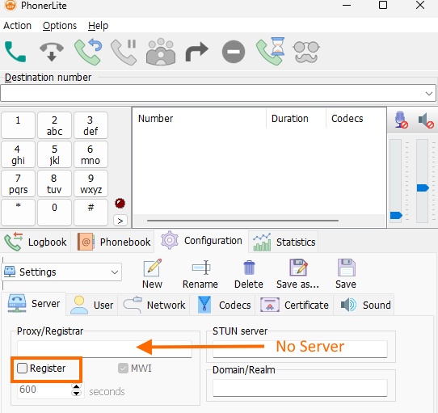

## [1.1.0] - 2026-04-26
### Fixed
- Updated to reflect that there is no difference between the ringall and enterprise methods in the FIFO module's outbound strategies.

<br/><br/><br/>

# Freeswitch Callcenter using mod_fifo

FIFO stands for "First In, First Out". As calls enter the queue, they are arranged in order so that the call that has been in the queue for the longest time will be the first call to get answered. Generally FIFO call queues are used in "first come, first served" call scenarios such as customer service call centers.

An alternative to mod_fifo is mod_callcenter which is more of a traditional ACD application and was contributed by a member of the FreeSWITCH™ community.
However, mod_fifo is sufficient for a simple call center implementation.

The terms used in Freeswitch documentation are slightly different from terms used in general call centers. There are some parts that can be a little confusing, but I will try to use the terms used in general call centers as much as possible.

I will create a test environment for call system implementation as follows.
For reference, there is no agent concept in mod_fifo. The service is implemented using only the extension phone number.<br/><br/>

# Test Environment
<br>
I prepared the following for testing.
Two telephones (1001 and 1002) to be used by agents receiving inbound calls are connected to Freeswitch as extensions. And a separate phone was prepared to serve as a customer. This phone needs to be able to connect to another exchange or make calls to freeswitch directly over a sip trunk. I used the latter.<br/><br/>

<br/><br/>


<br/><br/>

# extension settings
<br>
For extension configuration, add the following two files to the conf/directory/default directory.
The file names were 1001.xml and 1002.xml.<br/><br/>


``` xml
<include>
  <user id="1001">
    <params>
      <param name="password" value="$${default_password}"/>
      <param name="vm-password" value="1001"/>
    </params>
    <variables>
      <variable name="toll_allow" value="domestic,local"/>
      <variable name="accountcode" value="1001"/>
      <variable name="user_context" value="default"/>
      <variable name="effective_caller_id_name" value="Extension 1001"/>
      <variable name="effective_caller_id_number" value="1001"/>
      <variable name="outbound_caller_id_name" value="$${outbound_caller_name}"/>
      <variable name="outbound_caller_id_number" value="$${outbound_caller_id}"/>
    </variables>
  </user>
</include>
```


``` xml
<include>
  <user id="1002">
    <params>
      <param name="password" value="$${default_password}"/>
      <param name="vm-password" value="1002"/>
    </params>
    <variables>
      <variable name="toll_allow" value="domestic,local"/>
      <variable name="accountcode" value="1002"/>
      <variable name="user_context" value="default"/>
      <variable name="effective_caller_id_name" value="Extension 1002"/>
      <variable name="effective_caller_id_number" value="1002"/>
      <variable name="outbound_caller_id_name" value="$${outbound_caller_name}"/>
      <variable name="outbound_caller_id_number" value="$${outbound_caller_id}"/>
    </variables>
  </user>
</include>
```

<br/><br/>
Prepare two phones in advance or prepare two SIP softphones for PC. I used 2 SIP softphones.
The following picture is my softphone screen where I set up an account. I have used Microsip and Blink.
<br><br>

<br/><br/>

You can check registered phones with the show registration command on the fs_cli screen.

<br/><br/>

``` bash
freeswitch@blueivr> show registrations
reg_user,realm,token,url,expires,network_ip,network_port,network_proto,hostname,metadata
1002,192.168.150.128,072332d7b2aa4045babae4f1bd7c9e3a,sofia/internal/sip:42791635@192.168.150.1:58579,1686662097,192.168.150.1,58579,udp,blueivr,
1001,192.168.150.128,08103ee3f88145d8a3ca984addb18662,sofia/internal/sip:1001@192.168.150.1:55232;ob,1686662067,192.168.150.1,55232,udp,blueivr,

2 total.
```

<br><br>

# External Phone
<br>

My favorite softphone for trunk call testing is the PhonerLite. 

<br>

<br/><br/>

Do not enter server information as shown in the picture and do not check Register.  ___However, in User in the next tab, a random value (generally a phone number) must be entered for UserName.___

<br/><br/>


# Freeswitch Settings

<br>

Now for the most important Freeswitch settings. Since the extension setting has been done, set the dialplan first.

<br/>

## Load FIFO module

<br>

First, modify the conf/auto_loads/modules.conf.xml file to load mod_fifo when Freeswitch starts. If xml is commented out, uncomment it.

``` xml
<configuration name="modules.conf" description="Modules">
  <modules>
  
    ......

    <!-- BluebayNetworks -->
    <load module="mod_fifo"/>
  </modules>
</configuration>
```
<br>

## Trunk Call Dialplan

<br>

You first create a dial plan for incoming calls from an external phone (usually a customer's phone).

I set the SIP port used by the internal extension to 5060 and the SIP port for incoming calls to 5080. And the profile name was set to blueivr.  For reference, you can also see that the profile name used by the station is internal and the port is 5060.
__And profile blueivr is set in sip_profiles to use blueivr context and internal to use default context.__

<br/>

``` bash
freeswitch@blueivr> sofia status
                     Name	   Type	                                      Data	State
=================================================================================================
                  blueivr	profile	        sip:mod_sofia@192.168.150.128:5080	RUNNING (0)
              blueivr::GW	gateway	                  sip:voipgw@192.168.150.1	NOREG
          192.168.150.128	  alias	                                  internal	ALIASED
                 internal	profile	        sip:mod_sofia@192.168.150.128:5060	RUNNING (0)
=================================================================================================
2 profiles 1 alias

```

<br/>

Add contents for FIFO test as follows under blueivr context in dialplan directory. This is the dial plan applied to incoming calls to 2XXX. Prepare the voice files used in the dial plan below in advance.  The FIFO queue name can be anything you want. I called it "fifoqueue" for convenience.

<br/>

``` xml
<include>
  <context name="blueivr">

    <!-- ...... -->
    
    <extension name="FIFO_TEST">
	    <condition field="destination_number" expression="^(2000)$">
        <action application="set" data="continue_on_fail=true"/>
        <action application="log" data="ALERT ==== [2000] FIFO TEST START ==== "/>
        <action application="fifo" data="fifoqueue in /$${sounds_dir}/exit-message.wav $${sounds_dir}/music-on-hold.wav"/> 
      </condition>
    </extension>

    <!-- ...... -->

  </context>
</include>
```

<br/>

The above dial plan can be implemented in one scenario using lua script.

<br/>

``` xml
<include>
  <context name="blueivr">
    <!--    ......    -->
    <extension name="FIFO_TEST2">
	    <condition field="destination_number" expression="^(2001)$">
        <action application="set" data="continue_on_fail=true"/>
        <action application="log" data="ALERT ==== [2001] FIFO TEST START ==== "/>
        <action application="lua" data="fifo_test.lua"/> 
      </condition>
    </extension>
    <!--    ......    -->

  </context>
</include>
```
<br/><br/>
And this is lua script.

``` lua
me = session:getVariable("destination_number")
you = session:getVariable("caller_id_number")
g_log_ani = you
g_log_dnis = me

-- log line
function ScenarioLog(strLevel, strLog)
    local sLine = "[" .. g_log_ani .. "][" .. g_log_dnis .. "]" .. strLog
    freeswitch.consoleLog(strLevel, sLine)
end

ScenarioLog("INFO", "Test FIFO Scenario Start\n")
session:answer()
session:execute("fifo", "fifoqueue in /$${sounds_dir}/exit-message.wav $${sounds_dir}/music-on-hold.wav")

```

<br/>

Calls to 2000 or 2001 are placed in a FIFO queue that works as follows:

* __It listens to music-on-hold.wav repeatedly until the agent connects.__
* __When the agent connects, you will hear exit-message.wav.__
* __And the agent is connected.__

<br/><br/>


## fifo.conf.xml

<br/>

mod_fifo has two operating modes depending on the configuration method, and the way the bell rings changes completely depending on which method is selected.

<br/>

### How mod_fifo works

<br/>

There is a significant lack of official documentation regarding how mod_fifo works.
The official website only introduces the Consumer Method (a method where the agent directly calls a specific number to intercept a call in the queue, rather than the system automatically calling the agent).


1. Consumer Method (Picking the Call)

This method allows agents (extensions) to directly call a specific number and "consume" a person waiting in the queue.
How it works: The extensions do not ring even when a call enters the queue.
Situation: When an agent is ready and calls a number with the `fifo <queue_name> out` command set, they are connected to the person who has been waiting the longest in the queue.

<br/>

2. Outbound Strategy (System makes the call)

In this method, when a call enters the queue, it places the call to the extension list (Outbound Nodes) configured with FreeSWITCH. Here, you can determine how the ringing occurs.

| Strategy | Description |
| :--- | :--- |
| **ringall (Simultaneous Ringing)** | The bell rings for all members in the queue **simultaneously**. It connects to the first person to answer. |
| **enterprise (Sequential Ringing)** | The bell rings **one person at a time** in the order of the list. If the first person does not answer, the call is passed to the next member in line. |

<br/>

🚨 **Important Notes**

The Consumer Method requires extension users to constantly monitor the FIFO queue to check if a call has entered the FIFO queue. Since it necessitates the use of display boards or applications to monitor the FIFO queue, it is inconvenient to use in practice. Therefore, most users utilize the Outbound Strategy in FreeSwitch, which makes calls to extensions.


<br/>


📌 **Consumer Method**

<br/>

The **Consumer Method (Pull Method)** is a method where the system does not automatically ring the phone, but rather an agent (Consumer) calls directly to pick up a customer from the queue when they are ready.

To implement this, you must remove the automatic dialing settings from fifo.conf.xml and create a number in the dial plan that allows an agent to pull calls.


```xml
<configuration name="fifo.conf" description="FIFO Configuration">
  <settings>
    <param name="delete-all-outbound-member-on-startup" value="false"/>
  </settings>
  <fifos>
    <fifo name="fifoqueue" importance="0">
      </fifo>
  </fifos>
</configuration>
```

And to pull calls from the FIFO queue, add a dial plan as follows.

```xml
<extension name="pick_up_from_fifo">
  <condition field="destination_number" expression="^7001$">
    <action application="answer"/>
    <action application="fifo" data="fifoqueue out nowait"/>
  </condition>
</extension>
```

<br/>

📌 **Outbound Strategy**

<br/>

If you perform an actual test, you can confirm that the round-robin method is applied in the enterprise mode, rather than the linear method.

* linear method : Incoming FIFO calls are connected according to the extension order registered in the fifo.conf.xml file. The ring sounds starting from the lowest number every time. An excessive number of calls is concentrated on the lower numbers.

* Round Robin: A sequential distribution method where if extensions a, b, and c are registered in that order, FIFO calls are distributed sequentially to a, b, and c.

<br/>


If you want to use the Outbound Strategy strategy, configure it as follows.

Based on my testing,

outbound_strategy="enterprise" or outbound_strategy="ringall" works identically. 
Therefore, it works the same way even if you do not include the above values ​​in the FIFO settings.

<br/>

``` xml
<configuration name="fifo.conf" description="FIFO Configuration">
  <settings>
    <param name="delete-all-outbound-member-on-startup" value="false"/>
  </settings>
  <fifos>
    <fifo name="fifoqueue" importance="0">
      <member timeout="15" simo="1" lag="5">{call_timeout=30,fifo_member_wait=nowait}user/1001@$${domain}</member>
      <member timeout="15" simo="1" lag="5">{call_timeout=30,fifo_member_wait=nowait}user/1002@$${domain}</member>
    </fifo>

  </fifos>
</configuration>
```
<br/><br/>

# If you want to implement linear method call distrbution or ringall method

<br/>

## linear method

<br/>

If you want to chain calls in a specific order using a linear method, you can implement it directly using a dial plan.


```xml
<extension name="FIFO_TEST">
    <condition field="destination_number" expression="^(2001)$">
        <action application="set" data="continue_on_fail=true"/>
        <!-- If any of the dial plans are successfully bridged, the next dial plan is skipped. -->
        <action application="set" data="hangup_after_bridge=true"/>
        <action application="log" data="ALERT ====  SEQUENTIAL CALL START ==== "/>
        
        <action application="bridge" data="{call_timeout=10}user/1001@$${domain}"/>
        <action application="bridge" data="{call_timeout=10}user/1002@$${domain}"/>
        <action application="fifo" data="fifoqueue in"/>
    </condition>
</extension>
```

Attempt to bridge by explicitly fixing the order as shown above.

Attempt to connect to 1001 first; if no connection is established within 10 seconds, attempt to connect to 1002.

If 1002 also fails to connect, enter the FIFO queue and wait.

In this case, you must enter the member value in the FIFO settings like this.

```xml
    <fifo name="fifoqueue" importance="0">
      <member timeout="15" simo="1" lag="5">{call_timeout=30,fifo_member_wait=nowait}user/1001@$${domain}</member>
      <member timeout="15" simo="1" lag="5">{call_timeout=30,fifo_member_wait=nowait}user/1002@$${domain}</member>
    </fifo>
```
<br/>

## ringall method

<br/><br/>

```xml
<extension name="RINGALL_ADVANCED">
    <condition field="destination_number" expression="^(2001)$">
        <action application="set" data="continue_on_fail=true"/>
        <action application="set" data="hangup_after_bridge=true"/>    
        <action application="set" data="ignore_early_media=true"/>
        <action application="set" data="call_timeout=10"/>
        
        <!-- If bridge fails, answer and insert to fifo queue -->
        <action application="bridge" data="user/1001@$${domain},user/1002@$${domain}"/>
        
        <action application="answer"/>
        <action application="sleep" data="1000"/>
        <action application="fifo" data="fifoqueue in"/>
    </condition>
</extension>
```

<br/><br/>

# Wrapping up

<br/>

```bash
FreeSWITCH (Version 1.10.13-dev git 0e02cd4 2024-08-03 15:43:34Z 64bit) is ready
```

At least in the 1.10.13 version I am using, the ringall feature, which rings all phones, does not work.

__It operates in only two ways:__

* Consumer Method: A method where calls waiting in the FIFO queue are pulled from an extension.

* Outbound Strategy: A method where calls are distributed to FIFO member extensions in a round-robin fashion, regardless of ringall or enterprise settings.


Although ringall and linear call distribution methods do not work in FIFO, they can be easily implemented in a dial plan.
In fact, the round-robin call distribution method provided by FIFO is generally a more useful approach.
Depending on your needs, you can choose between the round-robin method provided by FIFO or a method where an extension picks up a FIFO waiting number.
Alternatively, you can directly create ringall and linear call distribution methods within the dial plan.

