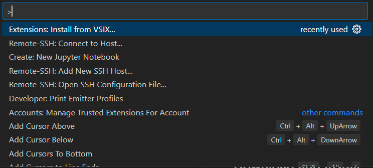
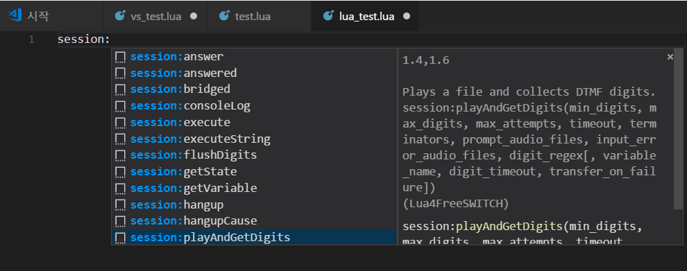
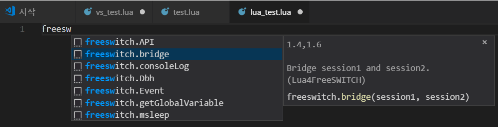
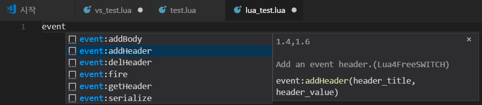
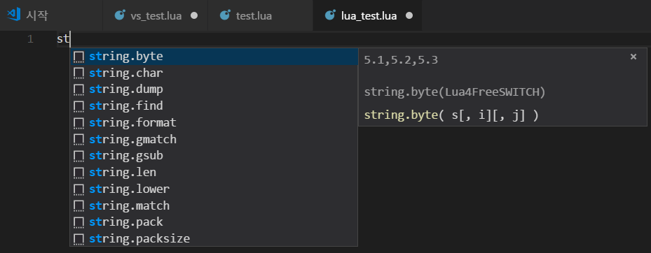

# VSCode extension for Freeswitch Lua script

This extension was made by a fellow developer around 2018. I used it a lot in the beginning, but forgot about it for a while. I remembered this extension by chance, so I am releasing it. I hope it will be helpful to those who develop lua scripts for Freeswitch in VSCode.

 

## Download and Install

First, download the following extension.
* [Lua4FreeSWITCH-0.0.3.vsix](https://github.com/raspberry-pi-maker/VoIP-related-codes/blob/main/FreeSWITCH/tools/Lua4FreeSWITCH-0.0.3.vsix). 

 
You can install them all at once by pressing Ctrl(cmd)+Shift+P, selecting "Install from VSIX..." from the command palette, and then selecting the downloaded vsix file.

 

  

 

## Functions

 

### session object auto complete

 

  

 

### freeswitch object auto complete

 

  

 

### event object auto complete

 

  

 

### Lua basic grammar support (math/string, etc.)

 

  

 

### Happy Programming!