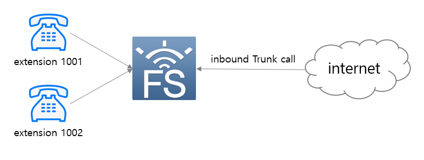
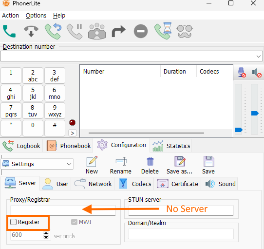
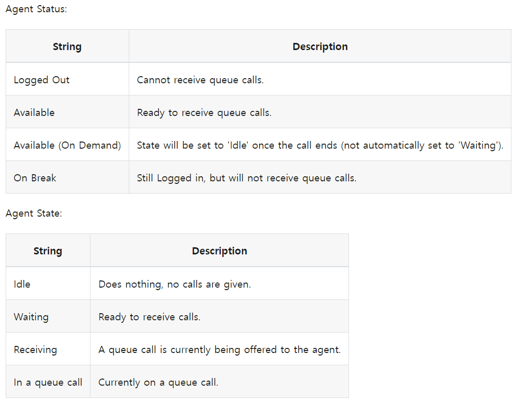

# Freeswitch Callcenter using mod_callcenter

A detailed description of mod_callcenter can be found in [mod_callcenter](https://developer.signalwire.com/freeswitch/FreeSWITCH-Explained/Modules/mod_callcenter_1049389/#ring-progressively-delay). 
Please be sure to read this article.

The modules for call distribution in Freeswitch include mod_callcenter and mod_fifo.
However, mod_fifo has several problems when applied to call centers.
The biggest problem is that in call distribution, calls are distributed in order from the caller's perspective, but the call distribution from the agent's perspective is not.

A typical call center uses a routing strategy that distributes inbound calls to agents as evenly as possible.
However, mod_fifo rings all extension phones subscribed to the fifo queue at the same time. This call distribution method is not suitable for call centers.

There are several advantages to using mod_callcenter to properly distribute calls to agents.

I will create a test environment for call center implementation as follows.

<br/>


# Test Environment
<br>
I prepared the following for testing.
Four telephones (1001 and,1002) to be used by agents receiving inbound calls are connected to Freeswitch as extensions. 
And for inbound calls, Internet telephony calls provided by telecommunication companies were used.

<br/><br/>


<br/>

# extension settings
<br>
For extension configuration, add the following two files to the conf/directory/default directory.
The file names were 1001.xml and 1002.xml.<br/><br/>


``` xml
<include>
  <user id="1001">
    <params>
      <param name="password" value="$${default_password}"/>
      <param name="vm-password" value="1001"/>
    </params>
    <variables>
      <variable name="toll_allow" value="domestic,local"/>
      <variable name="accountcode" value="1001"/>
      <variable name="user_context" value="default"/>
      <variable name="effective_caller_id_name" value="Extension 1001"/>
      <variable name="effective_caller_id_number" value="1001"/>
      <variable name="outbound_caller_id_name" value="$${outbound_caller_name}"/>
      <variable name="outbound_caller_id_number" value="$${outbound_caller_id}"/>
    </variables>
  </user>
</include>
```
``` xml
<include>
  <user id="1002">
    <params>
      <param name="password" value="$${default_password}"/>
      <param name="vm-password" value="1002"/>
    </params>
    <variables>
      <variable name="toll_allow" value="domestic,local"/>
      <variable name="accountcode" value="1002"/>
      <variable name="user_context" value="default"/>
      <variable name="effective_caller_id_name" value="Extension 1002"/>
      <variable name="effective_caller_id_number" value="1002"/>
      <variable name="outbound_caller_id_name" value="$${outbound_caller_name}"/>
      <variable name="outbound_caller_id_number" value="$${outbound_caller_id}"/>
    </variables>
  </user>
</include>
```

<br/><br/>
Prepare two phones in advance or prepare two SIP softphones for PC. I used 2 SIP softphones.
The following picture is my softphone screen where I set up an account. I have used Microsip and Blink.
<br><br>

<br/><br/>

You can check registered phones with the show registration command on the fs_cli screen.

<br/><br/>

``` bash
freeswitch@blueivr> show registrations
reg_user,realm,token,url,expires,network_ip,network_port,network_proto,hostname,metadata
1002,192.168.150.128,072332d7b2aa4045babae4f1bd7c9e3a,sofia/internal/sip:42791635@192.168.150.1:58579,1686662097,192.168.150.1,58579,udp,blueivr,
1001,192.168.150.128,08103ee3f88145d8a3ca984addb18662,sofia/internal/sip:1001@192.168.150.1:55232;ob,1686662067,192.168.150.1,55232,udp,blueivr,

2 total.
```
<br><br>

# Trunk Setting
<br>

My favorite softphone for trunk call testing is the PhonerLite. 

<br>

<br/><br/>

Do not enter server information as shown in the picture and do not check Register. ___However, in User in the next tab, a random value (generally a phone number) must be entered for UserName.___

<br/><br/>


# Freeswitch Settings
<br><br>

Now for the most important Freeswitch settings. Since the extension setting has been done in advance, set the dialplan first.

<br/><br/>

## callcenter module load

<br>

First, modify the conf/auto_loads/modules.conf.xml file to load mod_callcenter when Freeswitch starts. If xml is commented out, uncomment it.

``` xml
<configuration name="modules.conf" description="Modules">
  <modules>
  
    ......

    <!-- BluebayNetworks -->
  <load module="mod_callcenter"/>
  </modules>
</configuration>

```
<br>


## __Trunk Call Dialplan__

<br>

You first create a dial plan for incoming calls from an external phone (usually a customer's phone).
I set the SIP port used by the internal extension to 5060 and the SIP port for incoming calls to 5080. And the profile name was set to blueivr.  For reference, you can also see that the profile name used by the station is internal and the port is 5060.
__And profile blueivr is set in sip_profiles to use blueivr context and internal to use default context.__
Now, when you call 3000 from your PhonerLite softphone, callcenter.lua will run.

<br/><br/>

``` bash
freeswitch@blueivr> sofia status
                     Name	   Type	                                      Data	State
=================================================================================================
                  blueivr	profile	        sip:mod_sofia@192.168.150.128:5080	RUNNING (0)
              blueivr::GW	gateway	                  sip:voipgw@192.168.150.1	NOREG
          192.168.150.128	  alias	                                  internal	ALIASED
                 internal	profile	        sip:mod_sofia@192.168.150.128:5060	RUNNING (0)
=================================================================================================
2 profiles 1 alias

```

<br/><br/>

Add contents for mod_callcenter test as follows under blueivr context in dialplan directory. This is the dial plan applied to incoming calls to 2XXX. Prepare the voice files used in the dial plan below in advance.  
I decided to implement it using a Lua script named "callcenter.lua". 

<br/><br/>

``` xml
<include>
  <context name="blueivr">

    ......
    
    <extension name="Callcenter_TEST">
	    <condition field="destination_number" expression="^(3000)$">
        <action application="set" data="continue_on_fail=true"/>
        <action application="log" data="ALERT ==== [3000] mod_callcenter TEST START ==== "/>
        <action application="lua" data="callcenter.lua"/> 
      </condition>
    </extension>

    ......

  </context>
</include>
```
<br/>

This is the lua file. It's very simple. All calls made to number 3000 are forwarded to the call center queue with the name of the called number (3000).

``` lua
fs_api = freeswitch.API();
g_log_ani = session:getVariable("caller_id_number")
g_log_dnis = session:getVariable("destination_number")

function ScenarioLog(strLevel, strLog)
        local sLine = "[" .. g_log_ani .. "][" .. g_log_dnis .. "]" .. strLog
        freeswitch.consoleLog(strLevel, sLine)
end

local queue = g_log_dnis
ScenarioLog("INFO", "Test Call center Scenario Start Queue:" ..queue .."\n")
session:execute("set", "caller_id_name=" ..queue)
session:execute("callcenter", queue .."@default")
ScenarioLog("INFO", "Test Call center Scenario End \n")

```
<br/>

Now it's time to look at the "3000@default" queue. This value is defined in the conf/autoloads/callcenter.conf.xml file.
There are three important items:
They are queue, agent, and tier.
A queue is a place where incoming customer calls are temporarily parked to distribute them to counselors.
agent is information about the agent to whom the call will be connected according to the routing rules used in the queue.
And tier is information that connects the queue and agent and defines which queue the agent belongs to.

``` xml
<configuration name="callcenter.conf" description="CallCenter">
    <settings>
    <!-- If you want to use another database instead of sqlite3, which freeswitch uses by default, add ODBC DSN information in this part. -->
    </settings>
    <!-- https://www.thenoccave.com/2011/10/freeswitch-queues-with-mod_callcenter/ -->
    <queues>
        <queue name="3000@default">
            <param name="strategy" value="round-robin"/>
            <param name="moh-sound" value="$${sounds_dir}/ivr/common/music-on-hold.wav"/>
            <param name="time-base-score" value="system"/>
            <param name="max-wait-time" value="0"/>
            <param name="max-wait-time-with-no-agent" value="0"/>
            <param name="max-wait-time-with-no-agent-time-reached" value="20"/>
            <param name="tier-rules-apply" value="false"/>
            <param name="tier-rule-wait-second" value="300"/>
            <param name="tier-rule-wait-multiply-level" value="true"/>
            <param name="tier-rule-no-agent-no-wait" value="false"/>
            <param name="discard-abandoned-after" value="60"/>
            <param name="abandoned-resume-allowed" value="false"/>
        </queue>
    </queues>
    
    <agents>
        <agent name="1001" type="callback" contact="[call_timeout=60]user/1001" status="Logged Out" max-no-answer="3" wrap-up-time="10" reject-delay-time="30" busy-delay-time="60" no-answer-delay-time="10" />
        <agent name="1002" type="callback" contact="[call_timeout=60]user/1002" status="Logged Out" max-no-answer="3" wrap-up-time="10" reject-delay-time="30" busy-delay-time="60" no-answer-delay-time="10" />
    </agents>    
    
    <tiers>
        <tier agent="1001" queue="3000@default" level="1" position="1"/>
        <tier agent="1002" queue="3000@default" level="1" position="1"/>
    </tiers>    
</configuration>
```

<br><br>

# Agent Login , Log out

In a call center system, an agent goes through a login process to receive a call from the call center queue. And if you no longer want to receive calls from the call center queue, log out.
Freeswitch defines these values as follows.

<br/>

As you can see from the table above, if you change the status to "Available/Waiting" or "Available (On Demand)/Waiting", you will be able to receive calls coming into the call center queue.

“On Break” is mainly used when leaving the office for a while, and “Logged Out” is used when completely ending consulting work.
“Available (On Demand)” changes “state” to “idle” when a phone call entered into the call center queue is terminated. In the "idle" state, you will no longer receive call center calls. You must manually change it back to “Waiting”.
This value is mainly used when the finalization process is long after the call center call ends.

There are two ways for agents to log in and out of the call center system. This method uses ESL commands or dial plans.
Create a dial plan that allows agents to log in and out of the call center system as follows.

``` xml
    <!-- Log Out of the Call Queues -->
    <extension name="agent_login">
        <condition field="destination_number" expression="^300$">
            <action application="log" data="INFO Add Call center agent"/>
            <action application="set" data="continue_on_fail=true"/>
            <action application="set" data="res=${callcenter_config(agent set status ${caller_id_number} 'Available')}" />
            <action application="answer" data=""/>
            <action application="sleep" data="500"/>
            <action application="playback" data="$${sounds_dir}/ivr/common/ivr-you_are_now_logged_in.wav"/>
            <action application="hangup" data="NORMAL_CLEARING"/>
        </condition>
    </extension>

    <!-- Log Into the Call Queues -->
    <extension name="agent_logoff">
        <condition field="destination_number" expression="^301$">
            <action application="log" data="INFO Delete Call center agent"/>
            <action application="set" data="continue_on_fail=true"/>
            <action application="set" data="res=${callcenter_config(agent set status ${caller_id_number} 'Logged Out')}" />
            <action application="log" data="INFO Delete Call center agent"/>
            <action application="answer" data=""/>
            <action application="sleep" data="500"/>
            <action application="playback" data="$${sounds_dir}/ivr/common/ivr-you_are_now_logged_out.wav"/>
            <action application="hangup" data=""/>
        </condition>
    </extension>

  </context>

```

<br>
Now, if you call 300 from extension 1001 or 1002, you will be logged into the call center system with a login message.
Likewise, if you call 301, you will be logged out of the call center system with a logout message.

<br><br>


# Test
Test with the following process.
<br/><br/>

* __Restart Freeswitch.__
* __Check if stations 1001 and 1002 are registered in Freeswitch.__
* __Dial 300 from extensions 1001 and 1002. It is normal to listen to the pre-registered comment (ivr-you_are_now_logged_in.wav). Now both stations can receive calls. If successful, you can check agent login with the callcenter-config command as follows.  .__


``` bash
freeswitch@blueivr> callcenter_config agent list
name|instance_id|uuid|type|contact|status|state|max_no_answer|wrap_up_time|reject_delay_time|busy_delay_time|no_answer_delay_time|last_bridge_start|last_bridge_end|last_offered_call|last_status_change|no_answer_count|calls_answered|talk_time|ready_time|external_calls_count
1001|single_box||callback|[call_timeout=60]user/1001|Available|Waiting|3|10|30|60|10|0|0|0|1694879896|0|0|0|0|0
1002|single_box||callback|[call_timeout=60]user/1002|Available|Waiting|3|10|30|60|10|0|0|0|1694880197|0|0|0|0|0
+OK
```

* __Call 3000@192.168.150.128:5080 from an external phone (PhonerLite). It is normal to hear the sound source (music-on-hold.wav).__
* __It should ring one of the extensions 1001, 1002.__
* __When you answer the call, a call is made between the agent and the customer (external phone).__
* __After ending the call, try making another inbound call to 3000 again.__
* __This time a different phone will ring. This is because we set the strategy of queue "3000" to round robin in the callcenter.conf.xml file.__

* __Dial 1001 to 301. It is normal to listen to the pre-registered comment (ivr-you_are_now_logged_out.wav). Now, 1001 extension is logged out. From now on, extension 1002 can only receive queue "3000" calls.__

<br/><br/>

# Wrapping up
Through the test, it was confirmed that call is distributed in all extension phones participating in queue "3000".

Unlike mod_fifo, mod_callcenter can distribute calls to agents precisely. Therefore, it is better than mod_fifo for use in call centers.
