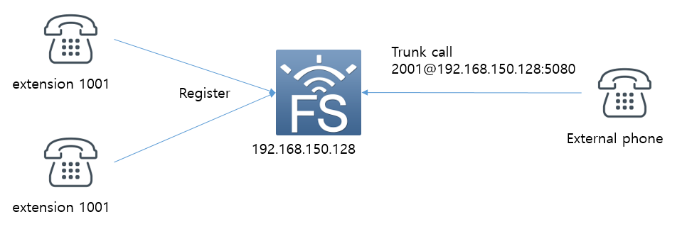
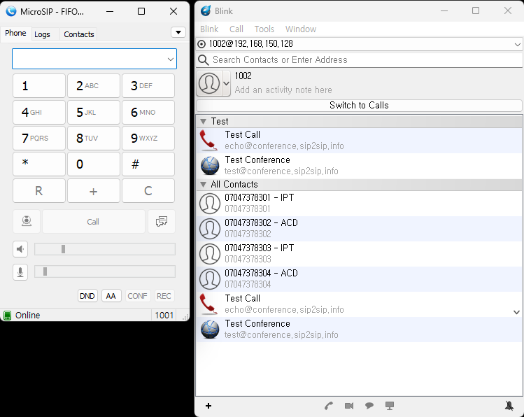
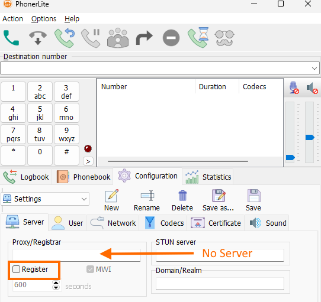

# Freeswitch Callcenter using mod_fifo

Recently, I made a call center using mod_fifo. FIFO stands for "First In, First Out". As calls enter the queue, they are arranged in order so that the call that has been in the queue for the longest time will be the first call to get answered. Generally FIFO call queues are used in "first come, first served" call scenarios such as customer service call centers.

An alternative to mod_fifo is mod_callcenter which is more of a traditional ACD application and was contributed by a member of the FreeSWITCH™ community.
However, mod_fifo is sufficient for a simple call center implementation.

The terms used in Freeswitch documentation are slightly different from terms used in general call centers. There are some parts that can be a little confusing, but I will try to use the terms used in general call centers as much as possible.

I will create a test environment for call center implementation as follows.
For reference, there is no agent concept in mod_fifo. The service is implemented using only the extension phone number.<br/><br/>

## Test Environment
<br>
I prepared the following for testing.
Two telephones (1001 and 1002) to be used by agents receiving inbound calls are connected to Freeswitch as extensions. And a separate phone was prepared to serve as a customer. This phone needs to be able to connect to another exchange or make calls to freeswitch directly over a sip trunk. I used the latter.<br/><br/>

<br/><br/>


<br/><br/>

## extension settings
<br>
For extension configuration, add the following two files to the conf/directory/default directory.
The file names were 1001.xml and 1002.xml.<br/><br/>


``` xml
<include>
  <user id="1001">
    <params>
      <param name="password" value="$${default_password}"/>
      <param name="vm-password" value="1001"/>
    </params>
    <variables>
      <variable name="toll_allow" value="domestic,local"/>
      <variable name="accountcode" value="1001"/>
      <variable name="user_context" value="default"/>
      <variable name="effective_caller_id_name" value="Extension 1001"/>
      <variable name="effective_caller_id_number" value="1001"/>
      <variable name="outbound_caller_id_name" value="$${outbound_caller_name}"/>
      <variable name="outbound_caller_id_number" value="$${outbound_caller_id}"/>
      <variable name="callgroup" value="techsupport"/>
    </variables>
  </user>
</include>
```


``` xml
<include>
  <user id="1002">
    <params>
      <param name="password" value="$${default_password}"/>
      <param name="vm-password" value="1002"/>
    </params>
    <variables>
      <variable name="toll_allow" value="domestic,local"/>
      <variable name="accountcode" value="1002"/>
      <variable name="user_context" value="default"/>
      <variable name="effective_caller_id_name" value="Extension 1002"/>
      <variable name="effective_caller_id_number" value="1002"/>
      <variable name="outbound_caller_id_name" value="$${outbound_caller_name}"/>
      <variable name="outbound_caller_id_number" value="$${outbound_caller_id}"/>
      <variable name="callgroup" value="techsupport"/>
    </variables>
  </user>
</include>
```

<br/><br/>
Prepare two phones in advance or prepare two SIP softphones for PC. I used 2 SIP softphones.
The following picture is my softphone screen where I set up an account. I have used Microsip and Blink.
<br><br>

<br/><br/>

You can check registered phones with the show registration command on the fs_cli screen.

<br/><br/>

``` bash
freeswitch@blueivr> show registrations
reg_user,realm,token,url,expires,network_ip,network_port,network_proto,hostname,metadata
1002,192.168.150.128,072332d7b2aa4045babae4f1bd7c9e3a,sofia/internal/sip:42791635@192.168.150.1:58579,1686662097,192.168.150.1,58579,udp,blueivr,
1001,192.168.150.128,08103ee3f88145d8a3ca984addb18662,sofia/internal/sip:1001@192.168.150.1:55232;ob,1686662067,192.168.150.1,55232,udp,blueivr,

2 total.
```


## External Phone
<br><br>

My favorite softphone for trunk call testing is the PhonerLite. 

<br><br>

<br/><br/>

Do not enter server information as shown in the picture and do not check Register. ___However, in User in the next tab, a random value (generally a phone number) must be entered for UserName.___

<br/><br/>


## Freeswitch Settings
<br><br>

Now for the most important Freeswitch settings. Since the extension setting has been done in advance, set the dialplan first.

<br/><br/>

### __Trunk Call Dialplan__

<br>

You first create a dial plan for incoming calls from an external phone (usually a customer's phone).

I set the SIP port used by the internal extension to 5060 and the SIP port for incoming calls to 5080. And the profile name was set to blueivr.  For reference, you can also see that the profile name used by the station is internal and the port is 5060.
__And profile blueivr is set in sip_profiles to use blueivr context and internal to use default context.__

<br/><br/>

``` bash
freeswitch@blueivr> sofia status
                     Name	   Type	                                      Data	State
=================================================================================================
                  blueivr	profile	        sip:mod_sofia@192.168.150.128:5080	RUNNING (0)
              blueivr::GW	gateway	                  sip:voipgw@192.168.150.1	NOREG
          192.168.150.128	  alias	                                  internal	ALIASED
                 internal	profile	        sip:mod_sofia@192.168.150.128:5060	RUNNING (0)
=================================================================================================
2 profiles 1 alias

```

<br/><br/>

Add contents for FIFO test as follows under blueivr context in dialplan directory. This is the dial plan applied to incoming calls to 2XXX. Prepare the voice files used in the dial plan below in advance.  The FIFO queue name can be anything you want. I called it "fifoqueue" for convenience.

<br/><br/>

``` xml
<include>
  <context name="blueivr">

    ......
    
    <extension name="FIFO_TEST">
	    <condition field="destination_number" expression="^(2000)$">
        <action application="set" data="continue_on_fail=true"/>
        <action application="log" data="ALERT ==== [2000] FIFO TEST START ==== "/>
        <action application="fifo" data="fifoqueue in /$${sounds_dir}/exit-message.wav $${sounds_dir}/music-on-hold.wav"/> 
      </condition>
    </extension>

    ......

  </context>
</include>
```

<br/>
The above dial plan can be implemented in one scenario using lua script.
<br/><br/>

``` xml
<include>
  <context name="blueivr">

    ......
    
    <extension name="FIFO_TEST2">
	    <condition field="destination_number" expression="^(2001)$">
        <action application="set" data="continue_on_fail=true"/>
        <action application="log" data="ALERT ==== [2001] FIFO TEST START ==== "/>
        <action application="lua" data="fifo_test.lua"/> 
      </condition>
    </extension>
    ......

  </context>
</include>
```
<br/><br/>
And this is lua script.

``` lua
me = session:getVariable("destination_number")
you = session:getVariable("caller_id_number")
g_log_ani = you
g_log_dnis = me

-- log line
function ScenarioLog(strLevel, strLog)
    local sLine = "[" .. g_log_ani .. "][" .. g_log_dnis .. "]" .. strLog
    freeswitch.consoleLog(strLevel, sLine)
end

ScenarioLog("INFO", "Test FIFO Scenario Start\n")
session:answer()
session:execute("fifo", "fifoqueue in /$${sounds_dir}/exit-message.wav $${sounds_dir}/music-on-hold.wav")

```

<br/><br/>
Calls to 2000 or 2001 are placed in a FIFO queue that works as follows:

* __It listens to music-on-hold.wav repeatedly until the agent connects.__
* __When the agent connects, you will hear exit-message.wav.__
* __And the agent is connected.__

<br/><br/>

### __Extension Dialplan__

<br>

The dial plan for extension calls is for FIFO entry and exit. It can be seen as similar to agent login and out.
If you participate in FIFO, you can receive calls from the FIFO queue. And, if the FIFO queue is exited, calls entered in the FIFO queue cannot be distributed any more.

Instead of the following dial plan, ESL (Event Socket Library) can be used for processing.
I will use 6*X as the number for entering the FIFO and 6#X as the number for exiting the FIFO.
Since the following dial plan will be used in the station, modify the internal context in the dialplan directory. 

<br/><br/>

``` xml
<include>
  <context name="default">

  ......
  
  <extension name="Agent Login">
    <condition field="destination_number" expression="^6\*(\d)">
      <action application="answer"/>
      <action application="set" data="result=${fifo_member(add fifoqueue {fifo_member_wait=nowait}user/${user_name} )"/>
      <!-- use the following line instead if you want to have group_confirm for the agent 
    <action application="set" data="result=${fifo_member(add FIFO$1 {fifo_member_wait=nowait,group_confirm_file=ivr/ivr-accept_reject_voicemail.wav,group_confirm_key=1}user/${user_name} )"/>   
      -->

      <action application="log" data="INFO Add FIFO agent result: ${result}"/>
      <action application="log" data="INFO User Login: fifoqueue User: ${user_name}"/>
      <!-- No error checking, just assuming login went well... -->
      <action application="playback" data="ivr-you_are_now_logged_in.wav"/>
    </condition>
  </extension>

  <!-- Agent logout extension: 6#[0-9] -->
  <extension name="Agent Logout">
    <condition field="destination_number" expression="^6(#|\*\*)(\d)">
      <action application="answer"/>
      <action application="set" data="result=${fifo_member(del fifoqueue {fifo_member_wait=nowait}user/${user_name})}"/>
      <!-- Use this line instead if you are using group_group confirm
       <action application="set" data="result=${fifo_member(del FIFO$2 {fifo_member_wait=nowait,group_confirm_file=ivr/ivr-accept_reject_voicemail.wav,group_confirm_key=1}user/${user_name} )"/>
       -->

      <action application="log" data="INFO Del FIFO agent result: ${result}"/>
      <action application="log" data="INFO User Logout: fifoqueue User: ${user_name}"/>
      <!-- No error checking, just assuming logout went well... -->
      <action application="playback" data="ivr-you_are_now_logged_out.wav"/>
    </condition>
  </extension>

  ......
  
  </context>
</include>
```

<br/><br/>

When an agent dials 6*X from extension numbers 1001 and 1002, the following process is performed. Prepare the ivr-you_are_now_logged_in.wav audio file in advance. 
<br>

* __The extension phone participates in the FIFO queue to receive a call coming into the fifoqueue.__
* __Listen to the announcement ivr-you_are_now_logged_in.wav.__

<br>
When an agent dials 6#X from extension numbers 1001 and 1002, the following process is performed. Prepare the ivr-you_are_now_logged_out.wav audio file in advance.
* __The extension phone leaves in the FIFO queue and can't receive a call coming into the fifoqueue any more.__
* __Listen to the announcement ivr-you_are_now_logged_out.wav.__

<br/><br/>

### __fifo.conf.xml__
<br/><br/>

The two most important tasks remain. First, open the fifo.conf.xml file and create the FIFO queue name "fifoqueue" used in dialplan.
<br/><br/>

``` xml
<configuration name="fifo.conf" description="FIFO Configuration">
  <settings>
    <param name="delete-all-outbound-member-on-startup" value="false"/>
  </settings>
  <fifos>
    <fifo name="fifoqueue@$${domain}" importance="0">
      <!-- <member timeout="60" simo="1" lag="20">{fifo_member_wait=wait}user/1001@$${domain}</member> -->
    </fifo>
    
    <fifo name="cool_fifo@$${domain}" importance="0">
      <!--<member timeout="60" simo="1" lag="20">{member_wait=nowait}user/1005@$${domain}</member>-->
    </fifo>
  </fifos>
</configuration>

```
<br/><br/>

And open the modules.conf.xml file to check whether mod_fifo is used or not. If mod_fifo is commented out or not visible, add it.<br/><br/>


``` xml
<configuration name="modules.conf" description="Modules">
  <modules>
  
    ......

    <!-- BluebayNetworks -->
    <load module="mod_fifo"/>
  </modules>
</configuration>
```
<br/><br/>

## Test 
<br>
Test with the following process.
<br/><br/>

* __Restart Freeswitch.__
* __Check if stations 1001 and 1002 are registered in Freeswitch.__
* __Dial 6*0 from extensions 1001 and 1002. It is normal to listen to the pre-registered comment (ivr-you_are_now_logged_in.wav). Now both stations can receive FIFO calls.__
* __Call 2001@192.168.150.128:5080 from an external phone (PhonerLite). It is normal to hear the sound source (music-on-hold.wav).__
* __It should ring on either 1001 or 1002 extensions.__
* __When the ringing extension receives a call, the sound source (exit-message.wav) is heard from the external phone.__
* __A call is made between the agent and the customer (external phone).__
* __If you repeat the above process, this time the phone that did not ring in front of you will ring. That is, calls are distributed in a round-robin fashion.__
* __Dial 1001 to 6#0. It is normal to listen to the pre-registered comment (ivr-you_are_now_logged_out.wav). Now, one station can receive FIFO calls.__
* __Call 2001@192.168.150.128:5080 from an external phone (PhonerLite). It is normal to hear the sound source (music-on-hold.wav).__
* __From now on, only extension 1002 should ring.__

<br/><br/>
Through the test, it was confirmed that calls were distributed in a round-robin manner to extension phones participating in FIFO.

In fact, an important part of FIFO is to make several calls at the same time and check whether they are connected to the agent in order.
I haven't tested this part due to the lack of an external phone, but I expect it to be.