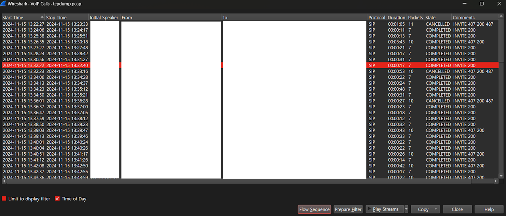
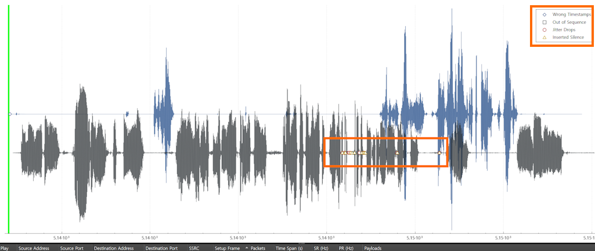
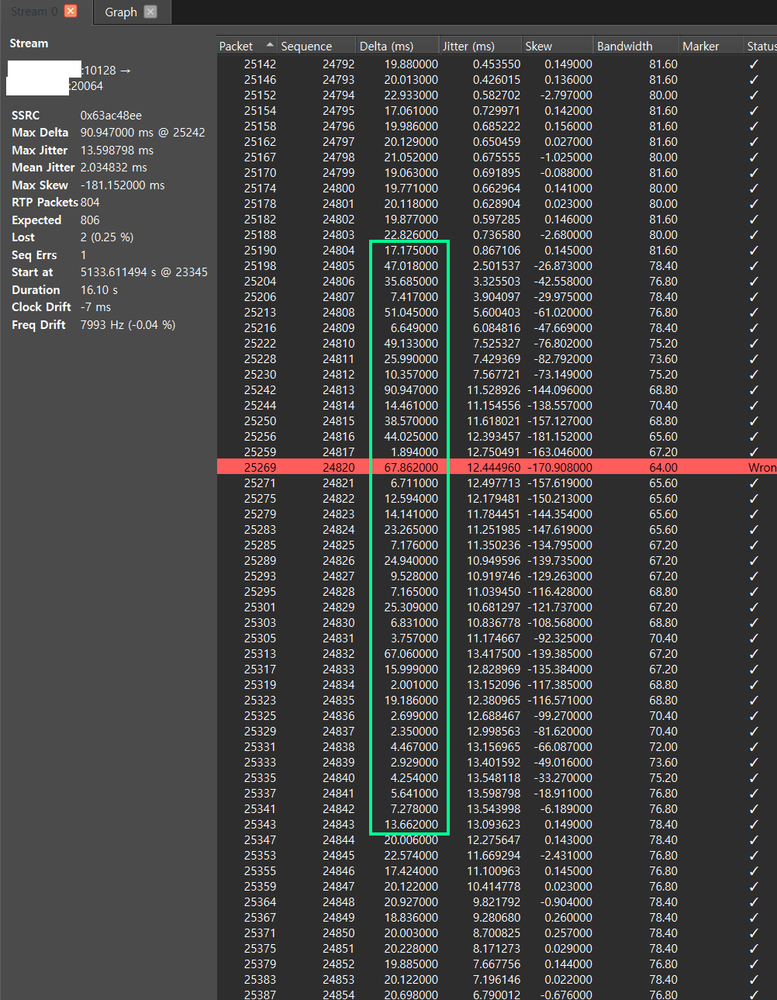
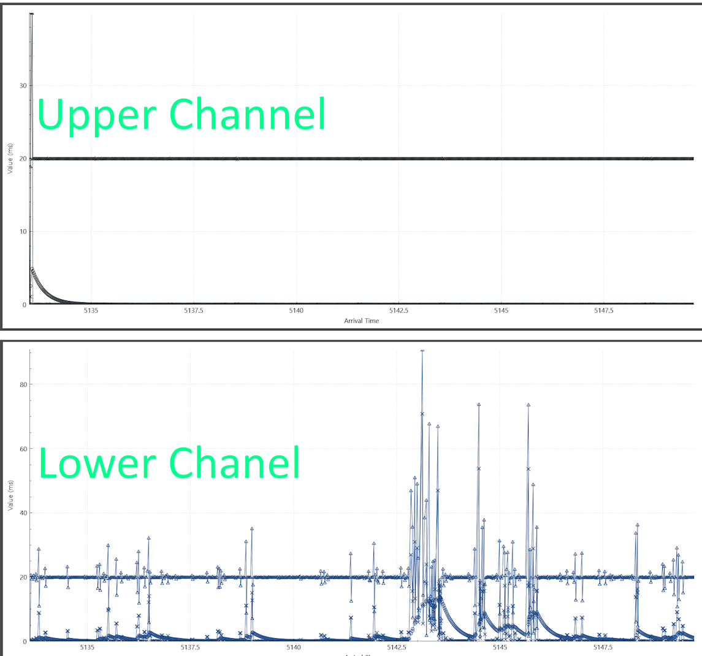

# Call quality Issue

Recently, a client I had a new PBX product for had a call quality issue. The biggest symptom was that the caller’s voice would cut off during the call with a ticking sound like an old LP record. This was a problem that occurred across the entire call center with about 100 seats.
To troubleshoot the problem, I first identified a few phones and captured the communication packets with these phones using the tcpdump command on the IP PBX. Capturing all the packets of an IP PBX is a very dangerous action. If you save all the packets of an IP PBX that generates more than 100 calls at the same time to a file, it can negatively affect the system operation due to excessive disk IO.
<br><br>

## IP Phone Packet Capture

After checking the IP of the three IP phones to be monitored, I captured the packets with the following command. In the case of IP phones, since most of them are SIP signaling and RTP voice packets, it is okay to use only the host filter without a separate filter.

```bash
tcpdump -i eth0 host 192.168.1.1 or host 192.168.1.2 or host 192.168.1.3 -w phones.pcap
 
```

Since I am only capturing packets from 3 phones, the pcap file will not grow very fast. After a few hours of capturing, I downloaded the phone.pcap file to my PC.
<br><br>

## Analyzing the downloaded pcap file

Open the downloaded pcap file on your PC using the WireShark program. Then select Telephony -> VoIP Calls from the menu.


<br/><br/>

* Select the call whose call quality is questionable from the list of VoIP calls.
* Select “Play Streams” from the button below.

<br/>

Below is the "Play Streams" screen for a call where call quality is suspect.


<br/><br/>
One of the two channels is clean, but the lower channel waveform shows areas marked with shapes in the middle.

In the middle of the lower waveform, you can see triangles, squares, and circles in the boxed area. If you refer to the legend explanation, this part means Jitter Drops, Inserted Silence, etc.

Let's check what these values ​​mean and what phenomenon occurred in this part.

### Jitter Drops

VoIP jitter refers to the irregular arrival of data packets during a call, causing disruptions in communication, such as delays, echoing, and audio/video distortions.

RTP voice packets are transmitted at ptime intervals defined in SDP. Typically, this value is 20ms, 30ms, or 40ms. Most VoIP terminals use the 20ms value. If your terminal uses ptime 20ms and uses the G.711 codec, it will transmit and receive 12 bytes of RTP header and 160 bytes of RTP data.

To maintain stable VoIP quality in a jitter environment, terminals use buffering. The reason for buffering RTP packets is simple. In an Ethernet network, RTP packets can be received unstably due to network quality or the terminal not sending RTP packets on time. For this reason, 3 to 5 RTP packets are buffered and then taken out one by one to play voice at an accurate time interval (20ms) or to send it to another SIP device. Therefore, if 3 are buffered, a delay of 0.06 (60ms) seconds occurs. However, since voice packets received through buffering are used, better call quality can be provided.

But what happens if a terminal using a 60ms jitter does not receive an RTP packet for 60ms? In this case, the terminal will consume all 3 packets buffered and either replace them with silent packets or give up consuming them due to a lack of packets to consume in the next 20ms schedule.

When this phenomenon occurs, voice is broken up on the receiving side because accurate voice packet transmission and reception are not performed. This leads to a decline in call quality.

These are called Jitter Drops.
Therefore, if there are any sections where Jitter Drops occur, it is evidence that there is a problem with the VoIP quality.

Select the L line where the Jitter Drops occurred and click "Analyze" on the bottom button.
<br><br>



<br/><br/>

The Delta value in the green box section is far from 20ms. You can see 1ms intervals and 67ms intervals. When packets are sent and received irregularly like this, the jitter phenomenon becomes severe.

<br/><br/>



<br/><br/>


Comparing the upper and lower channels on a graph, the results are as follows. There is no problem at all with RTP transmission and reception in the SIP terminal of the upper channel. However, in the lower channel, severe delays occur frequently due to the jitter phenomenon, and even packet loss occurs.

<br/><br/>

## Conclusion

The channel above the graph is the VoIP trunk channel connected to the telecommunications company.
And the channel below is the channel connected to the phone.
That is, you can see that there is no quality issue in the trunk section of the national line, but there is a quality issue in the connection with the internal phone.

**There are two possible causes for the quality issue.**

* Phone is defective
* Network instability between phone and PBX


