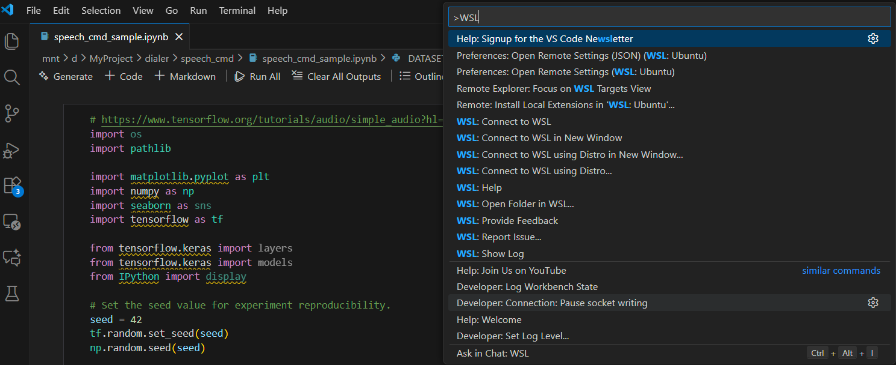
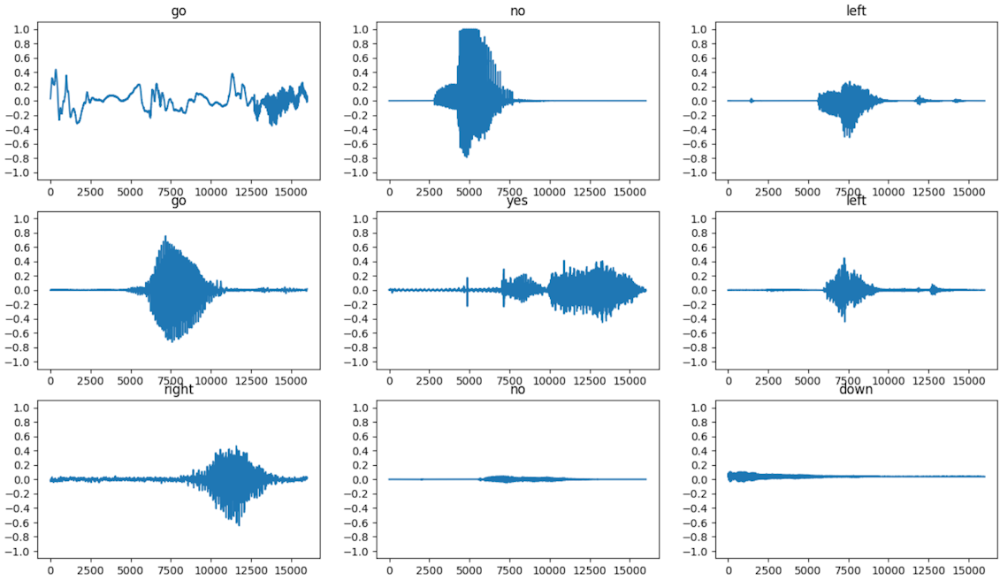
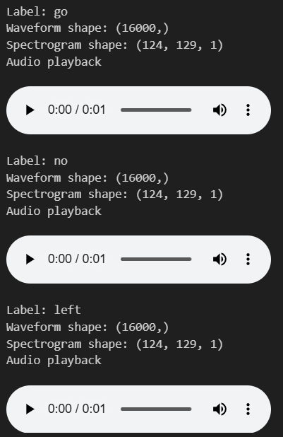
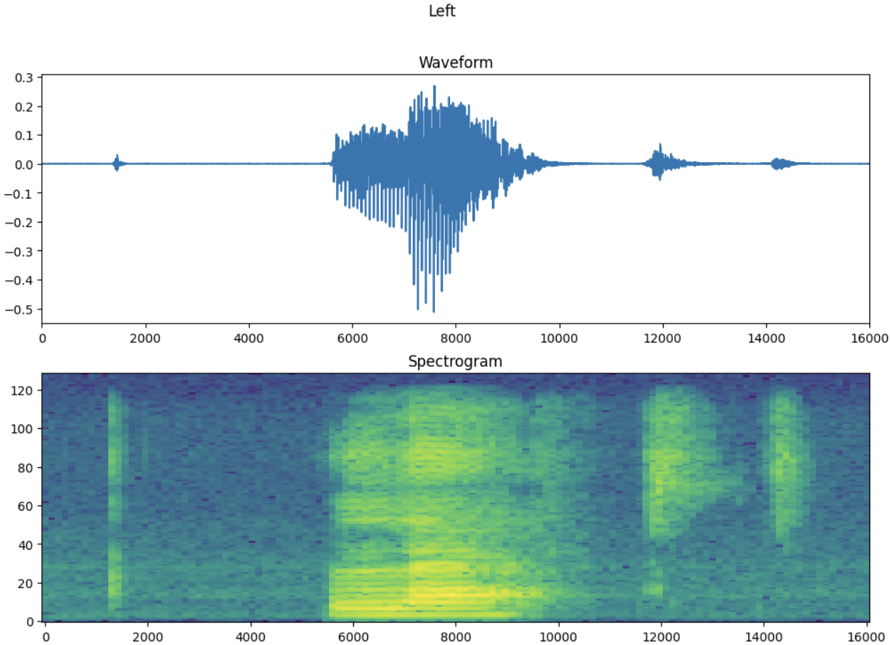
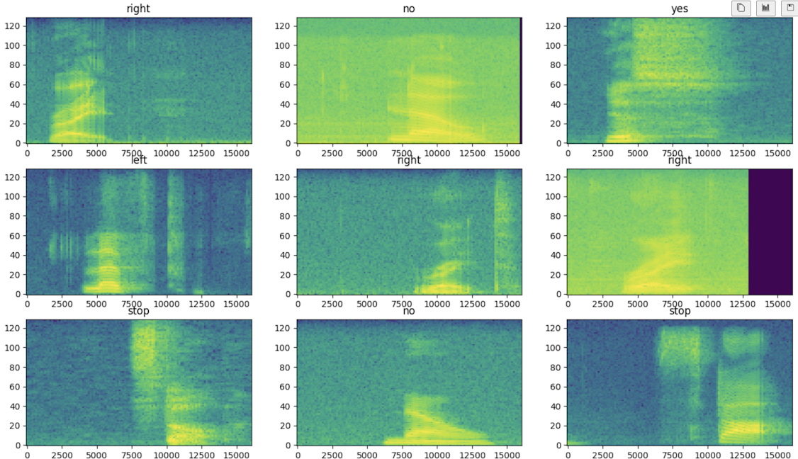
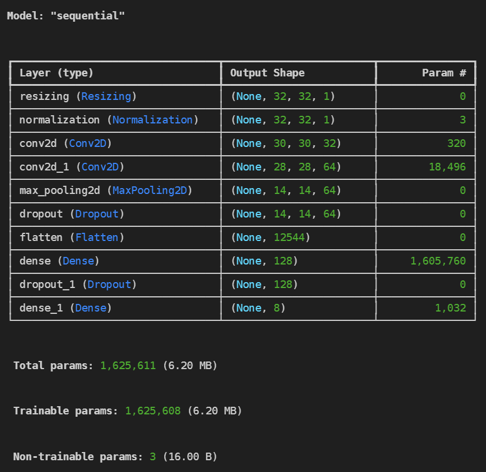
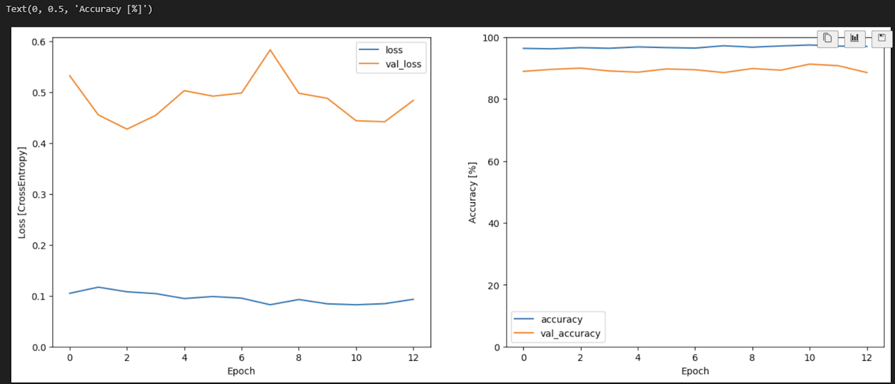

# Speech Command by Tensorflow

<br>

* [tensorflow/tensorflow/examples/speech_commands](https://github.com/tensorflow/tensorflow/tree/master/tensorflow/examples)
* [Simple audio recognition: Recognizing keywords](https://www.tensorflow.org/tutorials/audio/simple_audio)
* [docs/site/en/tutorials/audio/simple_audio.ipynb](https://github.com/tensorflow/docs/blob/master/site/en/tutorials/audio/simple_audio.ipynb)

Previously, in Tensorflow 1.X, I used the Speech Command to learn Yes and No necessary for IVR. The last of the links above is an example introduced in the first version of Speech Command upgraded to TensorFlow 2.X. The command dataset used for Speech Command is also much simpler than the current example.

Today I will be working in Tensorflow 2.X.
<br><br>

## Windows Users

<br>
TensorFlow 2.11 no longer directly supports CUDA on Windows. To use CUDA on Windows, you must use WSL (Windows subsystem for Linux).

## Creating a TensorFlow working environment on Windows

<br>

### Install WSL2

* Check the list of currently installed subsystems


```bash
(base) PS C:\Users\spypi> wsl --list --verbose
  NAME                   STATE           VERSION
* Ubuntu                 Stopped         2
  docker-desktop-data    Stopped         2
  docker-desktop         Stopped         2
```
I can use this WSL because I already have Ubuntu installed.

<br>

If you don't have Ubuntu, enable WSL in Windows Features and install a distribution like Ubuntu.

In PowerShell:

```bash
wsl --install -d Ubuntu
```

<br>

### Run WSL2

Run Ubuntu with the following command:

<br>
```bash
(base) PS C:\Users\spypi> wsl  -d Ubuntu
dongu@spypiggy-rog:/mnt/c/Users/spypi$
```

You can see that Powershell has been replaced with Ubuntu Shell.

<br>

### Accessing Windows directory from WSL

The file system in Windows starts with c:\, d:\, etc. It is not structured like \, \home, \etc, \usr in Linux system. If you want to access the file system of the Windows directory in WSL:

``` bash
dongu@spypiggy-rog:/mnt/c/Users/spypi$ ls -al /mnt
total 12
drwxr-xr-x  8 root  root  4096 Nov 10 23:55 .
drwxr-xr-x 20 root  root  4096 Nov 23 23:11 ..
drwxrwxrwx  1 dongu dongu 4096 Nov 23 21:40 c
drwxrwxrwx  1 dongu dongu 4096 Nov 23 21:39 d
drwxrwxrwx  2 root  root  4096 Jan 14  2024 e
drwxrwxrwx  1 dongu dongu  512 Nov 23 21:39 g
drwxrwxrwt  2 root  root    60 Nov 23 23:11 wsl
drwxrwxrwt  7 root  root   300 Nov 23 23:11 wslg
```
<br>

The Windows c directory can be accessed as /mnt/c, and the d directory can be accessed as the mnt/d directory.

<br>

### Accessing WSL Ubuntu from your Windows VSCode

We'll be using Visual Studio Code (VSCode) for coding, and connecting to WSL Linux from VSCode on Windows is simple. Simply type "WSL" in the command prompt (Ctrl + Shift + P) to connect to WSL on your PC, as shown below.



<br>

### Install Tensorflow in your WSL


Ubuntu WSL already has Python 3 installed (the version will likely continue to be updated).
Currently, my Ubuntu WSL has Python 3 3.10 installed.
For reference, my Windows PC already has an NVidia GPU installed. Now, let's install TensorFlow on Ubuntu via WSL. The latest version of TensorFlow automatically detects CUDA support and installs the appropriate version.

```bash
dongu@spypiggy-rog:/mnt/c/Users/spypi$ sudo apt update
dongu@spypiggy-rog:/mnt/c/Users/spypi$ sudo apt install python3-pip
dongu@spypiggy-rog:/mnt/c/Users/spypi$ python3 -m pip install tensorflow[and-cuda]
dongu@spypiggy-rog:/mnt/c/Users/spypi$ python3 -c "import tensorflow as tf; print(tf.config.list_physical_devices('GPU'))"
2025-11-23 23:41:20.057319: I tensorflow/core/platform/cpu_feature_guard.cc:210] This TensorFlow binary is optimized to use available CPU instructions in performance-critical operations.
To enable the following instructions: AVX2 FMA, in other operations, rebuild TensorFlow with the appropriate compiler flags.
dongu@spypiggy-rog:/mnt/c/Users/spypi$ python3 -c "import tensorflow as tf; print(tf.__version__)"
2025-11-23 23:47:12.208219: I tensorflow/core/platform/cpu_feature_guard.cc:210] This TensorFlow binary is optimized to use available CPU instructions in performance-critical operations.
To enable the following instructions: AVX2 FMA, in other operations, rebuild TensorFlow with the appropriate compiler flags.
2.20.0
```
This means TensorFlow 2.20.0 has discovered a GPU device and is ready to use it.
The log (cpu_feature_guard.cc) above is only related to CPU optimization and has nothing to do with GPU usage.

<br><br>

# Run Speech Command example

<br>
First, connect to WSL from VSCode and then install the Jupyter Notebook related extension on the remote system (WSL).
Jupyter Notebooks increase productivity by making it easy to test code blocks at a time.
And it also installs the modules required to run the example files.

<br>

```bash
dongu@spypiggy-rog:/mnt/c/Users/spypi$ pip3 install notebook ipykernel
dongu@spypiggy-rog:/mnt/c/Users/spypi$ pip3 install matplotlib
dongu@spypiggy-rog:/mnt/c/Users/spypi$ pip3 install  seaborn
```

<br>

## Sample Ipython codes from Tensorflow

The following example is from the TensorFlow homepage. It will help you understand the structure and operation of the Speech Command before working with your own dataset.


* Load required modules:

```python
import os
import pathlib

import matplotlib.pyplot as plt
import numpy as np
import seaborn as sns
import tensorflow as tf

from tensorflow.keras import layers
from tensorflow.keras import models
from IPython import display
from scipy.signal import resample

# Set the seed value for experiment reproducibility.
seed = 42
tf.random.set_seed(seed)
np.random.seed(seed)
```
<br>

* Downoad dataset and unzip dataset:

```python
DATASET_PATH = 'data/mini_speech_commands'

data_dir = pathlib.Path(DATASET_PATH)
if not data_dir.exists():
  tf.keras.utils.get_file(
      'mini_speech_commands.zip',
      origin="http://storage.googleapis.com/download.tensorflow.org/data/mini_speech_commands.zip",
      extract=True,
      cache_dir='.', cache_subdir='data')
```

<br>

* check dataset:

```python
DATASET_PATH = 'data/mini_speech_commands_extracted/mini_speech_commands'
data_dir = pathlib.Path(DATASET_PATH)
commands = np.array(tf.io.gfile.listdir(str(data_dir)))
commands = commands[commands != 'README.md']
print('Commands:', commands)
```
```
Commands: ['down' 'go' 'left' 'no' 'right' 'stop' 'up' 'yes']
```

<br>

#### tf.keras.utils.audio_dataset_from_directory: Automatically converts audio files into a dataset (tf.data.Dataset).
* Reads audio files in the specified directory (data_dir) and converts them into TensorFlow Dataset objects.
* Audio files must be stored in subdirectories for each class (e.g., data_dir/yes/*.wav, data_dir/no/*.wav).
* Automatically splits the training and validation datasets.

### Description of key parameters


| Parameters                  | Description                                                                 |
|----------------------------|----------------------------------------------------------------------|
| `directory=data_dir`       | The top-level directory containing audio files. Each class must have a subfolder. |
| `batch_size=64`            | The number of samples to retrieve at once when loading a dataset, i.e. the minibatch size. |
| `validation_split=0.2`     | Separate 20% of the total data set into a validation dataset. The remaining 80% is used for training. |
| `seed=0`                   | A seed value that controls randomness when splitting data. If the same seed is used, the train/val split is always identical. |
| `output_sequence_length=16000` | Fits audio signals to a specific length (here, 16,000 samples). Shorter signals are padded, longer signals are truncated. (Based on 16kHz sampling, 1 second length) |
| `subset='both'`            | train/validation 두 가지 데이터셋을 모두 반환. 결과가 `(train_ds, val_ds)` 튜플 형태로 나옴. |


```python
train_ds, val_ds = tf.keras.utils.audio_dataset_from_directory(
    directory=data_dir,
    batch_size=64,
    validation_split=0.2,
    seed=0,
    output_sequence_length=16000,
    subset='both')

label_names = np.array(train_ds.class_names)
print("label names:", label_names)
```
```
Found 8000 files belonging to 8 classes.
Using 6400 files for training.
Using 1600 files for validation.
WARNING: All log messages before absl::InitializeLog() is called are written to STDERR
I0000 00:00:1763912129.764121   31832 gpu_device.cc:2020] Created device /job:localhost/replica:0/task:0/device:GPU:0 with 5564 MB memory:  -> device: 0, name: NVIDIA GeForce RTX 3070 Ti Laptop GPU, pci bus id: 0000:01:00.0, compute capability: 8.6

label names: ['down' 'go' 'left' 'no' 'right' 'stop' 'up' 'yes']
```

```python
train_ds.element_spec
```

```
(TensorSpec(shape=(None, 16000, None), dtype=tf.float32, name=None),
 TensorSpec(shape=(None,), dtype=tf.int32, name=None))
```

* Remove extra axes using the tf.squeeze function
* The utils.audio_dataset_from_directory function returns at most two partitions.
* It's recommended to keep the test set separate from the validation set. Ideally, you'd keep it in a separate directory, but in this case, you can split the validation set into two parts using Dataset.shard . Iterating over any shard will load all the data and retain only a portion.

* The last line of the output is "2025-11-25 19:28:49.565887: I tensorflow/core/framework/local_rendezvous.cc:407] Local rendezvous is aborting with status: OUT_OF_RANGE: End of sequence", which is not an error message.

#### Why am I getting this log?

* train_ds.take(1) fetches only one batch from the dataset and ends.
* Once the batch is consumed, the end of the dataset (end of sequence) is reached.
* TensorFlow's data pipeline (tf.data) returns the OUT_OF_RANGE status when it reaches the end, which is normal behavior.
* It internally processes this status and outputs the INFO log as shown above. (I = Info level)


```python
def squeeze(audio, labels):
  audio = tf.squeeze(audio, axis=-1)
  return audio, labels

train_ds = train_ds.map(squeeze, tf.data.AUTOTUNE)
val_ds = val_ds.map(squeeze, tf.data.AUTOTUNE)

test_ds = val_ds.shard(num_shards=2, index=0)
val_ds = val_ds.shard(num_shards=2, index=1)

for example_audio, example_labels in train_ds.take(1):  
  print(example_audio.shape)
  print(example_labels.shape)
```
```
(64, 16000)
(64,)
2025-11-24 00:37:13.706525: I tensorflow/core/framework/local_rendezvous.cc:407] Local rendezvous is aborting with status: OUT_OF_RANGE: End of sequence
```

<br>

```python
label_names[[1,1,3,0]]
```
```
array(['go', 'go', 'no', 'down'], dtype='<U5')
```

<br>

```python
rows = 3
cols = 3
n = rows * cols
fig, axes = plt.subplots(rows, cols, figsize=(16, 9))

for i in range(n):
  if i>=n:
    break
  r = i // cols
  c = i % cols
  ax = axes[r][c]
  ax.plot(example_audio[i].numpy())
  ax.set_yticks(np.arange(-1.2, 1.2, 0.2))
  label = label_names[example_labels[i]]
  ax.set_title(label)
  ax.set_ylim([-1.1,1.1])

plt.show()
```



#### Converting a Waveform to a Spectrogram
The waveforms in the dataset are represented in the time domain. Next, we convert the time-domain signal into a time-frequency-domain signal. To do this, we compute the short-time Fourier transform (STFT), which shows frequency changes over time and converts the waveform into a spectrogram, which can be represented as a 2D image. We feed the spectrogram image to a neural network to train the model.

The Fourier transform (tf.signal.fft) converts a signal into its component frequencies but loses all temporal information. In contrast, the STFT (tf.signal.stft) splits the signal into time windows and performs the Fourier transform on each window, preserving some temporal information and returning a 2D tensor that can be subjected to standard convolution.

Create a utility function to convert the waveform to a spectrogram.

* Waveforms should be of the same length so that the resulting spectrogram has similar dimensions. To achieve this, audio clips shorter than 1 second can simply be zero-padded (using tf.zeros). When calling tf.signal.stft , choose the frame_length and frame_step parameters so that the generated spectrogram "image" is approximately square. For more information on choosing STFT parameters, see this Coursera video on audio signal processing and the STFT.
* The STFT produces complex arrays representing magnitude and phase. However, in this tutorial, we will only use the magnitude, which can be derived by applying tf.signal.stft to the output of tf.abs .


```python
def get_spectrogram(waveform):
  # Convert the waveform to a spectrogram via a STFT.
  spectrogram = tf.signal.stft(
      waveform, frame_length=255, frame_step=128)
  # Obtain the magnitude of the STFT.
  spectrogram = tf.abs(spectrogram)
  # Add a `channels` dimension, so that the spectrogram can be used
  # as image-like input data with convolution layers (which expect
  # shape (`batch_size`, `height`, `width`, `channels`).
  spectrogram = spectrogram[..., tf.newaxis]
  return spectrogram
```
#### Next, we begin exploring the data. We output an example tensorized waveform and its corresponding spectrogram shape, and play the original audio.

```python
for i in range(3):
  label = label_names[example_labels[i]]
  waveform = example_audio[i]
  spectrogram = get_spectrogram(waveform)

  print('Label:', label)
  print('Waveform shape:', waveform.shape)
  print('Spectrogram shape:', spectrogram.shape)
  print('Audio playback')
  display.display(display.Audio(waveform, rate=16000))
```




#### Now we define a function that displays the spectrogram.

```python
def plot_spectrogram(spectrogram, ax):
  if len(spectrogram.shape) > 2:
    assert len(spectrogram.shape) == 3
    spectrogram = np.squeeze(spectrogram, axis=-1)
  # Convert the frequencies to log scale and transpose, so that the time is
  # represented on the x-axis (columns).
  # Add an epsilon to avoid taking a log of zero.
  log_spec = np.log(spectrogram.T + np.finfo(float).eps)
  height = log_spec.shape[0]
  width = log_spec.shape[1]
  X = np.linspace(0, np.size(spectrogram), num=width, dtype=int)
  Y = range(height)
  ax.pcolormesh(X, Y, log_spec)
```

#### Plot the waveform of the example over time and its spectrogram (frequency over time).

```python
fig, axes = plt.subplots(2, figsize=(12, 8))
timescale = np.arange(waveform.shape[0])
axes[0].plot(timescale, waveform.numpy())
axes[0].set_title('Waveform')
axes[0].set_xlim([0, 16000])

plot_spectrogram(spectrogram.numpy(), axes[1])
axes[1].set_title('Spectrogram')
plt.suptitle(label.title())
plt.show()
```




#### Now we will create a spectrogram dataset from the audio dataset.

```python
def make_spec_ds(ds):
  return ds.map(
      map_func=lambda audio,label: (get_spectrogram(audio), label),
      num_parallel_calls=tf.data.AUTOTUNE)

train_spectrogram_ds = make_spec_ds(train_ds)
val_spectrogram_ds = make_spec_ds(val_ds)
test_spectrogram_ds = make_spec_ds(test_ds)
```

#### Let's look at spectrograms for various examples from the dataset.

```python
for example_spectrograms, example_spect_labels in train_spectrogram_ds.take(1):
  break

rows = 3
cols = 3
n = rows*cols
fig, axes = plt.subplots(rows, cols, figsize=(16, 9))

for i in range(n):
    r = i // cols
    c = i % cols
    ax = axes[r][c]
    plot_spectrogram(example_spectrograms[i].numpy(), ax)
    ax.set_title(commands[example_spect_labels[i].numpy()])

plt.show()
```




#### Building and Training a Model

* Add the Dataset.cache and Dataset.prefetch operations to reduce read latency during model training.

```python
train_spectrogram_ds = train_spectrogram_ds.cache().shuffle(10000).prefetch(tf.data.AUTOTUNE)
val_spectrogram_ds = val_spectrogram_ds.cache().prefetch(tf.data.AUTOTUNE)
test_spectrogram_ds = test_spectrogram_ds.cache().prefetch(tf.data.AUTOTUNE)
```

#### For this model, we use a simple convolutional neural network (CNN), since we converted the audio file into a spectrogram image.

The tf.keras.Sequential model uses the following Keras preprocessing layers:

* tf.keras.layers.Resizing: Downsamples the input to help the model train faster.
* tf.keras.layers.Normalization: Normalizes each pixel in the image based on the mean and standard deviation.
For the Normalization layer, we first need to call its adapt method on the training data to compute aggregate statistics (i.e., the mean and standard deviation).


```python
input_shape = example_spectrograms.shape[1:]
print('Input shape:', input_shape)
num_labels = len(commands)

# Instantiate the `tf.keras.layers.Normalization` layer.
norm_layer = layers.Normalization()
# Fit the state of the layer to the spectrograms
# with `Normalization.adapt`.
norm_layer.adapt(data=train_spectrogram_ds.map(map_func=lambda spec, label: spec))

model = models.Sequential([
    layers.Input(shape=input_shape),
    # Downsample the input.
    layers.Resizing(32, 32),
    # Normalize.
    norm_layer,
    layers.Conv2D(32, 3, activation='relu'),
    layers.Conv2D(64, 3, activation='relu'),
    layers.MaxPooling2D(),
    layers.Dropout(0.25),
    layers.Flatten(),
    layers.Dense(128, activation='relu'),
    layers.Dropout(0.5),
    layers.Dense(num_labels),
])
```


#### We build a Keras model using the Adam optimizer and cross-entropy loss. For demonstration purposes, we train the model for 10(or 1000) epochs.


```python
model.compile(
    optimizer=tf.keras.optimizers.Adam(),
    loss=tf.keras.losses.SparseCategoricalCrossentropy(from_logits=True),
    metrics=['accuracy'],
)

EPOCHS = 1000
history = model.fit(
    train_spectrogram_ds,
    validation_data=val_spectrogram_ds,
    epochs=EPOCHS,
    callbacks=tf.keras.callbacks.EarlyStopping(verbose=1, patience=10),  #If there is no improvement in patiencer value for a while, stop.
)
```
#### Let's plot the training and validation loss curves to see how the model improved during training.

```python
metrics = history.history
plt.figure(figsize=(16,6))
plt.subplot(1,2,1)
plt.plot(history.epoch, metrics['loss'], metrics['val_loss'])
plt.legend(['loss', 'val_loss'])
plt.ylim([0, max(plt.ylim())])
plt.xlabel('Epoch')
plt.ylabel('Loss [CrossEntropy]')

plt.subplot(1,2,2)
plt.plot(history.epoch, 100*np.array(metrics['accuracy']), 100*np.array(metrics['val_accuracy']))
plt.legend(['accuracy', 'val_accuracy'])
plt.ylim([0, 100])
plt.xlabel('Epoch')
plt.ylabel('Accuracy [%]')
```


#### Evaluate Model Performance
* Run the model on the test set and check its performance.

```python
model.evaluate(test_spectrogram_ds, return_dict=True)
```
```
13/13 ━━━━━━━━━━━━━━━━━━━━ 0s 16ms/step - accuracy: 0.8738 - loss: 0.5386
```

#### Displaying the confusion matrix
* Use the confusion matrix to see how well the model classified each command in the test set.

```python
y_pred = tf.argmax(y_pred, axis=1)
y_true = tf.concat(list(test_spectrogram_ds.map(lambda s,lab: lab)), axis=0)
confusion_mtx = tf.math.confusion_matrix(y_true, y_pred)
plt.figure(figsize=(10, 8))
sns.heatmap(confusion_mtx,
            xticklabels=commands,
            yticklabels=commands,
            annot=True, fmt='g')
plt.xlabel('Prediction')
plt.ylabel('Label')
plt.show()
```


#### Running Inference on an Audio File
* Finally, let's check the model's prediction output using an input audio file of someone saying "no." How well does the model perform?

```python
x = data_dir/'no/01bb6a2a_nohash_0.wav'
x = tf.io.read_file(str(x))
x, sample_rate = tf.audio.decode_wav(x, desired_channels=1, desired_samples=16000,)
x = tf.squeeze(x, axis=-1)
waveform = x
x = get_spectrogram(x)
x = x[tf.newaxis,...]

prediction = model(x)
plt.bar(commands, tf.nn.softmax(prediction[0]))
plt.title('No')
plt.show()

display.display(display.Audio(waveform, rate=16000))
```

#### Exporting the Model with Preprocessing
* If you need to apply these preprocessing steps before passing data to the model for inference, the model will be less usable. Therefore, build the full version.

```python
class ExportModel(tf.Module):
  def __init__(self, model):
    self.model = model

    # Accept either a string-filename or a batch of waveforms.
    # YOu could add additional signatures for a single wave, or a ragged-batch. 
    self.__call__.get_concrete_function(
        x=tf.TensorSpec(shape=(), dtype=tf.string))
    self.__call__.get_concrete_function(
       x=tf.TensorSpec(shape=[None, 16000], dtype=tf.float32))


  @tf.function
  def __call__(self, x):
    # If they pass a string, load the file and decode it. 
    if x.dtype == tf.string:
      x = tf.io.read_file(x)
      x, _ = tf.audio.decode_wav(x, desired_channels=1, desired_samples=16000,)
      x = tf.squeeze(x, axis=-1)
      x = x[tf.newaxis, :]

    x = get_spectrogram(x)  
    result = self.model(x, training=False)

    class_ids = tf.argmax(result, axis=-1)
    class_names = tf.gather(label_names, class_ids)
    return {'predictions':result,
            'class_ids': class_ids,
            'class_names': class_names}
```

```python
export = ExportModel(model)
export(tf.constant(str(data_dir/'no/01bb6a2a_nohash_0.wav')))
```

#### If you save and reload the model, the reloaded model will give the same output.
#### Model Save Location
* "saved" is a relative path from the current working directory.
* Therefore, the model is saved in the ./saved/ directory.
* The saved structure is as follows:
``` bash
saved/
├── assets/
├── variables/
│ ├── variables.data-00000-of-00001
│ └── variables.index
└── saved_model.pb
```
You can save to a desired location by specifying an absolute path. For example:

```python
tf.saved_model.save(export, "/mnt/d/MyProject/dialer/speech_cmd/saved_model")
```

```python
tf.saved_model.save(export, "saved")
imported = tf.saved_model.load("saved")
imported(waveform[tf.newaxis, :])
```

#### Applying to a wav file model
* The current model suggests the most probable value even for nonexistent values.
When training on a real dataset, at least silence should be included in the dataset.
If the probability value is lower than threadshold, it should be treated as unknown.

```python
import time

# WAV file path
filename = str(data_dir/'no/01bb6a2a_nohash_0.wav')
filename = str('/mnt/d/MyProject/dialer/speech_cmd/data/hello.wav')

s = time.time()
# Read file
audio_binary = tf.io.read_file(filename)

# Decode WAV (convert to mono channel)
waveform, sample_rate = tf.audio.decode_wav(audio_binary, desired_channels=1)
if False == tf.equal(sample_rate, 16000): # Compare tensors
# Example: Downsampling 44.1kHz → 16kHz
waveform = resample(waveform, 16000)

# Waveform has shape (samples, 1) → model Convert to 1D to fit the input
waveform = tf.squeeze(waveform, axis=-1)

# Fit the length (padding or truncation)
waveform = waveform[:16000] # Truncate if too long
padding = tf.zeros([16000 - tf.shape(waveform)[0]], dtype=tf.float32)
waveform = tf.concat([waveform, padding], 0)

output = imported(waveform[tf.newaxis, :])
# Extract logits
logits = output['predictions'] # shape (1, 8)

# Apply softmax → Convert to probabilities
probs = tf.nn.softmax(logits, axis=-1)

print("Probability by label:", probs.numpy())
# Index of the highest probability
pred_id = tf.argmax(probs, axis=-1).numpy()[0]

# The corresponding label name
pred_label = output['class_names'].numpy()[0].decode("utf-8")

print("Predicted label:", pred_label)
print("Predicted probability:", probs.numpy()[0][pred_id])

e = time.time()
print("time:", e - s)
```
```
Probabilities by Label: [[2.1246144e-01 3.4728169e-01 2.4885560e-09 8.9462381e-03 4.3130812e-01
6.7525524e-10 1.6725445e-06 8.8123045e-07]]
Predicted Label: Right
Predicted Probability: 0.43130812
Time: 0.03911614418029785
```

#### Applying a PCM file or buffer

```python
pcm_binary = tf.io.read_file('/mnt/d/MyProject/dialer/speech_cmd/data/0ab3b47d_nohash_0_01.pcm') #8kHz 16bit PCM Sample file
waveform = tf.io.decode_raw(pcm_binary, tf.int16)
# Resample after numpy conversion (8kHz → 16kHz)
waveform_np = waveform.numpy()
waveform_resampled = resample(waveform_np, 16000) #8kHz -> 16kHz
# Convert back to tensor
waveform = tf.convert_to_tensor(waveform_resampled, dtype=tf.float32)
waveform = tf.cast(waveform, tf.float32) / 32768.0

waveform = waveform[:16000]
padding = tf.zeros([16000 - tf.shape(waveform)[0]], dtype=tf.float32)
waveform = tf.concat([waveform, padding], 0)
output = imported(waveform[tf.newaxis, :])
# Extract logits
logits = output['predictions'] # shape (1, 8)

# Apply softmax → Convert to probabilities
probs = tf.nn.softmax(logits, axis=-1)

print("Probability by label:", probs.numpy())
# Index of the highest probability
pred_id = tf.argmax(probs, axis=-1).numpy()[0]

# Name of the corresponding label
pred_label = output['class_names'].numpy()[0].decode("utf-8")

print("Predicted Label:", pred_label)
print("Predicted Probability:", probs.numpy()[0][pred_id])

e = time.time()
print("time:", e - s)
```

```
Probability by Label: [[1.2493253e-04 1.3373655e-08 5.2745188e-17 9.9987507e-01 8.5578284e-25
2.6984713e-13 4.3411162e-18 1.1372672e-16]]
Predicted Label: No
Predicted Probability: 0.99987507
Time: 43.18598532676697
```


