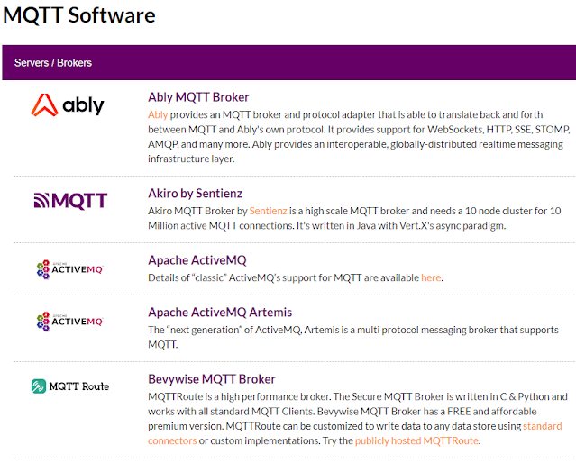
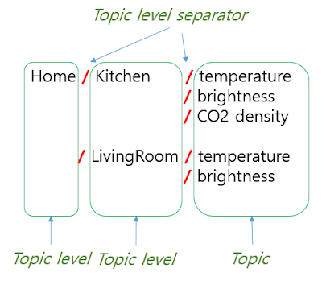
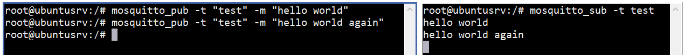

# What is Mosquitto

 I quoted a lot from [How to Install and Secure the Mosquito MQTT Messaging Broker on Ubuntu 18.04](https://www.digitalocean.com/community/tutorials/how-to-install-and-secure-the-mosquitto-mqtt-messaging-broker-on-ubuntu-18-04).

MQTT is a machine-to-machine messaging protocol, designed to provide lightweight publish/subscribe communication to “Internet of Things” devices. It is commonly used for geo-tracking fleets of vehicles, home automation, environmental sensor networks, and utility-scale data collection.
Mosquitto is a popular MQTT server (or broker, in MQTT parlance) that has great community support and is easy to install and configure. 

MQTT is often thought of only as IoT platform and applied to devices such as Arduino and many sensors. However, Message Queue (MQ) is a protocol that has long been used to deliver asynchronous messages.  It can be applied to various applications for asynchronous message delivery. The Public, Subscribe model for a particular topic can also be useful for implementing chat rooms, etc. There are rumors that Facebook's messenger actually used Mosquito.(This is something I haven't confirmed yet.)

<br/>

I often use message queue middleware such as mosquitto in various projects.
Rather than developing communication between server programs directly, I use a messaging system to build a stable communication environment.
In the PBX system using FreeSWITCH, I have used it a lot to transmit call events, etc. from the server program in charge of the CTI function to multiple client programs.

<br/>

## MQTT communication architecture

MQTT does not consist of a client-server structure like HTTP, normal TCP, etc., but consists of a broker, publisher, and subscriber structure.


<MQTT Publish . Subscribe Architecture from https://mqtt.org/>

A Publisher publishes a Topic, and a Subscriber subscribes to a Topic. Broker acts as a relay between them, and since multiple subscribers can subscribe to a single topic, it is also very useful for establishing 1:N communication.

<br/>

## MQTT Brokers

The role of the broker that mediates messages in the middle is important, and the software that plays this role is called an MQTT broker (server).



https://mqtt.org/software/ introduces numerous MQTT brokers. Among them, there are products that are used, and there are products that are open source and available for free.
The most popular of these open source products is Mosquitto from the Eclipse Foundation. There are many brokers that can implement MQTT, but I will explain using the most popular and easily accessible mosquitto.


<br/>

## MQTT Topic

Publishers and Subscribers work on a per-topic basis. Topics can be hierarchically organized using forward slashes (/), so that a large number of sensor devices can be efficiently managed. For example, if you have a sensor that measures various states of your computer, you could configure it as follows.
If you've ever implemented the HTTP Restful API, you'll know that forward slashes ("/") in URIs are used to separate resources.
In MQTT, topics can also be separated using forward slashes, so that subscribers and publishers can process messages efficiently.



If your subscriber wants to receive temperature, brightness, and CO2 density from all three topics belonging to /Home/Kitchen, you can do it at once with "/Home/Kitchen/#".

<br/>

## MQTT QoS level

QoS-related information brought from

* http://www.steves-internet-guide.com/understanding-mqtt-qos-1/
* http://www.steves-internet-guide.com/understanding-mqtt-qos-2/

MQTT has its origins in IBM's Message Queue. Message Queue uses TCP/IP but uses an asynchronous transmission method. Therefore, even when the communication of subscribe is cut off, the broker can keep the message and send it when communication is restored.

However, if all messages are processed in this way, the load is large, so MQTT can be used in three QoS modes.

MQTT provides 3 QOS levels-

* QOS 0 – Once (not guaranteed)
* QOS 1 – At Least Once (guaranteed)
* QOS 2 – Only Once (guaranteed)

<br/>

### QOS 0 –  Once
This is the fastest method and requires only 1 message. It is also the most unreliable transfer mode. The message is not stored on the sender, and is not acknowledged. The message will be delivered only once, or not at all. Once the message has been sent by the client it is deleted from the outbound message queue. Therefore with this QOS level there is no possibility of duplicate messages.

<br/>

### QOS 1 – At Least Once
This level guarantees that the message will be delivered at least once, but may be delivered more than once. (See Flow Diagram on right.) Publishing with QOS of 1 requires 2 messages. The sender sends a message and waits for an acknowledgement (PUBACK).

If it receives an acknowledgement then it notifies the client app, and deletes the message from the outbound queue.. If it doesn’t receive an acknowledgement it will resend the message with the DUP flag set (Duplicate Flag). The message will continue to be resent at regular intervals, until the sender receives an acknowledgement.

<br/>

### QOS 2 – Only Once
This level guarantees that the message will be delivered only once. This is the slowest method as it requires 4 messages.

The sender sends a message and waits for an acknowledgement (PUBREC)
The receiver sends a PUBREC message
If the sender doesn’t receive an acknowledgement ( PUBREC)  it will resend the message with the DUP flag set.
When the sender receives an acknowledgement message PUBREC it then sends a message release message (PUBREL). The message can be deleted from the queue.
If the receiver doesn’t receive the PUBREL it will resend the PUBREC message
When the receiver receives the PUBREL message it can now forward the message onto any subscribers.
The receiver then send a publish complete (PUBCOMP) .
If the sender doesn’t receive the PUBCOMP message it will resend the PUBREL message.
When the sender receives the PUBCOMP the process is complete and it can delete the message from the outbound queue, and also the message state.

<br/>

# Installation
 First of all, I will install Mosquito MQTT Broker in Ubuntu. Eclipse Mosquitto is an open source (EPL/EDL licensed) message broker that implements the MQTT protocol versions 5.0, 3.1.1 and 3.1. Mosquitto is lightweight and is suitable for use on all devices from low power single board computers to full servers.

Installation is very simple. I will install Mosquito client for testing.

```bash
# For Rehhat or Rocky
dnf -y install mosquitto 

# For Ubuntu or Debian
root@ubuntusrv:/# apt-get update
root@ubuntusrv:/# apt-get  install mosquitto mosquitto-clients
```
<br/>

# Simple Test
 Let’s test the default configuration. We’ll use one of the Mosquitto clients we just installed to subscribe to a topic on our broker.
Topics are labels that you publish messages to and subscribe to. They are arranged as a hierarchy, so you could have sensors/outside/temp and sensors/outside/humidity, for example. How you arrange topics is up to you and your needs. Throughout this tutorial we will use a simple test topic to test our configuration changes.

Log in to your server a second time, so you have two terminals side-by-side. In the new terminal, use mosquitto_sub to subscribe to the test topic:

```bash
root@ubuntusrv:/# mosquitto_sub -t test
```
<br/>


```bash
root@ubuntusrv:/# mosquitto_pub -t "test" -m "hello world" 
```




 mosquitto_sub, mosquitto_pub are both mosquitto client programs.
The example above is tested locally. In most cases, we will probably communicate with different hosts, so we will test them on different hosts.

<br/>

# Access Control with ID/Password

<br/>

Let’s configure Mosquitto to use passwords. Mosquitto includes a utility to generate a special password file called mosquitto_passwd. This command will prompt you to enter a password for the specified username, and place the results in /etc/mosquitto/passwd.

```bash
root@ubuntusrv:/# mosquitto_passwd -c /etc/mosquitto/passwd your_id 
```

This command will create or update  passwd files that includes your_id and its encrypted password
Now we’ll open up a new configuration file for Mosquitto and tell it to use this password file to require logins for all connections:

```bash
# For Ubuntu Users
root@ubuntusrv:/# vim /etc/mosquitto/conf.d/default.conf 
root@ubuntusrv:/# cat /etc/mosquitto/conf.d/default.conf

# For Rocky Users
vim /etc/mosquitto/mosquitto.conf

allow_anonymous false
password_file /etc/mosquitto/passwd 
```

"allow_anonymous false" will disable all non-authenticated connections, and the password_file line tells Mosquitto where to look for user and password information. Save and exit the file.

Now restart the mosquitto broker again.

```bash
root@ubuntusrv:/# systemctl restart mosquitto
```

From now on, access to the Mosquito broker is only possible by using id/password.

<br/>


# Secure communication over SSL

<br/>

If you have a domain and server ready, you can create a private certificate using openssl, but I recommend getting a public certificate from the letsencrypt site.
Here we briefly explain how to obtain a certificate from the letsencrypt site.

To create a certificate, first install the certbot package for Linux provided by letsencrypt. It may require the epel-release repo.

```bash
dnf install certbot 
```

<br/>

## Create a letsencrypt certificate

<br/>

Create a certificate with the command below. Enter the required information during the process, and the certificate will be created with the message "Congratulations!" at the end.

```bash
 certbot --standalone -d spypiggy.shop certonly
```
The directory where the certificate is created is '/etc/letsencrypt/live/spypiggy.shop'. You can change the domain name to your own domain name. 

<br/>

## Verify public certificate

<br/>

You can check the certificate installed with the certbot command.

```bash
 [root@spypiggy live]# certbot certificates 
/usr/local/lib/python3.6/site-packages/requests/__init__.py:104: 
RequestsDependencyWarning: urllib3 (1.26.7) or chardet 
(5.0.0)/charset_normalizer (2.0.6) doesn't match a supported version! 
  RequestsDependencyWarning) 
Saving debug log to /var/log/letsencrypt/letsencrypt.log - - - - - - - - - - - - - - - - - - - - - - - - - - - - - - - - - - - - - - - - 
Found the following certs: 
  Certificate Name: spypiggy.shop 
    Serial Number: ********f27445e4d01****************
    Key Type: RSA 
    Domains: spypiggy.shop www.spypiggy.shop 
    Expiry Date: 2024-08-18 05:02:28+00:00 (VALID: 46 days) 
    Certificate Path: /etc/letsencrypt/live/spypiggy.shop/fullchain.pem 
    Private Key Path: /etc/letsencrypt/live/spypiggy.shop/privkey.pem - - - - - - - - - - - - - - - - - - - - - - - - - - - - - - - - - - - - - - - - 
```

<br/>

## Automatic certificate renewal

<br/>

The certificate generated with certbot above has a validity period of 3 months and is automatically renewed.
Certbot uses systemd.timer instead of crontab to renew certificates.
Check the timer first as follows. Then, you can check the status of certbot-renew.timer.
The timer started on 2024-05-22 and after 12 hours,

```bash
[root@spypiggy live]# systemctl list-timers 
NEXT                         LEFT       LAST                         PASSED      
UNIT                      > 
Tue 2024-07-02 17:30:00 KST  30s left   Tue 2024-07-02 17:20:01 KST  9min ago    
sysstat-collect.timer     > 
Tue 2024-07-02 17:40:23 KST  10min left Tue 2024-07-02 16:27:22 KST  1h 2min 
ago dnf-makecache.timer       > 
Wed 2024-07-03 00:00:00 KST  6h left    Tue 2024-07-02 00:00:00 KST  17h ago     
unbound-anchor.timer      > 
Wed 2024-07-03 00:07:00 KST  6h left    Tue 2024-07-02 00:07:03 KST  17h ago     
sysstat-summary.timer     > 
Wed 2024-07-03 05:34:50 KST  12h left   Tue 2024-07-02 15:25:27 KST  2h 4min 
ago certbot-renew.timer       > 
Wed 2024-07-03 10:48:45 KST  17h left   Tue 2024-07-02 10:48:45 KST  6h ago      
systemd-tmpfiles-clean.tim> 
6 timers listed. 
[root@spypiggy live]# systemctl status certbot-renew.timer 
● certbot-renew.timer - This is the timer to set the schedule for automated 
renewals 
   Loaded: loaded (/usr/lib/systemd/system/certbot-renew.timer; enabled; vendor 
preset: enabled) 
   Active: active (waiting) since Wed 2024-05-22 10:24:22 KST; 1 months 10 days 
ago 
  Trigger: Wed 2024-07-03 05:34:50 KST; 12h left 
Warning: Journal has been rotated since unit was started. Log output is 
incomplete or unavailable.
```
<br/>

For reference, the location of the timer configuration file certbot-renew.timer is '/etc/systemd/system/timers.target.wants/certbot
renew.timer'

```bash
[root@spypiggy live]# cat /etc/systemd/system/timers.target.wants/certbot
renew.timer 
[Unit] 
Description=This is the timer to set the schedule for automated renewals 
[Timer] 
OnCalendar=*-*-* 00/12:00:00 
RandomizedDelaySec=12hours 
Persistent=true 
[Install] 
WantedBy=timers.target
```

**Note: Port 80 must be developed for certificate renewal. Be sure to check your firewall settings and open port 80.** 


<br/>

## Apply certificate

<br/>

The following sets up an MQTT service over port 1883 and an HTTP MQTT service with TLS applied over port 8883.
Change the mosquitto configuration file as follows:

```bash
[root@spypiggy ~]# cat /etc/mosquitto/mosquitto.conf 

...
Omission in the middle
...

port 1883
protocol mqtt

listener 8883
protocol mqtt


cafile /etc/letsencrypt/live/spypiggy.shop/chain.pem
# Path to the PEM encoded server certificate.
certfile /etc/letsencrypt/live/spypiggy.shop/cert.pem
# Path to the PEM encoded keyfile.
keyfile /etc/letsencrypt/live/spypiggy.shop/privkey.pem
```
<br/>

If you want to support websockets, add the following below.

```bash
listener 9001
protocol websockets

listener 9003
protocol websockets

cafile /etc/letsencrypt/live/spypiggy.shop/chain.pem
# Path to the PEM encoded server certificate.
certfile /etc/letsencrypt/live/spypiggy.shop/cert.pem
# Path to the PEM encoded keyfile.
keyfile /etc/letsencrypt/live/spypiggy.shop/privkey.pem
```

<br/>

Now your mosquitto can listen on ports 1883, 8883, 9001 and 9003. Restart the process for the changes to take effect.


<br/>

## Renew certificate and restart mosquitto

<br/>

Unfortunately, mosquitto does not automatically recognize certificate updates. So you need to restart the mosquitto service to reread the changed certificates, or send it a signal (SIGHUP) to reread its settings.
Of course, I recommend the latter.

```bash
[root@spypiggy ~]# ps -ef|grep mosquitto
mosquit+  209884       1  0 Nov01 ?        00:30:29 /usr/sbin/mosquitto -c /etc/mosquitto/mosquitto.conf
root      572064  570663  0 21:07 pts/0    00:00:00 grep --color=auto mosquitto
[root@spypiggy ~]# kill -s SIGHUP 209884
```

<br/>
If you check the /var/log/mosquitto/mosquitto.log file, you can see that the settings have been re-read as follows:


```bash
1734264562: Reloading config.
```

If you create a script file to run the above task at regular intervals and add it to crontab, you can automatically use the changed certificate.


<br/>

# Python Programming and Version Problem

<br/>

Paho is a Python client module provided by the EClipse Foundation with the Mosquito MQTT broker. Use the pip3 command to install the paho.

```bash
pip3 install paho-mqtt
```
However, the API has changed a little depending on the paho version.
Depending on your Python version, a different version of paho will be installed.
Here, I introduce a simple code that does not cause an error depending on the pahi version. 

You can read the mqtt.__version__ value to check whether the version value is 1.X.X or 2.X.X, and then proceed with different initialization processes.

```python
'''
pip install websockets
'''

import paho.mqtt.client as paho
import paho.mqtt as mqtt
import time

mqttc = None

def on_message(clnt, userdata, msg):     
    txt = msg.payload.decode('utf-8')
    print("Received:", txt)

def on_connect_v1(client, userdata, flags, rc):    #paho.CallbackAPIVersion.VERSION1은 properties 파라미터가 없음
    print("Connected with result code "+str(rc))
    if rc == 0:
        print("Connection successful")
    elif rc == 1:
        print("Connection refused - incorrect protocol version")    
    elif rc == 2:
        print("Connection refused - invalid client identifier")    
    elif rc == 3:
        print("Connection refused - server unavailable")    
    elif rc == 4:
        print("Connection refused - bad username or password")    
    elif rc == 5:
        print("Connection refused - not authorised")    
    else:
        print("Connection refused unused")  
    if rc == 0:
        mqttc.subscribe(f"Your Topic")
    else:
        sys.exit(1)


def on_connect(client, userdata, flags, rc, properties):    #paho.CallbackAPIVersion.VERSION1은 properties 파라미터가 없음
    on_connect_v1(client, userdata, flags, rc)

def connect_mqtt(ip, port):
    global mqttc

    ver = mqtt.__version__.split('.')  # '2.0.0' or '1.6.X'
    print(ver)
    if ver[0] == '1':
        mqttc = paho.Client()
        mqttc.username_pw_set(username="your id",password="your pw")
        mqttc.on_connect = on_connect_v1
        mqttc.on_message = on_message
    else:    
        mqttc = paho.Client(paho.CallbackAPIVersion.VERSION2)
        mqttc.username_pw_set(username="your id",password="your pw")
        mqttc.on_connect = on_connect
        mqttc.on_message = on_message

    rc = mqttc.connect(ip, port)    

def init_mq(ip, port):
    connect_mqtt(ip, port)
    time.sleep(0.5)
    mqttc.loop_forever()

if __name__ == "__main__":

    th = threading.Thread(target=init_mq, args=(args.mqtt, args.port, ))
    th.start()

    while True:
        time.sleep(1)
        #Do your Extra jobs here !!
```