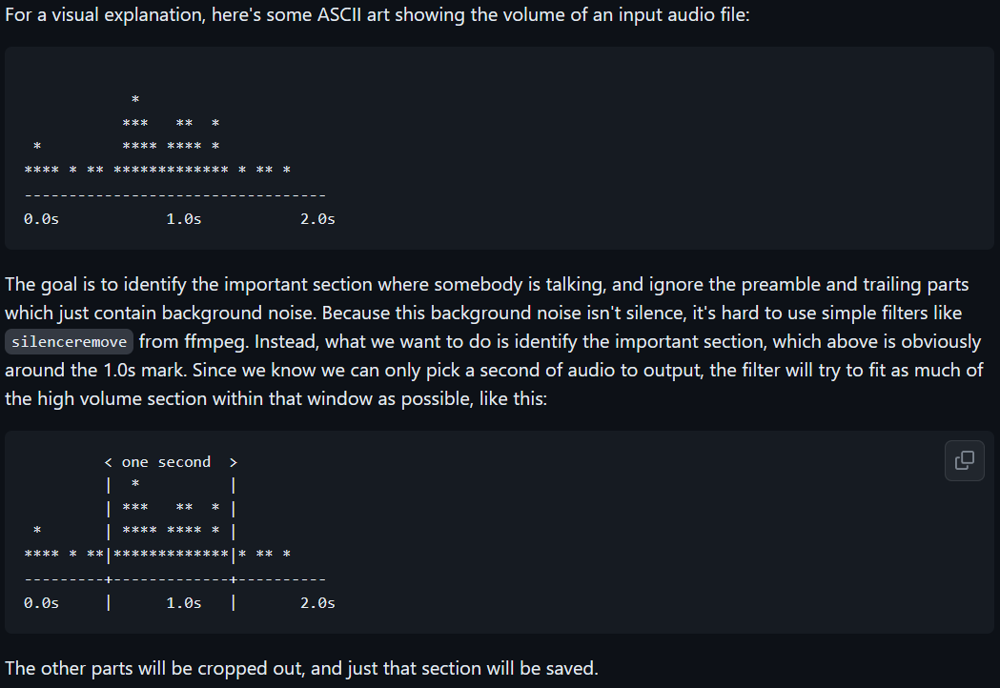
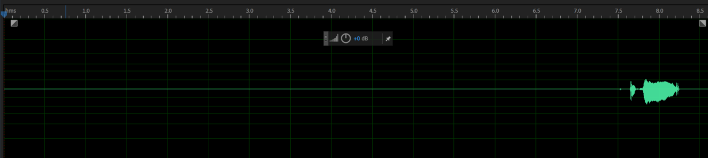
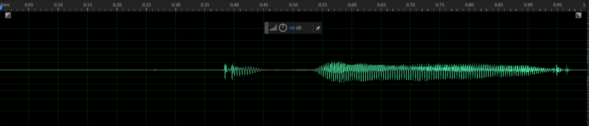

# remove silent section from wav file

This is the content to remove the silence at the beginning and end of the voice file sample used in the voice recognition service.
<br><br>


## extrace_loudest_section
<br>
You can download and build the source code created by petewarden from Github. These source codes are written in C++ and can be compiled on Linux or Unix.

**This program targets short spoken speech and extracts 1 second of the part with the highest energy density in the audio file. Therefore, it cannot be used when there are many utterances. It is mainly used for word-oriented utterances.**  <br /><br />

 <br /><br />


``` bash
# Clone
git clone https://github.com/petewarden/extract_loudest_section.git

# build command. The output executable might be created at /tmp/extract_loudest_section/gen/bin/
cd extract_loudest_section
make
```
<br><br>

## Example
<br><br />
The following is the audio file to be used for testing. As you can see in the figure, there is about 7.5 seconds of silence in the front part. The file will be saved as ./input/sample.wav file and the file format is 8000Hz, 16bit, mono. The directory to save the result file is ./output.


<br><br>

 <br />

``` bash
#run command . 
[root@rocky extract_loudest_section]# /tmp/extract_loudest_section/gen/bin/extract_loudest_section ./input/*.wav ./output
Saved to './output/sample.wav'
[root@rocky extract_loudest_section]# ll output/
total 16
-rw-r--r--. 1 root root 16044 Apr  1 17:57 sample.wav
```
Now let's look at the waveform of the resulting file. 

 <br />

It can be seen that the total length of the audio file is 1 second, and the section with high energy (the section where speech is made) has been extracted.
<br><br />

## Under the Hood
<br>
What if you want to extract a high-energy section of 2 seconds instead of 1 second from your audio file?
If you look at the bottom part of the main.cc file 
<br><br> 

``` c++
  assert(input_filenames.size() == output_filenames.size());
  for (int64_t i = 0; i < input_filenames.size(); ++i) {
    const std::string input_filename = input_filenames[i];
    const std::string output_filename = output_filenames[i];
    const int64_t desired_length_ms = 1000;
    const float min_volume = 0.004f;
    Status trim_status =
      TrimFile(input_filename, output_filename, desired_length_ms, min_volume);
    if (!trim_status.ok()) {
      std::cerr << "Failed on '" << input_filename << "' => '"
                << output_filename << "' with error " << trim_status;
    }
  }
```

<br />
After changing desired_length_ms value from 1000 to 2000, build again. <br /><br />

``` c++
    const int64_t desired_length_ms = 2000;
```


