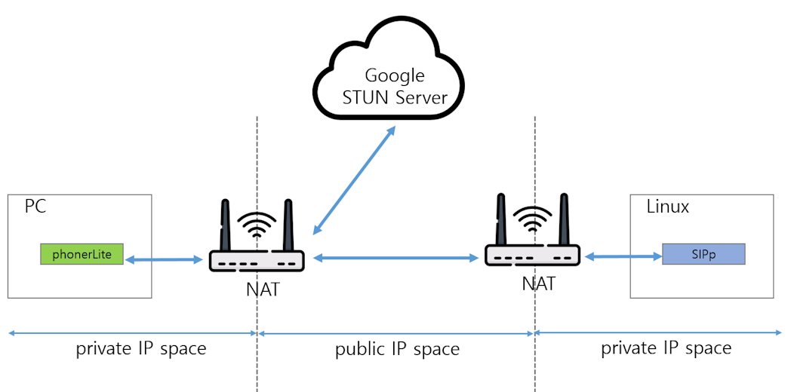
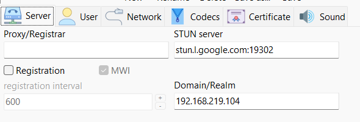
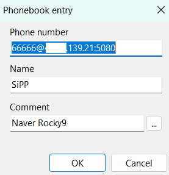
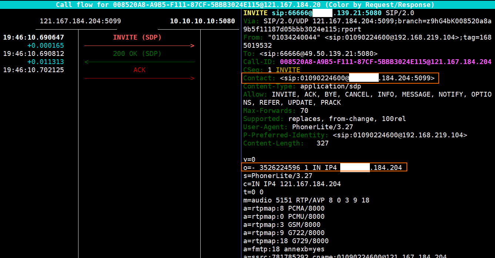
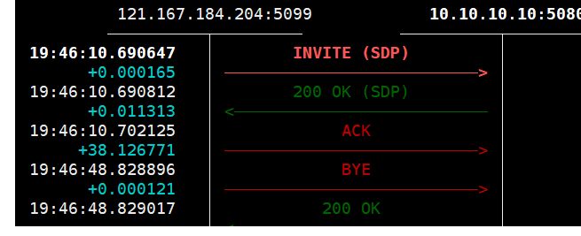

# Overview

One of the most important use cases for SIPp is generating high volumes of traffic to perform load testing on SIP servers, such as PBX systems.
This article examines a scenario that generates a large volume of SIP traffic directed at a target PBX for this purpose.

<br><br>

# Basic Outbound

<br>


This SIPp scenario defines a basic UAC (User Agent Client) call flow that includes audio playback using a PCAP file.
Here is a brief breakdown of the workflow:

1. Call Setup: Sends an INVITE request with SDP information to initiate the call and waits for a 200 OK response (ignoring optional 100/180 provisional responses).
2. ACK & Media Playback: Sends an ACK to establish the session and immediately triggers the play_pcap_audio="a.pcap" action within a <nop> tag to start playing the audio file.
3. Call Duration: Uses a <pause> tag set to 10,000 milliseconds (10 seconds) to keep the call connected while the PCAP audio is playing.
4. Call Teardown: Sends a BYE request to hang up the call and waits to receive a final 200 OK response to properly close the session.

<br>


```xml
<?xml version="1.0" encoding="UTF-8" ?>
<scenario name="UAC with PCAP Play">
  
  <!-- 1. Send INVITE -->
  <send retrans="500">
    <![CDATA[
      INVITE sip:[service]@[remote_ip]:[remote_port] SIP/2.0
      Via: SIP/2.0/[transport] [local_ip]:[local_port];branch=[branch]
      From: sipp <sip:sipp@[local_ip]:[local_port]>;tag=[pid]SIPpTag00[call_number]
      To: <sip:[service]@[remote_ip]:[remote_port]>
      Call-ID: [call_id]
      CSeq: 1 INVITE
      Contact: sip:sipp@[local_ip]:[local_port]
      Max-Forwards: 70
      Subject: PCAP Play Test
      Content-Type: application/sdp
      Content-Length: [len]

      v=0
      o=user1 53655765 2353687637 IN IP[local_ip_type] [local_ip]
      s=-
      c=IN IP[local_ip_type] [local_ip]
      t=0 0
      m=audio [media_port] RTP/AVP 0
      a=rtpmap:0 PCMU/8000
    ]]>
  </send>

  <recv response="100" optional="true"></recv>
  <recv response="180" optional="true"></recv>
  <recv response="200" rtd="true"></recv>

  <!-- 2. Send ACK and start playing PCAP file -->
  <send>
    <![CDATA[
      ACK sip:[service]@[remote_ip]:[remote_port] SIP/2.0
      Via: SIP/2.0/[transport] [local_ip]:[local_port];branch=[branch]
      From: sipp <sip:sipp@[local_ip]:[local_port]>;tag=[pid]SIPpTag00[call_number]
      To: <sip:[service]@[remote_ip]:[remote_port]>[peer_tag_param]
      Call-ID: [call_id]
      CSeq: 1 ACK
      Contact: sip:sipp@[local_ip]:[local_port]
      Max-Forwards: 70
      Subject: PCAP Play Test
      Content-Length: 0
    ]]>
  </send>

  <nop>
    <action>
      <!-- Play a.pcap file -->
      <exec play_pcap_audio="a.pcap"/>
    </action>
  </nop>

  <!-- 3. Pause for the duration of the PCAP play (e.g., set 10000ms for a 10-second play) -->
  <pause milliseconds="10000"/>

  <!-- 4. Send BYE to terminate the call -->
  <send retrans="500">
    <![CDATA[
      BYE sip:[service]@[remote_ip]:[remote_port] SIP/2.0
      Via: SIP/2.0/[transport] [local_ip]:[local_port];branch=[branch]
      From: sipp <sip:sipp@[local_ip]:[local_port]>;tag=[pid]SIPpTag00[call_number]
      To: <sip:[service]@[remote_ip]:[remote_port]>[peer_tag_param]
      Call-ID: [call_id]
      CSeq: 2 BYE
      Contact: sip:sipp@[local_ip]:[local_port]
      Max-Forwards: 70
      Subject: PCAP Play Test
      Content-Length: 0
    ]]>
  </send>

  <recv response="200" crlf="true"></recv>

</scenario>
```

<br>

If you want to make 100 outbound calls simultaneously, you can use the `sipp` command as follows.

<br>

```bash
sipp [Target_IP]:[port] -sf uac_pcap.xml -s [destination_number] -m 100 -l 100 -r 100
```

<br>

The -m 100, -l 100, and -r 100 options have the following meanings.

### -m [number]

* Specifies the total number of calls.
* Example: -m 100 → Generates a total of 100 calls and then terminates. If you want to re-send calls after they finish to test a total of 1,000 calls, simply change this value to 1,000.   

### -l [number]

* Limits the maximum number of concurrent calls.
* Example: -l 100 → Maintains a maximum of 100 concurrent calls.
* If -m is 1000 and -l is 100, no new calls are initiated while 100 calls are in progress; the next call begins only after an existing call completes.

### -r [number]

* Specifies the call generation rate (Calls per Second, CPS).
* Example: -r 100 → Generates 100 calls per second. Since this value is 100, 100 calls are sent simultaneously.

The method for creating pcap audio files was explained in [SIPp overview and Implementing SIPp Inbound Services in a NAT Environment ](https://example.com)


<br>


# Testing SIPp in a NAT environment

<br>

Most VoIP devices today operate in NAT environments. Therefore, we will create a scenario in which a client (PhonerLite) located in a NAT environment places a call to SIPp, which is also situated in a NAT environment.

Unlike softswitches such as FreeSWITCH and Asterisk, SIPp does not fully support NAT environments. Therefore, it is advisable to configure the endpoint (PhonerLite) located behind NAT to use a STUN server to identify and utilize its public IP address.

<br>



*Figure 1: Test Call Flow*


<br>

## PhonerLite in a NAT environment

<br>

Configure the Google STUN server in the PhonerLite configuration settings under "Server," as shown in the image below.
When a STUN server is configured, the softphone no longer uses a local private IP address but instead uses the public IP address obtained from the STUN server.

<br>



*Figure 2: Configuring a STUN server*

<br>

### make a PhonerLite phonebook item

<br>

To facilitate SIPp connection testing, add an entry to the PhoneBook as follows.
SIPp will listen on port 5080, and the server address (X.X.139.21) is the public IP of the host where SIPp is running.

<br>




<br>

## SIPp in a NAT environment

<br>

<br>

### Preparing Audio

<br>

SIPp lacks an audio streaming engine and codecs.
The reason for this is easily inferred: SIPp is designed for high-volume call processing tests. Consequently, it maximizes processing performance by focusing on high-volume signaling handling and avoiding the use of codecs or audio streaming engines.

To stream audio, SIPp requires a pcap file containing captured RTP network packets.
The RTP pcap file holds pre-encoded audio, and the stored RTP packets include timestamps indicating when they were sent. Streaming is performed by utilizing these time intervals. It is an intelligent architecture that processes RTP while minimizing CPU usage.
Therefore, it is advisable to pre-generate the audio source to be played—in the form of a pcap file—for use when the call connects.

If you have audio files such as MP3 or WAV, you can create a pcap file using ffmpeg and tcpdump as follows.


```bash
# First console. 
# It stores data arriving on the local interface via UDP port 10000.
sudo tcpdump -i lo -n -w music_pcmu.pcap udp port 10000

# Second console
# Play the `bg.wav` file using ffmpeg, but fix the sample size to 160 bytes to match the packet size.
# 160 bytes corresponds to the audio size for a `ptime` of 20 when using the G.711 codec.
ffmpeg -re -i bg.wav -vn -af asetnsamples=160 -acodec pcm_mulaw -ar 8000 -ac 1 -f rtp rtp://127.0.0.1:10000

```

By stopping tcpdump after the ffmpeg playback finishes, you can create a pcap file containing the audio data. While `pcm_mulaw` is specified as the codec for ffmpeg playback, specifying `pcm_alaw` instead allows you to create a pcap file encoded in A-law.


<br>

### Preparing Scenarion Xml 

<br>

SIPp uses XML for its default scenarios. Create the XML as shown below.
This XML includes information on the audio file to be played upon connection (the file created earlier) and codec details.
It also contains the public IP address (X.X.139.21) of the host where SIPp is running. When SIPp operates in a NAT environment, private IP information is not required.
If SIPp interacts with a device located on the same host or within the internal network, use a private IP address instead of a public IP address.

<br>

```xml
<?xml version="1.0" encoding="ISO-8859-1" ?>
<scenario name="UAS Loop Media">

  <!-- 1. Receive initial INVITE -->
  <recv request="INVITE" />

  <!-- 2. Send initial 200 OK
    retrans means...  After sending the message, it is retransmitted at 500ms intervals.-->
  <send retrans="500">
    <![CDATA[
      SIP/2.0 200 OK
      [last_Via:]
      [last_From:]
      [last_To:];tag=[pid]SIPpTag[call_number]
      [last_Call-ID:]
      [last_CSeq:]
      Contact: <sip:X.X.139.21:[local_port]>
      Content-Type: application/sdp
      Content-Length: [len]

      v=0
      o=user1 53655765 2353687637 IN IP4 X.X.139.21
      s=SIPp
      c=IN IP4 X.X.139.21
      t=0 0
      m=audio [media_port] RTP/AVP 0
      a=rtpmap:0 PCMU/8000
    ]]>
  </send>

  <!-- 3. Receive initial ACK -->
  <recv request="ACK" />

  <!-- Start media playback loop -->
  <label id="play_media" />
  <nop>
    <action>
      <exec play_pcap_audio="/usr/local/src/sipp/pcap/music_pcmu.pcap"/>
    </action>

```


<br>

### Preparing SIPp command

<br>

Prepare the SIPp command as follows.

<br>

``` bash
# sipp -sf uas_media.xml -i [local ip] -mi [local ip] -p [sip port] -mp [local media port]

sipp -sf uas_media.xml -i 10.10.10.10 -mi l10.10.10.10 -p 5080 -mp 10000

```


<br>

## Test

<br>

Everything is now ready. Run SIPp as follows. Then, using PhoneLite on your PC, place a call to the address in the phonebook you created earlier.

<br>

```bash
sipp -sf uas_media.xml -i 10.10.10.10 -mi 10.10.10.10 -p 5080 -mp 100001:10000

```

If there are no issues with settings such as the firewall, the audio file you created (bg.wav) will play on your PC. And the call information will appear on the SIPp screen as follows.

```bash
------------------------------ Scenario Screen -------- [1-9]: Change Screen --
  Port   Total-time  Total-calls  Transport
  5080      91.15 s            2  UDP

  0 new calls during 1.001 s period	  1 ms scheduler resolution
  1 calls                                 Peak was 1 calls, after 53 s
  0 Running, 3 Paused, 3 Woken up
  0 dead call msg (discarded)
  3 open sockets                          0/0/0 UDP errors (send/recv/cong)
  768 Total RTP pckts sent                0.000 last period RTP rate (kB/s)

                                 Messages  Retrans   Timeout   Unexpected-Msg
0 :  ----------> INVITE             2         0         0         0
1 :  <---------- 200                2         4         0
2 :  ----------> ACK                1         0         0         0
3 :              [ NOP ]
4 :  ----------> INVITE             0         0         0         0
5 :  ----------> BYE                1         0         0         0
6 :  <---------- 200                1         0
7 :  <---------- 200                0         0
8 :  ----------> ACK                0         0         0         0
------------------------------ SIPp Server Mode -------------------------------

```

<br>

If you use sngrep to inspect SIP packets, the call should be established as follows for it to be considered normal. The INVITE message will display information as shown below. The boxed area indicates the part where the address was changed to a public IP due to the use of a STUN server.



And if you terminate the call, you can also verify the handling of the BYE message.

<br>



<br>

## Add IP Authentication

<br>

If you run SIPp as a daemon program, IP authentication for incoming trunk calls may be required.
In this case, you can add the following ACL information to the XML file using a regular expression.
The XML below uses a regular expression to validate the IP address; if the condition is met, it sends a ring signal, and otherwise, it terminates the call.

```xml
<!-- Receive INVITE and check IP -->
<recv request="INVITE">
  <action>
    <!-- Check if the allowed IP (e.g., 192.168.1.50) exists in the Via header and save the result to the 'ip_matched' variable -->
    <ereg regexp="192\.168\.1\.50" search_in="hdr" header="Via:" assign_to="ip_matched"/>
  </action>
</recv>
<!-- If the regular expression matches (allowed IP), jump to the 'accept_invite' label -->

<nop next="accept_invite" test="ip_matched"/>
<!-- If the regular expression does not match (disallowed IP), respond with 403 Forbidden -->
<send>
  <![CDATA[
    SIP/2.0 403 Forbidden
    [last_Via:]
    [last_From:]
    [last_To:];tag=[pid]SIPpTag01[call_number]
    [last_Call-ID:]
    [last_CSeq:]
    Content-Length: 0
  ]]>
</send>
<!-- Jump to the call termination label -->
<nop next="end_call"/>

 <!-- === Allowed IP processing area === -->

<label id="accept_invite"/>
<send>
  <![CDATA[
    SIP/2.0 180 Ringing
    [last_Via:]
    [last_From:]
    [last_To:];tag=[pid]SIPpTag01[call_number]
    [last_Call-ID:]
    [last_CSeq:]
    Content-Length: 0
  ]]>
</send>
```


