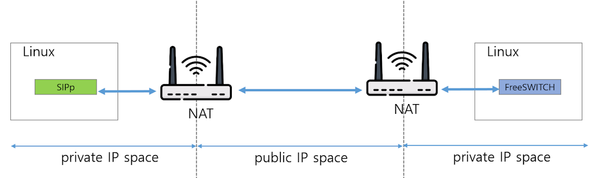
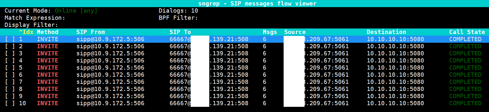
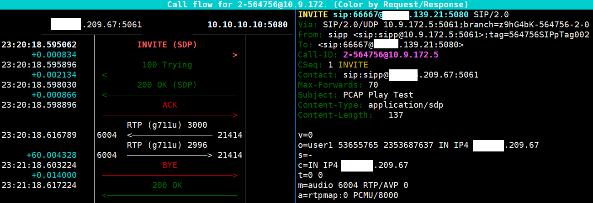
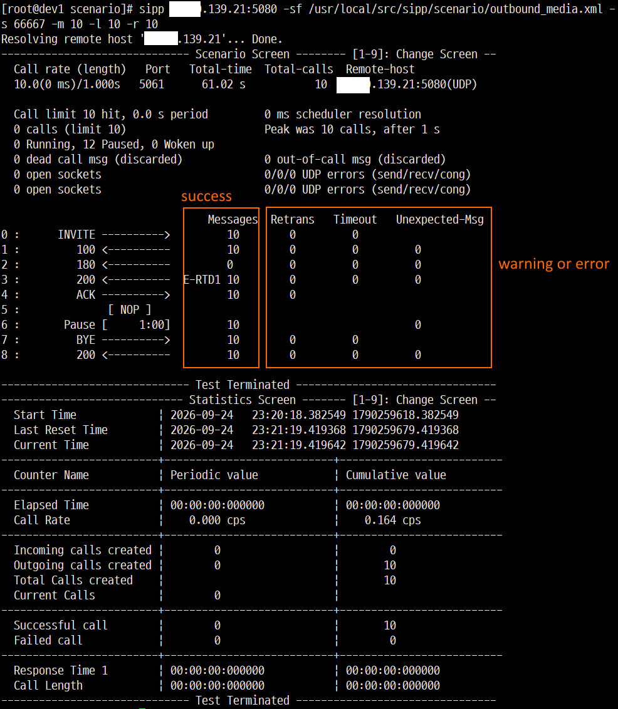

# Overview

One of the most important use cases for SIPp is generating high volumes of traffic to perform load testing on SIP servers, such as PBX systems.
This article examines a scenario that generates a large volume of SIP traffic directed at a target PBX for this purpose.




<br><br>

# Basic Outbound

<br>


This SIPp scenario defines a basic UAC (User Agent Client) call flow that includes audio playback using a PCAP file.
Here is a brief breakdown of the workflow:

1. Call Setup: Sends an INVITE request with SDP information to initiate the call and waits for a 200 OK response (ignoring optional 100/180 provisional responses).
2. ACK & Media Playback: Sends an ACK to establish the session and immediately triggers the play_pcap_audio="a.pcap" action within a <nop> tag to start playing the audio file.
3. Call Duration: Uses a <pause> tag set to 10,000 milliseconds (10 seconds) to keep the call connected while the PCAP audio is playing.
4. Call Teardown: Sends a BYE request to hang up the call and waits to receive a final 200 OK response to properly close the session.


There is one point to note.
Unlike the inbound scenario(UAS scenario), this scenario(UAC scenario) does not involve waiting for a BYE message.
Therefore, a `pause` command is used to specify the call duration, after which the call is terminated. This duration should be set to match the playback time of the announcement file (bg.wav).

Although 10 seconds was specified in the scenario below, you can adjust this duration to change the call duration.

There is one more point to note.
To maintain distinct RTP ports while simultaneously creating two or more calls, you must use `auto_media_port` instead of `media_port` within the SDP section of the XML file.

<br>


```xml
<?xml version="1.0" encoding="UTF-8" ?>
<scenario name="UAC with PCAP Play">
  
  <!-- 1. Send INVITE -->
  <send retrans="500">
    <![CDATA[
      INVITE sip:[service]@[remote_ip]:[remote_port] SIP/2.0
      Via: SIP/2.0/[transport] [local_ip]:[local_port];branch=[branch]
      From: sipp <sip:sipp@[local_ip]:[local_port]>;tag=[pid]SIPpTag00[call_number]
      To: <sip:[service]@[remote_ip]:[remote_port]>
      Call-ID: [call_id]
      CSeq: 1 INVITE
      Contact: sip:sipp@[public_ip]:[local_port]
      Max-Forwards: 70
      Subject: PCAP Play Test
      Content-Type: application/sdp
      Content-Length: [len]

      v=0
      o=user1 53655765 2353687637 IN IP[local_ip_type] [public_ip]
      s=-
      c=IN IP[local_ip_type] [public_ip]
      t=0 0
      m=audio [auto_media_port] RTP/AVP 0
      a=rtpmap:0 PCMU/8000
    ]]>
  </send>

  <recv response="100" optional="true"></recv>
  <recv response="180" optional="true"></recv>
  <recv response="200" rtd="true"></recv>

  <!-- 2. Send ACK and start playing PCAP file -->
  <send>
    <![CDATA[
      ACK sip:[service]@[remote_ip]:[remote_port] SIP/2.0
      Via: SIP/2.0/[transport] [local_ip]:[local_port];branch=[branch]
      From: sipp <sip:sipp@[local_ip]:[local_port]>;tag=[pid]SIPpTag00[call_number]
      To: <sip:[service]@[remote_ip]:[remote_port]>[peer_tag_param]
      Call-ID: [call_id]
      CSeq: 1 ACK
      Contact: sip:sipp@[public_ip]:[local_port]
      Max-Forwards: 70
      Subject: PCAP Play Test
      Content-Length: 0
    ]]>
  </send>

  <nop>
    <action>
      <!-- Play a.pcap file -->
      <exec play_pcap_audio="a.pcap"/>
    </action>
  </nop>

  <!-- 3. Pause for the duration of the PCAP play (e.g., set 10000ms for a 10-second play) -->
  <pause milliseconds="10000"/>

  <!-- 4. Send BYE to terminate the call -->
  <send retrans="500">
    <![CDATA[
      BYE sip:[service]@[remote_ip]:[remote_port] SIP/2.0
      Via: SIP/2.0/[transport] [local_ip]:[local_port];branch=[branch]
      From: sipp <sip:sipp@[local_ip]:[local_port]>;tag=[pid]SIPpTag00[call_number]
      To: <sip:[service]@[remote_ip]:[remote_port]>[peer_tag_param]
      Call-ID: [call_id]
      CSeq: 2 BYE
      Contact: sip:sipp@[public_ip]:[local_port]
      Max-Forwards: 70
      Subject: PCAP Play Test
      Content-Length: 0
    ]]>
  </send>

  <recv response="200" crlf="true"></recv>

</scenario>
```

<br>

If you want to make 100 outbound calls simultaneously, you can use the `sipp` command as follows.

<br>

```bash
sipp [Target_IP]:[port] -sf uac_pcap.xml -key public_ip X.X.209.67 -s [destination_number] -m 100 -l 100 -r 100
```

<br>

The -m 100, -l 100, and -r 100 options have the following meanings.

### -m [number]

* Specifies the total number of calls.
* Example: -m 100 → Generates a total of 100 calls and then terminates. If you want to re-send calls after they finish to test a total of 1,000 calls, simply change this value to 1,000.   

### -l [number]

* Limits the maximum number of concurrent calls.
* Example: -l 100 → Maintains a maximum of 100 concurrent calls.
* If -m is 1000 and -l is 100, no new calls are initiated while 100 calls are in progress; the next call begins only after an existing call completes.

### -r [number]

* Specifies the call generation rate (Calls per Second, CPS).
* Example: -r 100 → Generates 100 calls per second. Since this value is 100, 100 calls are sent simultaneously.

<br>


The method for creating pcap audio files was explained in [SIPp overview and Implementing SIPp Inbound Services in a NAT Environment ](https://github.com/raspberry-pi-maker/VoIP-related-codes/blob/main/Tools%20and%20Tips/sipp/SIPp%20overview%20and%20Implementing%20SIPp%20Inbound%20Services%20in%20a%20NAT%20Environment%20.md)


<br><br>

# Test Result

<br>

I ran FreeSWITCH on one Linux machine and sipp on the other. 



*Figure 2: sngrep result of FreeSWITCH side host*

It can be seen that 10 calls have been successfully created.


<br>



*Figure 3: sngrep result of FreeSWITCH side call flow*

It can be seen that SIP call signaling and RTP packets were successfully transmitted and received in both directions.


<br>



*Figure 4: sngrep result of sipp side host*

You can also confirm in SIPp that 10 calls were successfully established and all terminated normally after one minute.
