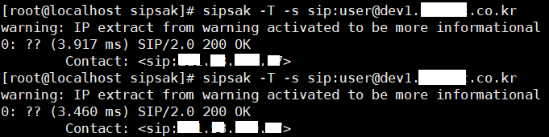
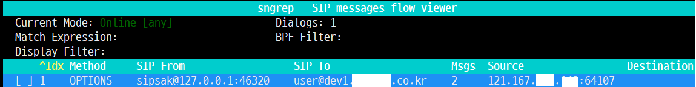

# sipsak

Sipsak is a lightweight, command-line tool designed for testing and troubleshooting SIP (Session Initiation Protocol) connections, widely used in VoIP environments. It allows engineers to quickly verify SIP server availability, diagnose issues, and trace message flows.

Sipsak is essentially the “ping” tool for SIP networks, offering VoIP professionals a simple yet powerful way to test and troubleshoot SIP connectivity, registrations, and signaling flows from the command line. It’s widely appreciated for being lightweight, reliable, and versatile in real-world VoIP diagnostics.

<br>

## Key Features of Sipsak

It is particularly useful when testing integration with PBXs such as Asterisk and FreeSwitch.

If it is difficult to install a SIP endpoint, you can use sipsak to easily check whether the endpoint is registered with the PBX and whether an INVITE message is processed successfully to establish a call.

* SIP Diagnostics: Send SIP OPTIONS pings to check server responsiveness.

* Registration Testing: Simulate SIP client registrations to ensure proper server handling.

* Message Flow Tracing: Observe SIP signaling exchanges for troubleshooting.

* Connectivity Verification: Test bidirectional UDP connectivity with SIP providers.

* Lightweight & CLI-based: Runs directly from the terminal on Linux, macOS, or Windows.

<br>

## Typical Use Cases

* VoIP Engineers & Administrators: Quickly confirm SIP trunks or servers are operational.

* Network Troubleshooting: Similar to using ping for IP connectivity, but focused on SIP control-plane testing.

* Routine Health Checks: Validate SIP infrastructure during deployment or maintenance.

<br>

## Install Sipsak


<br>

### Install build tools

```bash
sudo dnf groupinstall "Development Tools" -y
sudo dnf install git autoconf automake libtool -y

```

<br>

### Clone the repository and build

```bash
git clone https://github.com/nils-ohlmeier/sipsak.git
cd sipsak
autoreconf -i
./configure
make
sudo make install

```

<br>

### Verify Installation

```bash
sipsak --version
sipsak 0.9.9-pre  by Nils Ohlmeier
 Copyright (C) 2002-2004 FhG Fokus
 Copyright (C) 2004-2005 Nils Ohlmeier
 compiled with DEFAULT_TIMEOUT=500, FQDN_SIZE=65, RAW_SUPPORT, LONG_OPTS, INTERNAL_MD5, TLS_SUPPORT(GNUTLS), STR_CASE_INSENSITIVE, CMP_CASE_INSENSITIVE

```

<br>

## Useful usage

<br>

### Connection verification using OPTION messages

You can check if communication with the SIP Server is working properly using the following command.
You can view detailed output using the -vv option.

```bash
sipsak -s sip:username@sipserver.com
sipsak -vv -s sip:username@sipserver.com:5060
sipsak -vv -s sip:username@sipserver.com:5060
#if you want to use tcp connection
sipsak -vv -T -s sip:username@example.com
```
<br>

### REGISTER messages

You can verify whether the terminal is successfully registered by sending a REGISTER message to the SIP Server.

```bash
sipsak -U -s sip:1001@sipserver.com
sipsak -U -s sip:1001@example.com -u 1001 -a mypassword
sipsak -T -U -s sip:1001@example.com -u 1001 -a mypassword
# -S : use TLS connection
sipsak -S -U -s sip:1001@example.com -u 1001 -a mypassword
```

<br>

### INVITE messages

You can establish a call by sending INVITE messages to the SIP Server.
However, the server's dial plan must be prepared in advance.
Sipsak sends an INVITE message including SDP, and if the actual call is successful, it sends a dummy RTP packet to the server. It then receives and discards the RTP packet sent by the server. (There is no audio playback function.)

```bash
sipsak -I -s sip:1001@example.com
# -T:tcp connection 
sipsak -I -T -s sip:1001@example.com -u 1001 -a mypassword

```

<br>

## Using with sngrep

<br>

To verify that packets sent via sipsak are being processed correctly, it is recommended to use sngrep in conjunction with it.

If possible, install sngrep (or tcpdump) on both the SIP Server and the host where sipsak is installed.
The following is the result of sending an OPTION message from the host using sipsak and verifying it with sngrep installed on the PBX.

Verifying from both sides in this way is the most accurate method and is also advantageous when trying to find the cause of a failure.



*Figure 1: sending OPTION message from sipsak*
<br>




*Figure 2: Received OPTION message from PBX*

