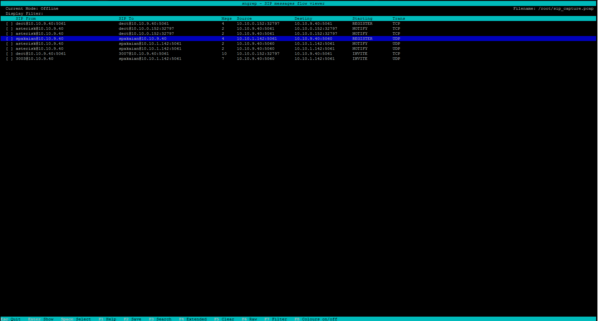
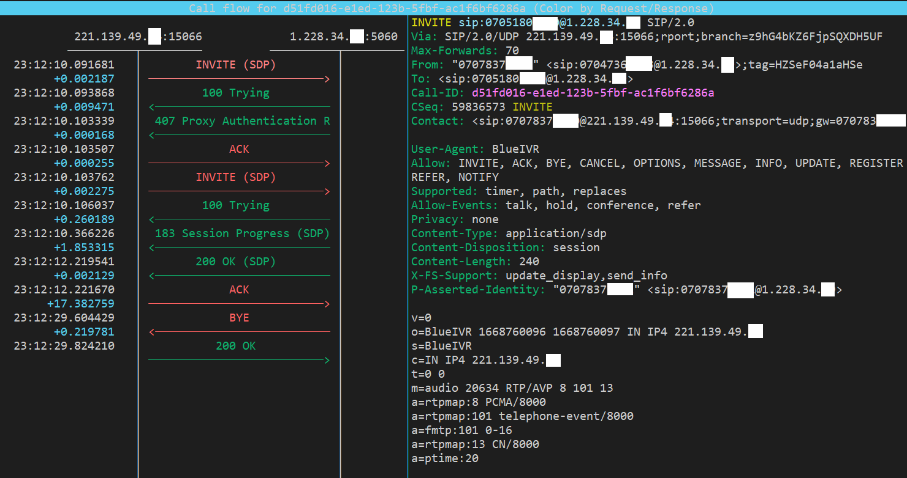
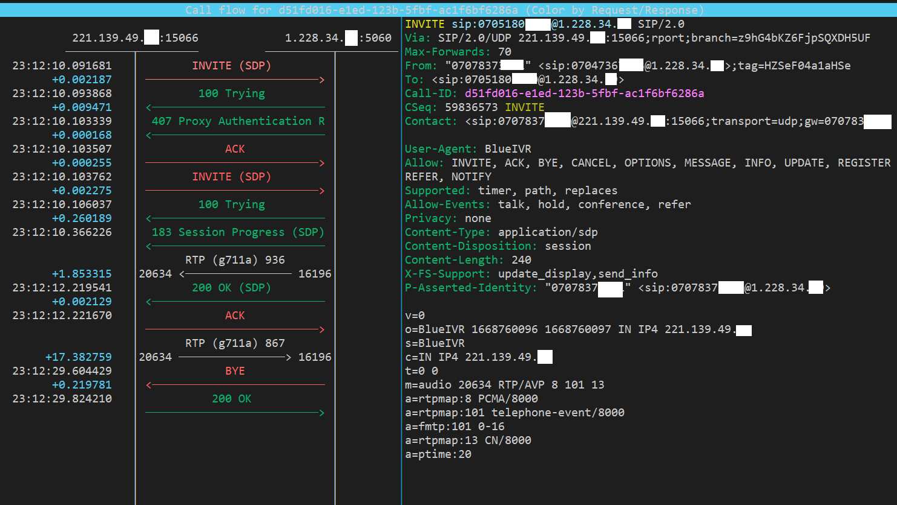
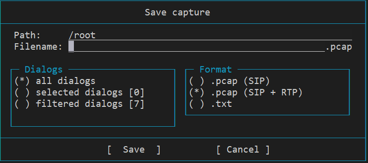

# sngrep

The most commonly used tool for capturing and inspecting network packets is probably WireShark. WireShark is also an open-source tool that can be used for free, with the advantages of using Windows, Mac, and Linux. WireShark is also very useful for VoIP packet analysis. It is possible to analyze not only signaling protocols such as SIP and H.323 but also RTP voice packets. In addition, voice can be played using the collected RTP packets and even call quality can be analyzed.

However, this program works in a GUI environment. Therefore, it is not suitable for use in the CLI environment. X.11 forwarding for using the GUI in a CLI environment is not covered here.
There is also a TShark program that can perform functions like Wireshark in a CLI environment.  

However, both Wireshark and TShark are tools for general-purpose network packet analysis.  These packages are too large to analyze only Session Initiation Protocol (SIP). 
In the CLI environment, sngrep is a program specialized for SIP protocol analysis. The program is compact compared to Wireshark and consumes much less system resources because it does not capture unnecessary packets except for SIP.
<br><br>

## build from source and installation

If you want to use the latest version, build your own source code. <br>
Install the following packages in advance for your Linux distribution.
<br><br>

### Prerequisites

* libncurses5 - for UI, windows, panels.
* libpcap - for capturing packets.
* libssl - (optional) for TLS transport decrypt using OpenSSL and libcrypt
* gnutls - (optional) for TLS transport decrypt using GnuTLS and libgcrypt
* libncursesw5 - (optional) for UI, windows, panels (wide-character support)
* libpcre - (optional) for Perl Compatible regular expressions
* zlib - (optional) for gzip compressed pcap files

``` bash
git clone https://github.com/irontec/sngrep.git
cd sngrep 
./bootstrap.sh
./configure
make
sudo make install (as root)
```
<br>

## Installing Binaries

The https://github.com/irontec/sngrep/wiki/Installing-Binaries#centos--fedora--rhel page explains how to install for different distributions.

<br>

## Realtime monitoring 
From now on, you must execute commands with root privileges. 
To monitor the SIP protocol in real time, just use the sngrep command.
<br>

``` bash
sngrep 
```
Then you can see the screen like this.
<br/>

<br/>

### Filtering
If you want to analyze only invite messages, register, option messages, etc. are quite annoying. In particular, it is more difficult to find invite messages when there are many of these packets. You can use filtering if you want to see a specific message. Press the shortcut F7 to display a filter dialog window. You can see a list of shortcuts at the bottom of the main screen.

<br/>

Press the shortcut F7 to display a filter dialog window. You can see a list of shortcuts at the bottom of the main screen.
<br/><br/>

### Analyzing SIP Call
The SIP call begins with an INVITE message and ends with BYE. All packets in between are not visible on the main screen for readability. You can move the cursor up and down using the keyboard on the main screen. If you press the enter key in the INVITE Message to be analyzed, the entire process of the call can be viewed.



And on this screen, by moving the cursor up and down using the mouse, you can check the contents of INVITE, Trying,... from the top in the right pane. The above figure is a picture with the cursor in the INVITE. <br><br> This picture alone is very helpful in identifying calls because you can check the flow and time information of the entire call at a glance. However, in the above figure, SIP signaling information is visible at a glance, but RTP information is not known. The payload value used in the RTP packet is unknown.  <br><br> 

### RTP Monitoring
Press F3 on the screen above to add RTP information like this.
  <br><br> 

The G711a codec is used, and the ports that send and receive RTP을 are 20634 and 16196, and the number of packets is 936 and 867 respectively.
 <br><br> 

### Save as pcap file
Packets monitored in real time can be stored and viewed again later. Saving is possible on the main screen. If you press Esc to go back to the main screen, it can be seen that you can save it using the F2 shortcut at the bottom of the screen.

  <br><br> 
If there is no specific purpose, it is recommended to save it in the form of a pcap file. It is convenient to analyze later using Wireshark or sngrep.

<br><br>
Currently, in the above figure, SIP + RTP is selected. If you want to save up to RTP, give the -r option at the start of sngrep.

``` bash
sngrep -r
```
You can then save it as a SIP + RTP option.

  <br><br> 


## Analyzing pcap file
Maybe you can't sit down for real-time monitoring. In this case, you can use the tcpdump command to save the network packet and then leave for a while. And after you return, exit the tcpdump command and check the saved pcap file. Alternatively, the saved file may be checked again using the sngrep's pcap format storage function described above.
Now, only SIP-related contents among contents stored in the pcap file can be checked using sngrep. The filtering parameter of sngrep is almost the same as the filtering parameter of tcpdump.<br>
The following command analyzes only SIP packets using the 5060 port (tcp and udp) by the IP 192.168.150.1 host in the saved pcap file. 
<br>


``` bash
sngrep -I file.pcap host 192.168.150.1 and port 5060
```

