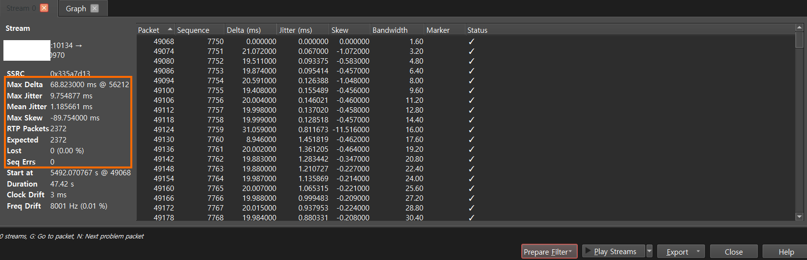

# pcap

Wireshark and tcpdump provide functions to extract and save network packets input and output to the host.
WireShark provides a GUI version and also provides a function to analyze saved network packets.

I mainly use Wireshark only on Windows OS to capture and analyze packets.

However, since I often do not use GUI on Linux hosts, I save packets using tcpdump, then move the files to a Windows PC and analyze them using Wireshark.


An important library that is commonly used by both Wireshark and tcpdump programs is the pcap library. This library can only be used with root privileges in the Linux version.
It is also possible to program to directly capture or analyze pcap network packets using the pcap library. For information on how to use the pcap library, see the following link.

* [pcap file Analyzing](https://github.com/raspberry-pi-maker/VoIP-related-codes/tree/main/pcap/pcap%20file%20Analyzing). 

* [pcap samples](https://github.com/raspberry-pi-maker/VoIP-related-codes/tree/main/pcap/pcap%20samples). 

<br/><br/>

The library dependencies of these two programs on Windows and Linux are as follows:


<p align="center">
  < Windows Wireshark libraries dependencies >
</p>

<br/>


<p align="center">
  < Linux tcpdump libraries dependencies >
</p>

<br/>

## Jitter

VoIP jitter refers to the irregular arrival of data packets during a call, causing disruptions in communication, such as delays, echoing, and audio/video distortions.
The formula for calculating the JItter value is defined in RFC3550 (RTP).


The following content is taken from [RTP statistics](https://wiki.wireshark.org/RTP_statistics).


If Si is the RTP timestamp from packet i, and Ri is the time of arrival in RTP timestamp units for packet i, then for two packets i and j, D may be expressed as

D(i,j) = (Rj - Ri) - (Sj - Si) = (Rj - Sj) - (Ri - Si)

The interarrival jitter SHOULD be calculated continuously as each data packet i is received from source SSRC_n, using this difference D for that packet and the previous packet i-1 in order of arrival (not necessarily in sequence), according to the formula

J(i) = J(i-1) + (|D(i-1,i)| - J(i-1))/16

RTP timestamp: RTP timestamp is based on the sampling frequency of the codec, 8000 in most audio codecs and 90000 in most video codecs. As the sampling frequency must be known to correctly calculate jitter it is problematic to do jitter calculations for dynamic payload types as the codec and it's sampling frequency must be known which implies that the setup information for the session must be in the trace and the codec used must be known to the program(with the current implementation).

Developers with time to spend could change the current implementation to also record the sampling frequency in the SDP data and add that to the RTP conversation data and use that in the RTP analysis.

SampleCaptures: SIP and RTP file: aaa.pcap, stream: SSRC = 932629361 (0x3796CB71)

This is what we have in the packets and what we will use in the formula:

R0 = frame 624: frame.time = Jul 4, 2005 11:56:25.348411000

S0 = frame 624: rtp.timestamp = 1240

R1 = frame 625: frame.time = Jul 4, 2005 11:56:25.418358000

S1 = frame 625: rtp.timestamp = 1400

R2 = frame 626: frame.time = Jul 4, 2005 11:56:25.421891000

S2 = frame 626: rtp.timestamp = 1560

we also have rtp.p_type = ITU-T G.711 PCMA (8) and thus we know sampling clock is 8000Hz and thus the unit of rtp.timestamp is 1/8000 sec = 0.000125 sec .

Now the calculation:

frame 624:

J(0) = 0

frame 625:

D(0,1) = (R1 - R0) - (S1 - S0)

= [in seconds] (.418358000 sec - .348411000 sec) - (1400 * 0.000125 sec - 1240 * 0.000125 sec) = 0.049947

J(1) = J(0) + (|D(0,1)| - J(0))/16

= [in seconds] 0 + (|0.049947| - 0)/16 = 0.0031216875

frame 626:

D(1,2) = (R2 - R1) - (S2 - S1)

= [in seconds] (.421891000 sec - .418358000 sec) - (1560 * 0.000125 sec - 1400 * 0.000125 sec) = -0.016467

J(2) = J(1) + (|D(1,2)| - J(1))/16

= [in seconds] 0.0031216875 + (|-0.016467| - 0.0031216875)/16 = 0.00395576953125


<br/><br/>

# Frequently used tcpdump commands in VoIP

## Capturing RTP packets

<br/>

To capture only RTP packets, you can combine the following commands:
You should first know the packet size according to the codec you are using.
For the G.711 codec used in most VoIP systems, the RTP packet size is as follows. Some codecs may use variable length, so the explanation here may not apply. 
Most ptimes use 20, which results in a packet frame size of 214.


* ptime:20  -> frame:214 ip:200, udp:180(udp header:8 , rtp header:12, g.711:160)
* ptime:30  -> frame:294 ip:280, udp:260(udp header:8 , rtp header:12, g.711:240)
* ptime:40  -> frame:374 ip:360, udp:340(udp header:8 , rtp header:12, g.711:320)

<br/>

```bash
# for G.711 codec ptime 20ms case for this host
tcpdump 'greater 213 and less 215 and udp' -w phones.pcap 

# for G.711 codec ptime 20ms case between this host and 192.168.1.1
tcpdump 'host 192.168.1.1 and greater 213 and less 215 and udp' -w phones.pcap 
```

<br/><br/>

## Capturing SIP packets

<br/>

You need to know the SIP signal port of the host in advance.
Most SIP terminals use udp 5060, 5080.
However, if you need to handle NAT in a router environment, you may use tcp instead of udp.

<br/>

```bash
# 5060, 5080 for both tcp, udp
tcpdump 'port 5060 or port 5080'

# 5060, 5080 for  udp
tcpdump 'port 5060 or port 5080 and udp'
```
<br/><br/>

## Capturing RTP and SIP?

<br/>

If you want to capture both SIP signals and RTP, you can use tcpdump as follows, or you can run two tcpdump processes simultaneously using the method introduced above to create two pcap files and then merge them. 

<br/>

### Capturing both RTP and SIP

<br/>

```bash
tcpdump '(greater 213 and less 215 and udp) or (port 5060 or port 5080)' -w phones.pcap 
```


<br/><br/>

# WireShark for VoIP

<br/>

## Applying SIP Filter

<br/>

Enter sip in lowercase letters in the filter tab. Now, only sip related packets will be displayed in the packet list.

<br/>


If you want to know more about a specific packet, double-click it.

<br/>

## Applying RTP Filter

<br/>

Enter rtp in lowercase letters in the filter tab. Now, only rtp related packets will be displayed in the packet list.

<br/>


If you want to know more about a specific packet, double-click it.


<br/>

## Telephony Menu

<br/>

There are many more useful features in the Telephony menu than the sip and rtp filters.

<br/>

### VoIP Calls

<br/>

It organizes packets saved in a pcap file so that they can be identified by call unit. This menu is very useful if the pcap file contains multiple mixed calls.

**Select the menu when no filter is applied, that is, all packets are visible.**

<br/>


Now you can check call information such as call start and end time, caller, receiver, and call duration on a call-by-call basis.
Select the call you want to analyze and then you can take additional actions using the buttons below.

<br/>

#### Flow Sequence

Provides a visual representation of the SIP message flow.

<br/>


**Clicking on a specific message in the Flow automatically selects the current message in the packet list on the WireShark home screen.**
Provides a function to export the screen image to PDF.

<br/>

#### Play Streams

It separates the rtp packets of the currently selected call into Rx and Tx and displays the wav waveforms. Voice play is also possible.

<br/>


This is very useful because it uses both Left and Right channels on your PC's stereo output device to output Rx RTP and Tx RTP separately. It is also possible to listen to only one channel by muting the Left or Right channel.

The following pages show instances where I used this feature to determine that call quality issues were caused by phone or network instability.
* [Checking call quality using WireShark](https://github.com/raspberry-pi-maker/VoIP-related-codes/tree/main/Tools%20and%20Tips/Checking%20call%20quality%20using%20WireShark). 

<br/>

* Jitter Buffer : The Jitter Buffer is explained in detail in [Checking call quality using WireShark](https://github.com/raspberry-pi-maker/VoIP-related-codes/tree/main/Tools%20and%20Tips/Checking%20call%20quality%20using%20WireShark).However, Wireshark does not know the Jitter Buffer value of the SIP device of the host that captured the packet. The value of 50ms is commonly used and is provided as the default value. If you know the exact Jitter Buffer value of the host SIP device, you can replace it with this value to obtain more accurate graph results.

<br/>

The Play Streams window again has some useful features: Analyze and Export. 

<br/>



<br/>
These values ​​are important terms in the Analyze window.

* Max Delta : Delta is the time interval between two RTP packets. Ma Delta therefore represents the largest value among the intervals between two packets. The larger this value, the more unstable the system is.

* Max Jitter : It is the maximum value among the jitter values.

* Mean Jitter : Jitter is the average value.

* Max Skew : The skew value indicates how much earlier or later the packet is compared to the first packet. Since 50 packets are transmitted per second at ptime 20, the 100th packet should arrive 2 seconds later. If the second packet arrived in 2.1 seconds, the skew value would be -100ms. If it arrived early, it would be a positive value. A large skew can be considered as a bad quality. The Max Skew value is the absolute largest value among the skew values.

* RTP Packets : Actual number of RTPs sent and received

* Expected : The number of RTPs that should be sent and received in theory

* Lost : Number of RTPs lost. The closer this value is to 0, the more stable the system is.
