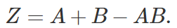
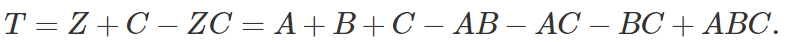
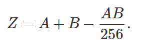
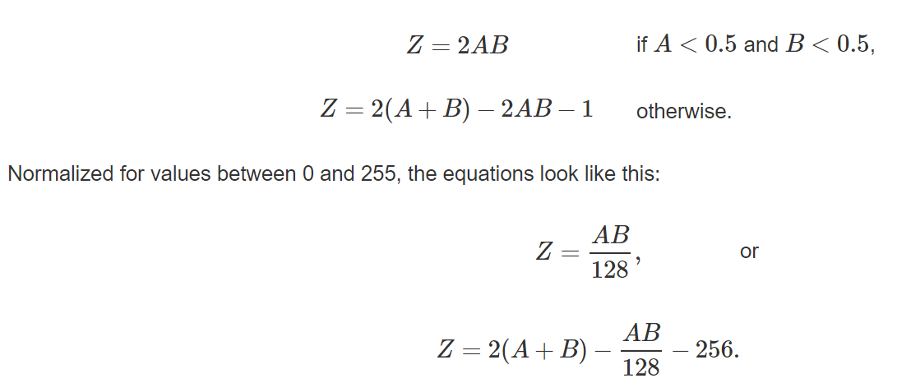

# Digital audio mixing
I found a good article on audio mixing. Here, I will introduce the article and create the source code for mixing the pcm files.

This article is written by Viktor T. Toth. [Mixing digital audio](http://www.vttoth.com/CMS/index.php/technical-notes/68) 

<br><br>

## Mixing digital audio article from Viktor T. Toth
 Created: 13 August 2000
Recently, I encountered an interesting problem during my work: if you have more than one digital audio buffers and you wish to play them back simultaneously, how do you mix their contents?

In real life, when you hear audio from two sources simultaneously, what you hear is the sum of the signals. Therein lies our problem. If you hear a group of ten people singing, the result will be louder than the singing of one person. A giant choir of a thousand will be even louder. A hundred thousand people singing an anthem in a sports stadium can be outright deafening. The point: there is no upper limit; the more voices you mix, the higher the amplitude.

With digital audio, we have a limited dynamic range. Let's say we use 8-bit sampling; that means that every data point in the audio stream is a value between 0 and 255. When we add two such values, the result may be anywhere between 0 and 510, which simply doesn't fit within the allowable range of 0-255.

So why don't we just normalize the result, dividing it by two? Sounds simple enough alright, but it won't necessarily yield the desired result. When we divide, we lose information; a contributing signal, instead of being allowed the full 8-bit dynamic range of 0-255, will be reduced to the range of 0-127. This is true even if the other signal is momentarily silent. In fact, when we turn on this kind of mixing, even when there's no signal on one of the inputs, the other signal will become noticeably quieter on the output. If we have more than two signals, this effect becomes even more pronounced. Dividing the amplitude by two reduces a signal's dynamic range by about 6 dB; dividing it by 8 reduces range by as much as 18 dB, which is an awful lot if you consider that the dynamic range of an 8-bit signal wasn't much to begin with, only about 48 dB (i.e., less than that of a cheap tape recorder.) Clearly, something more sophisticated needs to be done.

That more sophisticated method can be described qualitatively as follows:

Let's say we have two signals, A and B. If A is quiet, we want to hear B on the output in unaltered form. If B is quiet, we want to hear A on the output (i.e., A and B are treated symmetrically.) If both A and B have a non-zero amplitude, the mixed signal must have an amplitude between the greater of A and B, and the maximum permissible amplitude.

If we take A and B to have values between 0 and 1, there is actually a simple equation that satisfies all of the above conditions:
<br><br>



<br>

Simple, isn't it! Moreover, it can be easily adapted for more than two signals. Consider what happens if we mix another signal, C, to Z:

<br><br>



<br>


In a practical implementation, the signal values are not between 0 and 1, but between 0 and some maximum integer value, such as 255 for 8-bit signals. So the equation needs to be normalized. For 8-bit audio, the normalized version looks like this:

<br><br>



<br>


When I tested this mixing method, I got the expected result: as I mixed multiple audio streams I heard the contributing signals clearly, without distortion or loss of volume.

When I tried to put this mixing method into practice, however, I encountered an unexpected problem. My client-server application uses a specific audio format with values representing signed quantities. I.e., silence is the value 128, and actual amplitude values can go up (129-255) or down (127-0). The mixing method I developed above is not applicable in this case. For instance, mixing two silent signals with a value of 128, I get a result of 192, which is not the sound of silence. How can one mix these types of audio signals, then?

Once again, let's approach the problem qualitatively first.

If we have two signals, A and B, and either A or B has a value at the midpoint (representing silence), we want the other to appear on the output in unchanged form. If either A or B has an extremal value (minimum or maximum) we want that extremal value to appear on the output. If both A and B are below the midpoint, the result should be further below the midpoint than either A and B; if both are above the midpoint then similarly, the result should be higher than either of them. Lastly, if A and B are on opposite sides of the midpoint, the result should represent the fact that the two signals are cancelling each other out to some extent.

These requirements can be implemented using the following equations (again assuming that A and B have values between 0 and 1):

<br><br>



<br>

 
I implemented this audio mixing under Windows using a very simple COM (Component Object Model) service that I built using the ActiveX Template Library, or ATL. The advantage of this method is that the COM server can exist in a separate executable (and thus more than one client application can use it for audio playback at the same time) and it's also lightweight and efficient. The server executable is started and stopped automatically, thanks to the magic of COM.

And before you write to me, yes, I know there are other solutions out there for this problem: in addition to third-party libraries, Windows 2000 has built-in digital mixing capabilities. But I wasn't interested in a solution that works only under Windows 2000; as for purchasing a third-party product, I figured that the cost of purchase, learning to use the product, and incorporating it into my application (not to mention the risks associated with potentially inadequate support and buggy code) would exceed the level of effort required to develop audio mixing functionality on my own. Besides, where's the fun in using someone else's software?

<br><br>
## Mixing digital audio 

Working in the call center field, sometimes you need to mix two mono format PCM files.
In most cases, tools such as sox and ffmpeg will do the job easily.
How to use the sox command is explained in detail in [Useful ffmpeg sox commands](https://github.com/raspberry-pi-maker/VoIP-related-codes/tree/main/audio%20conversion/Useful%20ffmpeg%20sox%20commands)

However, sometimes there is a need to mix voice packets in real time in the program source code. In this case, it is difficult to use sox and ffmpeg. Let's use the above to mix two PCM voices by hand. A slight application of the source code can be applied even when real-time processing is required.

I will use 8000, 16 bit, mono format pcm file. Sampling data has 16 bit values. Therefore, it has values from -32,768 to 32,767.


``` bash
#build
g++ pcm_mix.cpp -o pcm_mix
#run
pcm_mix -i rx.pcm -j tx.pcm -o mix.pcm
```