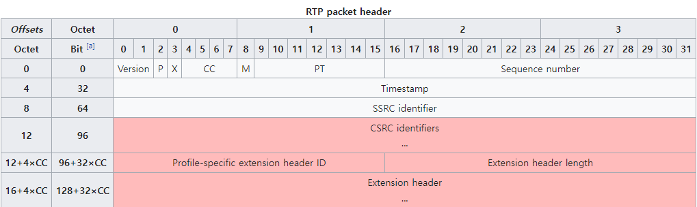

# pcap file related codes

Root privileges are required to capture network packets using libpcap.
<br><br>


## basic_pcap
<br>
Example of filtering only RTP (G.711 payload) in a pcap file to show RTP information

``` bash
# build command
g++ basic_pcap.cpp  -lpcap -o basic_pcap

#run command
./basic_pcap -f rtp_example.pcap
```
<br><br>

## basic_pcap_recording
<br>
Example of filtering only RTP (G.711 payload) in a pcap file to save them as wav files.
An important part of call recording is to separate and store packets of multiple calls. There are many ways to do this.
I will use the SSRC value of RTP and the incoming and outgoing IP values to distinguish the recording files.
<br><br>

### prerequisite knowledge

* basic_pcap : https://github.com/raspberry-pi-maker/VoIP-related-codes/tree/main/pcap%20file%20Analyzing/basic_pcap
* g711 to pcm : https://github.com/raspberry-pi-maker/VoIP-related-codes/tree/main/audio%20conversion
* pcm to wav : https://github.com/raspberry-pi-maker/VoIP-related-codes/tree/main/audio%20conversion

<br>


### RTP header
The rtp header has the following structure. <br>



<br>
In most cases, red painted areas are not used. Whether or not this area is used is determined by the X and CC values of the RTP header.
I have never seen an RTP header where this value exists. However, the reference code allows it to work regardless of the existence of this value.

<br><br>


``` bash
# build command
g++ basic_pcap_recording.cpp util.cpp  -lpcap -o basic_pcap_recording

#run command and save the output wav files at the current directory
./basic_pcap_recording -f rtp_example.pcap -o ./

#You might see the results like this. You can see two newly created pcm files and two wav files.
[spypiggy@localhost pcap]$ ls -al
total 684
drwxrwxr-x.  2 spypiggy spypiggy   4096 Nov 18 20:19 .
drwxrwxr-x. 16 spypiggy spypiggy    211 Nov 18 17:40 ..
-rw-rw-r--.  1 spypiggy spypiggy 113280 Nov 18 20:19 10.1.3.143-10.1.6.18-3739283087.pcm
-rw-rw-r--.  1 spypiggy spypiggy 113324 Nov 18 20:19 10.1.3.143-10.1.6.18-3739283087.wav
-rw-rw-r--.  1 spypiggy spypiggy 109920 Nov 18 20:19 10.1.6.18-10.1.3.143-4090175489.pcm
-rw-rw-r--.  1 spypiggy spypiggy 109964 Nov 18 20:19 10.1.6.18-10.1.3.143-4090175489.wav
-rwxrwxr-x.  1 spypiggy spypiggy  39616 Nov 18 20:18 basic_pcap_recording
-rw-rw-r--.  1 spypiggy spypiggy   5681 Nov 18 20:18 basic_pcap_recording.cpp
-rw-rw-r--.  1 spypiggy spypiggy   3974 Nov 18 20:16 global.h
-rw-rw-r--.  1 spypiggy spypiggy 147286 Nov 18 18:18 rtp_example.pcap
-rw-rw-r--.  1 spypiggy spypiggy   5144 Nov 18 20:06 util.cpp
```
<br>
Two pcm(or wav) files are actually one call. One is a voice from agent A (10.1.3.143) to agent B (10.1.6.18) and the other is the opposite. Therefore, two voice files should be treated as one call. In many cases, two mono voice files may be made into one stereo voice file.
<br><br>