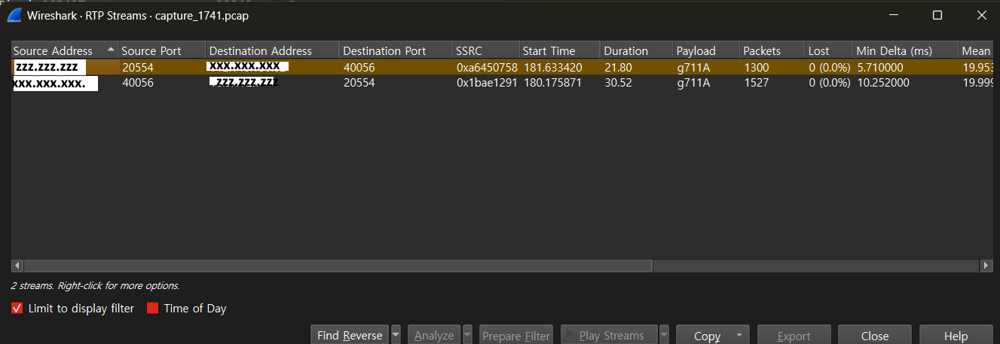
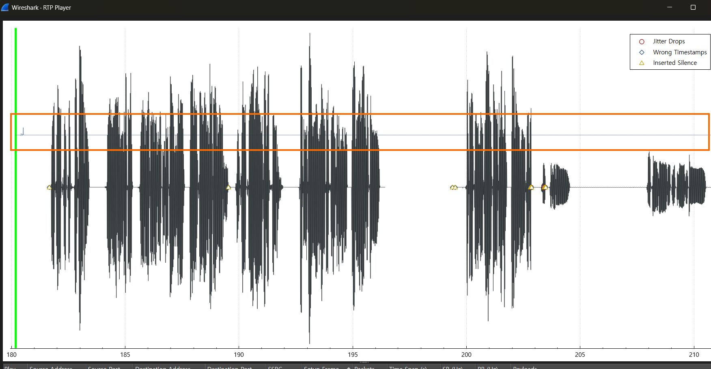

# prerequisite knowledge

* basic_pcap : https://github.com/raspberry-pi-maker/VoIP-related-codes/tree/main/pcap%20file%20Analyzing/basic_pcap
* g711 to pcm : https://github.com/raspberry-pi-maker/VoIP-related-codes/tree/main/audio%20conversion
* pcm to wav : https://github.com/raspberry-pi-maker/VoIP-related-codes/tree/main/audio%20conversion

<br><br>


# VoIP headache
<br>
One day, a customer using the VoIP system my company services received a complaint that the caller's voice had suddenly become inaudible.

Because the VoIP system serves multiple customers, I didn't take this particular customer's problem seriously. Initially, I thought it was due to a problem with the NAT processing on the customer's router.
However, the customer's engineer confirmed that there was no problem with the NAT system, and I had to investigate the problem with the VoIP system.

First, I had to create statistics on where silence occurs.


<br><br>

# Packet Capture

<br>

First, I captured the packets using the following command using the IP address of the telecommunications company's media (RTP) server (xxx.xxx.xxx.xxx) to which the company's VoIP system is connected and the public IP address of the customer's NAT system (yyy.yyy.yyy.yyy). And zzz.zzz.zzz.zzz is the IP of our VoIP system. Note that the signaling between the customer's phone and our company's VoIP system uses TCP. Therefore, I did not limit the tcpdump command to UDP.


``` bash
# capture command
sudo tcpdump -i eth0 -s 0 \( net xxx.xxx.xxx.xxx or host yyy.yyy.yyy.yyy \) -w /var/log/capture.pcap
```
<br>

And after about 5 minutes I was able to get a pcap file of about 50MB.
Now it's time to analyze this file with WireShark. Rather than directly inspecting the RTP stream for every call using Wireshark, I decided to create a simple pcap program to first calculate the number of RTP packets and silences per call, and then directly monitor only the suspicious calls.

<br><br>

# pcap program 

<br>

* This program does not analyze SIP signals.
* It only analyzes RTP.
* It distinguishes calls using the SSRC value in the RTP header.
* RTP calls with the same SSRC value are treated as the same call.
* Assuming G.711 codec, ptime value of 20 (rtp payload size: 160).
* The address of the media server sending and receiving RTP is used as an input parameter of the program.

<br>


``` c++
#include <pcap.h>
#include <iostream>
#include <map>
#include <vector>
#include <netinet/ip.h>
#include <netinet/udp.h>
#include <arpa/inet.h>
#include <algorithm>
#include <vector>

struct StreamInfo {
    std::string src_ip;
    std::string dst_ip;
    uint16_t sport;
    uint16_t dport;
    int payload_type;
    int start_frame;
    int packet_count;
    int silent_count;
};

std::map<uint32_t, StreamInfo> ssrc_info;

bool is_silence_payload(int payload_type, const u_char* payload, int len) {
    if (len <= 0) return false;
    if (payload_type == 0) { // PCMU
        for (int i = 0; i < len; i++) {
            if (!(payload[i] == 0xFF || payload[i] == 0x7F)) return false;
        }
        return true;
    } else if (payload_type == 8) { // PCMA
        for (int i = 0; i < len; i++) {
            if (payload[i] != 0xD5) return false;
        }
        return true;
    }
    return false;
}

int main(int argc, char* argv[]) {
    if (argc < 2) {
        std::cerr << "Usage: " << argv[0] << " <pcap_file>" << std::endl;
        return 1;
    }

    char errbuf[PCAP_ERRBUF_SIZE];
    pcap_t* handle = pcap_open_offline(argv[1], errbuf);
    if (!handle) {
        std::cerr << "Error opening pcap file: " << errbuf << std::endl;
        return 1;
    }

    const u_char* packet;
    struct pcap_pkthdr header;
    int frame_number = 0;

    while ((packet = pcap_next(handle, &header)) != nullptr) {
        frame_number++;

        // Ethernet header = 14 bytes
        const struct ip* iphdr = (struct ip*)(packet + 14);
        int iphdr_len = iphdr->ip_hl * 4;
        //std::cout << "iphdr_len:" << iphdr_len << std::endl;  //20바이트 OK

        if (iphdr->ip_p != IPPROTO_UDP) continue;

        const struct udphdr* udph = (struct udphdr*)((u_char*)iphdr + iphdr_len);
        int udp_len = ntohs(udph->uh_ulen) - sizeof(struct udphdr);

        //std::cout << "udp_len:" << udp_len << std::endl;  //20바이트 OK
        if (udp_len != 172) continue;

        const u_char* udp_payload = (u_char*)udph + sizeof(struct udphdr);

        // RTP header
        const u_char* rtp_header = udp_payload;
        const u_char* rtp_payload = udp_payload + 12;
        int rtp_payload_len = udp_len - 12;

        int payload_type = rtp_header[1] & 0x7F;
        uint32_t ssrc = ntohl(*(uint32_t*)(rtp_header + 8));

        char src_ip[INET_ADDRSTRLEN], dst_ip[INET_ADDRSTRLEN];
        inet_ntop(AF_INET, &(iphdr->ip_src), src_ip, INET_ADDRSTRLEN);
        inet_ntop(AF_INET, &(iphdr->ip_dst), dst_ip, INET_ADDRSTRLEN);

        uint16_t sport = ntohs(udph->uh_sport);
        uint16_t dport = ntohs(udph->uh_dport);

        if (ssrc_info.find(ssrc) == ssrc_info.end()) {
            ssrc_info[ssrc] = {src_ip, dst_ip, sport, dport, payload_type, frame_number, 0, 0};
        }

        ssrc_info[ssrc].packet_count++;

        if (is_silence_payload(payload_type, rtp_payload, rtp_payload_len)) {
            ssrc_info[ssrc].silent_count++;
        }
    }

    pcap_close(handle);

    std::cout << "Unique SSRC: " << ssrc_info.size() << std::endl;


    // Use vector for sorting.
    std::vector<std::pair<uint32_t, StreamInfo>> sorted_streams(ssrc_info.begin(), ssrc_info.end());

    std::sort(sorted_streams.begin(), sorted_streams.end(),
              [](const auto& a, const auto& b) {
                  return a.second.start_frame < b.second.start_frame;
              });

    // printing
    for (const auto& kv : sorted_streams) {
        const auto& info = kv.second;
        std::cout << "SSRC=" << kv.first
                  << ", Start=" << info.start_frame
                  << ", " << info.src_ip << ":" << info.sport
                  << " -> " << info.dst_ip << ":" << info.dport
                  << ", Packets=" << info.packet_count
                  << ", Silence=" << info.silent_count
                  << std::endl;
    }
    return 0;
}

```
<br>

``` bash
# build command
g++ -std=c++14 -o pcap_rtp main.cpp -lpcap
```

<br><br>

# test program 

<br>

I got the following output using the previously saved pcap file as a parameter.

<br>


``` csv
Unique SSRC: 137
SSRC=2778319677, Start=1, zzz.zzz.zzz.zzz:20802 -> xxx.xxx.xxx.xxx:28972, Packets=603, Silence=42
SSRC=1062397121, Start=2, xxx.xxx.xxx.xxx:28564 -> zzz.zzz.zzz.zzz:20318, Packets=758, Silence=148
SSRC=1899785893, Start=3, xxx.xxx.xxx.xxx:28972 -> zzz.zzz.zzz.zzz:20802, Packets=636, Silence=285
SSRC=2786572138, Start=4, zzz.zzz.zzz.zzz:20256 -> xxx.xxx.xxx.xxx:27600, Packets=437, Silence=0
SSRC=2784930443, Start=5, zzz.zzz.zzz.zzz:21802 -> xxx.xxx.xxx.xxx:27736, Packets=150, Silence=0
SSRC=2776436958, Start=6, zzz.zzz.zzz.zzz:20848 -> xxx.xxx.xxx.xxx:29016, Packets=984, Silence=85
SSRC=2789888996, Start=7, zzz.zzz.zzz.zzz:20318 -> xxx.xxx.xxx.xxx:28564, Packets=605, Silence=58
SSRC=4011341233, Start=8, xxx.xxx.xxx.xxx:29016 -> zzz.zzz.zzz.zzz:20848, Packets=1136, Silence=350
SSRC=2416510081, Start=9, xxx.xxx.xxx.xxx:27736 -> zzz.zzz.zzz.zzz:21802, Packets=151, Silence=4
SSRC=3539164133, Start=10, xxx.xxx.xxx.xxx:27600 -> zzz.zzz.zzz.zzz:20256, Packets=437, Silence=91
SSRC=1105727609, Start=694, xxx.xxx.xxx.xxx:29212 -> zzz.zzz.zzz.zzz:20752, Packets=930, Silence=332
SSRC=2789541541, Start=1413, zzz.zzz.zzz.zzz:20752 -> xxx.xxx.xxx.xxx:29212, Packets=856, Silence=83
SSRC=2048257675, Start=2314, xxx.xxx.xxx.xxx:29292 -> zzz.zzz.zzz.zzz:21746, Packets=1112, Silence=833
SSRC=2790004024, Start=3096, zzz.zzz.zzz.zzz:21746 -> xxx.xxx.xxx.xxx:29292, Packets=1006, Silence=70
SSRC=1472475463, Start=4228, xxx.xxx.xxx.xxx:29392 -> zzz.zzz.zzz.zzz:20116, Packets=1889, Silence=1466
SSRC=2433806403, Start=4232, yyy.yyy.yyy.yyy:10486 -> zzz.zzz.zzz.zzz:20440, Packets=359, Silence=0
SSRC=3984297827, Start=4467, xxx.xxx.xxx.190:42220 -> zzz.zzz.zzz.zzz:20118, Packets=2026, Silence=1007
SSRC=2640839496, Start=4479, zzz.zzz.zzz.zzz:20440 -> yyy.yyy.yyy.yyy:10486, Packets=338, Silence=82
SSRC=3553373145, Start=4740, xxx.xxx.xxx.190:42248 -> zzz.zzz.zzz.zzz:20658, Packets=1942, Silence=1023
SSRC=2784930475, Start=5333, zzz.zzz.zzz.zzz:20116 -> xxx.xxx.xxx.xxx:29392, Packets=1672, Silence=193
SSRC=592073145, Start=5573, xxx.xxx.xxx.xxx:29452 -> zzz.zzz.zzz.zzz:21162, Packets=1462, Silence=608
SSRC=2786753628, Start=5608, zzz.zzz.zzz.zzz:20118 -> xxx.xxx.xxx.190:42220, Packets=1952, Silence=72
SSRC=2786124748, Start=5932, zzz.zzz.zzz.zzz:20658 -> xxx.xxx.xxx.190:42248, Packets=1865, Silence=72
SSRC=2788620925, Start=6936, zzz.zzz.zzz.zzz:21162 -> xxx.xxx.xxx.xxx:29452, Packets=1235, Silence=131
SSRC=449309372, Start=9100, yyy.yyy.yyy.yyy:10444 -> zzz.zzz.zzz.zzz:20290, Packets=323, Silence=0
SSRC=3059770479, Start=9382, zzz.zzz.zzz.zzz:20290 -> yyy.yyy.yyy.yyy:10444, Packets=307, Silence=97
SSRC=2347185134, Start=19818, yyy.yyy.yyy.yyy:10490 -> zzz.zzz.zzz.zzz:21900, Packets=388, Silence=0
SSRC=2439218113, Start=19979, zzz.zzz.zzz.zzz:21900 -> yyy.yyy.yyy.yyy:10490, Packets=366, Silence=58
SSRC=1798760829, Start=24111, xxx.xxx.xxx.xxx:31732 -> zzz.zzz.zzz.zzz:20740, Packets=1603, Silence=1053
SSRC=2789541580, Start=24626, zzz.zzz.zzz.zzz:20740 -> xxx.xxx.xxx.xxx:31732, Packets=1413, Silence=157
SSRC=1774871489, Start=25472, xxx.xxx.xxx.xxx:31852 -> zzz.zzz.zzz.zzz:21642, Packets=1364, Silence=1349
SSRC=2778319727, Start=26137, zzz.zzz.zzz.zzz:21642 -> xxx.xxx.xxx.xxx:31852, Packets=1137, Silence=137
SSRC=2400088693, Start=27596, xxx.xxx.xxx.xxx:32012 -> zzz.zzz.zzz.zzz:20450, Packets=1080, Silence=1077
SSRC=2961876245, Start=27736, xxx.xxx.xxx.xxx:32036 -> zzz.zzz.zzz.zzz:21678, Packets=1374, Silence=475
SSRC=2784930517, Start=28016, zzz.zzz.zzz.zzz:20450 -> xxx.xxx.xxx.xxx:32012, Packets=1003, Silence=61
SSRC=2776437014, Start=28210, zzz.zzz.zzz.zzz:21678 -> xxx.xxx.xxx.xxx:32036, Packets=1149, Silence=128
SSRC=2767679417, Start=29806, xxx.xxx.xxx.xxx:32168 -> zzz.zzz.zzz.zzz:21154, Packets=1545, Silence=1011
SSRC=2789889067, Start=30428, zzz.zzz.zzz.zzz:21154 -> xxx.xxx.xxx.xxx:32168, Packets=1320, Silence=137
SSRC=4052483237, Start=32047, xxx.xxx.xxx.xxx:32632 -> zzz.zzz.zzz.zzz:20984, Packets=1849, Silence=803
SSRC=1406753291, Start=32333, xxx.xxx.xxx.xxx:32684 -> zzz.zzz.zzz.zzz:21066, Packets=1214, Silence=687
SSRC=2781419036, Start=32692, yyy.yyy.yyy.yyy:10448 -> zzz.zzz.zzz.zzz:21144, Packets=481, Silence=0
SSRC=2786572224, Start=32862, zzz.zzz.zzz.zzz:20984 -> xxx.xxx.xxx.xxx:32632, Packets=1759, Silence=157
SSRC=2790004079, Start=32884, zzz.zzz.zzz.zzz:21144 -> yyy.yyy.yyy.yyy:10448, Packets=465, Silence=465
SSRC=2786753680, Start=33251, zzz.zzz.zzz.zzz:21066 -> xxx.xxx.xxx.xxx:32684, Packets=1138, Silence=150
SSRC=952635475, Start=34116, xxx.xxx.xxx.190:44796 -> zzz.zzz.zzz.zzz:20304, Packets=1423, Silence=755
SSRC=2788620979, Start=35369, zzz.zzz.zzz.zzz:20304 -> xxx.xxx.xxx.190:44796, Packets=1346, Silence=42
SSRC=22811621, Start=35947, xxx.xxx.xxx.xxx:33116 -> zzz.zzz.zzz.zzz:21448, Packets=1436, Silence=502
SSRC=2684584166, Start=36923, yyy.yyy.yyy.yyy:10494 -> zzz.zzz.zzz.zzz:21378, Packets=225, Silence=0
SSRC=1783128499, Start=37247, zzz.zzz.zzz.zzz:21378 -> yyy.yyy.yyy.yyy:10494, Packets=203, Silence=203
SSRC=2785971237, Start=37379, zzz.zzz.zzz.zzz:21448 -> xxx.xxx.xxx.xxx:33116, Packets=1207, Silence=128
SSRC=1796680329, Start=40060, xxx.xxx.xxx.xxx:33516 -> zzz.zzz.zzz.zzz:20044, Packets=2100, Silence=848
SSRC=2526696279, Start=40173, xxx.xxx.xxx.190:44860 -> zzz.zzz.zzz.zzz:20496, Packets=3965, Silence=2128
SSRC=2786124809, Start=41834, zzz.zzz.zzz.zzz:20044 -> xxx.xxx.xxx.xxx:33516, Packets=1876, Silence=128
SSRC=2784009193, Start=41955, zzz.zzz.zzz.zzz:20496 -> xxx.xxx.xxx.190:44860, Packets=3891, Silence=72
SSRC=1164724899, Start=42935, xxx.xxx.xxx.xxx:33760 -> zzz.zzz.zzz.zzz:20350, Packets=1229, Silence=665
SSRC=2276134685, Start=42990, xxx.xxx.xxx.190:44908 -> zzz.zzz.zzz.zzz:21526, Packets=1882, Silence=845
SSRC=2785684780, Start=44206, zzz.zzz.zzz.zzz:20350 -> xxx.xxx.xxx.xxx:33760, Packets=1152, Silence=89
SSRC=2785766716, Start=44259, zzz.zzz.zzz.zzz:21526 -> xxx.xxx.xxx.190:44908, Packets=1808, Silence=72
SSRC=2310739899, Start=45409, xxx.xxx.xxx.xxx:34016 -> zzz.zzz.zzz.zzz:21516, Packets=2260, Silence=1042
SSRC=2789541615, Start=46974, zzz.zzz.zzz.zzz:21516 -> xxx.xxx.xxx.xxx:34016, Packets=2181, Silence=103
SSRC=1955587277, Start=49111, yyy.yyy.yyy.yyy:10452 -> zzz.zzz.zzz.zzz:21242, Packets=395, Silence=0
SSRC=2708231503, Start=49426, zzz.zzz.zzz.zzz:21242 -> yyy.yyy.yyy.yyy:10452, Packets=380, Silence=201
SSRC=2834414449, Start=50643, yyy.yyy.yyy.yyy:10498 -> zzz.zzz.zzz.zzz:21244, Packets=267, Silence=0
SSRC=2843731679, Start=50963, zzz.zzz.zzz.zzz:21244 -> yyy.yyy.yyy.yyy:10498, Packets=248, Silence=136
SSRC=4131026929, Start=51818, xxx.xxx.xxx.xxx:34244 -> zzz.zzz.zzz.zzz:20182, Packets=11, Silence=9
SSRC=1725997729, Start=59356, yyy.yyy.yyy.yyy:10502 -> zzz.zzz.zzz.zzz:21452, Packets=467, Silence=0
SSRC=2173264379, Start=59579, zzz.zzz.zzz.zzz:21452 -> yyy.yyy.yyy.yyy:10502, Packets=447, Silence=61
SSRC=2227876096, Start=62712, yyy.yyy.yyy.yyy:10456 -> zzz.zzz.zzz.zzz:20680, Packets=1417, Silence=0
SSRC=2439218172, Start=62970, zzz.zzz.zzz.zzz:20680 -> yyy.yyy.yyy.yyy:10456, Packets=1403, Silence=536
SSRC=3824404019, Start=64590, xxx.xxx.xxx.xxx:34624 -> zzz.zzz.zzz.zzz:20498, Packets=2128, Silence=1362
SSRC=2789889105, Start=65892, zzz.zzz.zzz.zzz:20498 -> xxx.xxx.xxx.xxx:34624, Packets=1758, Silence=184
SSRC=2280112887, Start=69407, xxx.xxx.xxx.xxx:34860 -> zzz.zzz.zzz.zzz:21098, Packets=1404, Silence=301
SSRC=2785684808, Start=70375, zzz.zzz.zzz.zzz:21098 -> xxx.xxx.xxx.xxx:34860, Packets=1175, Silence=128
SSRC=710242777, Start=72687, xxx.xxx.xxx.190:46684 -> zzz.zzz.zzz.zzz:21986, Packets=8300, Silence=0
SSRC=2261172869, Start=72691, xxx.xxx.xxx.xxx:35316 -> zzz.zzz.zzz.zzz:21640, Packets=1180, Silence=412
SSRC=2778319788, Start=73768, zzz.zzz.zzz.zzz:21986 -> xxx.xxx.xxx.190:46684, Packets=8243, Silence=72
SSRC=2776437069, Start=73892, zzz.zzz.zzz.zzz:21640 -> xxx.xxx.xxx.xxx:35316, Packets=1105, Silence=89
SSRC=192614627, Start=75087, xxx.xxx.xxx.xxx:35580 -> zzz.zzz.zzz.zzz:21092, Packets=1394, Silence=743
SSRC=2790004127, Start=76511, zzz.zzz.zzz.zzz:21092 -> xxx.xxx.xxx.xxx:35580, Packets=1165, Silence=128
SSRC=2732381857, Start=80740, xxx.xxx.xxx.xxx:36180 -> zzz.zzz.zzz.zzz:20376, Packets=2361, Silence=15
SSRC=2785766758, Start=82007, zzz.zzz.zzz.zzz:20376 -> xxx.xxx.xxx.xxx:36180, Packets=2133, Silence=128
SSRC=3386217217, Start=82872, xxx.xxx.xxx.xxx:36488 -> zzz.zzz.zzz.zzz:21026, Packets=1714, Silence=1710
SSRC=2786572280, Start=84163, zzz.zzz.zzz.zzz:21026 -> xxx.xxx.xxx.xxx:36488, Packets=1491, Silence=170
SSRC=3593022809, Start=85409, xxx.xxx.xxx.xxx:36756 -> zzz.zzz.zzz.zzz:20674, Packets=1970, Silence=1405
SSRC=2786753739, Start=86771, zzz.zzz.zzz.zzz:20674 -> xxx.xxx.xxx.xxx:36756, Packets=1893, Silence=126
SSRC=1177101349, Start=92533, xxx.xxx.xxx.xxx:37112 -> zzz.zzz.zzz.zzz:21752, Packets=2247, Silence=855
SSRC=2789541667, Start=93836, zzz.zzz.zzz.zzz:21752 -> xxx.xxx.xxx.xxx:37112, Packets=2167, Silence=159
SSRC=843813765, Start=100526, yyy.yyy.yyy.yyy:10506 -> zzz.zzz.zzz.zzz:20502, Packets=1026, Silence=0
SSRC=2038858188, Start=100753, zzz.zzz.zzz.zzz:20502 -> yyy.yyy.yyy.yyy:10506, Packets=1004, Silence=643
SSRC=1693845903, Start=102361, xxx.xxx.xxx.190:47900 -> zzz.zzz.zzz.zzz:21446, Packets=3747, Silence=820
SSRC=851762221, Start=102794, yyy.yyy.yyy.yyy:10460 -> zzz.zzz.zzz.zzz:21564, Packets=474, Silence=0
SSRC=2241388044, Start=103043, zzz.zzz.zzz.zzz:21564 -> yyy.yyy.yyy.yyy:10460, Packets=458, Silence=457
SSRC=961806113, Start=103417, xxx.xxx.xxx.xxx:37568 -> zzz.zzz.zzz.zzz:20660, Packets=2706, Silence=2045
SSRC=1421888481, Start=103424, xxx.xxx.xxx.xxx:37572 -> zzz.zzz.zzz.zzz:20992, Packets=1476, Silence=687
SSRC=2790004161, Start=103584, zzz.zzz.zzz.zzz:21446 -> xxx.xxx.xxx.190:47900, Packets=3673, Silence=42
SSRC=2785684850, Start=104884, zzz.zzz.zzz.zzz:20660 -> xxx.xxx.xxx.xxx:37568, Packets=2476, Silence=151
SSRC=2776437106, Start=104889, zzz.zzz.zzz.zzz:20992 -> xxx.xxx.xxx.xxx:37572, Packets=1355, Silence=163
SSRC=2118779343, Start=115298, yyy.yyy.yyy.yyy:10464 -> zzz.zzz.zzz.zzz:20146, Packets=908, Silence=0
SSRC=2843731757, Start=115558, zzz.zzz.zzz.zzz:20146 -> yyy.yyy.yyy.yyy:10464, Packets=892, Silence=302
SSRC=1177165911, Start=124724, xxx.xxx.xxx.190:49524 -> zzz.zzz.zzz.zzz:20800, Packets=4888, Silence=3889
SSRC=2785766811, Start=125686, zzz.zzz.zzz.zzz:20800 -> xxx.xxx.xxx.190:49524, Packets=4812, Silence=72
SSRC=1739163619, Start=127216, xxx.xxx.xxx.xxx:39776 -> zzz.zzz.zzz.zzz:20794, Packets=3534, Silence=2182
SSRC=2786572335, Start=128243, zzz.zzz.zzz.zzz:20794 -> xxx.xxx.xxx.xxx:39776, Packets=3306, Silence=128
SSRC=464392849, Start=131920, xxx.xxx.xxx.xxx:40056 -> zzz.zzz.zzz.zzz:20554, Packets=1527, Silence=1523
SSRC=2648183281, Start=132613, xxx.xxx.xxx.190:49764 -> zzz.zzz.zzz.zzz:20346, Packets=7397, Silence=3835
SSRC=2789541720, Start=132739, zzz.zzz.zzz.zzz:20554 -> xxx.xxx.xxx.xxx:40056, Packets=1300, Silence=137
SSRC=2776437145, Start=133568, zzz.zzz.zzz.zzz:20346 -> xxx.xxx.xxx.190:49764, Packets=7323, Silence=72
SSRC=1442756579, Start=138005, xxx.xxx.xxx.190:10300 -> zzz.zzz.zzz.zzz:21306, Packets=7001, Silence=5703
SSRC=2786753809, Start=139046, zzz.zzz.zzz.zzz:21306 -> xxx.xxx.xxx.190:10300, Packets=6928, Silence=72
SSRC=1474206307, Start=140726, yyy.yyy.yyy.yyy:10510 -> zzz.zzz.zzz.zzz:21714, Packets=2459, Silence=0
SSRC=2711086835, Start=140964, zzz.zzz.zzz.zzz:21714 -> yyy.yyy.yyy.yyy:10510, Packets=2440, Silence=1399
SSRC=1348578425, Start=147376, xxx.xxx.xxx.xxx:41388 -> zzz.zzz.zzz.zzz:20636, Packets=1346, Silence=941
SSRC=2785684908, Start=148674, zzz.zzz.zzz.zzz:20636 -> xxx.xxx.xxx.xxx:41388, Packets=1266, Silence=104
SSRC=2017129862, Start=149042, yyy.yyy.yyy.yyy:10468 -> zzz.zzz.zzz.zzz:20448, Packets=396, Silence=0
SSRC=2976448235, Start=149298, zzz.zzz.zzz.zzz:20448 -> yyy.yyy.yyy.yyy:10468, Packets=382, Silence=382
SSRC=1076485643, Start=160667, xxx.xxx.xxx.xxx:42448 -> zzz.zzz.zzz.zzz:21512, Packets=1609, Silence=1185
SSRC=2789541755, Start=161861, zzz.zzz.zzz.zzz:21512 -> xxx.xxx.xxx.xxx:42448, Packets=1420, Silence=167
SSRC=1987034015, Start=178735, xxx.xxx.xxx.xxx:43444 -> zzz.zzz.zzz.zzz:20414, Packets=1916, Silence=1251
SSRC=2785684947, Start=179842, zzz.zzz.zzz.zzz:20414 -> xxx.xxx.xxx.xxx:43444, Packets=1679, Silence=156
SSRC=3774272705, Start=181916, xxx.xxx.xxx.xxx:43852 -> zzz.zzz.zzz.zzz:21334, Packets=1418, Silence=715
SSRC=2786572407, Start=182861, zzz.zzz.zzz.zzz:21334 -> xxx.xxx.xxx.xxx:43852, Packets=1192, Silence=137
SSRC=505717420, Start=195414, yyy.yyy.yyy.yyy:10514 -> zzz.zzz.zzz.zzz:20986, Packets=300, Silence=0
SSRC=2789541803, Start=195575, zzz.zzz.zzz.zzz:20986 -> yyy.yyy.yyy.yyy:10514, Packets=280, Silence=130
SSRC=15200677, Start=199267, xxx.xxx.xxx.xxx:45384 -> zzz.zzz.zzz.zzz:21832, Packets=1692, Silence=671
SSRC=2786572437, Start=199784, zzz.zzz.zzz.zzz:21832 -> xxx.xxx.xxx.xxx:45384, Packets=1464, Silence=128
SSRC=185839221, Start=202987, xxx.xxx.xxx.xxx:46248 -> zzz.zzz.zzz.zzz:20040, Packets=2240, Silence=1539
SSRC=2789541824, Start=203497, zzz.zzz.zzz.zzz:20040 -> xxx.xxx.xxx.xxx:46248, Packets=2013, Silence=170
SSRC=892440097, Start=203705, xxx.xxx.xxx.xxx:46428 -> zzz.zzz.zzz.zzz:20708, Packets=2014, Silence=1238
SSRC=3147524321, Start=204309, xxx.xxx.xxx.190:14972 -> zzz.zzz.zzz.zzz:20600, Packets=2020, Silence=1534
SSRC=2778319970, Start=204387, zzz.zzz.zzz.zzz:20708 -> xxx.xxx.xxx.xxx:46428, Packets=1786, Silence=137
SSRC=2789889299, Start=205096, zzz.zzz.zzz.zzz:20600 -> xxx.xxx.xxx.190:14972, Packets=1948, Silence=72
SSRC=3110406659, Start=216127, yyy.yyy.yyy.yyy:10472 -> zzz.zzz.zzz.zzz:20520, Packets=1041, Silence=0
SSRC=3053409092, Start=216305, zzz.zzz.zzz.zzz:20520 -> yyy.yyy.yyy.yyy:10472, Packets=1026, Silence=631
SSRC=642234559, Start=216634, yyy.yyy.yyy.yyy:10518 -> zzz.zzz.zzz.zzz:21270, Packets=876, Silence=0
SSRC=3115490230, Start=216824, zzz.zzz.zzz.zzz:21270 -> yyy.yyy.yyy.yyy:10518, Packets=857, Silence=326
SSRC=3263249241, Start=220385, xxx.xxx.xxx.xxx:47976 -> zzz.zzz.zzz.zzz:20702, Packets=740, Silence=391
SSRC=2786572478, Start=221488, zzz.zzz.zzz.zzz:20702 -> xxx.xxx.xxx.xxx:47976, Packets=666, Silence=95
```
<br>

We were able to extract the following suspicious values:

<br>

``` csv
SSRC=1774871489, Start=25472, xxx.xxx.xxx.xxx:31852 -> zzz.zzz.zzz.zzz:21642, Packets=1364, Silence=1349
SSRC=2400088693, Start=27596, xxx.xxx.xxx.xxx:32012 -> zzz.zzz.zzz.zzz:20450, Packets=1080, Silence=1077
SSRC=3386217217, Start=82872, xxx.xxx.xxx.xxx:36488 -> zzz.zzz.zzz.zzz:21026, Packets=1714, Silence=1710
SSRC=464392849, Start=131920, xxx.xxx.xxx.xxx:40056 -> zzz.zzz.zzz.zzz:20554, Packets=1527, Silence=1523
```

<br>

Contrary to my expectations, I found myself receiving a call from the telecom operator's exchange that was filled with silence.

Using the port value in the last line, I gave the following filter condition in Wireshark:

```
udp.srcport==40056 or udp.srcport==20554
```
<br>

Then select RTP/RTP Streams from the Telephony menu.



<br>
Then select both streams from the list above and press the Play Streams button below.



<br>
The red box is an RTP packet sent from the telecommunications company. Again, you can see that there is no audio.
Ultimately, the issue wasn't with the customer's NAT router, but rather with the carrier's media server. This issue ticket was resolved after I relayed this information to the carrier and requested a resolution.